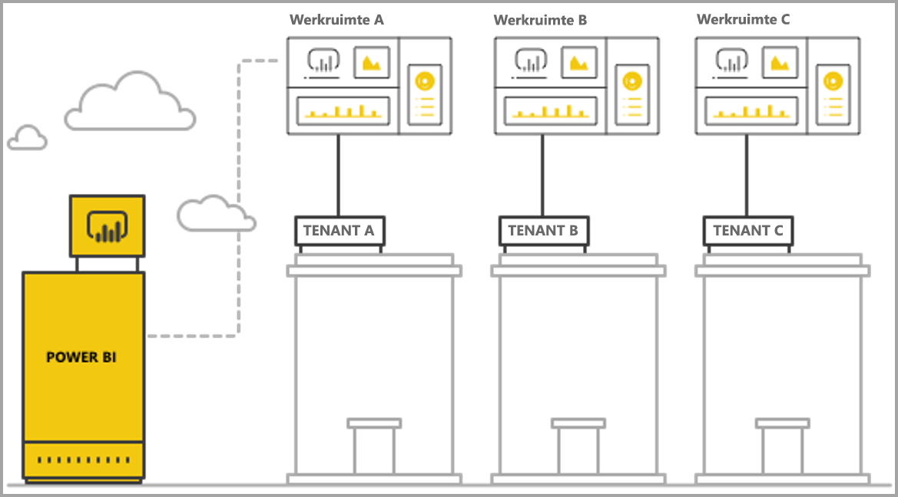
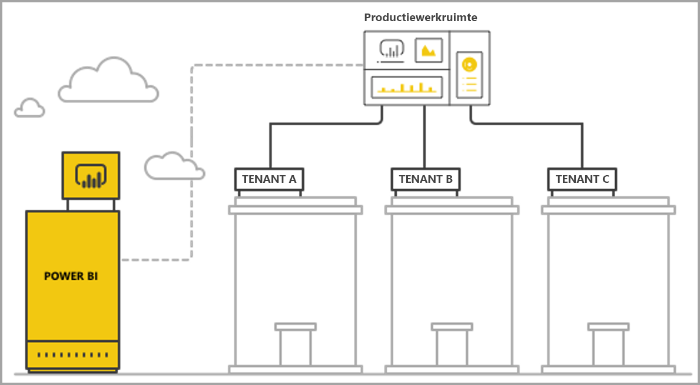

# Multitenancy beheren met ingesloten analyse in Power BI

Wanneer u een SaaS-app met meerdere tenants ontwerpt, moet u zorgvuldig overwegen welk tenancymodel het beste aansluit bij de behoeften van uw SaaS-app. Hetzelfde geldt wanneer u Power BI gebruikt als onderdeel voor ingesloten analyse in uw SaaS-app. Een tenancymodel bepaalt hoe gegevens van elke tenant in Power BI en het opslagaccount worden toegewezen en beheerd. Het tenancymodel dat u kiest, beïnvloedt het ontwerp en beheer van de app. Als u later moet overstappen op een ander model, kan dit kosten met zich meebrengen en verstorend zijn.

Power BI Embedded biedt twee algemene benaderingen om tenants gescheiden te houden.

   1. **Isolatie op basis van werkruimte**, waarbij u voor elke tenant een afzonderlijke Power BI-werkruimte maakt.
   2. **Isolatie op basis van beveiliging op rijniveau**, waarbij de onderliggende gegevens worden gebruikt om de toegang tot gegevens per gebruiker of per groep te beheren.

In dit artikel worden de verschillende benaderingen besproken en geanalyseerd op basis van diverse evaluatiecriteria.

## Concepten en terminologie

**[AAD](https://docs.microsoft.com/en-us/azure/active-directory/fundamentals/active-directory-whatis)**: Azure Active Directory.

**AAD-app**: een app-identiteit in AAD. Een AAD-app is vereist voor verificatie.

**SaaS-app (Software as a Service)**: een systeem dat is geïmplementeerd door een onderneming of ISV, meestal een online service. SaaS omvat ook gerelateerde softwaresystemen voor het bedienen van meerdere klanttenants (organisaties). In dit artikel **maakt de SaaS-app gebruik van Power BI Embedded om analysen uit te voeren voor alle verschillende tenants**. Power BI Embedded is geschikt voor alle soorten apps met een online verbinding.

**Tenant**: één klant (organisatie) die de SaaS-app gebruikt en alle resources of gegevens die de klant toevoegt aan de SaaS-app.

**[Power BI](../power-bi-overview.md)**: de Power BI-cloudservice die dient als platform voor Power BI Embedded.

**Power BI-tenant**: een set Power BI-resources die is gekoppeld aan één AAD-tenant.

**[Power BI-werkruimte](../service-create-workspaces.md)**: een container voor inhoud in Power BI.

**Power BI-artefacten**: Power BI-werkruimten bevatten verschillende Power BI-artefacten, zoals dashboards, rapporten, gegevenssets en gegevensstromen.

**[Power BI Embedded](azure-pbie-what-is-power-bi-embedded.md)**: een set openbare API's waarmee ontwikkelaars apps kunnen maken om Power BI-inhoud en ingesloten Power BI-elementen te beheren.

**[Beveiliging op rijniveau](embedded-row-level-security.md)**: biedt de mogelijkheid om gebruikerstoegang tot gegevens te beheren voor individuele rijen in een tabel. U kunt beveiliging op rijniveau implementeren op gegevensbronniveau of in het semantische Power BI-model.

**Hoofdgebruiker**: de identiteit die de SaaS-app vertegenwoordigt in Power BI en die de SaaS-app gebruikt wanneer API's van Power BI worden aangeroepen. De hoofdgebruiker moet een AAD-gebruiker met een Power BI Pro-licentie zijn.

**AAD-appgebruiker (service-principal)**: de identiteit die de SaaS-app vertegenwoordigt in Power BI en die de SaaS-app gebruikt wanneer API's van Power BI worden aangeroepen. De AAD-appgebruiker moet een AAD-webtoepassing zijn. Deze kan in plaats van een *hoofdgebruiker* worden gebruikt om te verifiëren met Power BI.

**Capaciteit**: een set resources die is bedoeld voor het uitvoeren van de Power BI-service. [Power BI Premium-capaciteit](../service-premium.md): bedoeld voor bedrijven die Power BI intern gebruiken, terwijl [Power BI Embedded-capaciteit](azure-pbie-create-capacity.md) is bedoeld voor app-ontwikkelaars die SaaS-apps ontwikkelen voor externe partijen.

**[Power BI Pro-licentie](../service-admin-purchasing-power-bi-pro.md)**: een op gebruikers gebaseerde licentie waarmee rechten worden verleend om inhoud te publiceren naar app-werkruimten, apps te gebruiken zonder Premium-capaciteit, dashboards te delen en te abonneren op dashboards en rapporten.

**[Modi voor gegevensconnectiviteit](../desktop-directquery-about.md)**: er zijn verschillende modi voor het verbinden van gegevensbronnen met Power BI:

   * Importeren: de meest voorkomende manier om gegevens op te halen.
   * DirectQuery: maak rechtstreeks verbinding met de gegevens in de opslagplaats van de gegevensbron.
   * Live-verbinding: een andere modus waarbij rechtstreeks verbinding wordt gemaakt met Analysis Services-gegevens (Azure en on-premises).

## Evaluatiecriteria

De beste keuze voor een geschikt tenancymodel voor uw SaaS-app hangt af van de specifieke zakelijke en technische vereisten, de gegevensarchitectuur en meer. Als u een grondig begrip hebt van deze vereisten en de opties en afwegingen van beschikbare tenancymodellen, kunt u een robuuste, betrouwbare, rendabele en schaalbare architectuur voor uw SaaS-app definiëren.

Houd rekening met onderstaande onderwerpen wanneer u een tenancymodel gaat kiezen.

### Gegevensarchitectuur

Ontwikkelaars die apps met Power BI Embedded maken, beschikken doorgaans al over een database met een of meerdere tenants. Het is gemakkelijker om voor Power BI Embedded een tenancymodel te gebruiken dat vergelijkbaar is met het model van de database. Als het tenancymodel van de database nog niet is gedefinieerd, kunt u andere aspecten overwegen voordat u een gegevensarchitectuur kiest.

### Gegevensisolatie

Hoe gevoelig zijn de gegevens die worden opgeslagen? Welk isolatieniveau is nodig voor het scheiden van verschillende klanttenants? Het antwoord kan variëren afhankelijk van de betreffende vereisten voor verschillende branches of specifieke klanten.

### Schaalbaarheid

Als u de beste oplossing wilt vinden, definieert u de schaal die u in de nabije toekomst bereikt. Een oplossing die nu geschikt is, voldoet misschien niet meer wanneer gebruik en gegevens omhoog worden geschaald. Houd rekening met onderstaande punten wanneer u schaalbaarheid analyseert:

   * het aantal tenants (klanten)
   * het aantal rapporten, dashboards en gegevenssets voor elke tenant
   * de grootte van gegevens in elke gegevensset en de frequentie van vernieuwingen
   * het aantal gebruikers
   * het aantal gelijktijdige gebruikers op piekmomenten

Sommige SaaS-apps hebben weinig klanten en een laag gebruik, maar grote hoeveelheden gegevens. Andere apps hebben veel klanten en een hoog gebruik, maar een kleine hoeveelheid gegevens en rapporten voor elke klant. Hoge getallen in elk van deze scenario's kunnen toekomstige kosten en operationele complexiteit beïnvloeden.

### Automatisering en operationele complexiteit

Identificeer de processen die regelmatig voorkomen en die moeten worden geautomatiseerd.

   * Hoe vaak vindt onboarding van nieuwe tenants plaats? Welke acties zijn vereist om elke tenant volledig te onboarden?
   * Wat is de vrijgeeffrequentie voor nieuwe of bijgewerkte Power BI-inhoud die moet worden geïmplementeerd?
   * Hoeveel beveiligingsrollen op rijniveau worden gedefinieerd voor elke tenant?  

Wanneer u deze processen identificeert en bedenkt hoe u ze kunt benaderen, krijgt u meer inzicht in de operationele complexiteit voor het onderhouden van elk model.

### Vereisten voor gegevenslocatie en ondersteuning voor meerdere regio's

Power BI Embedded ondersteunt implementatie in meerdere regio's (preview-functie). Met [Multi-Geo](embedded-multi-geo.md) kunt u Power BI Embedded-resources in verschillende regio's implementeren en specifieke inhoud toewijzen aan specifieke locaties. Deze functie is beschikbaar voor alle modellen, maar kan invloed hebben op de hoeveelheid inhoud die u moet beheren en op de kosten. Multi-Geo is momenteel bedoeld om te voldoen aan vereisten op het gebied van gegevenslocatie. Prestaties worden niet verbeterd door gegevens dichter bij consumenten te brengen.

### Kosten

[Power BI Embedded](https://azure.microsoft.com/en-us/services/power-bi-embedded/) heeft een op resources gebaseerd aanschafmodel, net als **Power BI Premium**. U koopt een of meer capaciteiten met een vaste hoeveelheid rekenkracht en geheugen. Deze capaciteit is het primaire kostenitem wanneer u met **Power BI Embedded** werkt. Er is geen limiet voor het aantal gebruikers van de capaciteit. Er geldt alleen een limiet voor de prestaties van de capaciteit. U hebt een [Power BI Pro-licentie](../service-admin-licensing-organization.md) nodig voor elke *hoofdgebruiker* of voor specifieke gebruikers die toegang nodig hebben tot de Power BI-portal.

We raden aan om de verwachte belasting van uw capaciteit te testen en meten door de omgeving en het gebruik live te simuleren en belastingtests uit te voeren op de capaciteit. U kunt de belasting en prestaties meten aan de hand van de diverse metrische gegevens die beschikbaar zijn in de Azure-capaciteit of de [app voor metrische gegevens van de Premium-capaciteit](../service-admin-premium-monitor-capacity.md).

### Inhoud aanpassen en ontwerpen

Er zijn twee benaderingen voor SaaS-apps die gebruikers de mogelijkheid bieden om rapporten te bewerken en maken, of om gegevens in de service te uploaden als onderdeel van de stroom:

   * [Bewerk-/maakmodus in een ingesloten iFrame](https://github.com/Microsoft/PowerBI-JavaScript/wiki/Create-Report-in-Embed-View): de gebruiker krijgt een weergave van het rapport of een nieuw leeg canvas in de SaaS-app. Zo kan de gebruiker met de Power BI-werkbalk inhoud maken op basis van een gegevensset in de werkruimte. We raden deze optie aan, aangezien die zich bevindt in de gebruikerscontext in een bekende omgeving. De gebruiker kan dan makkelijker aan de slag met bewerkingen en maakt een rapport dat wordt toegevoegd aan een bestaande gegevensset.

   * Gebruik Power BI Desktop om inhoud te maken en uploaden naar de werkruimte via de gebruikersinterface van de SaaS-app. In deze benadering hebben gebruikers meer hulpmiddelen die ze in Power BI Desktop kunnen gebruiken. We raden deze benadering echter niet aan, omdat gebruikers bekend moeten zijn met een extra hulpmiddel buiten de context van de SaaS-app. Door een PBIX-bestand te uploaden, voegt de gebruiker een extra gegevensset toe, die mogelijk een duplicaat is van gegevenssets die al in de werkruimte staan.

## Isolatie op basis van Power BI-werkruimte

Met isolatie op basis van Power BI-werkruimte ondersteunt de SaaS-app meerdere tenants vanuit één Power BI-tenant. Isolatie op basis van werkruimte bevat alle Power BI-inhoud die door verschillende tenants wordt gebruikt. De scheiding van tenants wordt uitgevoerd op Power BI-werkruimteniveau door meerdere werkruimten te maken. Elke werkruimte bevat de relevante gegevenssets, rapporten en dashboards voor de tenant. Bovendien is elke werkruimte alleen verbonden met de gegevens van de betreffende tenant. Als u extra isolatie nodig hebt, kunt u een *hoofdgebruiker* of een service-principal maken voor elke werkruimte en de inhoud ervan.

### Gegevensarchitectuur

Er zijn twee primaire benaderingen voor het beheren van tenantgegevens:

* een afzonderlijke database per tenant
* één database voor meerdere tenants

Als de opslag van de SaaS-app een afzonderlijke database per tenant gebruikt, is het logisch om ook gegevenssets met één tenant in Power BI te gebruiken, waarbij de verbindingsreeks voor elke gegevensset verwijst naar de bijbehorende database.

Als de opslag van de SaaS-app één database voor alle tenants gebruikt, is het eenvoudiger om tenants te scheiden per werkruimte. U kunt de databaseverbinding voor de Power BI-gegevensset configureren met een geparameteriseerde databasequery die alleen gegevens van de relevante tenant ophaalt. U kunt de verbinding bijwerken met [Power BI Desktop](../desktop-query-overview.md) of met de [API](https://docs.microsoft.com/rest/api/power-bi/datasets/updatedatasourcesingroup) met [parameters](https://docs.microsoft.com/en-us/rest/api/power-bi/datasets/updateparametersingroup) voor de query.

### Gegevensisolatie

Gegevens worden in dit tenancymodel gescheiden op werkruimteniveau. Dankzij een eenvoudige toewijzing tussen een werkruimte en een tenant voorkomt u dat gebruikers van de ene tenant inhoud van een andere tenant kunnen zien. Wanneer u één *hoofdgebruiker* hebt, moet u toegang hebben tot alle verschillende werkruimten. Welke gegevens een eindgebruiker kan zien, wordt gedefinieerd tijdens het [genereren van een insluitingstoken](https://docs.microsoft.com/en-us/rest/api/power-bi/embedtoken). Dit proces vindt uitsluitend aan de back-end plaats en is niet zichtbaar of bewerkbaar voor gebruikers.

Voor extra isolatie kan een app-ontwikkelaar een *hoofdgebruiker* of een app per werkruimte definiëren in plaats van één *hoofdgebruiker* of een app met toegang tot meerdere werkruimten. Op deze manier kunt u ervoor zorgen dat er in geval van een menselijke fout of lek van referentiegegevens geen gegevens van meerdere klanten openbaar worden gemaakt.

### Schaalbaarheid

Een voordeel van dit model is dat u, door de gegevens te scheiden in meerdere gegevenssets voor elke tenant, niet wordt beperkt door de [limiet van een gegevensset](https://docs.microsoft.com/en-us/power-bi/service-premium-large-datasets) (op dit moment 10 GB in een capaciteit). Wanneer de capaciteit overbelast is, [kan deze ongebruikte gegevenssets buitensluiten](../service-premium-understand-how-it-works.md) om geheugen vrij te maken voor actieve gegevenssets. Deze taak is niet mogelijk wanneer u één grote gegevensset hebt. Wanneer u meerdere gegevenssets gebruikt, kunt u tenants indien nodig ook verdelen over meerdere Power BI-capaciteiten. [Meer informatie over hoe capaciteit werkt](../service-admin-premium-manage.md).

Ondanks deze voordelen is het belangrijk om rekening te houden met de schaal die de SaaS-app in de toekomst mogelijk bereikt. U kunt bijvoorbeeld te maken krijgen met beperkingen voor het aantal artefacten dat u kunt beheren. Lees het gedeelte over [implementatiebeperkingen](#summary-comparison-of-the-different-approaches) verderop in dit artikel voor meer informatie. De gebruikte capaciteit-SKU beperkt de hoeveelheid geheugen die gegevenssets nodig hebben, [hoeveel vernieuwingen er tegelijkertijd kunnen worden uitgevoerd](../service-premium-understand-how-it-works.md) en de maximale frequentie van gegevensvernieuwingen. Het is raadzaam om tests uit te voeren wanneer u honderden of duizenden gegevenssets beheert. We raden ook aan rekening te houden met het gemiddelde en piekvolume van gebruik, evenals specifieke tenants met grote gegevenssets of afwijkende gebruikspatronen die anders worden beheerd dan andere tenants.

### Automatisering en operationele complexiteit

Met isolatie op basis van Power BI-werkruimte moet een app-ontwikkelaar mogelijk honderden of duizenden artefacten beheren. Het is zeer belangrijk om processen te definiëren die regelmatig worden uitgevoerd in de levenscyclus van uw app. Bovendien moet u over de juiste hulpprogramma's beschikken om deze bewerkingen in dit tenancymodel op schaal uit te voeren. Enkele voorbeelden van zulke bewerkingen:

   * een nieuwe tenant toevoegen (klant)
   * een rapport of dashboard bijwerken voor enkele of alle tenants
   * het schema van de gegevensset bijwerken voor enkele of alle tenants
   * niet-geplande aanpassingen voor specifieke tenants
   * frequentie van vernieuwingen van de gegevensset

Het maken van een werkruimte voor een nieuwe tenant is bijvoorbeeld een veelvoorkomende taak die moet worden geautomatiseerd. Met de [Power BI REST API](https://docs.microsoft.com/rest/api/power-bi/) kunt u zorgen voor [volledige automatisering bij het maken van werkruimten](https://powerbi.microsoft.com/blog/duplicate-workspaces-using-the-power-bi-rest-apis-a-step-by-step-tutorial/).

### Multi-Geo-behoeften

Multi-Geo omvat het aanschaffen van capaciteit in de gewenste regio's en het toewijzen van een werkruimte aan die capaciteit. Als u ondersteuning moet bieden voor verschillende tenants in verschillende regio's, moet u de werkruimte van de tenant toewijzen aan een capaciteit in de gewenste regio. Dit is een eenvoudige taak en de kosten zijn niet hoger dan wanneer u alle werkruimten in dezelfde capaciteit plaatst. Als u echter tenants hebt waarvoor gegevens in meerdere regio's moeten worden bewaard, moeten alle artefacten in de werkruimte worden gedupliceerd in elke regionale capaciteit. Dit betekent hogere kosten en complexer beheer.

### Kosten

App-ontwikkelaars die Power BI Embedded gebruiken, moeten [Power Bi Embedded-capaciteit aanschaffen om naar productie te gaan](embed-sample-for-customers.md#move-to-production).  Het is belangrijk om inzicht te hebben in de impact van een op werkruimte gebaseerd isolatiemodel en het effect daarvan op capaciteiten.

Het op werkruimte gebaseerde isolatiemodel werkt om de volgende redenen goed met capaciteiten:

   * Het kleinste object dat u onafhankelijk aan een capaciteit kunt toewijzen, is een werkruimte (u kunt bijvoorbeeld geen rapport toewijzen). Wanneer u tenants scheidt door middel van werkruimten, kunt u elke afzonderlijke tenant en de prestatiebehoeften volledig flexibel beheren, en het capaciteitsgebruik optimaliseren door omhoog/omlaag te schalen. Grote, essentiële tenants met een hoog volume en hoge fluctuatie kunnen worden beheerd in een afzonderlijke capaciteit om een consistent serviceniveau te bieden. U kunt kleinere tenants groeperen in een andere capaciteit om de kosten te optimaliseren.

   * Wanneer u werkruimten scheidt, verdeelt u eveneens de gegevenssets over tenants, waardoor de gegevensmodellen uit meerdere kleinere delen bestaan in plaats van één grote gegevensset. Met deze taak kan de capaciteit het geheugengebruik beter beheren, door kleine, niet-gebruikte gegevenssets uit te sluiten wanneer ze niet nodig zijn, en tegelijkertijd zorgen dat gebruikers tevreden blijven over de prestaties.

App-ontwikkelaars moeten rekening houden met de limiet voor het aantal parallelle vernieuwingen. Vernieuwingsprocessen vereisen mogelijk extra capaciteit als u meerdere gegevenssets hebt.

### Inhoud aanpassen en ontwerpen

Voor primaire gebruikssituaties bij het maken van inhoud moet de app-ontwikkelaar zorgvuldig overwegen welke tenants bewerkingsmogelijkheden krijgen en hoeveel gebruikers in elke tenant bewerkingsrechten krijgen. Als meerdere gebruikers in elke tenant bewerkingsrechten krijgen, kan er veel inhoud worden gegenereerd, waardoor de limiet van de gegevensset mogelijk wordt bereikt, bijvoorbeeld voor het aantal rapporten per gegevensset of het aantal gegevenssets in een werkruimte. Als u gebruikers deze mogelijkheid biedt, raden we aan de gegenereerde inhoud zorgvuldig te bewaken en indien nodig omhoog te schalen. Om dezelfde redenen raden we aan deze mogelijkheid niet te gebruiken voor personalisatie van inhoud, waarbij elke gebruiker kleine wijzigingen in een rapport kan aanbrengen en een persoonlijke kopie kan opslaan. Als inhoudspersonalisatie is toegestaan in de SaaS-app, kunt u bewaarbeleid voor gebruikersspecifieke inhoud in de werkruimte opstellen om de stroom van inhoudsverwijdering te bevorderen wanneer gebruikers een nieuwe functie krijgen, bij het bedrijf weggaan of het platform niet meer gebruiken.

## Isolatie op basis van beveiliging op rijniveau

Met isolatie op basis van beveiliging op rijniveau gebruikt de SaaS-app één werkruimte om meerdere tenants te hosten. Dit betekent dat alle Power BI-artefact (rapporten, dashboards, gegevenssets) worden gemaakt wanneer alle tenants ze gebruiken. Gegevensscheiding tussen tenants wordt bereikt met [beveiliging op rijniveau](embedded-row-level-security.md) voor de gegevensset met meerdere tenants. Wanneer eindgebruikers zich aanmelden bij de SaaS-app en inhoud openen, wordt er een insluitingstoken gegenereerd voor de sessie van die gebruiker. Deze token bevat de rollen en filters die ervoor zorgen dat de gebruiker alleen gegevens ziet waarvoor de gebruiker gemachtigd is. Als gebruikers van dezelfde tenant niet zijn gemachtigd om dezelfde gegevens te bekijken, moet de app-ontwikkelaar hiërarchische rollen implementeren voor verschillende tenants en binnen dezelfde tenant.

### Gegevensarchitectuur

Het implementeren van isolatie op basis van beveiliging op rijniveau is het eenvoudigst wanneer de gegevens van alle tenants worden opgeslagen in één datawarehouse. De app-ontwikkelaar kan dan, via DirectQuery of gegevensimport, alleen relevante gegevens meegeven van het datawarehouse naar de Power BI-gegevensset. Als gegevens in de database worden gescheiden per tenant, moeten deze worden gecombineerd tot één gegevensset. Hierdoor bestaat er minder scheiding tussen de tenants in de database.

### Gegevensisolatie

Met isolatie op basis van beveiliging op rijniveau wordt gegevensscheiding bereikt met [beveiligingsdefinities op rijniveau](embedded-row-level-security.md) in de gegevensset, wat inhoudt dat alle gegevens naast elkaar bestaan. Deze vorm van gegevensscheiding is gevoeliger voor gegevenslekken door ontwikkelaarsfouten. Beveiliging op rijniveau wordt uitgevoerd aan de back-end en is beveiligd voor eindgebruikers. Als de gegevens echter zeer gevoelig zijn of klanten vragen om gegevensscheiding, kan het toch beter zijn om isolatie op basis van werkruimte te gebruiken.

### Schaalbaarheid

Met isolatie op basis van beveiliging op rijniveau moeten de gegevens binnen de limiet van de gegevensset passen (op dit moment 10 GB). Met de introductie van [incrementeel vernieuwen](../service-premium-incremental-refresh.md) en de geplande release van een XMLA-eindpunt voor Power BI-gegevenssets, wordt de limiet voor de grootte van de gegevensset naar verwachting aanzienlijk verhoogd. De gegevens moeten echter nog altijd passen in het geheugen van de capaciteit. Er moet bovendien genoeg geheugen overblijven om gegevensvernieuwingen uit te voeren. Grootschalige implementaties vereisen een grote capaciteit zodat gebruikers geen problemen ondervinden met betrekking tot overschrijding van de limieten van de huidige capaciteit. U kunt ook voorzien in schalingsbehoeften door **[aggregaties](../desktop-aggregations.md)** te gebruiken of rechtstreeks verbinding te maken met de gegevensbron via DirectQuery of een live-verbinding, in plaats van alle gegevens te cachen in de Power BI-capaciteit.

### Automatisering en operationele complexiteit

U kunt artefacten veel eenvoudiger beheren met isolatie op basis van beveiliging op rijniveau dan met isolatie op basis van werkruimte. U hebt dan namelijk maar één versie van een artefact voor elke omgeving (ontwikkeling/test/productie), in plaats van een versie per tenant. Op grote schaal houdt het beheren van artefacten in dat u tientallen artefacten beheert en bijwerkt, niet duizenden tot tienduizenden.

Power BI heeft nog geen API om rollen en regels voor beveiliging op rijniveau aan te passen of te maken. U kunt rollen alleen handmatig toevoegen of wijzigen in Power BI Desktop. Als u een hiërarchie voor beveiliging op rijniveau wilt toepassen, kan deze foutgevoelig en lastig te beheren zijn als u geen zorgvuldige planning hebt.

Als de app-ontwikkelaar veel rollen en roldefinities moet beheren die regelmatig moeten worden gemaakt of bijgewerkt, is isolatie op basis van beveiliging op rijniveau met betrekking tot beheer niet schaalbaar.

Een andere operationele complexiteit is de noodzaak om geheugengebruik nauwkeurig te bewaken en een robuust mechanisme te ontwikkelen voor meldingen en schaling, zodat gebruikers een soepele ervaring hebben.  

### Multi-Geo-behoeften

Aangezien alle gegevens in één gegevensset worden opgeslagen, is het lastig om te voldoen aan vereisten voor gegevenslocatie, waarbij bepaalde gegevens aan bepaalde locaties moeten worden gekoppeld. Dit kan ook leiden tot aanzienlijk hogere kosten voor het gebruik van meerdere regio's, aangezien alle gegevens in elke regio worden gerepliceerd en opgeslagen. Als slechts een beperkt aantal tenants verschillende regio's nodig heeft, kunt u alleen de gegevens van die tenants in een andere regio opslaan met behulp van het isolatiemodel op basis van werkruimte dat hierboven is beschreven.

### Kosten

De primaire kostendrijver bij isolatie op basis van beveiliging op rijniveau is de geheugen-footprint van de gegevensset. U hebt voldoende capaciteit nodig om de gegevensset op te slaan en een extra geheugenbuffer te behouden voor pieken in de vraag naar geheugen. Een oplossing voor deze situatie is het opslaan van de gegevens in een SQL Server-database of een SQL Server Analysis Services-kubus en DirectQuery of een live-verbinding gebruiken om gegevens in realtime op te halen uit de gegevensbron. Met deze aanpak stijgen uw kosten voor gegevensbronnen, maar hebt u geen grote capaciteit nodig vanwege geheugenbehoefte, dus beperkt u de kosten voor Power BI-capaciteit.

### Inhoud aanpassen en ontwerpen

Wanneer eindgebruikers rapporten bewerken of maken, kunnen ze de gegevensset voor productie met meerdere tenants gebruiken. We raden daarom aan alleen de ingesloten iFrame-optie te gebruiken om [rapporten te maken](https://github.com/Microsoft/PowerBI-JavaScript/wiki/Create-Report-in-Embed-View) of bewerken. Hiervoor wordt dezelfde gegevensset gebruikt en is beveiliging op rijniveau toegepast. Als gebruikers PBIX-bestanden met aanvullende gegevenssets uploaden, kan dit leiden tot hogere kosten en complexer beheer met isolatie op basis van beveiliging op rijniveau. En wanneer gebruikers nieuwe inhoud genereren in dezelfde werkruimte, moet u ervoor zorgen dat de productiewerkruimte de limiet niet bereikt en moet u een robuust mechanisme ontwikkelen om te bepalen welke inhoud aan welke tenant is gekoppeld.

## Vergelijkingsoverzicht van de verschillende benaderingen

> [!Important]
> De volgende analyse is gebaseerd op de huidige status van het product. We introduceren maandelijks nieuwe functies en mogelijkheden die een oplossing vormen voor huidige beperkingen of zwakke plekken. Lees onze maandelijkse blogposts om op de hoogte te blijven van al het nieuws en raadpleeg dit artikel opnieuw om te zien hoe de nieuwe functies de aanbevelingen voor het tenancymodel beïnvloeden.

| Evaluatiecriteria | Op basis van werkruimte   | Op basis van beveiliging op rijniveau  |  |  |
|--------------------------------------|----------------------------------------------------------------------------------------------------------------------|---------------------------------------------------------------------------------------|---|---|
| Gegevensarchitectuur  | Eenvoudigst wanneer elke tenant een afzonderlijke database heeft  | Eenvoudigst wanneer de gegevens voor alle tenants worden opgeslagen in één datawarehouse   |  |  |
| Gegevensisolatie  | Goed. Elke tenant heeft een toegewezen gegevensset.  | Gemiddeld. Alle gegevens bevinden zich in dezelfde gedeelde gegevensset, maar worden beheerd door middel van toegangsbeheer.  |  |  |
| Schaalbaarheid  | Gemiddeld. Het verdelen van gegevens over meerdere gegevenssets maakt optimalisatie mogelijk.  | Laagst. Beperkt door de limieten van gegevenssets.  |  |  |
| Multi-Geo-behoeften  | Geschikt wanneer de meeste tenants zich alleen in één regio bevinden.  | Niet aanbevolen. Hierbij moet de volledige gegevensset in meerdere regio's worden opgeslagen.  |  |  |
| Automatisering en operationele complexiteit  | Goede automatisering voor de afzonderlijke tenant.   Ingewikkeld om veel artefacten op schaal te beheren.  | Eenvoudig om Power BI-artefacten te beheren maar ingewikkeld om beveiliging op rijniveau op schaal te beheren.  |  |  |
| Kosten  | Laag tot gemiddeld. Gebruik kan worden geoptimaliseerd om kosten per tenant te beperken.  Kosten kunnen toenemen wanneer regelmatige vernieuwingen vereist zijn.  | Gemiddeld tot hoog bij gebruik van de importmodus.  Laag tot gemiddeld bij gebruik van DirectQuery.  |  |  |
| Inhoud aanpassen en ontwerpen  | Geschikt. Op grote schaal kunnen limieten worden bereikt.  | Alleen inhoud genereren in ingesloten iFrame.  |  |  |

## Overwegingen en beperkingen voor implementatie

**Limieten voor Power BI-artefacten:**

* Eén gebruiker/app kan van maximaal 250 werkruimten V1 (groepen) lid/beheerder zijn.
* Eén gebruiker/app kan van maximaal 1000 werkruimten V2 (mappen) lid/beheerder zijn.
* Eén werkruimte kan 1000 gegevenssets bevatten.
* Eén gegevensset kan verbonden zijn met 1000 rapporten/dashboards.
* De limiet voor het geheugen van de gegevensset om een *.pbix*-bestand te uploaden, is 10 GB.

**Overwegingen en limieten voor Power BI-capaciteit:**

* Elke capaciteit kan alleen gebruikmaken van het toegewezen geheugen en de toegewezen v-cores, overeenkomstig de [aangeschafte SKU](../service-premium.md).
* Raadpleeg [Premium-ondersteuning voor grotere gegevenssets](../service-premium-large-datasets.md) voor meer informatie over de aanbevolen gegevenssetgrootte voor elke SKU.
* De maximale grootte van een gegevensset in een toegewezen capaciteit is 10 GB.
* Het aantal geplande vernieuwingen voor een gegevensset in de *importmodus* is 48 per dag.
* De tijd tussen geplande vernieuwingen voor een gegevensset in de *importmodus* bedraagt 30 minuten.
* Raadpleeg [Resourcebeheer en optimalisatie](../service-premium-understand-how-it-works.md) voor meer informatie over het aantal vernieuwingen dat tegelijkertijd kan worden uitgevoerd in een capaciteit.
* De gemiddelde tijd voor het schalen van een capaciteit bedraagt 1 tot 2 minuten. Gedurende die tijd is de capaciteit niet beschikbaar. We raden aan een uitschalingsbenadering te gebruiken om [downtime te voorkomen](https://powerbi.microsoft.com/blog/power-bi-developer-community-november-update-2018/#scale-script).

## Volgende stappen

* [Ingesloten analysen met Power BI](embedding.md)
* [Power BI Embedded](azure-pbie-what-is-power-bi-embedded.md)
* [Power BI Premium](../service-premium.md)
* [Beveiliging op rijniveau](embedded-row-level-security.md)