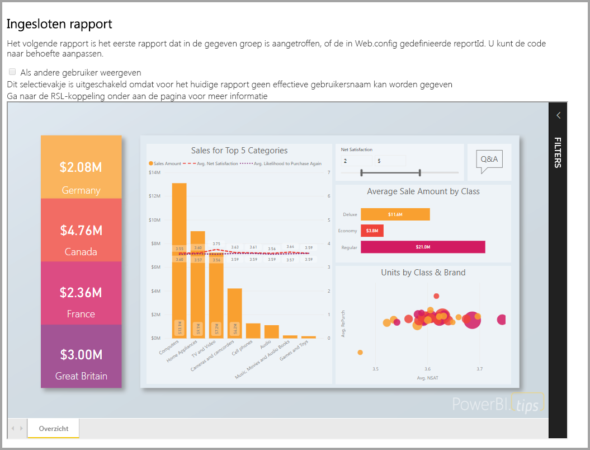
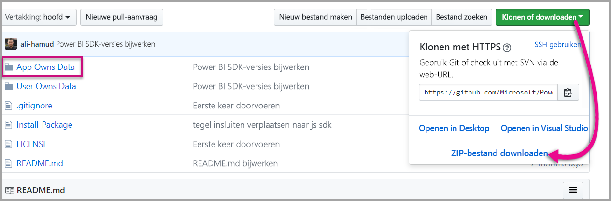
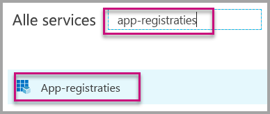
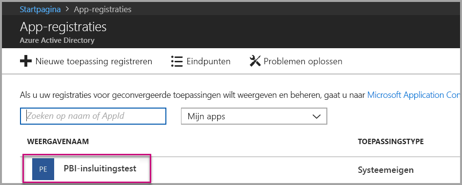
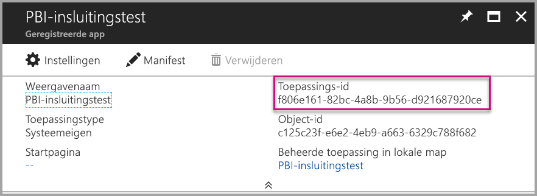
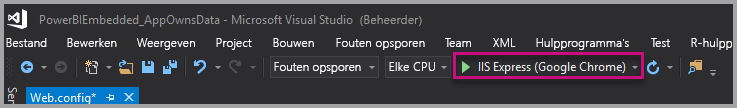
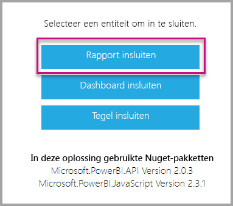
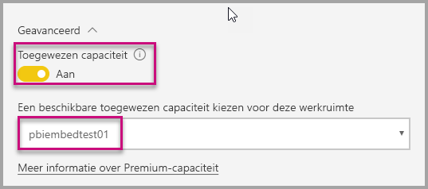

# <a name="tutorial-embed-power-bi-content-into-an-application-for-your-customers"></a>Zelfstudie: Power BI-inhoud insluiten in een toepassing voor uw klanten

Met **Power BI Embedded in Azure** kunt u rapporten, dashboards en tegels in een toepassing insluiten met de gegevens waarvan de app eigenaar is. Als **de app eigenaar is van de gegevens** kunt u een toepassing gebruiken die Power BI gebruikt als ingesloten analytics platform. Als **ISV-ontwikkelaar** kunt u Power BI-inhoud maken waarmee rapporten, dashboards of tegels worden weergegeven in een toepassing die volledig geïntegreerd en interactief is, zonder dat gebruikers een licentie voor Power BI hoeven te hebben. In deze zelfstudie leert u hoe u een rapport in een toepassing kunt integreren met de .NET SDK voor Power BI en de JavaScript-API voor Power BI bij gebruik van **Power BI Embedded in Azure** voor uw klanten.



In deze zelfstudie leert u het volgende:
> [!div class="checklist"]
> * Een toepassing registreren in Azure.
> * Een Power BI-rapport insluiten in een toepassing.

## <a name="prerequisites"></a>Vereisten

U hebt het volgende nodig om aan de slag te gaan:

* Een [Power BI Pro-account](../service-self-service-signup-for-power-bi.md) (een hoofdaccount met een gebruikersnaam en wachtwoord om u aan te melden bij uw Power BI Pro-account) of een [service-principal (een token alleen voor apps)](embed-service-principal.md).
* Een [Microsoft Azure](https://azure.microsoft.com/)-abonnement.
* U moet beschikken over een eigen [Azure Active Directory-tenant ](create-an-azure-active-directory-tenant.md).

Als u zich niet hebt geregistreerd voor **Power BI Pro**, [kunt u zich hier aanmelden voor een gratis proefversie](https://powerbi.microsoft.com/pricing/) voordat u begint.

Als u nog geen abonnement op Azure hebt, maakt u een [gratis account](https://azure.microsoft.com/free/?WT.mc_id=A261C142F) voordat u begint.

## <a name="set-up-your-embedded-analytics-development-environment"></a>De ingesloten analytische ontwikkelomgeving instellen

Voordat u begint met het insluiten van rapporten, dashboards en tegels in uw toepassing, moet u insluiting met Power BI mogelijk maken in uw omgeving.

U kunt het [installatieprogramma voor insluiten](https://aka.ms/embedsetup/AppOwnsData) uitvoeren om snel aan de slag te gaan en een voorbeeldtoepassing te downloaden waarmee u een omgeving leert maken en een rapport leert insluiten.

Als u echter besluit de omgeving handmatig in te stellen, kunt u hieronder doorgaan.

### <a name="register-an-application-in-azure-active-directory-azure-ad"></a>Een toepassing registreren in Azure Active Directory (Azure AD)

[Registreer uw toepassing](register-app.md) bij Azure Active Directory AD zodat uw toepassing toegang heeft tot de [Power BI REST API's](https://docs.microsoft.com/rest/api/power-bi/). Als u uw toepassing registreert, kunt u een identiteit instellen voor uw toepassing en machtigingen opgeven voor Power BI REST-resources. Afhankelijk van of u een hoofdaccount of [service-principal](embed-service-principal.md) wilt gebruiken, wordt bepaald op welke manier u een toepassing gaat registreren.

Welk type toepassing u in Azure registreert, is afhankelijk van de gekozen methode.

Als u een hoofdaccount blijft gebruiken, gaat u verder met het registreren van een **systeemeigen** app. U gebruikt een systeemeigen app omdat u met een niet-interactieve aanmelding werkt.

Als u echter de service-principal blijft gebruiken, moet u verder gaan met het registreren van een **webtoepassing aan de serverzijde**. U registreert een webtoepassing aan de serverzijde om een toepassingsgeheim te maken.

## <a name="set-up-your-power-bi-environment"></a>Uw Power BI-omgeving instellen

### <a name="create-an-app-workspace"></a>Een app-werkruimte maken

Als u rapporten, dashboards of tegels voor uw klanten insluit, moet u uw inhoud binnen de werkruimte van een app plaatsen. Er zijn verschillende typen werkruimten die u kunt instellen: de [traditionele werkruimten](../service-create-workspaces.md) of de [nieuwe werkruimten](../service-create-the-new-workspaces.md). Als u een *hoofdaccount* gebruikt, maakt het niet uit welke type werkruimten u gebruikt. Als u echter een *[service-principal](embed-service-principal.md)* gebruikt voor aanmelding bij uw toepassing, moet u de nieuwe werkruimten gebruiken. In beide scenario’s moet ofwel het *hoofdaccount* of de *service-principal* een beheerder zijn van de app-werkruimten die bij uw toepassing horen.

### <a name="create-and-publish-your-reports"></a>Rapporten maken en publiceren

U kunt de rapporten en gegevenssets maken met Power BI Desktop en de rapporten vervolgens publiceren naar een app-werkruimte. U kunt deze taak op twee manieren uitvoeren: Als eindgebruiker kunt u rapporten publiceren naar een traditionele app-werkruimte met een hoofdaccount (Power BI Pro-licentie). Als u een service-principal gebruikt, kunt u rapporten naar de nieuwe werkruimten publiceren met behulp van de [Power BI REST API's](https://docs.microsoft.com/rest/api/power-bi/imports/postimportingroup).

Volg de onderstaande stappen om uw PBIX-rapport naar uw Power BI-werkruimte te publiceren.

1. Download het voorbeeld van de [blogdemo](https://github.com/Microsoft/powerbi-desktop-samples) vanuit GitHub.

    

2. Open het voorbeeld-PBIX-rapport in **Power BI Desktop**.

   

3. Publiceren naar **app-werkruimten**. Hoe dit proces verloopt, hangt ervan af of u een hoofdaccount (Power Pro-licentie) of service-principal gebruikt. Als u een hoofdaccount gebruikt, kunt u uw rapport publiceren via Power BI Desktop.  Als u een service-principal gebruikt, moet de Power BI REST API's gebruiken.

## <a name="embed-content-using-the-sample-application"></a>Inhoud met behulp van de voorbeeldtoepassing insluiten

We hebben dit voorbeeld voor demonstratiedoeleinden bewust eenvoudig gehouden. Het is aan u of uw ontwikkelaars om het toepassingsgeheim of de aanmeldgegevens van het hoofdaccount te beveiligen.

Volg de onderstaande stappen om inhoud in te sluiten met de voorbeeldtoepassing.

1. Download [Visual Studio](https://www.visualstudio.com/) (versie 2013 of later). Download het meest recente [NuGet-pakket](https://www.nuget.org/profiles/powerbi).

2. Download het [voorbeeld waarin de app eigenaar is van de gegevens](https://github.com/Microsoft/PowerBI-Developer-Samples) vanuit GitHub om aan de slag te gaan.

    

3. Open het bestand **Web.config** in de voorbeeldtoepassing. Er zijn velden die u moet invullen om de toepassing uit te voeren. U kunt **MasterUser** of **ServicePrincipal** als **verificatietype** selecteren. Welke velden u moet invullen, is afhankelijk van de gekozen verificatiemethode.

    > [!Note]
    > Het standaard ingestelde **verificatietype** in dit voorbeeld is MasterUser.

    <center>

    | **MasterUser** <br> (Power BI Pro-licentie) | **ServicePrincipal** <br> (token alleen voor app)|
    |---------------|-------------------|
    | [applicationId](#application-id) | [applicationId](#application-id) |
    | [workspaceId](#workspace-id) | [workspaceId](#workspace-id) |
    | [reportId](#report-id) | [reportId](#report-id) |
    | [pbiUsername](#power-bi-username-and-password) |  |
    | [pbiPassword](#power-bi-username-and-password) |  |
    |  | [applicationsecret](#application-secret) |
    |  | [tenant](#tenant) |

   </center>

    

### <a name="application-id"></a>Toepassings-id

Dit kenmerk is vereist voor beide verificatietypen (hoofdaccount en [service-principal](embed-service-principal.md)).

Vul bij **applicationId** de **Toepassings-id** van **Azure** in. De **applicationId** wordt door de toepassing gebruikt om zich te identificeren bij de gebruikers bij wie u machtigingen aanvraagt.

Ga als volgt te werk om de **applicationId** op te halen:

1. Meld u aan bij [Azure Portal](https://portal.azure.com).

2. Selecteer in het navigatiedeelvenster links **Alle services** en selecteer **App-registraties**.

    

3. Selecteer de toepassing waarvoor de **applicationID** nodig is.

    

4. U ziet een **toepassings-id** die wordt vermeld als een GUID. Gebruik deze **Toepassings-id** als de **applicationId** voor de toepassing.

    

### <a name="workspace-id"></a>Werkruimte-id

Dit kenmerk is vereist voor beide verificatietypen (hoofdaccount en [service-principal](embed-service-principal.md)).

Vul bij **workspaceId** de app-werkruimte (groep)-GUID van Power BI in. U kunt deze informatie verkrijgen via de URL wanneer u bent aangemeld bij de Power BI-service, of via PowerShell.

URL <br>


PowerShell <br>

```powershell
Get-PowerBIworkspace -name "App Owns Embed Test"
```

   

### <a name="report-id"></a>Rapport-id

Dit kenmerk is vereist voor beide verificatietypen (hoofdaccount en [service-principal](embed-service-principal.md)).

Vul bij **reportId** informatie over de rapport-GUID uit Power BI in. U kunt deze informatie verkrijgen via de URL wanneer u bent aangemeld bij de Power BI-service, of via PowerShell.

URL<br>


PowerShell <br>

```powershell
Get-PowerBIworkspace -name "App Owns Embed Test" | Get-PowerBIReport
```


### <a name="power-bi-username-and-password"></a>Gebruikersnaam en wachtwoord voor Power BI

Deze kenmerken zijn alleen vereist voor het verificatietype Hoofdaccount.

Als u een [service-principal](embed-service-principal.md) gebruikt voor de verificatie, hoeft u de kenmerken Gebruikersnaam of Wachtwoord niet in te vullen.

* Vul bij **pbiUsername** het Power BI-hoofdaccount in.
* Vul bij **pbiPassword** het wachtwoord van het Power BI-hoofdaccount in.

### <a name="application-secret"></a>Toepassingsgeheim

Dit kenmerk is alleen vereist voor het verificatietype [Service-principal](embed-service-principal.md).

Geef de **ApplicationSecret**-gegevens op in de sectie **Sleutels** van de sectie **App-registraties** in **Azure**.  Dit kenmerk werkt wanneer u een [service-principal](embed-service-principal.md) gebruikt.

Ga als volgt te werk om de **ApplicationSecret** op te halen:

1. Meld u aan bij [Azure Portal](https://portal.azure.com).

2. Selecteer in het navigatiedeelvenster links **Alle services** en selecteer vervolgens **App-registraties**.

    

3. Selecteer de toepassing die de **ApplicationSecret** moet gebruiken.

    

4. Selecteer **Instellingen**.

    

5. Selecteer **Sleutels**.

    

6. Voer in het vak **Beschrijving** een naam in en selecteer een duur. Selecteer vervolgens **Opslaan** om de **Waarde** voor uw toepassing op te halen. Wanneer u het deelvenster **Sleutels** sluit nadat u de sleutelwaarde hebt opgeslagen, wordt het waardeveld alleen nog als verborgen weergegeven. Op dat punt kunt u de sleutelwaarde niet meer ophalen. Als u de sleutelwaarde kwijtraakt, kunt u een nieuwe maken in Azure Portal.

    

### <a name="tenant"></a>Tenant

Dit kenmerk is alleen vereist voor het verificatietype [Service-principal](embed-service-principal.md).

Vul bij de informatie over de **tenant** uw Azure zure-tenant-id in. U kunt deze informatie verkrijgen via [Azure AD Portal](https://docs.microsoft.com/onedrive/find-your-office-365-tenant-id#use-the-azure-ad-portal) wanneer u bent aangemeld bij de Power BI-service, of via PowerShell.

### <a name="run-the-application"></a>De toepassing uitvoeren

1. Selecteer **Uitvoeren** in **Visual Studio**.

    

2. Selecteer vervolgens **Rapport insluiten**. Selecteer de optie die overeenkomt met het item dat u wilt testen (rapporten, dasboards of tegels).

    

3. U kunt het rapport nu weergeven in de voorbeeldtoepassing.

    

## <a name="embed-content-within-your-application"></a>Inhoud in uw toepassing insluiten

Hoewel de stappen voor het insluiten van uw inhoud worden uitgevoerd met de [Power BI REST API's](https://docs.microsoft.com/rest/api/power-bi/), worden de voorbeeldcodes die worden beschreven in dit artikel gemaakt met de **.NET SDK**.

Als u voor uw klanten inhoud in uw toepassing wilt insluiten, is een **toegangstoken** vereist voor uw hoofdaccount of [service-principal](embed-service-principal.md) van **Azure AD**. U moet een [Azure Active Directory-toegangstoken ophalen](get-azuread-access-token.md#access-token-for-non-power-bi-users-app-owns-data) voor uw Power BI-toepassing voordat u de [Power BI REST API's](https://docs.microsoft.com/rest/api/power-bi/) kunt aanroepen.

Als u de Power BI-client met uw **toegangstoken** wilt maken, maakt u uw Power BI-clientobject zodat u kunt communiceren met de [Power BI REST-API's](https://docs.microsoft.com/rest/api/power-bi/). U maakt het **Power BI-clientobject** door het AccessToken te verpakken met het object ***Microsoft.Rest.TokenCredentials***.

```csharp
using Microsoft.IdentityModel.Clients.ActiveDirectory;
using Microsoft.Rest;
using Microsoft.PowerBI.Api.V2;

var tokenCredentials = new TokenCredentials(authenticationResult.AccessToken, "Bearer");

// Create a Power BI Client object. it's used to call Power BI APIs.
using (var client = new PowerBIClient(new Uri(ApiUrl), tokenCredentials))
{
    // Your code to embed items.
}
```

### <a name="get-the-content-item-you-want-to-embed"></a>Het inhoudsitem dat u wilt insluiten ophalen

U kunt het Power BI-clientobject gebruiken voor het ophalen van een verwijzing naar het item dat u wilt insluiten.

Hier volgt een codevoorbeeld van hoe u het eerste rapport ophaalt uit een bepaalde werkruimte.

*Een voorbeeld van het ophalen van een inhoudsitem voor een rapport, dashboard of tegel die u wilt insluiten is beschikbaar in het bestand Services\EmbedService.cs in de [voorbeeldtoepassing](https://github.com/Microsoft/PowerBI-Developer-Samples).*

```csharp
using Microsoft.PowerBI.Api.V2;
using Microsoft.PowerBI.Api.V2.Models;

// You need to provide the workspaceId where the dashboard resides.
ODataResponseListReport reports = await client.Reports.GetReportsInGroupAsync(workspaceId);

// Get the first report in the group.
Report report = reports.Value.FirstOrDefault();
```

### <a name="create-the-embed-token"></a>Het insluittoken maken

Een insluittoken genereren dat kan worden gebruikt vanuit de JavaScript API. Het insluittoken heeft alleen betrekking op het item dat u insluit. Dit betekent dat u een nieuw insluittoken moet maken voor elk stukje Power BI-inhoud dat u wilt insluiten. Zie [GenerateToken API](https://msdn.microsoft.com/library/mt784614.aspx) voor meer informatie, onder andere over welk **accessLevel** u moet gebruiken.

*Een voorbeeld van het maken van een insluittoken voor een rapport, dashboard of tegel is beschikbaar in het bestand Services\EmbedService.cs in de [voorbeeldtoepassing](https://github.com/Microsoft/PowerBI-Developer-Samples).*

```csharp
using Microsoft.PowerBI.Api.V2;
using Microsoft.PowerBI.Api.V2.Models;

// Generate Embed Token.
var generateTokenRequestParameters = new GenerateTokenRequest(accessLevel: "view");
EmbedToken tokenResponse = client.Reports.GenerateTokenInGroup(workspaceId, report.Id, generateTokenRequestParameters);

// Generate Embed Configuration.
var embedConfig = new EmbedConfig()
{
    EmbedToken = tokenResponse,
    EmbedUrl = report.EmbedUrl,
    Id = report.Id
};
```

Er wordt een klasse wordt gemaakt voor **EmbedConfig** en **TileEmbedConfig**. Er is een voorbeeld beschikbaar in het bestand **Models\EmbedConfig.cs** en het bestand **Models\TileEmbedConfig.cs**.

### <a name="load-an-item-using-javascript"></a>Een item laden met JavaScript

U kunt JavaScript gebruiken om een rapport te laden in een div-element op uw webpagina.

Voor een volledig voorbeeld van het gebruik van de JavaScript-API kunt u het [hulpprogramma Playground](https://microsoft.github.io/PowerBI-JavaScript/demo) gebruiken. Met het hulpprogramma Playground kunt u op een snelle manier verschillende typen Power BI Embedded-voorbeelden uitproberen. Op de [wikipagina voor Power BI JavaScript](https://github.com/Microsoft/powerbi-javascript/wiki) vindt u ook meer informatie over de JavaScript-API.

Dit voorbeeld maakt gebruik van een **EmbedConfig**-model, een **TileEmbedConfig**-model en weergaven van een rapport.

*Een voorbeeld van het toevoegen van een weergave voor een rapport, dashboard of tegel is beschikbaar in het bestand Views\Home\EmbedReport.cshtml, Views\Home\EmbedDashboard.cshtml of Views\Home\Embedtile.cshtml in de [voorbeeldtoepassing](#embed-your-content-within-a-sample-application).*

```javascript
<script src="~/scripts/powerbi.js"></script>
<div id="reportContainer"></div>
<script>
    // Read embed application token from Model
    var accessToken = "@Model.EmbedToken.Token";

    // Read embed URL from Model
    var embedUrl = "@Html.Raw(Model.EmbedUrl)";

    // Read report Id from Model
    var embedReportId = "@Model.Id";

    // Get models. models contains enums that can be used.
    var models = window['powerbi-client'].models;

    // Embed configuration used to describe what and how to embed.
    // This object is used when calling powerbi.embed.
    // This also includes settings and options such as filters.
    // You can find more information at https://github.com/Microsoft/PowerBI-JavaScript/wiki/Embed-Configuration-Details.
    var config = {
        type: 'report',
        tokenType: models.TokenType.Embed,
        accessToken: accessToken,
        embedUrl: embedUrl,
        id: embedReportId,
        permissions: models.Permissions.All,
        settings: {
            filterPaneEnabled: true,
            navContentPaneEnabled: true
        }
    };

    // Get a reference to the embedded report HTML element
    var reportContainer = $('#reportContainer')[0];

    // Embed the report and display it within the div container.
    var report = powerbi.embed(reportContainer, config);
</script>
```

## <a name="move-to-production"></a>Verplaatsen naar productie

Nu u uw toepassing hebt ontwikkeld, is het tijd om toegewezen capaciteit toe te voegen aan uw app-werkruimte. 

> [!Important]
> Toegewezen capaciteit is vereist voor het verplaatsen naar productie.

### <a name="create-a-dedicated-capacity"></a>Een toegewezen capaciteit maken

Als u een toegewezen capaciteit maakt, profiteert u van een toegewezen resource voor uw klant. U kunt toegewezen capaciteit kopen in [Microsoft Azure Portal](https://portal.azure.com). Zie [Power BI Embedded-capaciteit maken in Azure Portal](azure-pbie-create-capacity.md) voor meer informatie over het maken van Power BI Embedded-capaciteit.

Gebruik de onderstaande tabel om te bepalen welke Power BI Embedded-capaciteit het beste aansluit op uw behoeften.

| Capaciteitsknooppunt | Totaal aantal cores<br/>*(back-end + front-end)* | Back-endcores | Front-endcores | Limieten voor DirectQuery/liveverbindingen|
| --- | --- | --- | --- | --- | --- |
| A1 |1 v-core(s) |0,5 kern, 3 GB RAM |0,5 kern |0 5 per seconde |
| A2 |2 v-core(s) |1 kern, 5 GB RAM |1 core(s) | 10 per seconde |
| A3 |4 v-core(s) |2 kernen, 10 GB RAM |2 core(s) | 15 per seconde |
| A4 |8 v-core(s) |4 kernen, 25 GB RAM |4 core(s) |30 per seconde |
| A5 |16 v-core(s) |8 kernen, 50 GB RAM |8 core(s) |60 per seconde |
| A6 |32 v-core(s) |16 kernen, 100 GB RAM |16 core(s) |120 per seconde |

**_Met A-SKU's hebt u met een GRATIS Power BI-licentie geen toegang tot Power BI-inhoud._**

Het gebruik van insluittokens met een PRO-licentie is bedoeld voor ontwikkelingstesten. Met een Power BI-hoofdaccount of service-principal kunt u dus maar een beperkt aantal insluittokens genereren. Er is een toegewezen capaciteit vereist voor het insluiten van items in een productieomgeving. Met een toegewezen capaciteit kunt u een onbeperkt aantal insluitingstokens genereren. Ga naar [Beschikbare functies](https://docs.microsoft.com/rest/api/power-bi/availablefeatures/getavailablefeatures) om de waarde voor het gebruik te controleren. Hiermee wordt het huidige gebruik van insluittokens in procenten aangegeven. De hoeveelheid is gebaseerd op elk hoofdaccount.

Zie het [Technisch document over ingesloten-capaciteitsplanning](https://aka.ms/pbiewhitepaper) voor meer informatie.

### <a name="assign-an-app-workspace-to-a-dedicated-capacity"></a>Een app-werkruimte toewijzen aan een toegewezen capaciteit

Zodra u toegewezen capaciteit hebt gemaakt, kunt u uw app-werkruimte toewijzen aan die toegewezen capaciteit.

Als u een toegewezen capaciteit aan een werkruimte wilt toewijzen met behulp van een [service-principal](embed-service-principal.md), gebruikt u de [Power BI REST API](https://docs.microsoft.com/rest/api/power-bi/capacities/groups_assigntocapacity). Wanneer u de Power BI REST API's gebruikt, moet u de [object-id van de service-principal](embed-service-principal.md#how-to-get-the-service-principal-object-id) gebruiken.

Volg de onderstaande stappen om een toegewezen capaciteit aan een werkruimte toe te wijzen met behulp van een **hoofdaccount**.

1. Vouw binnen **Power BI-service** werkruimten uit en selecteer het beletselteken voor de werkruimte die u gebruikt voor het insluiten van uw inhoud. Selecteer vervolgens **Werkruimten bewerken**.

    

2. Vouw **Geavanceerd** uit, schakel **Toegewezen capaciteit** in en selecteer de toegewezen capaciteit die u hebt gemaakt. Selecteer vervolgens **Opslaan**.

    

3. Nadat u **Opslaan** hebt geselecteerd, ziet u een **ruit** naast de naam van de app-werkruimte.

    

## <a name="next-steps"></a>Volgende stappen

In deze zelfstudie hebt u geleerd hoe u Power BI-inhoud insluit in een toepassing voor uw klanten. U kunt ook Power BI-inhoud insluiten voor uw organisatie.

> [!div class="nextstepaction"]
>[Insluiten voor uw organisatie](embed-sample-for-your-organization.md)

Hebt u nog vragen? [Misschien dat de Power BI-community het antwoord weet](http://community.powerbi.com/)
