# <a name="tutorial-embed-a-power-bi-report-dashboard-or-tile-into-an-application-for-your-customers"></a>Zelfstudie: Een Power BI-rapport, -dashboard of -tegel insluiten in een toepassing voor uw klanten

Met **Power BI Embedded in Azure** kunt u rapporten, dashboards en tegels in een toepassing insluiten met de gegevens waarvan de app eigenaar is. Als **de app eigenaar is van de gegevens** kunt u een toepassing gebruiken die Power BI gebruikt als ingesloten analytics platform. Als **ISV-ontwikkelaar** kunt u Power BI-inhoud maken waarmee rapporten, dashboards of tegels worden weergegeven in een toepassing die volledig geïntegreerd en interactief is, zonder dat gebruikers een licentie voor Power BI hoeven te hebben. In deze zelfstudie leert u hoe u een rapport in een toepassing kunt integreren met de .NET SDK voor Power BI en de JavaScript-API voor Power BI bij gebruik van **Power BI Embedded in Azure** voor uw klanten.

In deze zelfstudie leert u het volgende:
> [!div class="checklist"]
> * Een toepassing registreren in Azure.
> * Een Power BI-rapport insluiten in een toepassing.

## <a name="prerequisites"></a>Vereisten

Om te beginnen hebt u een **Power BI Pro**-account (dit account is uw **hoofdaccount**) en een **Microsoft Azure**-abonnement nodig.

* Als u zich niet hebt geregistreerd voor **Power BI Pro**, [kunt u zich hier aanmelden voor een gratis proefversie](https://powerbi.microsoft.com/en-us/pricing/) voordat u begint.
* Als u nog geen abonnement op Azure hebt, maakt u een [gratis account](https://azure.microsoft.com/free/?WT.mc_id=A261C142F) voordat u begint.
* U moet beschikken over een eigen [Azure Active Directory-tenant ](create-an-azure-active-directory-tenant.md).
* [Visual Studio](https://www.visualstudio.com/) moet zijn geïnstalleerd (versie 2013 of hoger).

## <a name="set-up-your-embedded-analytics-development-environment"></a>De ingesloten analytische ontwikkelomgeving instellen

Voordat u begint met het insluiten van rapporten, dashboards en tegels in uw toepassing, moet u insluiting met Power BI mogelijk maken in uw omgeving.

U kunt het [installatieprogramma voor insluiten](https://aka.ms/embedsetup/AppOwnsData) uitvoeren om snel aan de slag te gaan en een voorbeeldtoepassing te downloaden waarmee u een omgeving leert maken en een rapport leert insluiten.

Als u echter besluit de omgeving handmatig in te stellen, kunt u hieronder doorgaan.

### <a name="register-an-application-in-azure-active-directory-azure-ad"></a>Een toepassing registreren in Azure Active Directory (Azure AD)

U kunt uw toepassing registreren bij Azure Active Directory AD zodat uw toepassing toegang heeft tot de Power BI REST-API's. Als u uw toepassing registreert, kunt u een identiteit instellen voor uw toepassing en machtigingen opgeven voor Power BI REST-resources.

1. Accepteer de [algemene voorwaarden van de Microsoft Power BI-API](https://powerbi.microsoft.com/api-terms).

2. Meld u aan bij [Azure Portal](https://portal.azure.com).

    

3. Selecteer in het navigatiedeelvenster links **Alle services**, selecteer **App-registraties** en selecteer vervolgens **Nieuwe toepassing registreren**.

    </br>
    

4. Volg de aanwijzingen en maak een nieuwe toepassing. Als de app eigenaar is van de gegevens, gebruikt **Systeemeigen** als het toepassingstype. Daarnaast moet u een **omleidings-URI** opgeven, die **Azure AD** gebruikt om tokenantwoorden te retourneren. Voer een specifieke waarde in voor uw toepassing (bijvoorbeeld `http://localhost:13526/Redirect`).

    

### <a name="apply-permissions-to-your-application-within-azure-active-directory"></a>Machtigingen toepassen op uw toepassing in Azure Active Directory

Schakel extra machtigingen in voor uw toepassing, inclusief de informatie die u hebt opgegeven op de pagina voor de app-registratie. Meld u aan met het *hoofdaccount* dat u voor het insluiten van inhoud gebruikt. Het hoofdaccount moet het account van een globale beheerder zijn.

### <a name="use-the-azure-active-directory-portal"></a>Azure Active Directory-portal gebruiken

1. Blader naar [App-registraties](https://portal.azure.com/#blade/Microsoft_AAD_IAM/ApplicationsListBlade) in Azure Portal en selecteer de app die u gebruikt voor insluiting.

    

2. Selecteer **Instellingen** en selecteer **Vereiste machtigingen**, onder **API-toegang**.

    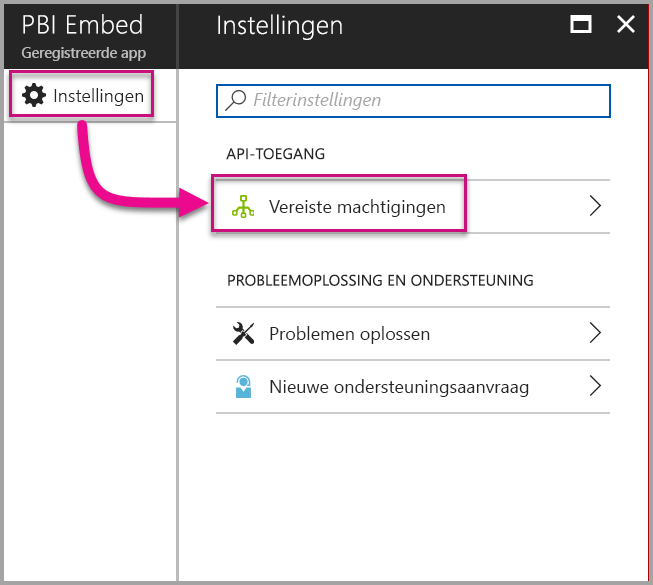

3. Selecteer **Windows Azure Active Directory** en controleer vervolgens of **De map openen als de aangemelde gebruiker** is geselecteerd. Selecteer **Opslaan**.

    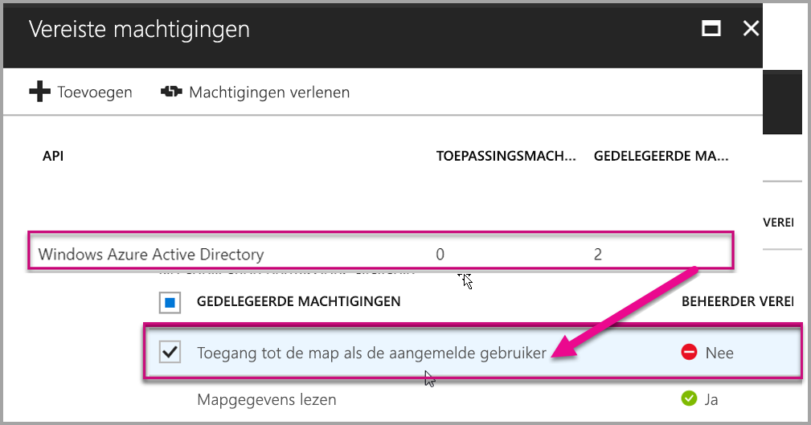

4. Selecteer **Toevoegen**.

    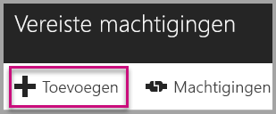

5. Selecteer **Een API selecteren**.

    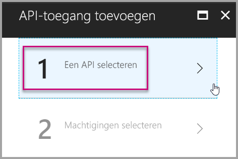

6. Selecteer **Power BI-service** en selecteer vervolgens **Selecteren**.

    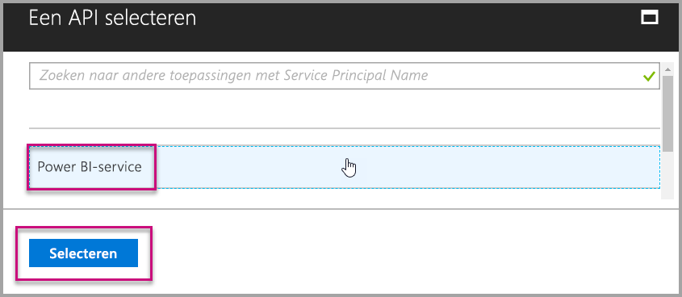

7. Selecteer alle machtigingen onder **Gedelegeerde machtigingen**. Selecteer **Opslaan** wanneer u klaar bent.

    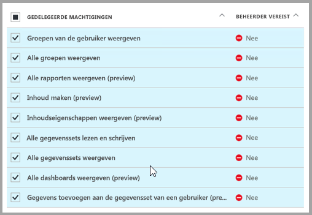

8. Selecteer binnen **Vereiste machtigingen** de optie **Machtigingen verlenen**.

    De actie **Machtigingen verlenen** is vereist voor het *hoofdaccount* om te voorkomen dat om toestemming wordt gevraagd door Azure AD. Als het account waarmee deze actie wordt uitgevoerd een globale beheerder is, moet u machtigingen verlenen voor alle gebruikers binnen uw organisatie voor deze toepassing. Als het account waarmee deze actie wordt uitgevoerd het *hoofdaccount* is en niet een globale beheerder, moet u alleen machtigingen verlenen aan het *hoofdaccount* voor deze toepassing.

    

## <a name="set-up-your-power-bi-environment"></a>Uw Power BI-omgeving instellen

### <a name="create-an-app-workspace"></a>Een app-werkruimte maken

Als u rapporten, dashboards of tegels voor uw klanten insluit, moet u uw inhoud binnen de werkruimte van een app plaatsen. Het *hoofd*account moet een beheerder van de app-werkruimte zijn.

1. Maak eerst de werkruimte. Selecteer **Werkruimten** > **App-werkruimte maken**. In Appwerkruimte maken plaatst u de inhoud waartoe de toepassing toegang moet hebben.

    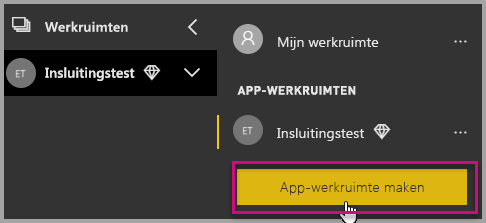

2. Geef een naam op voor de werkruimte. Als de corresponderende **werkruimte-id** niet beschikbaar is, kunt u deze bewerken tot een unieke aanduiding.

    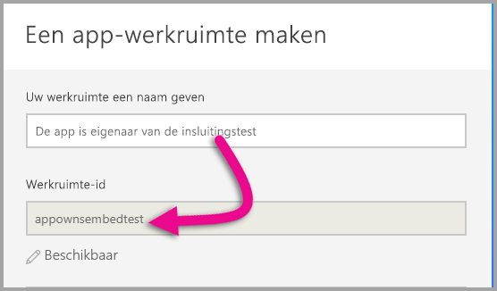

3. U moet een aantal opties instellen. Als u **Openbaar** kiest, is de inhoud van de werkruimte zichtbaar voor iedereen in de organisatie. Als u **Privé** kiest, kunnen alleen leden van de werkruimte de inhoud bekijken.

    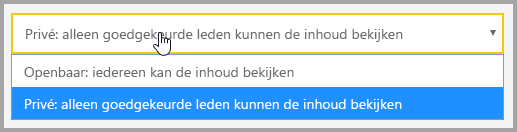

    U kunt de instelling Openbaar/Privé niet meer wijzigen nadat u de groep hebt gemaakt.

4. U kunt ook kiezen of leden van de werkruimte rechten voor **bewerken** of **alleen-lezen** krijgen.

    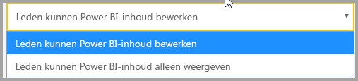

5. Voeg de e-mailadressen toe van de personen die u toegang tot de werkruimte wilt geven, en selecteer **Toevoegen**. U kunt geen groepsaliassen toevoegen, alleen personen.

6. Bepaal per persoon of deze een lid of een beheerder is. Beheerders kunnen de werkruimte zelf bewerken, en bijvoorbeeld ook andere leden toevoegen. Leden kunnen de inhoud in de werkruimte bewerken, tenzij ze alleen leesrechten hebben. Zowel beheerders als leden kunnen de app publiceren.

    Nu kunt u de nieuwe werkruimte weergeven. De werkruimte wordt gemaakt en in Power BI geopend. De werkruimte wordt weergegeven in de lijst met werkruimten waarvan u lid bent. Omdat u een beheerder bent, kunt u het weglatingsteken (...) selecteren om terug te gaan en wijzigingen aanbrengen, bijvoorbeeld nieuwe leden toevoegen of machtigingen van leden wijzigen.

    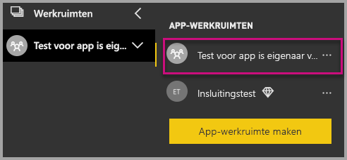

### <a name="create-and-publish-your-reports"></a>Rapporten maken en publiceren

U kunt de rapporten en gegevenssets maken met Power BI Desktop en de rapporten vervolgens publiceren naar een app-werkruimte. De eindgebruiker die de rapporten naar een app-werkruimte publiceert, moet beschikken over een Power BI Pro-licentie.

1. Download het voorbeeld van de [blogdemo](https://github.com/Microsoft/powerbi-desktop-samples) vanuit GitHub.

    

2. Open het voorbeeld-PBIX-rapport in **Power BI Desktop**.

   

3. Publiceer het rapport naar de **app-werkruimte**.

   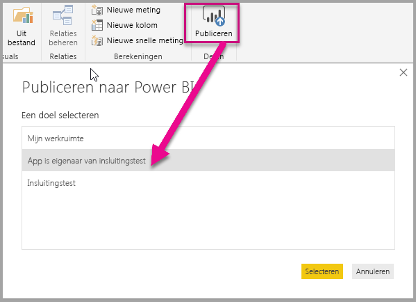

    U kunt het rapport nu weergeven in Power BI-service online.

   

## <a name="embed-your-content-using-the-sample-application"></a>Uw inhoud met behulp van de voorbeeldtoepassing insluiten

Volg deze stappen om inhoud in te sluiten met een voorbeeldtoepassing.

1. Download het [voorbeeld waarin de app eigenaar is van de gegevens](https://github.com/Microsoft/PowerBI-Developer-Samples) vanuit GitHub om aan de slag te gaan.

    

2. Open het bestand Web.config in de voorbeeldtoepassing. Er zijn vijf velden die u moet invullen voor een correcte uitvoering van de toepassing: **applicationId**, **workspaceId**, **reportId**, **pbiUsername** en **pbiPassword**.

    

    Vul bij **applicationId** de **Toepassings-id** van **Azure** in. De **applicationId** wordt door de toepassing gebruikt om zich te identificeren bij de gebruikers bij wie u machtigingen aanvraagt. Ga als volgt te werk om de **applicationId** op te halen:

    Meld u aan bij [Azure Portal](https://portal.azure.com).

    

    Selecteer in het navigatiedeelvenster links **Alle services** en selecteer **App-registraties**.

    

    Selecteer de toepassing waarvoor u de **applicationId** wilt ophalen.

    

    U ziet een **toepassings-ID** die wordt vermeld als een GUID. Gebruik deze **Toepassings-id** als de **applicationId** voor de toepassing.

    

    Vul bij **workspaceId** de **app-werkruimte-GUID** van Power BI in.

    

    Vul bij **reportId** informatie over de **rapport-GUID** uit Power BI in.

    

    * Vul bij **pbiUsername** het Power BI-account van de hoofdgebruiker in.
    * Vul bij **pbiPassword** het wachtwoord van het Power BI-account van de hoofdgebruiker in.

3. Nu kunt u de toepassing uitvoeren.

    Selecteer eerst **Uitvoeren** in **Visual Studio**.

    

    Selecteer vervolgens **Rapport insluiten**. Selecteer de optie die overeenkomt met het item dat u wilt testen (rapporten, dasboards of tegels).

    

    U kunt het rapport nu weergeven in de voorbeeldtoepassing.

    

## <a name="embed-your-content-within-your-application"></a>Uw inhoud in uw toepassing insluiten

Hoewel de stappen voor het insluiten van uw inhoud kunnen worden uitgevoerd met de [Power BI REST-API's](https://docs.microsoft.com/rest/api/power-bi/), worden de voorbeeldcodes die worden beschreven in dit artikel gemaakt met de **.NET SDK**.

Als u voor uw klanten inhoud in uw toepassing wilt insluiten, is een **toegangstoken** vereist voor het hoofdaccount van **Azure AD**. U moet een [Azure Active Directory-toegangstoken ophalen](get-azuread-access-token.md#access-token-for-non-power-bi-users-app-owns-data) voor uw Power BI-toepassing met een **app die eigenaar is van de gegevens** voordat u de [Power BI REST-API's](https://docs.microsoft.com/rest/api/power-bi/) kunt aanroepen.

Als u de Power BI-client met uw **toegangstoken** wilt maken, maakt u uw Power BI-clientobject zodat u kunt communiceren met de [Power BI REST-API's](https://docs.microsoft.com/rest/api/power-bi/). U maakt het **Power BI-clientobject** door het AccessToken te verpakken met het object ***Microsoft.Rest.TokenCredentials***.

```csharp
using Microsoft.IdentityModel.Clients.ActiveDirectory;
using Microsoft.Rest;
using Microsoft.PowerBI.Api.V2;

var tokenCredentials = new TokenCredentials(authenticationResult.AccessToken, "Bearer");

// Create a Power BI Client object. it's used to call Power BI APIs.
using (var client = new PowerBIClient(new Uri(ApiUrl), tokenCredentials))
{
    // Your code to embed items.
}
```

### <a name="get-the-content-item-you-want-to-embed"></a>Het inhoudsitem dat u wilt insluiten ophalen

U kunt het Power BI-clientobject gebruiken voor het ophalen van een verwijzing naar het item dat u wilt insluiten.

Hier volgt een codevoorbeeld van hoe u het eerste rapport ophaalt uit een bepaalde werkruimte.

*Een voorbeeld van het ophalen van een inhoudsitem voor een rapport, dashboard of tegel die u wilt insluiten is beschikbaar in het bestand Controllers\HomeController.cs in de [voorbeeldtoepassing](#embed-your-content-within-a-sample-application).*

```csharp
using Microsoft.PowerBI.Api.V2;
using Microsoft.PowerBI.Api.V2.Models;

// You need to provide the workspaceId where the dashboard resides.
ODataResponseListReport reports = await client.Reports.GetReportsInGroupAsync(workspaceId);

// Get the first report in the group.
Report report = reports.Value.FirstOrDefault();
```

### <a name="create-the-embed-token"></a>Het insluittoken maken

Een insluittoken genereren dat kan worden gebruikt vanuit de JavaScript API. Het insluittoken heeft alleen betrekking op het item dat u insluit. Dit betekent dat u een nieuw insluittoken moet maken voor elk stukje Power BI-inhoud dat u wilt insluiten. Zie [GenerateToken API](https://msdn.microsoft.com/library/mt784614.aspx) voor meer informatie, onder andere over welk **accessLevel** u moet gebruiken.

Hier volgt een voorbeeld van het toevoegen van een insluittoken voor een rapport aan uw toepassing.

*Een voorbeeld van het maken van een insluittoken voor een rapport, dashboard of tegel is beschikbaar in het bestand Controllers\HomeController.cs in de [voorbeeldtoepassing](#embed-your-content-within-a-sample-application).*

```csharp
using Microsoft.PowerBI.Api.V2;
using Microsoft.PowerBI.Api.V2.Models;

// Generate Embed Token.
var generateTokenRequestParameters = new GenerateTokenRequest(accessLevel: "view");
EmbedToken tokenResponse = client.Reports.GenerateTokenInGroup(workspaceId, report.Id, generateTokenRequestParameters);

// Generate Embed Configuration.
var embedConfig = new EmbedConfig()
{
    EmbedToken = tokenResponse,
    EmbedUrl = report.EmbedUrl,
    Id = report.Id
};
```

Er wordt een klasse wordt gemaakt voor **EmbedConfig** en **TileEmbedConfig**. Er is een voorbeeld beschikbaar in het bestand **Models\EmbedConfig.cs** en het bestand **Models\TileEmbedConfig.cs**.

### <a name="load-an-item-using-javascript"></a>Een item laden met JavaScript

U kunt JavaScript gebruiken om een rapport te laden in een div-element op uw webpagina.

Voor een volledig voorbeeld van het gebruik van de JavaScript-API kunt u het [hulpprogramma Playground](https://microsoft.github.io/PowerBI-JavaScript/demo) gebruiken. Met het hulpprogramma Playground kunt u op een snelle manier verschillende typen Power BI Embedded-voorbeelden uitproberen. Op de [wikipagina voor Power BI JavaScript](https://github.com/Microsoft/powerbi-javascript/wiki) vindt u ook meer informatie over de JavaScript-API.

Dit voorbeeld maakt gebruik van een **EmbedConfig**-model, een **TileEmbedConfig**-model en weergaven van een rapport.

*Een voorbeeld van het toevoegen van een weergave voor een rapport, dashboard of tegel is beschikbaar in het bestand Views\Home\EmbedReport.cshtml, Views\Home\EmbedDashboard.cshtml of Views\Home\Embedtile.cshtml in de [voorbeeldtoepassing](#embed-your-content-within-a-sample-application).*

```javascript
<script src="~/scripts/powerbi.js"></script>
<div id="reportContainer"></div>
<script>
    // Read embed application token from Model
    var accessToken = "@Model.EmbedToken.Token";

    // Read embed URL from Model
    var embedUrl = "@Html.Raw(Model.EmbedUrl)";

    // Read report Id from Model
    var embedReportId = "@Model.Id";

    // Get models. models contains enums that can be used.
    var models = window['powerbi-client'].models;

    // Embed configuration used to describe the what and how to embed.
    // This object is used when calling powerbi.embed.
    // This also includes settings and options such as filters.
    // You can find more information at https://github.com/Microsoft/PowerBI-JavaScript/wiki/Embed-Configuration-Details.
    var config = {
        type: 'report',
        tokenType: models.TokenType.Embed,
        accessToken: accessToken,
        embedUrl: embedUrl,
        id: embedReportId,
        permissions: models.Permissions.All,
        settings: {
            filterPaneEnabled: true,
            navContentPaneEnabled: true
        }
    };

    // Get a reference to the embedded report HTML element
    var reportContainer = $('#reportContainer')[0];

    // Embed the report and display it within the div container.
    var report = powerbi.embed(reportContainer, config);
</script>
```

## <a name="move-to-production"></a>Verplaatsen naar productie

Nu u uw toepassing hebt ontwikkeld, is het tijd om toegewezen capaciteit toe te voegen aan uw app-werkruimte. Toegewezen capaciteit is vereist voor het verplaatsen naar productie.

### <a name="create-a-dedicated-capacity"></a>Een toegewezen capaciteit maken

Als u een toegewezen capaciteit maakt, profiteert u van een toegewezen resource voor uw klant. U kunt toegewezen capaciteit kopen in [Microsoft Azure Portal](https://portal.azure.com). Zie [Power BI Embedded-capaciteit maken in Azure Portal](azure-pbie-create-capacity.md) voor meer informatie over het maken van Power BI Embedded-capaciteit.

Gebruik de onderstaande tabel om te bepalen welke Power BI Embedded-capaciteit het beste aansluit op uw behoeften.

| Capaciteitsknooppunt | Totaal aantal cores<br/>*(back-end + front-end)* | Back-endcores | Front-endcores | Limieten voor DirectQuery/liveverbindingen|
| --- | --- | --- | --- | --- | --- |
| A1 |1 v-core(s) |0,5 kern, 3 GB RAM |0,5 kern |0 5 per seconde |
| A2 |2 v-core(s) |1 kern, 5 GB RAM |1 core(s) | 10 per seconde |
| A3 |4 v-core(s) |2 kernen, 10 GB RAM |2 core(s) | 15 per seconde |
| A4 |8 v-core(s) |4 kernen, 25 GB RAM |4 core(s) |30 per seconde |
| A5 |16 v-core(s) |8 kernen, 50 GB RAM |8 core(s) |60 per seconde |
| A6 |32 v-core(s) |16 kernen, 100 GB RAM |16 core(s) |120 per seconde |

**_Met A-SKU's hebt u met een GRATIS Power BI-licentie geen toegang tot Power BI-inhoud._**

Het gebruik van insluittokens met een PRO-licentie is bedoeld voor ontwikkelingstesten, dus een Power BI-hoofdaccount kan maar een beperenkt aantal insluittokens genereren. Er is een toegewezen capaciteit vereist voor het insluiten van items in een productieomgeving. Met een toegewezen capaciteit kunt u een onbeperkt aantal insluitingstokens genereren. Ga naar [Beschikbare functies](https://docs.microsoft.com/rest/api/power-bi/availablefeatures/getavailablefeatures) om de waarde voor het gebruik te controleren. Hiermee wordt het huidige gebruik van insluittokens in procenten aangegeven. De hoeveelheid is gebaseerd op elk hoofdaccount.

Zie het [Technisch document over ingesloten-capaciteitsplanning](https://aka.ms/pbiewhitepaper) voor meer informatie.

### <a name="assign-an-app-workspace-to-a-dedicated-capacity"></a>Een app-werkruimte toewijzen aan een toegewezen capaciteit

Zodra u toegewezen capaciteit hebt gemaakt, kunt u uw app-werkruimte toewijzen aan die toegewezen capaciteit. Als u een toegewezen capaciteit aan een werkruimte wilt toewijzen, volgt u deze stappen.

1. Vouw binnen **Power BI-service** werkruimten uit en selecteer het beletselteken voor de werkruimte die u gebruikt voor het insluiten van uw inhoud. Selecteer vervolgens **Werkruimten bewerken**.

    

2. Vouw **Geavanceerd** uit, schakel **Toegewezen capaciteit** in en selecteer de toegewezen capaciteit die u hebt gemaakt. Selecteer vervolgens **Opslaan**.

    

3. Nadat u **Opslaan** hebt geselecteerd, ziet u een **ruit** naast de naam van de app-werkruimte.

    

## <a name="next-steps"></a>Volgende stappen

In deze zelfstudie hebt u geleerd hoe u Power BI-inhoud insluit in een toepassing voor uw klanten. U kunt ook Power BI-inhoud insluiten voor uw organisatie.

> [!div class="nextstepaction"]
>[Insluiten voor uw organisatie](embed-sample-for-your-organization.md)

Hebt u nog vragen? [Misschien dat de Power BI-community het antwoord weet](http://community.powerbi.com/)
