# <a name="tutorial-embed-a-power-bi-report-dashboard-or-tile-into-an-application-for-your-organization"></a>Zelfstudie: een Power BI-rapport, -dashboard of -tegel insluiten in een toepassing voor uw organisatie

In deze zelfstudie leert u hoe u een rapport in een toepassing integreert. U gebruikt de Power BI .NET-SDK in combinatie met de Power BI JavaScript-API om Power BI in te voegen in een toepassing voor uw organisatie. In Power BI kunt u rapporten, dashboards en tegels in een toepassing insluiten met **gegevens waarvan de gebruiker eigenaar is**. Uw toepassing kan met **gegevens waarvan de gebruiker eigenaar is** de Power BI-service uitbreiden.

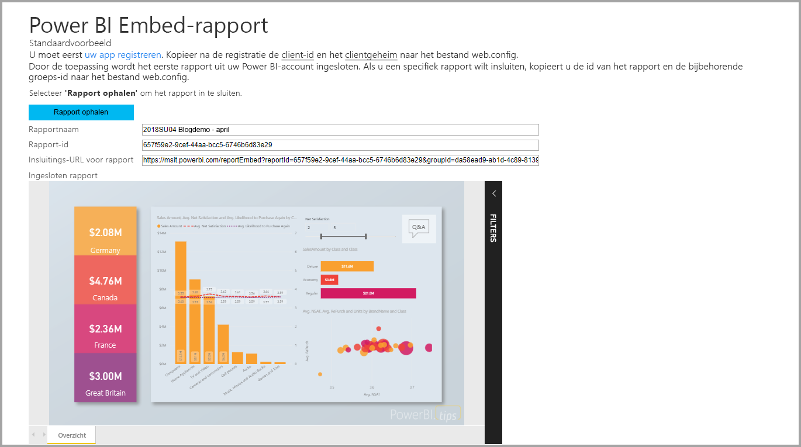

In deze zelfstudie leert u de volgende taken:
>[!div class="checklist"]
>* Een toepassing registreren in Azure.
>* Een Power BI-rapport insluiten in een toepassing.

## <a name="prerequisites"></a>Vereisten

Als u wilt beginnen, hebt u een Power BI Pro-account en een Microsoft Azure-abonnement nodig:

* Als u zich niet hebt geregistreerd voor Power BI Pro, [kunt u zich hier aanmelden voor een gratis proefversie](https://powerbi.microsoft.com/en-us/pricing/) voordat u begint.
* Als u nog geen abonnement op Azure hebt, maakt u een [gratis account](https://azure.microsoft.com/free/?WT.mc_id=A261C142F) voordat u begint.
* Stel uw eigen [Azure Active Directory (Azure AD)-tenant](create-an-azure-active-directory-tenant.md) in.
* Installeer [Visual Studio](https://www.visualstudio.com/), versie 2013 of later.

## <a name="set-up-your-embedded-analytics-development-environment"></a>De ingesloten analytische ontwikkelomgeving instellen

Voordat u begint met het insluiten van rapporten, dashboards en tegels in uw toepassing, moet u ervoor zorgen dat uw omgeving is ingesteld voor het insluiten van inhoud. Voer als onderdeel van de installatie een van deze acties uit:

- U kunt het [hulpprogramma voor installatie van insluiten](https://aka.ms/embedsetup/UserOwnsData) uitvoeren om snel aan de slag te gaan en een voorbeeldtoepassing te downloaden waarmee u een omgeving leert maken en een rapport leert insluiten.

- Als u ervoor kiest de omgeving handmatig in te stellen, volg u de stappen in de volgende gedeeltes.

### <a name="register-an-application-in-azure-active-directory"></a>Een toepassing registreren in Azure Active Directory

Als u uw toepassing toegang wilt geven tot de Power BI REST-API's, registreert u deze met Azure Active Directory. Daarna kunt u een identiteit instellen voor uw toepassing en machtigingen opgeven voor Power BI REST-resources.

1. Accepteer de [algemene voorwaarden van de Microsoft Power BI-API](https://powerbi.microsoft.com/api-terms).

2. Meld u aan bij [Azure Portal](https://portal.azure.com).

    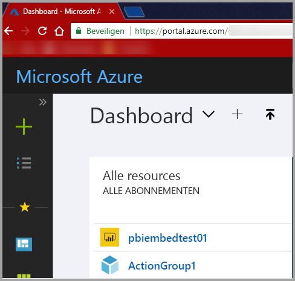

3. Kies in het navigatiedeelvenster links **Alle services** en selecteer **App-registraties**. Selecteer vervolgens **Registratie van nieuwe toepassing**.

    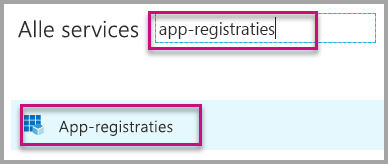</br>

    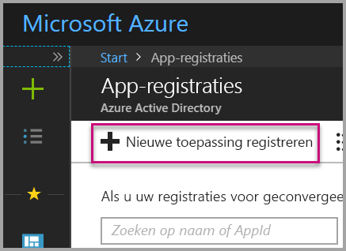

4. Volg de aanwijzingen en maak een nieuwe toepassing. Voor **gegevens waarvan de gebruiker eigenaar is** moet u **Web-app/API** voor het **toepassingstype** gebruiken. Daarnaast moet u een **aanmeldings-URL** opgeven, die door Azure AD wordt gebruikt om tokenantwoorden te retourneren. Voer een specifieke waarde in voor uw toepassing. Een voorbeeld is `http://localhost:13526/`.

    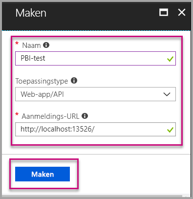

### <a name="apply-permissions-to-your-application-within-azure-active-directory"></a>Machtigingen toepassen op uw toepassing in Azure Active Directory

U moet machtigingen inschakelen voor uw toepassing naast de informatie die u hebt opgegeven op de pagina voor de app-registratie. Meld u aan met een algemeen beheerdersaccount om machtigingen in te schakelen.

### <a name="use-the-azure-active-directory-portal"></a>Azure Active Directory-portal gebruiken

1. Blader naar [App-registraties](https://portal.azure.com/#blade/Microsoft_AAD_IAM/ApplicationsListBlade) in Azure Portal en selecteer de app die u gebruikt voor insluiting.

    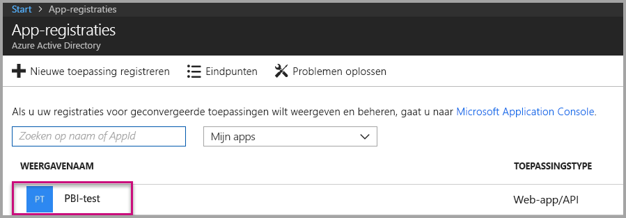

2. Selecteer **Instellingen**. Selecteer vervolgens **Vereiste machtigingen** onder **API-toegang**.

    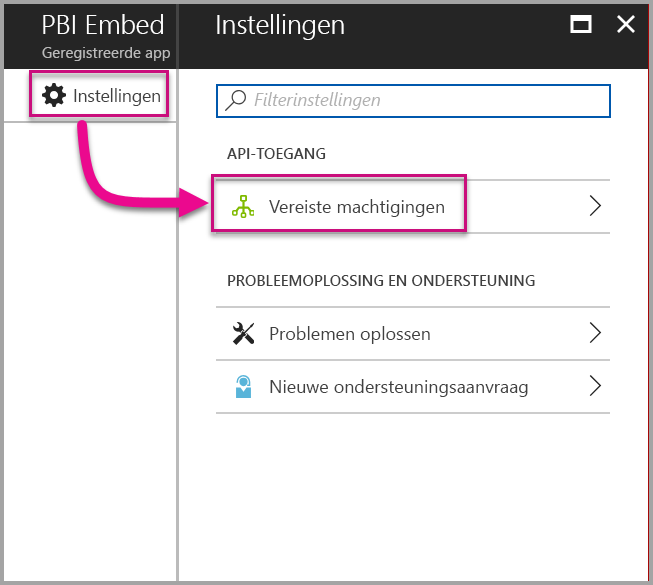

3. Selecteer **Windows Azure Active Directory**. Controleer of **De map openen als de aangemelde gebruiker** is ingeschakeld. Selecteer **Opslaan**.

    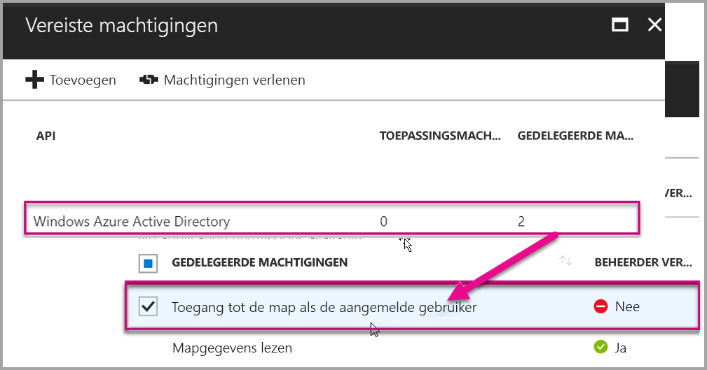

4. Selecteer **Toevoegen**.

    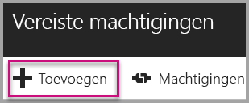

5. Kies **Een API selecteren**.

    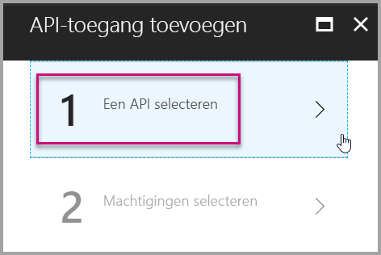

6. Selecteer **Power BI-service**. Kies vervolgens **Selecteren**.

    

7. Selecteer alle machtigingen onder **Gedelegeerde machtigingen**. Selecteer deze één voor één om ze te kunnen opslaan. Selecteer **Opslaan** wanneer u klaar bent.

    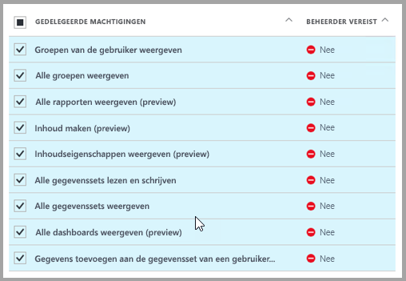

## <a name="set-up-your-power-bi-environment"></a>Uw Power BI-omgeving instellen

### <a name="create-an-app-workspace"></a>Een app-werkruimte maken

Als u rapporten, dashboards of tegels voor uw klanten insluit, moet u uw inhoud binnen de werkruimte van een app plaatsen:

1. Maak eerst de werkruimte. Selecteer **Werkruimten** > **App-werkruimte maken**. In deze werkruimte wordt de inhoud geplaatst waartoe de toepassing toegang moet hebben.

    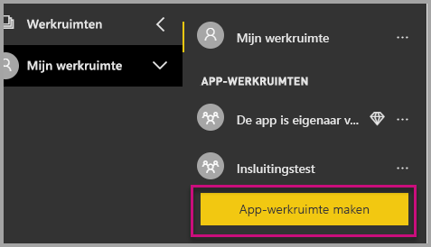

2. Geef een naam op voor de werkruimte. Als de corresponderende **werkruimte-id** niet beschikbaar is, kunt u deze bewerken tot een unieke aanduiding. Dit moet ook de naam van de app zijn.

    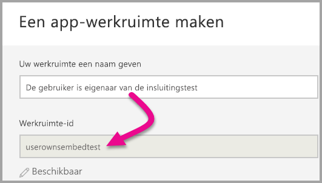

3. U moet een aantal opties instellen. Als u **Openbaar** kiest, is de inhoud van de werkruimte zichtbaar voor iedereen in de organisatie. **Privé** betekent dat de inhoud alleen zichtbaar is voor leden van de werkruimte.

    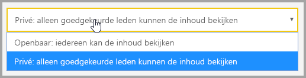

    U kunt de instelling Openbaar of Privé niet meer wijzigen nadat u de groep hebt gemaakt.

4. U kunt ook kiezen of leden rechten voor bewerken of alleen-lezen krijgen.

    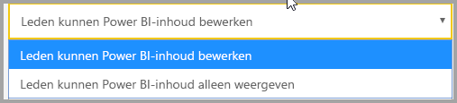

5. Voeg de e-mailadressen toe van de personen die u toegang tot de werkruimte wilt geven en selecteer **Toevoegen**. U kunt geen groepsaliassen toevoegen, alleen personen.

6. Bepaal per persoon of deze een lid of een beheerder is. Beheerders kunnen de werkruimte zelf bewerken, en bijvoorbeeld ook andere leden toevoegen. Leden kunnen de inhoud in de werkruimte bewerken, tenzij ze alleen leesrechten hebben. Zowel beheerders als leden kunnen de app publiceren.

    Nu kunt u de nieuwe werkruimte weergeven. De werkruimte wordt gemaakt en in Power BI geopend. De werkruimte wordt weergegeven in de lijst met werkruimten waarvan u lid bent. Omdat u een beheerder bent, kunt u het weglatingsteken (...) selecteren om terug te gaan en wijzigingen aanbrengen, bijvoorbeeld nieuwe leden toevoegen of machtigingen van leden wijzigen.

    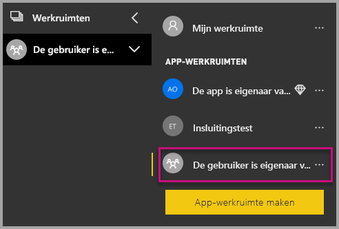

### <a name="create-and-publish-your-reports"></a>Rapporten maken en publiceren

U kunt uw rapporten en gegevenssets maken met behulp van Power BI Desktop. Vervolgens kunt u die rapporten publiceren naar een app-werkruimte. De eindgebruiker die de rapporten naar een app-werkruimte publiceert, moet beschikken over een Power BI Pro-licentie.

1. Download het voorbeeld van de [blogdemo](https://github.com/Microsoft/powerbi-desktop-samples) vanuit GitHub.

    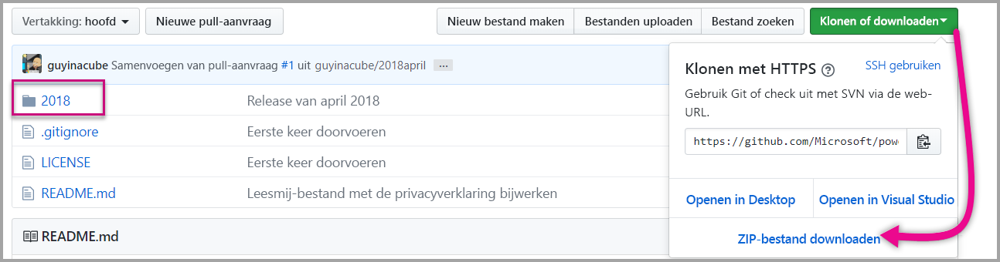

2. Open het .pbix-voorbeeldrapport in Power BI Desktop.

   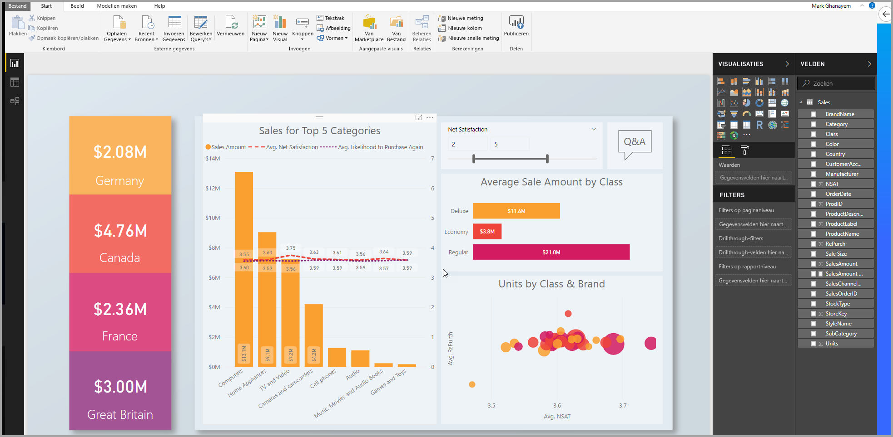

3. Publiceer het rapport naar de app-werkruimte.

   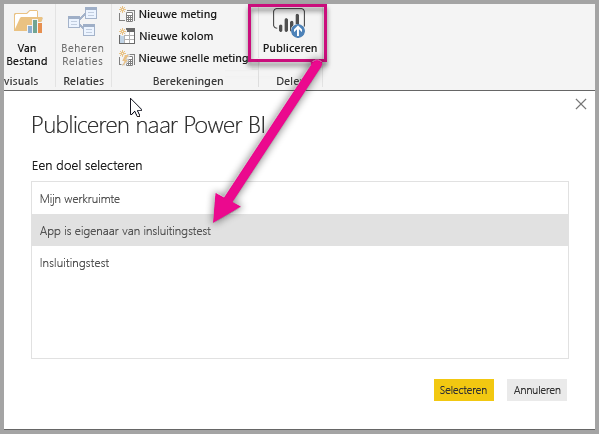

    U kunt het rapport nu weergeven in Power BI-service online.

   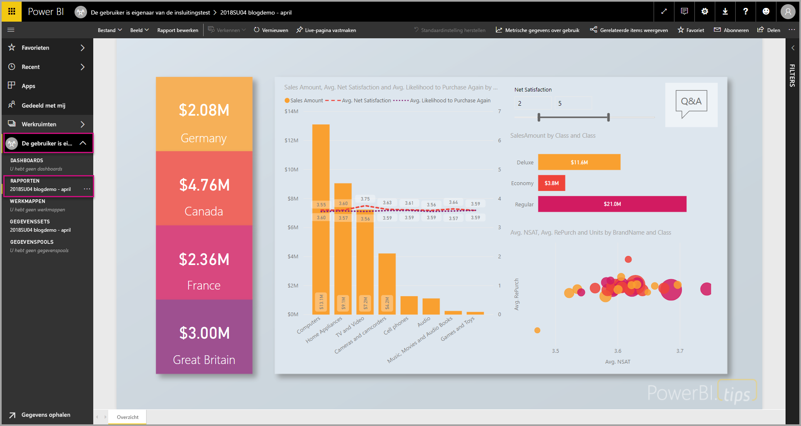

## <a name="embed-your-content-by-using-the-sample-application"></a>Uw inhoud met behulp van de voorbeeldtoepassing insluiten

Volg deze stappen om uw inhoud in te sluiten met behulp van een voorbeeldtoepassing:

1. Download het [voorbeeld waarin de gebruiker eigenaar is van de gegevens](https://github.com/Microsoft/PowerBI-Developer-Samples) vanuit GitHub om aan de slag te gaan. Er zijn drie verschillende voorbeeldtoepassingen: één voor [rapporten](https://github.com/Microsoft/PowerBI-Developer-Samples/tree/master/User%20Owns%20Data/integrate-report-web-app), één voor [dashboards](https://github.com/Microsoft/PowerBI-Developer-Samples/tree/master/User%20Owns%20Data/integrate-dashboard-web-app) en één voor [tegels](https://github.com/Microsoft/PowerBI-Developer-Samples/tree/master/User%20Owns%20Data/integrate-tile-web-app). In dit artikel wordt naar de toepassing **Rapporten** verwezen.

    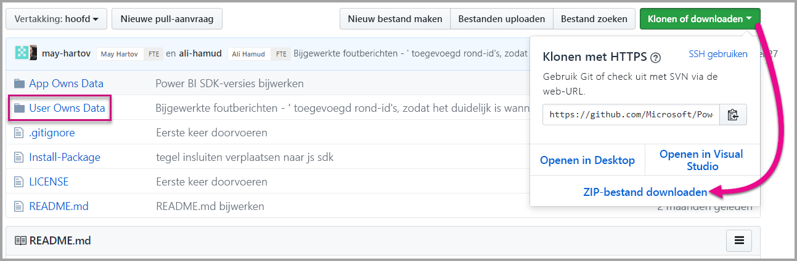

2. Open het bestand **Cloud.config** in de voorbeeldtoepassing. Er zijn een aantal velden die u moet invullen om de toepassing te kunnen uitvoeren: **ClientID** en **ClientSecret**.

    

    Vul bij **ClientID** de **toepassings-id** van Azure in. De **ClientID** wordt door de toepassing gebruikt om zich te identificeren bij de gebruikers bij wie u machtigingen aanvraagt.

    Ga als volgt te werk om de **ClientID** op te halen:

    1. Meld u aan bij [Azure Portal](https://portal.azure.com).

        

    1. Kies in het navigatiedeelvenster links **Alle services** en selecteer **App-registraties**.

        

    1. Selecteer de toepassing die de **ClientID** moet gebruiken.

        

    1. U ziet een **toepassings-id** die wordt vermeld als een GUID. Gebruik deze **toepassings-id** als de **ClientID** voor de toepassing.

        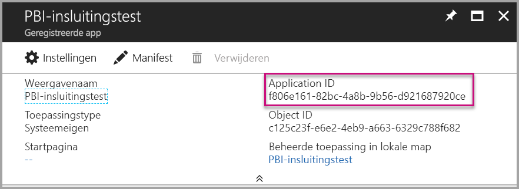

    1. Geef de **ClientSecret**-gegevens op in het gedeelte **Sleutels** van de sectie **App-registraties** in **Azure**.

    1. Ga als volgt te werk om het **ClientSecret** op te halen:

        1. Meld u aan bij [Azure Portal](https://portal.azure.com).

            

        1. Kies in het navigatiedeelvenster links **Alle services** en selecteer **App-registraties**.

            

        1. Selecteer de toepassing die het **ClientSecret** moet gebruiken.

            

        1. Selecteer **Instellingen**.

            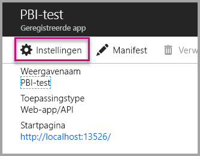

        1. Selecteer **Sleutels**.

            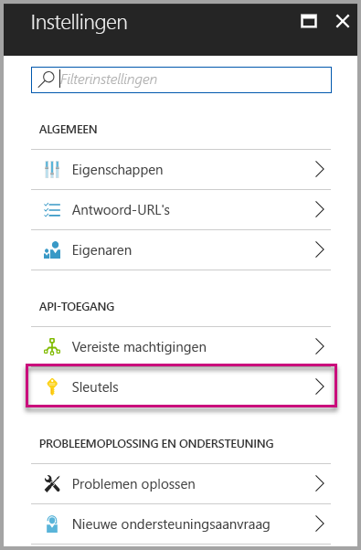

    1. Voer in het vak **Beschrijving** een naam in en selecteer een duur. Selecteer vervolgens **Opslaan** om de **Waarde** voor uw toepassing op te halen. Wanneer u het deelvenster **Sleutels** sluit nadat u de sleutelwaarde hebt opgeslagen, wordt het waardeveld alleen nog als verborgen weergegeven. Op dat punt kunt u de sleutelwaarde niet meer ophalen. Als u de sleutelwaarde kwijtraakt, kunt u een nieuwe maken in Azure Portal.

        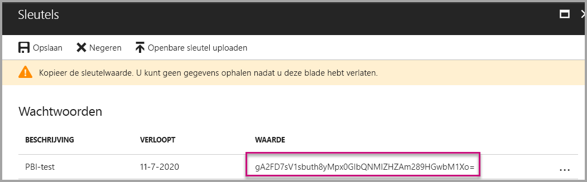

    1. Voor de **groupId** voert u de GUID van de app-werkruimte van Power BI in.

        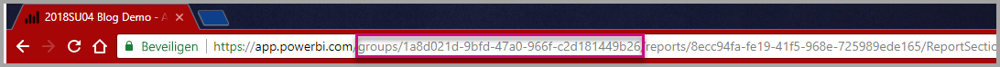

    1. Voor de **reportId** voert u de rapport-GUID uit Power BI in.

        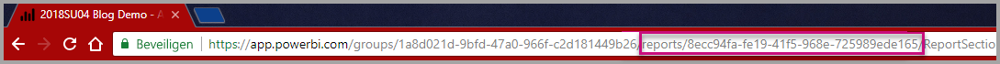

3. Voer de toepassing uit:

    1. Selecteer eerst **Uitvoeren** in **Visual Studio**.

        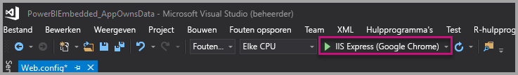

    1. Selecteer vervolgens **Rapport ophalen**.

        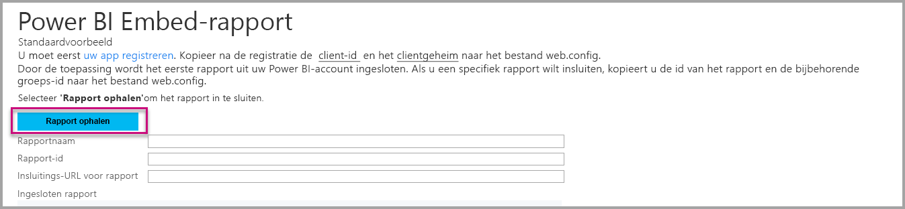

    1. U kunt het rapport nu weergeven in de voorbeeldtoepassing.

        

## <a name="embed-your-content-within-your-application"></a>Uw inhoud in uw toepassing insluiten

Hoewel de stappen voor het insluiten van uw inhoud kunnen worden uitgevoerd met de [Power BI REST-API's](https://docs.microsoft.com/rest/api/power-bi/), worden de voorbeeldcodes die worden beschreven in dit artikel gemaakt met de .NET SDK.

Als u een rapport in een web-app wilt integreren, gebruikt u de Power BI REST-API of de Power BI C#-SDK. U kunt ook een Azure Active Directory-verificatietoegangstoken gebruiken om een rapport op te halen. Vervolgens kunt u het rapport laden met hetzelfde toegangstoken. De Power BI Rest-API biedt programmatische toegang tot specifieke Power BI-resources. Zie [Power BI REST-API's](https://docs.microsoft.com/rest/api/power-bi/) en de [Power BI JavaScript-API](https://github.com/Microsoft/PowerBI-JavaScript) voor meer informatie.

### <a name="get-an-access-token-from-azure-ad"></a>Een toegangstoken ophalen uit Azure AD

In uw toepassing moet u een toegangstoken van Azure AD ophalen voordat u de Power BI REST API kunt aanroepen. Zie [Gebruikers verifiëren en een Azure AD-toegangstoken verkrijgen voor uw Power BI-app](get-azuread-access-token.md) voor meer informatie.

### <a name="get-a-report"></a>Een rapport ophalen

Als u een Power BI-rapport wilt ophalen, gebruikt u de bewerking [Rapporten ophalen](https://docs.microsoft.com/rest/api/power-bi/reports/getreports). Hiermee haalt u een lijst met Power BI-rapporten op. Vanuit de lijst met rapporten kunt u een rapport-id ophalen.

### <a name="get-reports-by-using-an-access-token"></a>Rapporten ophalen met behulp van een toegangstoken

Met de bewerking [Rapporten ophalen](https://docs.microsoft.com/rest/api/power-bi/reports/getreports) wordt een lijst met rapporten geretourneerd. U kunt een enkel rapport ophalen vanuit de lijst met rapporten.

Als u de REST-API-aanroep uitvoert, moet u de header *Autorisatie* met de indeling *Bearer {toegangstoken}* toevoegen.

#### <a name="get-reports-with-the-rest-api"></a>Rapporten ophalen met de REST-API

In het volgende codevoorbeeld ziet u hoe u rapporten ophaalt met de **REST-API**:

> [!NOTE]  
> Een voorbeeld van het ophalen van een inhoudsitem dat u wilt insluiten, is beschikbaar in het bestand **Default.aspx.cs** in de [voorbeeldtoepassing](#embed-your-content-using-the-sample-application). Voorbeelden zijn rapporten, dashboards of tegels.

```csharp
using Newtonsoft.Json;

//Get a Report. In this sample, you get the first Report.
protected void GetReport(int index)
{
    //Configure Reports request
    System.Net.WebRequest request = System.Net.WebRequest.Create(
        String.Format("{0}/Reports",
        baseUri)) as System.Net.HttpWebRequest;

    request.Method = "GET";
    request.ContentLength = 0;
    request.Headers.Add("Authorization", String.Format("Bearer {0}", accessToken.Value));

    //Get Reports response from request.GetResponse()
    using (var response = request.GetResponse() as System.Net.HttpWebResponse)
    {
        //Get reader from response stream
        using (var reader = new System.IO.StreamReader(response.GetResponseStream()))
        {
            //Deserialize JSON string
            PBIReports Reports = JsonConvert.DeserializeObject<PBIReports>(reader.ReadToEnd());

            //Sample assumes at least one Report.
            //You could write an app that lists all Reports
            if (Reports.value.Length > 0)
            {
                var report = Reports.value[index];

                txtEmbedUrl.Text = report.embedUrl;
                txtReportId.Text = report.id;
                txtReportName.Text = report.name;
            }
        }
    }
}

//Power BI Reports used to deserialize the Get Reports response.
public class PBIReports
{
    public PBIReport[] value { get; set; }
}
public class PBIReport
{
    public string id { get; set; }
    public string name { get; set; }
    public string webUrl { get; set; }
    public string embedUrl { get; set; }
}
```

#### <a name="get-reports-by-using-the-net-sdk"></a>Rapporten ophalen met de .NET SDK

U kunt de .NET-SDK gebruiken voor het ophalen van een lijst met rapporten. Zo hoeft u de REST-API niet rechtstreeks aan te roepen. In het volgende codevoorbeeld ziet u hoe u rapporten vermeldt:

```csharp
using Microsoft.IdentityModel.Clients.ActiveDirectory;
using Microsoft.PowerBI.Api.V2;
using Microsoft.PowerBI.Api.V2.Models;

var tokenCredentials = new TokenCredentials(<ACCESS TOKEN>, "Bearer");

// Create a Power BI Client object. It is used to call Power BI APIs.
using (var client = new PowerBIClient(new Uri(ApiUrl), tokenCredentials))
{
    // Get the first report all reports in that workspace
    ODataResponseListReport reports = client.Reports.GetReports();

    Report report = reports.Value.FirstOrDefault();

    var embedUrl = report.EmbedUrl;
}
```

### <a name="load-a-report-by-using-javascript"></a>Een rapport laden met JavaScript

U kunt JavaScript gebruiken om een rapport te laden in een div-element op uw webpagina. Het volgende codevoorbeeld toont u hoe u een rapport uit een bepaalde werkruimte ophaalt:

> [!NOTE]  
> Een voorbeeld van het laden van een inhoudsitem dat u wilt insluiten is beschikbaar in het bestand **standaard.aspx** in de [voorbeeldtoepassing](#embed-your-content-using-the-sample-application). Voorbeelden zijn rapporten, dashboards of tegels.

```javascript
<!-- Embed Report-->
<div> 
    <asp:Panel ID="PanelEmbed" runat="server" Visible="true">
        <div>
            <div><b class="step">Step 3</b>: Embed a report</div>

            <div>Enter an embed url for a report from Step 2 (starts with https://):</div>
            <input type="text" id="tb_EmbedURL" style="width: 1024px;" />
            <br />
            <input type="button" id="bEmbedReportAction" value="Embed Report" />
        </div>

        <div id="reportContainer"></div>
    </asp:Panel>
</div>
```

#### <a name="sitemaster"></a>Site.master

```javascript
window.onload = function () {
    // client side click to embed a selected report.
    var el = document.getElementById("bEmbedReportAction");
    if (el.addEventListener) {
        el.addEventListener("click", updateEmbedReporte, false);
    } else {
        el.attachEvent('onclick', updateEmbedReport);
    }

    // handle server side post backs, optimize for reload scenarios
    // show embedded report if all fields were filled in.
    var accessTokenElement = document.getElementById('MainContent_accessTokenTextbox');
    if (accessTokenElement !== null) {
        var accessToken = accessTokenElement.value;
        if (accessToken !== "")
            updateEmbedReport();
    }
};

// update embed report
function updateEmbedReport() {

    // check if the embed url was selected
    var embedUrl = document.getElementById('tb_EmbedURL').value;
    if (embedUrl === "")
        return;

    // get the access token.
    accessToken = document.getElementById('MainContent_accessTokenTextbox').value;

    // Embed configuration used to describe the what and how to embed.
    // This object is used when calling powerbi.embed.
    // You can find more information at https://github.com/Microsoft/PowerBI-JavaScript/wiki/Embed-Configuration-Details.
    var config = {
        type: 'report',
        accessToken: accessToken,
        embedUrl: embedUrl
    };

    // Grab the reference to the div HTML element that will host the report.
    var reportContainer = document.getElementById('reportContainer');

    // Embed the report and display it within the div container.
    var report = powerbi.embed(reportContainer, config);

    // report.on will add an event handler which prints to Log window.
    report.on("error", function (event) {
        var logView = document.getElementById('logView');
        logView.innerHTML = logView.innerHTML + "Error<br/>";
        logView.innerHTML = logView.innerHTML + JSON.stringify(event.detail, null, "  ") + "<br/>";
        logView.innerHTML = logView.innerHTML + "---------<br/>";
    }
  );
}
```

## <a name="using-a-power-bi-premium-dedicated-capacity"></a>Een toegewezen capaciteit voor Power BI Premium gebruiken

Nu u uw toepassing hebt ontwikkeld, is het tijd om toegewezen capaciteit toe te voegen aan uw app-werkruimte.

### <a name="create-a-dedicated-capacity"></a>Een toegewezen capaciteit maken

Als u een toegewezen capaciteit maakt, profiteert u van een toegewezen resource voor de inhoud in uw app-werkruimte. U kunt een toegewezen capaciteit maken met [Power BI Premium](../service-premium.md).

In de volgende tabel ziet u de Power BI Premium-SKU's die beschikbaar zijn in [Microsoft Office 365](../service-admin-premium-purchase.md):

| Capaciteitsknooppunt | Totaal aantal vCores<br/>(back-end + front-end) | Back-end vCores | Front-end vCores | Limieten voor DirectQuery/liveverbindingen | Maximaal aantal paginaweergaven (rendering) tijdens piekuren |
| --- | --- | --- | --- | --- | --- |
| EM1 |1 vCore |0,5 vCore, 10 GB RAM |0,5 vCore |3,75 per seconde |150-300 |
| EM2 |2 vCores |1 vCore, 10 GB RAM |1 vCores |7,5 per seconde |301-600 |
| EM3 |4 vCores |2 vCores, 10 GB RAM |2 vCores |15 per seconde |601-1200 |
| P1 |8 vCores |4 vCores, 25 GB RAM |4 vCores |30 per seconde |1201-2400 |
| P2 |16 vCores |8 vCores, 50 GB RAM |8 vCores |60 per seconde |2401-4800 |
| P3 |32 vCores |16 vCores, 100 GB RAM |16 vCores |120 per seconde |4.801-9.600 |
| P4 |64 vCores |32 vCores, 200 GB RAM |32 vCores |240 per seconde |9.601-19.200 |
| P5 |128 vCores |64 vCores, 400 GB RAM |64 vCores |480 per seconde |19.201-38.400 |

> [!NOTE]
> - Wanneer u probeert in te voegen met Microsoft Office-apps, kunt u EM-SKU's gebruiken om met een gratis Power BI-licentie toegang te krijgen tot inhoud. U kunt echter geen toegang krijgen tot inhoud met een gratis Power BI-licentie wanneer u Powerbi.com of Power BI voor mobiel gebruikt.
> - Wanneer u probeert in te voegen in Microsoft Office-apps via Powerbi.com of Power BI voor mobiel, kunt u met een gratis Power BI-licentie toegang krijgen tot inhoud.

### <a name="assign-an-app-workspace-to-a-dedicated-capacity"></a>Een app-werkruimte toewijzen aan een toegewezen capaciteit

Nadat u toegewezen capaciteit hebt gemaakt, kunt u uw app-werkruimte toewijzen aan die toegewezen capaciteit. Ga hiervoor als volgt te werk:

1. Vouw binnen Power BI-service werkruimten uit en selecteer het beletselteken voor de werkruimte die u gebruikt voor het insluiten van uw inhoud. Selecteer vervolgens **Werkruimten bewerken**.

    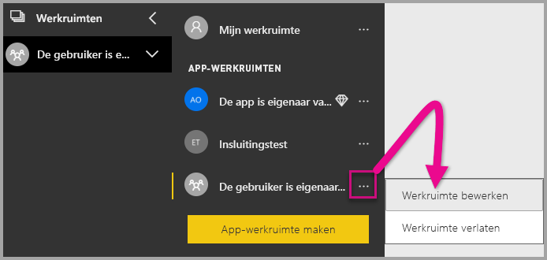

2. Vouw **Geavanceerd** uit en schakel **Toegewezen capaciteit** in. Selecteer de toegewezen capaciteit die u hebt gemaakt. Selecteer vervolgens **Opslaan**.

    

3. Nadat u **Opslaan** hebt geselecteerd, ziet u een ruit naast de naam van de app-werkruimte.

    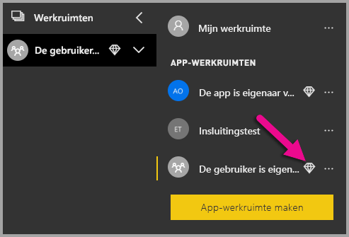

## <a name="admin-settings"></a>Beheerdersinstellingen

Globale beheerders of Power BI-servicebeheerders kunnen de mogelijkheid om REST-API's te gebruiken in- of uitschakelen voor een tenant. Power BI-beheerders kunnen deze instelling inschakelen voor de hele organisatie of voor afzonderlijke beveiligingsgroepen. Standaard is deze instelling ingeschakeld voor de hele organisatie. U kunt deze wijzigingen doorvoeren in de [Power BI-beheerportal](../service-admin-portal.md).

## <a name="next-steps"></a>Volgende stappen

In deze zelfstudie hebt u geleerd hoe u Power BI-inhoud insluit in een toepassing met uw Power BI-account voor uw organisatie. U kunt nu proberen Power BI-inhoud in een toepassing in te sluiten met behulp van apps. U kunt ook Power BI-inhoud insluiten voor uw klanten:

> [!div class="nextstepaction"]
> [Insluiten vanuit apps](embed-from-apps.md)

> [!div class="nextstepaction"]
>[Insluiten voor uw klanten](embed-sample-for-customers.md)

Als u meer vragen hebt, kunt u deze stellen [in de Power BI-community](http://community.powerbi.com/).
