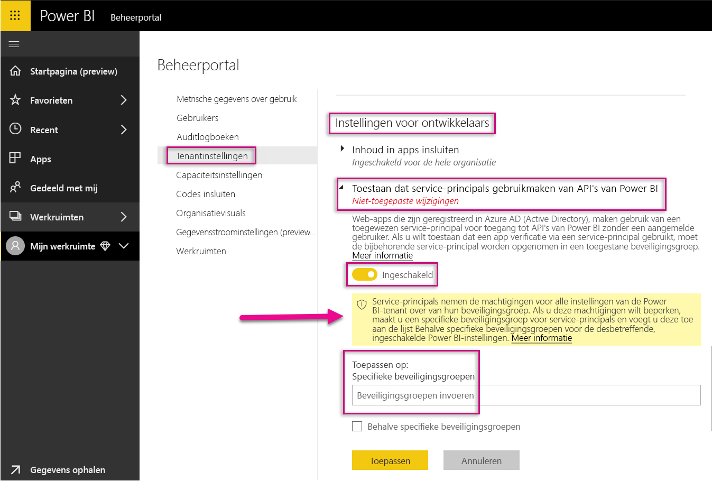
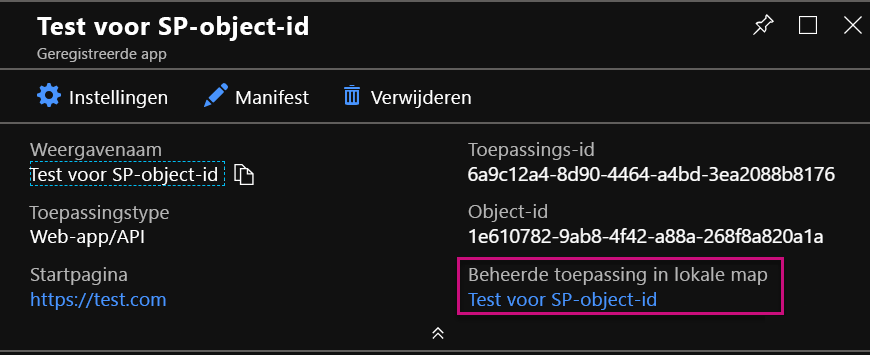
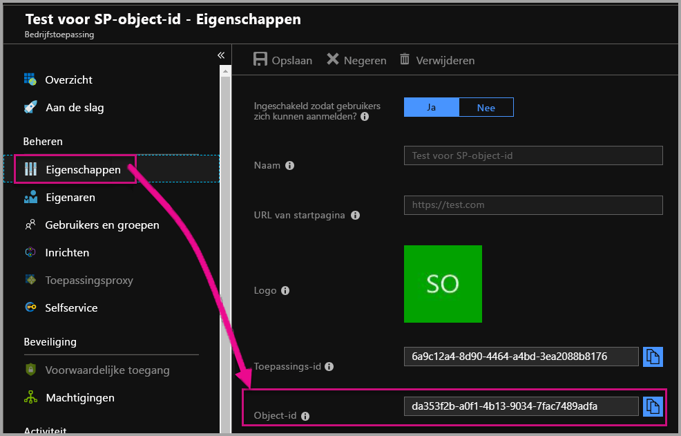

# <a name="service-principal-with-power-bi-preview"></a>Service-principal met Power BI (preview-versie)

Met een **service-principal** kunt u Power BI-inhoud insluiten in een toepassing en automatisering gebruiken met Power BI met behulp van een token dat **alleen voor de app** bestemd is. Een service-principal is handig bij gebruik van **Power BI Embedded** of bij het **automatiseren van Power BI-taken en -processen**.

Als u met Power BI Embedded werkt, zijn er voordelen bij het gebruik van een service-principal. Een belangrijk voordeel is dat u geen hoofdaccount (Power BI Pro-licentie die bestaat uit een gebruikersnaam en wachtwoord voor aanmelden) nodig hebt om te verifiëren in uw toepassing. Bij een service-principal worden een toepassings-id en toepassingsgeheim gebruikt om de toepassing te verifiëren.

Als u Power BI-taken wilt automatiseren, kunt u ook een script maken voor het verwerken en beheren van service-principals om te schalen.

## <a name="application-and-service-principal-relationship"></a>Relatie tussen toepassing en service-principal

Voor toegang tot resources waarmee een Azure AD-tenant wordt beveiligd, vertegenwoordigt de entiteit waarmee toegang wordt vereist, een beveiligingsprincipal. Deze actie geldt voor zowel gebruikers (principal van gebruiker) als voor toepassingen (service-principal).

Met de beveiligingsprincipal worden het toegangsbeleid en machtigingen voor gebruikers en toepassingen in de Azure AD-tenant gedefinieerd. Dit toegangsbeleid maakt kernfuncties mogelijk, zoals verificatie van gebruikers en toepassingen tijdens het aanmelden en autorisatie tijdens toegang tot resources. Zie [Toepassings- en service-principal in Azure Active Directory (AAD)](https://docs.microsoft.com/azure/active-directory/develop/app-objects-and-service-principals) voor meer informatie.

Wanneer u een Azure AD-toepassing in Azure Portal registreert, worden twee objecten in uw Azure AD-tenant gemaakt:

* Een [toepassingsobject](https://docs.microsoft.com/azure/active-directory/develop/app-objects-and-service-principals#application-object)
* Een [service-principal-object](https://docs.microsoft.com/azure/active-directory/develop/app-objects-and-service-principals#service-principal-object)

Beschouw het toepassingsobject als de *globale* representatie van uw toepassing voor gebruik in alle tenants en het service-principal-object als de *lokale* representatie voor gebruik in een specifieke tenant.

Het toepassingsobject fungeert als de sjabloon waaruit gemeenschappelijke en standaardeigenschappen worden *afgeleid* voor gebruik bij het maken van de bijbehorende service-principal-objecten.

Een service-principal is vereist in de tenant waar de toepassing wordt gebruikt, waardoor deze een identiteit voor het aanmelden tot stand kan brengen en toegang kan krijgen tot resources die door de tenant worden beveiligd. Een toepassing in één tenant heeft slechts één service-principal (in de starttenant) die is gemaakt en waarvoor toestemming is gegeven voor gebruik tijdens de toepassingsregistratie.

## <a name="service-principal-with-power-bi-embedded"></a>Service-principal met Power BI Embedded

U kunt met de service-principal uw hoofdaccountgegevens in uw toepassing maskeren met behulp van een toepassings-id en een toepassingsgeheim. U hoeft voor verificatie in uw toepassing geen code meer op te nemen voor een hoofdaccount.

Aangezien de **API's van Power BI** en **Power BI .NET SDK** nu met een service-principal ondersteuning voor aanroepen bieden, kunt u de [REST API's van Power BI](https://docs.microsoft.com/rest/api/power-bi/) met de service-principal gebruiken. U kunt bijvoorbeeld wijzigingen aan werkruimten aanbrengen, zoals werkruimten maken, gebruikers toevoegen aan of verwijderen uit werkruimten en inhoud in werkruimten importeren.

U kunt alleen een service-principal gebruiken als uw Power BI-artefacten en -resources worden opgeslagen in de [nieuwe Power BI-werkruimte](../service-create-the-new-workspaces.md).

## <a name="service-principal-vs-master-account"></a>Service-principal versus hoofdaccount

Er zijn verschillen tussen het gebruik van een service-principal en een standaardhoofdaccount (Power BI Pro-licentie) voor verificatie. In de onderstaande tabel zijn enkele belangrijke verschillen te zien.

| Functie | Hoofdgebruikersaccount </br> (Power BI Pro-licentie) | Service-principal </br> (token alleen voor app) |
|------------------------------------------------------|---------------------|-------------------|
| Kan aanmelden bij de Power BI-service  | Ja | Nee |
| Ingeschakeld in de Power BI-beheerportal | Nee | Ja |
| [Werkt met app-werkruimten (v1)](../service-create-workspaces.md) | Ja | Nee |
| [Werkt met de nieuwe app-werkruimten (v2)](../service-create-the-new-workspaces.md) | Ja | Ja |
| Moet de beheerder van een werkruimte zijn indien gebruikt met Power BI Embedded | Ja | Ja |
| Kan REST API's van Power BI gebruiken | Ja | Ja |
| Moet een globale beheerder zijn om te maken | Ja | Nee |
| Kan een on-premises gegevensgateway installeren en beheren | Ja | Nee |

## <a name="get-started-with-a-service-principal"></a>Aan de slag met een service-principal

Anders dan bij het traditionele gebruik van een hoofdaccount, moet er bij het gebruik van de service-principal (token voor alleen de app) een en ander worden ingesteld. Als u met de service-principal (token voor alleen de app) aan de slag wilt gaan, moet u de juiste omgeving instellen.

1. [Registreer een webtoepassing op de server](register-app.md) in Azure Active Directory (AAD) om bij Power BI te gebruiken. U kunt na de registratie van een toepassing een toepassings-id, een toepassingsgeheim en de id van het service-principal-object vastleggen voor toegang tot uw Power BI-inhoud. U kunt een service-principal maken met [PowerShell](https://docs.microsoft.com/powershell/azure/create-azure-service-principal-azureps?view=azps-1.1.0).

    Hieronder volgt een voorbeeld van een script om een nieuwe Azure Active Directory-toepassing te maken.

    ```powershell
    # The app id - $app.appid
    # The service principal object id - $sp.objectId
    # The app key - $key.value

    # Sign in as a user that is allowed to create an app.
    Connect-AzureAD

    # Create a new AAD web application
    $app = New-AzureADApplication -DisplayName "testApp1" -Homepage "https://localhost:44322" -ReplyUrls "https://localhost:44322"

    # Creates a service principal
    $sp = New-AzureADServicePrincipal -AppId $app.AppId

    # Get the service principal key.
    $key = New-AzureADServicePrincipalPasswordCredential -ObjectId $sp.ObjectId
    ```

   > [!Important]
   > Nadat u de service-principal voor gebruik met Power BI hebt ingeschakeld, zijn de AD-machtigingen van de toepassing niet meer geldig. De machtigingen van de toepassing worden dan beheerd via de Power BI-beheerportal.

2. Maak een [beveiligingsgroep in Azure Active Directory (AAD)](https://docs.microsoft.com/azure/active-directory/fundamentals/active-directory-groups-create-azure-portal) en voeg de toepassing die u hebt gemaakt toe aan die beveiligingsgroep. U kunt een AAD-beveiligingsgroep maken met [PowerShell](https://docs.microsoft.com/powershell/azure/create-azure-service-principal-azureps?view=azps-1.1.0).

    Hieronder volgt een voorbeeld van een script voor een nieuwe beveiligingsgroep en het toevoegen van een toepassing aan die beveiligingsgroep.

    ```powershell
    # Required to sign in as a tenant admin
    Connect-AzureAD

    # Create an AAD security group
    $group = New-AzureADGroup -DisplayName <Group display name> -SecurityEnabled $true -MailEnabled $false -MailNickName notSet

    # Add the service principal to the group
    Add-AzureADGroupMember -ObjectId $($group.ObjectId) -RefObjectId $($sp.ObjectId)
    ```

3. Als Power BI-beheerder moet u de service-principal in de **instellingen voor ontwikkelaars** in de Power BI-beheerportal inschakelen. Voeg de beveiligingsgroep die u hebt gemaakt in Azure AD, toe aan de sectie **Specifieke beveiligingsgroep** in de **instellingen voor ontwikkelaars**.

   > [!Important]
   > Service-principals nemen de machtigingen voor alle instellingen van de Power BI-tenant over van hun beveiligingsgroep. Als u deze machtigingen wilt beperken, maakt u een specifieke beveiligingsgroep voor service-principals en voegt u deze toe aan de lijst Behalve specifieke beveiligingsgroepen voor de desbetreffende, ingeschakelde Power BI-instellingen.

    

4. Stel uw [Power BI-omgeving](embed-sample-for-customers.md#set-up-your-power-bi-environment) in.

5. Voeg de service-principal als een **administrator** toe aan de nieuwe werkruimte die u hebt gemaakt. U kunt deze taak beheren via de [API's](https://docs.microsoft.com/rest/api/power-bi/groups/addgroupuser) of met de Power BI-service.

6. Kies er nu voor uw inhoud in een voorbeeldtoepassing of in uw eigen toepassing in te sluiten.

    * [Inhoud met behulp van de voorbeeldtoepassing insluiten](embed-sample-for-customers.md#embed-content-using-the-sample-application)
    * [Inhoud in uw toepassing insluiten](embed-sample-for-customers.md#embed-content-within-your-application)

7. U bent nu klaar voor de [verplaatsing naar productie](embed-sample-for-customers.md#move-to-production).

## <a name="migrate-to-service-principal"></a>Migreren naar service-principal

U kunt naar gebruik van de service-principal migreren als u momenteel een hoofdaccount met Power BI of met Power BI Embedded gebruikt.

Voer de eerste drie stappen in de sectie [Aan de slag met een service-principal](#get-started-with-a-service-principal) uit en volg daarna de onderstaande informatie.

Als u al gebruikmaakt van de [nieuwe werkruimten](../service-create-the-new-workspaces.md) in Power BI, voegt u de service-principal als een **administrator** toe aan de werkruimten met uw Power BI-artefacten. Als u echter de [traditionele werkruimten](../service-create-workspaces.md) gebruikt, kopieert of verplaatst u uw Power BI-artefacten en -resources naar de nieuwe werkruimten en voegt u vervolgens de service-principal als **administrator** aan deze werkruimten toe.

Er is geen gebruikersinterfacefunctie om Power BI-artefacten en -resources van de ene werkruimte naar een andere te verplaatsen, dus moet u [API's](https://powerbi.microsoft.com/pt-br/blog/duplicate-workspaces-using-the-power-bi-rest-apis-a-step-by-step-tutorial/) gebruiken om deze taak te voltooien. Als u de API's met een service-principal gebruikt, hebt u de id van het service-principal-object nodig.

### <a name="how-to-get-the-service-principal-object-id"></a>De id van het service-principal-object ophalen

Als u een service-principal aan een nieuwe app-werkruimte wilt toewijzen, gebruikt u de [REST API's van Power BI](https://docs.microsoft.com/rest/api/power-bi/groups/addgroupuser). Als u naar een service-principal wilt verwijzen voor bewerkingen of om wijzigingen aan te brengen, gebruikt u de **id van het service-principal-object** (bijvoorbeeld een service-principal als beheerder op een werkruimte toepassen).

Hieronder vindt u stappen voor het ophalen van de id van het service-principal-object vanuit Azure Portal.

1. Maak een nieuwe app-registratie in Azure Portal.  

2. Selecteer vervolgens onder **Beheerde toepassing in lokale map** de naam van de toepassing die u hebt gemaakt.

   

    > [!Note]
    > De object-id in de bovenstaande afbeelding is niet de object-id die wordt gebruikt met de service-principal.

3. Selecteer **Eigenschappen** om de object-id te bekijken.

    

Hieronder ziet u een voorbeeldscript om de id van het service-principal-object met PowerShell op te halen.

   ```powershell
   Get-AzureADServicePrincipal -Filter "DisplayName eq '<application name>'"
   ```

## <a name="considerations-and-limitations"></a>Overwegingen en beperkingen

* De service-principal werkt alleen met [nieuwe app-werkruimten](../service-create-the-new-workspaces.md).
* **Mijn werkruimte** wordt niet ondersteund bij het gebruik van een service-principal.
* [Toegewezen capaciteit](../service-admin-premium-manage.md) is vereist voor het verplaatsen naar productie.
* U kunt zich niet aanmelden bij de Power BI-portal met behulp van een service-principal.
* Power BI-beheerdersrechten zijn vereist voor het inschakelen van de service-principal in instellingen voor ontwikkelaars in de Power BI-beheerportal.
* U kunt een on-premises gegevensgateway niet installeren of beheren met behulp van een service-principal.
* Voor [Insluiten voor uw organisatie](embed-sample-for-your-organization.md)-toepassingen kunt u geen service-principal gebruiken.
* Beheer van [gegevensstromen](../service-dataflows-overview.md) wordt niet ondersteund.

## <a name="next-steps"></a>Volgende stappen

* [Een app registreren](register-app.md)
* [Power BI Embedded voor uw klanten](embed-sample-for-customers.md)
* [Toepassings- en service-principal-objecten in Azure Active Directory](https://docs.microsoft.com/azure/active-directory/develop/app-objects-and-service-principals)
