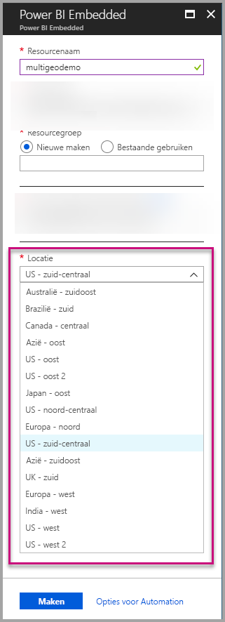
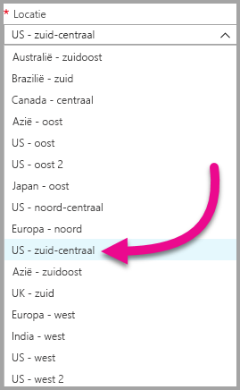
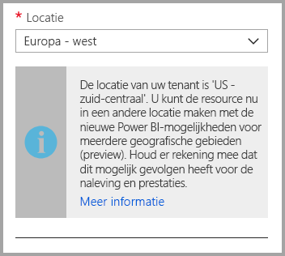
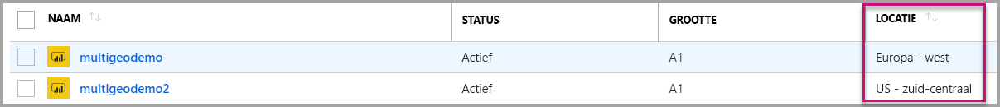
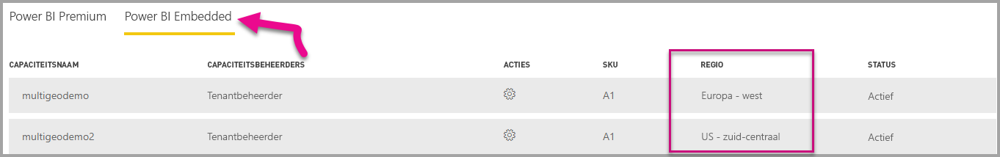

# Ondersteuning voor Multi-Geo voor Power BI Embedded (preview-versie)

**Ondersteuning voor Multi-Geo voor Power BI Embedded (preview-versie)** betekent dat internetproviders en organisaties die toepassingen bouwen met Power BI Embedded voor het insluiten van analyses in hun apps, nu hun gegevens in verschillende regio's overal ter wereld kunnen implementeren.

Klanten die **Power BI Embedded** gebruiken, kunnen nu een **A-capaciteit** instellen met **Multi-Geo**-opties, op basis van dezelfde functies en beperkingen die door [Power BI Premium worden ondersteund met Multi-Geo](../service-admin-premium-Multi-Geo.md).

## Nieuwe Power BI Embedded-capaciteitsresource maken met Multi-Geo

Kies in het scherm **Resource maken** de locatie van uw capaciteit. Tot nu toe was het alleen beperkt tot de locatie van uw Power BI-tenant en was er dus slechts één locatie beschikbaar. Met Multi-Geo kunt u kiezen uit verschillende regio's om uw capaciteit te implementeren.

Als u de vervolgkeuzelijst voor de locatie opent, is uw basistenant de standaardselectie.
  

Als u een andere locatie kiste, wordt u gevraagd de selectie te bevestigen.

## Capaciteitslocaties bekijken

Op de hoofdpagina voor het beheer van Power BI Embedded in de Azure-portal kunt u de capaciteitslocatie eenvoudig zien.

Deze is ook beschikbaar in de beheerportal op Powerbi.com. In de beheerportal kiest u Capaciteitsinstellingen en gaat u naar het tabblad Power BI Embedded.

[Meer informatie over het maken van capaciteiten met Power BI Embedded](azure-pbie-create-capacity.md)

## Bestaande capaciteitslocatie beheren

U kunt de locatie van een Power BI Embedded-resource niet meer wijzigen als u een nieuwe capaciteit hebt gemaakt.

Als u de inhoud van Power BI naar een andere regio wilt verplaatsen, gaat u als volgt te werk:

1. [Maak een nieuwe capaciteit](azure-pbie-create-capacity.md) in een andere regio.
2. Wijs alle werkruimten vanaf de bestaande capaciteit toe aan de nieuwe capaciteit.
3. Verwijder of onderbreek de oude capaciteit.

Belangrijk: als u besluit een capaciteit te verwijderen zonder de inhoud opnieuw toe te wijzen, wordt alle inhoud in die capaciteit naar een gedeelde capaciteit verplaatst. Deze bevindt zich in uw basisregio.

## API-ondersteuning voor Multi-Geo

Ter ondersteuning van het beheer van capaciteiten met Multi-Geo via de API, zijn er enkele wijzigingen aan bestaande API's aangebracht:

1. **[Capaciteiten ophalen](https://docs.microsoft.com/rest/api/power-bi/capacities/getcapacities)**: de API retourneert een lijst met capaciteiten met toegang voor de gebruiker. De respons bevat nu een aanvullende eigenschap, de zogenaamde regio. Hiermee wordt de locatie van de capaciteit opgegeven.
2. **[Toewijzen aan capaciteit](https://docs.microsoft.com/rest/api/power-bi/capacities)**: de API staat het toewijzen van een bepaalde werkruimte aan een capaciteit toe. Met deze bewerking kunt u geen werkruimten toewijzen aan een capaciteit buiten uw basisregio en evenmin werkruimten tussen capaciteiten in verschillende regio's verplaatsen. Als u deze bewerking wilt uitvoeren, moet de gebruiker nog steeds beschikken over beheerdersmachtigingen voor de werkruimte en over beheerders- of toewijzingsmachtigingen voor de doelcapaciteit.
3. **[Azure Resource Manager API](https://docs.microsoft.com/rest/api/power-bi-embedded/capacities)**: alle Azure Resource Manager API-bewerkingen, inclusief *Maken* en *Verwijderen* bieden ondersteuning voor Multi-Geo.

## Beperkingen en overwegingen

* Controleer of alle verplaatsingen tussen regio's voldoen aan alle nalevingsvereisten van uw bedrijf en de overheid voordat u de gegevensoverdracht daadwerkelijk start.

* Een in de cache opgeslagen query in een verafgelegen regio blijft in die regio wanneer de query niet wordt gebruikt. Andere gegevens die onderweg zijn kunnen echter heen en weer worden verplaatst tussen verschillende geografische gebieden.

* Bij het verplaatsen van gegevens van de ene naar de andere regio in een omgeving met ondersteuning voor meerdere geografische gebieden, kunnen de brongegevens gedurende maximaal dertig dagen aanwezig blijven in de regio van waaruit de gegevens zijn verplaatst. Gedurende die periode hebben gebruikers geen toegang tot de gegevens. De gegevens worden gedurende deze periode van 30 dagen verwijderd uit deze regio en vernietigd.

* Ondersteuning voor meerdere geografische gebieden resulteert over het algemeen niet in betere prestaties. Het laden van rapporten en dashboards vereist namelijk nog steeds dat er aanvragen voor metagegevens worden verstuurd naar de basisregio.

## Volgende stappen

U vindt meer informatie over Power BI Embedded-capaciteiten en Multi-Geo-opties voor alle capaciteiten door de onderstaande koppelingen te volgen.

* [Wat is Power BI Embedded?](azure-pbie-what-is-power-bi-embedded.md)

* [Power BI Embedded-capaciteit maken](azure-pbie-create-capacity.md)

* [Multi-Geo in Power BI Premium capacities](../service-admin-premium-multi-geo.md) (Multi-Geo in Power BI Premium-capaciteiten)

Hebt u nog vragen? [Misschien dat de Power BI-community het antwoord weet](http://community.powerbi.com/)