# <a name="row-level-security-with-power-bi-embedded"></a>Beveiliging op rijniveau met Power BI Embedded

**Beveiliging op rijniveau (RLS)** kan worden gebruikt om de gebruikerstoegang tot gegevens in dashboards, tegels, rapporten en gegevenssets te beperken. Verschillende gebruikers kunnen werken met dezelfde artefacten, terwijl ze allemaal verschillende gegevens zien. Het insluiten van inhoud biedt ondersteuning voor RLS.

Als u inhoud wilt insluiten voor niet-Power BI-gebruikers (app is eigenaar van de gegevens), een typisch ISV-scenario, is dit artikel van belang voor u. Configureer het insluittoken zodanig dat rekening wordt gehouden met de gebruiker en de rol.

Als u inhoud wilt insluiten voor Power BI-gebruikers (gebruiker is eigenaar van de gegevens), werkt RLS hetzelfde als bij het rechtstreeks insluiten van inhoud in de Power BI-service. U hoeft verder niets te doen in uw toepassing. Zie [Beveiliging op rijniveau (RLS) met Power BI](../service-admin-rls.md) voor meer informatie.


Om te kunnen profiteren van RLS, is het belangrijk dat u de drie hoofdbegrippen kent: gebruikers, rollen en regels. Laten we deze items eens nader bekijken:

**Gebruikers**: eindgebruikers die het artefact weergeven (dashboard, tegel, rapport of gegevensset). In Power BI Embedded worden gebruikers geïdentificeerd op basis van de eigenschap username (gebruikersnaam) in een insluittoken.

**Rollen**: gebruikers behoren tot rollen. Rollen zijn containers voor regels en kunnen namen hebben als *Verkoopmanager* of *Verkoper*. U maakt rollen in Power BI Desktop. Zie [Beveiliging op rijniveau (RLS) met Power BI Desktop](../desktop-rls.md) voor meer informatie.

**Regels**: rollen bevatten regels, en deze regels zijn de werkelijke filters die op de gegevens worden toegepast. De regels kunnen zo eenvoudig zijn als 'Land = Nederland', maar ook veel ingewikkelder.
In de rest van dit artikel is een voorbeeld te vinden van het ontwerp en gebruik van RLS binnen een ingesloten toepassing. Voor dit voorbeeld gebruiken we het PBIX-bestand [Voorbeeld van een retailanalyse](http://go.microsoft.com/fwlink/?LinkID=780547).


## <a name="adding-roles-with-power-bi-desktop"></a>Rollen toevoegen met Power BI Desktop

In het **voorbeeld van een retailanalyse** worden de verkoopcijfers voor alle winkels van een winkelketen weergegeven. Zonder RLS zou elke regiomanager die zich aanmeldt en het rapport weergeeft, dezelfde gegevens zien. Het senior management heeft besloten dat elke regiomanager alleen de verkoopcijfers mag zien voor de winkels die hij of zij beheert. Met behulp van RLS kan het senior management de gegevenstoegang filteren op regiomanager.

RLS is geschreven in Power BI Desktop. Na het openen van de gegevensset en het rapport kunnen we overschakelen naar de diagramweergave van het schema:


We noemen enkele dingen die opvallen in dit schema:

* Alle metingen, zoals **Totale verkoop**, worden opgeslagen in de feitentabel **Verkoop**.
* Er zijn vier extra gerelateerde dimensietabellen: **Artikel**, **Tijd**, **Winkel** en **Regio**.
* Met de pijlen op de relatielijnen wordt aangegeven in welke richting filters van de ene naar de andere tabel kunnen stromen. Als er bijvoorbeeld een filter op **Tijd[Datum]** wordt toegepast in het huidige schema, worden alleen de waarden in de tabel **Verkoop** gefilterd. Er worden geen andere tabellen beïnvloed door dit filter, omdat alle pijlen op de relatielijnen naar de tabel Verkoop toe wijzen, en niet ervandaan.
* In de tabel **Regio** wordt de manager van elke regio aangegeven:
  
    

Als we in dit schema een filter toepassen op de kolom **Regiomanager** in de tabel **Regio** en als dat filter overeenkomt met de gebruiker die het rapport weergeeft, worden in de tabellen **Winkel** en **Verkoop** de gegevens voor die regiomanager weergegeven.

U doet dit als volgt:

1. Op het tabblad **Modellering** selecteert u **Rollen beheren**.

    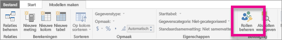
2. Maak een nieuwe rol met de naam **Manager**.

    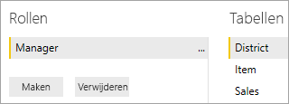
3. Voer in de tabel **Regio** deze DAX-expressie in: **[Regiomanager] = USERNAME()**.

    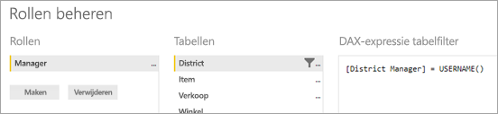
4. Als u wilt controleren of de regels correct functioneren, selecteert u op het tabblad **Modellering** de optie **Als rollen weergeven**. Selecteer vervolgens de rol **Manager** die u hebt gemaakt, plus de rol **Andere gebruikers**. Voer **AndrewMa** in als gebruiker.

    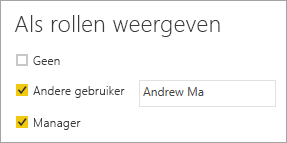

    In de rapporten worden de gegevens weergegeven alsof u bent aangemeld als **AndrewMa**.

Door het filter toe te passen zoals we hier hebben gedaan, worden alle records in de tabellen **Regio**, **Winkel** en **Verkoop** gefilterd. Vanwege de filterrichting van de relaties tussen **Verkoop** en **Tijd**, worden de tabellen **Verkoop** en **Artikel**, en **Artikel** en **Tijd** echter niet gefilterd. Download voor meer informatie over kruisfiltering in twee richtingen het technische document over [Kruisfiltering in twee richtingen in SQL Server Analysis Services 2016 en Power BI Desktop](http://download.microsoft.com/download/2/7/8/2782DF95-3E0D-40CD-BFC8-749A2882E109/Bidirectional%20cross-filtering%20in%20Analysis%20Services%202016%20and%20Power%20BI.docx).

## <a name="applying-user-and-role-to-an-embed-token"></a>Gebruiker en rol toepassen op een insluittoken

Nu de rollen in Power BI Desktop zijn geconfigureerd, moet u nog enig werk in de toepassing verrichten om van de rollen te kunnen profiteren.

Gebruikers worden geverifieerd en geautoriseerd door de toepassing, en insluittokens worden gebruikt om de betreffende gebruiker toegang te verlenen tot een specifiek Power BI Embedded-rapport. Power BI Embedded bevat geen specifieke informatie over de identiteit van de gebruiker. Voor de juiste werking van RLS moet u aanvullende contextgegevens bij insluittokens doorgeven in de vorm van identiteiten. U kunt de identiteiten doorgeven via de API [Embed Token](https://docs.microsoft.com/rest/api/power-bi/embedtoken).

Met de API wordt een lijst identiteiten geaccepteerd met vermelding van de relevante gegevenssets. Voor de juiste werking van RLS moet u de onderstaande stukken doorgeven als onderdeel van de identiteit.

* **gebruikersnaam (verplicht)**: een tekenreeks die kan worden gebruikt om de identiteit van de gebruiker vast te stellen bij het toepassen van RLS-regels. Er kan slechts één gebruiker worden opgegeven. Uw gebruikersnaam kan worden gemaakt met *ASCII*-tekens.
* **rollen (verplicht)**: een tekenreeks met de rollen die kunnen worden geselecteerd bij het toepassen van de regels voor beveiliging op rijniveau. Als u meerdere rollen wilt doorgeven, moeten deze worden doorgegeven als een tekenreeksmatrix.
* **gegevensset (verplicht)**: de toepasselijke gegevensset voor het artefact dat u wilt insluiten.

U kunt het insluittoken maken met behulp van de methode **GenerateTokenInGroup** in **PowerBIClient.Reports**.

U kunt bijvoorbeeld het voorbeeld [PowerBIEmbedded_AppOwnsData](https://github.com/Microsoft/PowerBI-Developer-Samples/tree/master/App%20Owns%20Data) wijzigen. *Home\HomeController.cs regel 76 en 77* kunnen worden gewijzigd van:

```csharp
// Generate Embed Token.
var generateTokenRequestParameters = new GenerateTokenRequest(accessLevel: "view");

var tokenResponse = await client.Reports.GenerateTokenInGroupAsync(GroupId, report.Id, generateTokenRequestParameters);
```

in

```csharp
var generateTokenRequestParameters = new GenerateTokenRequest("View", null, identities: new List<EffectiveIdentity> { new EffectiveIdentity(username: "username", roles: new List<string> { "roleA", "roleB" }, datasets: new List<string> { "datasetId" }) });

var tokenResponse = await client.Reports.GenerateTokenInGroupAsync("groupId", "reportId", generateTokenRequestParameters);
```

Als u de REST API aanroept, accepteert de bijgewerkte API nu een extra JSON-matrix met de naam **identities**, met een gebruikersnaam, een tekenreeks met de lijst met rollen en een tekenreeks met de lijst met gegevenssets. 

Gebruik de code hieronder als voorbeeld:

```json
{
    "accessLevel": "View",
    "identities": [
        {
            "username": "EffectiveIdentity",
            "roles": [ "Role1", "Role2" ],
            "datasets": [ "fe0a1aeb-f6a4-4b27-a2d3-b5df3bb28bdc" ]
        }
    ]
}
```

Nu zijn alle benodigde onderdelen aanwezig. Als een gebruiker zich bij uw toepassing aanmeldt om dit artefact weer te geven, ziet de gebruiker alleen de gegevens die hij of zij mag zien, zoals gedefinieerd in de beveiliging op rijniveau.

## <a name="working-with-analysis-services-live-connections"></a>Werken met liveverbindingen van Analysis Services

Beveiliging op rijniveau kan worden gebruikt voor liveverbindingen van Analysis Services met on-premises servers. Als u dit type verbinding wilt gebruiken, moet u een aantal concepten goed kennen.

De effectieve identiteit die wordt opgegeven voor de eigenschap voor de gebruikersnaam, moet een Windows-gebruiker zijn met machtigingen voor de Analysis Services-server.

### <a name="on-premises-data-gateway-configuration"></a>Configuratie van on-premises gegevensgateway

Voor liveverbindingen van Analysis Services wordt een [On-premises gegevensgateway](../service-gateway-onprem.md) gebruikt. Bij het genereren van een insluittoken, met een opgegeven identiteit, moet het hoofdaccount zijn opgegeven als beheerder van de gateway. Als het hoofdaccount niet is opgegeven, wordt de beveiliging op rijniveau niet toegepast op de eigenschap van de gegevens. Een niet-beheerder van de gateway kan rollen opgeven, maar moet zijn eigen gebruikersnaam als effectieve identiteit opgeven.

### <a name="use-of-roles"></a>Gebruik van rollen

Rollen kunnen worden opgegeven met de identiteit in een insluittoken. Als er geen rol wordt opgegeven, kunnen de betreffende rollen worden omgezet op basis van de opgegeven gebruikersnaam.

### <a name="using-the-customdata-feature"></a>De functie CustomData gebruiken

De functie CustomData werkt alleen voor modellen die zich in **Azure Analysis Services** bevinden. Bovendien werkt de functie uitsluitend in de **Connect livemodus**. In tegenstelling tot gebruikers en rollen, kan de functie voor Custom Data niet in een .pbix-bestand worden ingesteld. Tijdens het genereren van een token met de functie Custom Data, moet u over een gebruikersnaam beschikken.

Met de functie CustomData kunt u een rijfilter toevoegen wanneer u Power BI-gegevens in uw toepassing bekijkt en u **Azure Analysis Services** als gegevensbron gebruikt (Power BI-gegevens bekijken die zijn gekoppeld aan Azure Analysis Services in uw toepassing).

Met de functie CustomData kunt u vrije tekst (een tekenreeks) doorgeven met behulp van de eigenschap van de CustomData-verbindingsreeks. Analysis Services gebruikt deze waarde via de functie *CUSTOMDATA()*.

De enige manier om in **Azure Analysis Services** dynamische RLS (dat dynamische waarden gebruikt voor filterbeoordeling) te gebruiken, is door toepassing van de functie *CUSTOMDATA()*.

De functie kan binnen de DAX-query voor rollen worden gebruikt en de functie kan zonder rol in de DAX-query voor metingen worden gebruikt.
De functie CustomData maakt deel uit van de functionaliteit voor het genereren van tokens voor de artefacten Dashboard, Rapport en Tegel. Dashboards kunnen over meerdere CustomData-identiteiten (één per tegel/model) beschikken.

#### <a name="customdata-sdk-additions"></a>CustomData SDK - toevoegingen

De eigenschap van de CustomData-tekenreeks is toegevoegd aan de effectieve identiteit in het scenario voor het genereren van tokens.

```json
[JsonProperty(PropertyName = "customData")]
public string CustomData { get; set; }
```

Met behulp van de volgende aanroep kan de identiteit kan worden gemaakt met aangepaste gegevens:

```csharp
public EffectiveIdentity(string username, IList<string> datasets, IList<string> roles = null, string customData = null);
```

#### <a name="customdata-sdk-usage"></a>CustomData SDK - gebruik

Als u de REST API aanroept, kunt u binnen elke identiteit aangepaste gegevens toevoegen, bijvoorbeeld:

```json
{
    "accessLevel": "View",
    "identities": [
        {
            "username": "EffectiveIdentity",
            "roles": [ "Role1", "Role2" ],
            "customData": "MyCustomData",
            "datasets": [ "fe0a1aeb-f6a4-4b27-a2d3-b5df3bb28bdc" ]
        }
    ]
}
```

Dit zijn de stappen om de functie CustomData() in te stellen met uw Power BI Embedded-toepassing.

1. Maak een Azure Analysis Services-database. Meld u vervolgens aan bij uw Azure Analysis Services-server via [SQL Server Management Studio](https://docs.microsoft.com/sql/ssms/download-sql-server-management-studio-ssms?view=sql-server-2017).

    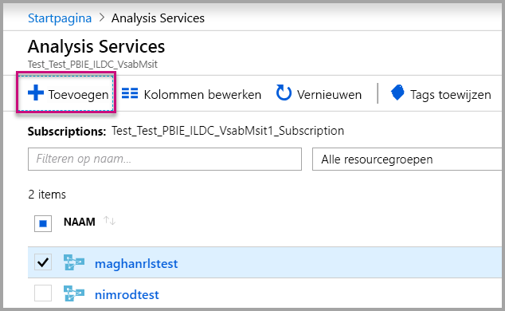

    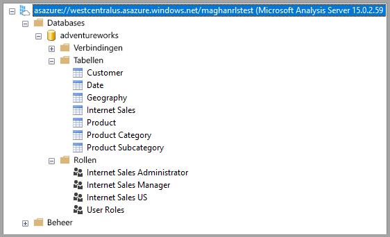

2. Maak een rol op de Analysis Services-server.

    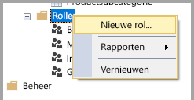

3. Stel de **Algemene instellingen** in.  Hier geeft u de **Rolnaam** op en stelt u de databasemachtigingen in op **alleen-lezen**.

    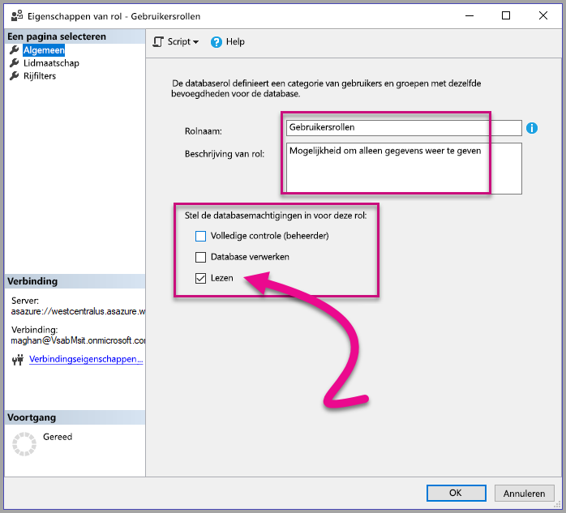

4. Geef de instellingen voor **Lidmaatschap** op. Hier kunt u gebruikers toevoegen die door deze rol worden beïnvloed.

    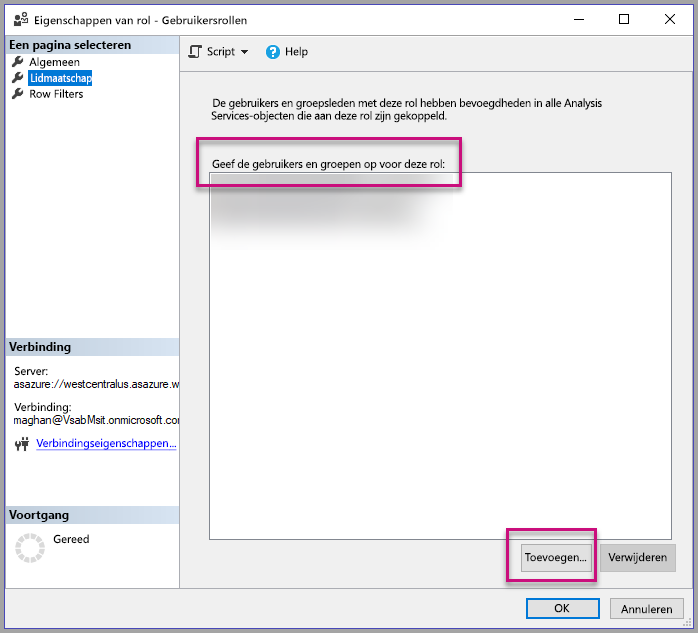

5. Stel de DAX-query **Rijfilters** in met de functie *CUSTOMDATA()*.

    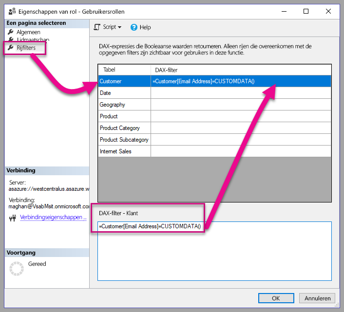

6. Maak een PBI-rapport en publiceer dit in een werkruimte met toegewezen capaciteit.

    

7. Gebruik de Power BI-API's om de functie CustomData in uw toepassing te gebruiken.  Tijdens het genereren van een token met de functie Custom Data, moet u over een gebruikersnaam beschikken. De gebruikersnaam moet gelijk zijn aan de UPN van de hoofdgebruiker. De hoofdgebruiker moet lid zijn van de rol(len) die u hebt gemaakt. Als er geen rollen zijn opgegeven, worden alle rollen waar de hoofdgebruiker lid van is, gebruikt voor de RLS-beoordeling.

    > [!Note]
    > Wanneer u klaar bent om uw toepassing in uw productieomgeving te implementeren, moeten eindgebruikers het hoofdgebruikersaccountveld of de hoofdgebruikersoptie niet kunnen zien.

    Bekijk de [code](#customdata-sdk-additions) om de functie CustomData toe te voegen.

8. U kunt het rapport nu weergeven in uw toepassing voordat u de Custom Data-waarde(n) toevoegt om alle gegevens in het rapport te bekijken.

    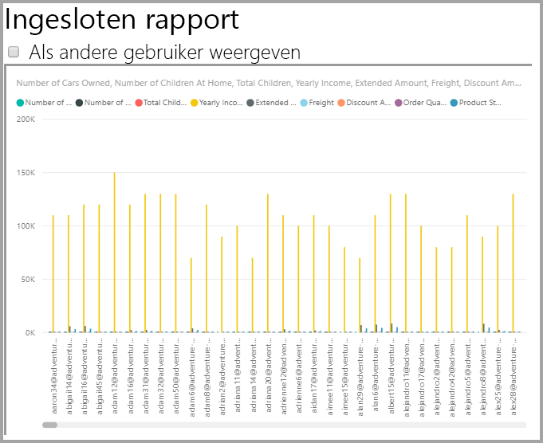

    Pas vervolgens de Custom Data-waarde(n) toe om te bekijken hoe in het rapport een andere set gegevens wordt weergegeven.
    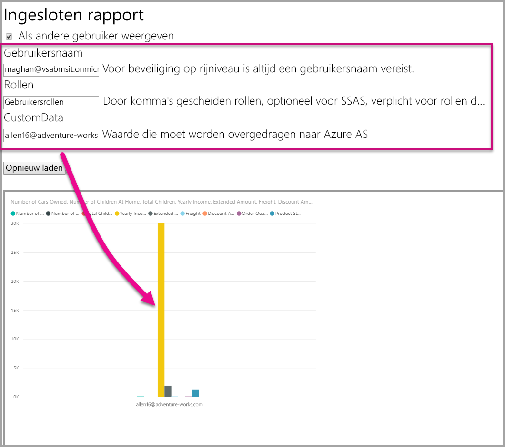

## <a name="using-rls-vs-javascript-filters"></a>RLS gebruiken vs. JavaScript-filters

Wanneer u een beslissing neemt over filters in uw rapport, kunt u **beveiliging op rijniveau (RLS)** of **JavaScript-filters** gebruiken.

[Beveiliging op rijniveau](../service-admin-rls.md) is een functie die gegevens op het niveau van het gegevensmodel filtert. Uw back-endgegevensbron beheert uw RLS-instellingen. Op basis van uw gegevensmodel stelt de generatie van het insluittoken de gebruikersnaam en de rollen voor de sessie in. De gegevens kunnen niet worden overschreven, verwijderd of gecontroleerd door de code aan de clientzijde. Daarom wordt deze methode als veilig beschouwd. We raden aan om RLS te gebruiken om gegevens veilig te filteren. U kunt gegevens filteren met RLS door een van de onderstaande opties te gebruiken.

* [Rollen configureren in een Power BI-rapport](../desktop-rls.md).
* Rollen configureren op gegevensbronniveau (alleen met een Analysis Services-liveverbinding).
* Programmatisch via een [Insluittoken](https://docs.microsoft.com/rest/api/power-bi/embedtoken/datasets_generatetokeningroup) met `EffectiveIdentity`. Wanneer u een insluittoken gebruikt, wordt het werkelijke filter doorgegeven via het insluittoken voor een specifieke sessie.

[JavaScript-filters](https://github.com/Microsoft/PowerBI-JavaScript/wiki/Filters#page-level-and-visual-level-filters) worden gebruikt om de gebruiker een beperkte, gerichte of gefilterde weergave van de gegevens te geven. De gebruiker heeft echter nog steeds toegang tot de tabellen, kolommen en metingen van het modelschema en mogelijk ook tot de gegevens daarin. Beperkte gegevenstoegang kan alleen worden gerealiseerd met RLS en niet via filter-API's aan de clientzijde.

## <a name="token-based-identity-with-azure-sql-database-preview"></a>Identiteit op basis van tokens met Azure SQL Database (preview)

Met de **identiteit op basis van tokens** kunt u de effectieve identiteit voor een ingesloten token opgeven met **Azure Active Directory**-toegangstokens (AAD) voor een **Azure SQL Database**.

Klanten die hun gegevens bewaren in **Azure SQL Database** hebben bij integratie met **Power BI Embedded** nu de mogelijkheid om gebruikers en hun toegang tot gegevens in Azure SQL te beheren.

Wanneer u het insluitingstoken genereert, kunt u de effectieve identiteit van een gebruiker in Azure SQL opgeven. U geeft de effectieve identiteit van een gebruiker op door het AAD-toegangstoken door te geven aan de server. Het toegangstoken wordt gebruikt om alleen de gegevens uit Azure SQL op te halen die voor die gebruiker en specifieke sessie relevant zijn.

Het kan worden gebruikt om de weergave van elke gebruiker in Azure SQL te beheren of om mee aan te melden bij Azure SQL als specifieke klant in een multitenant-database. Het kan eveneens worden gebruikt om voor die sessie beveiliging op rijniveau in Azure SQL toe te passen en alleen de relevante gegevens voor die sessie op te halen, zodat het niet meer nodig is om RLS te beheren in Power BI.

Dergelijke problemen met effectieve identiteit zijn rechtstreeks van toepassing op RLS-regels in de Azure SQL Server. Power BI Embedded maakt gebruikt van het opgegeven toegangstoken wanneer het query's uitvoert op gegevens uit de Azure SQL Server. De UPN van de gebruiker (voor wie de toegangstoken is opgegeven) is toegankelijk als gevolg van de functie USER_NAME() SQL.

De identiteit op basis van tokens werk allen voor DirectQuery-modellen in een toegewezen capaciteit, verbonden met een Azure SQL Database die is geconfigureerd voor AAD-verificatie ([meer informatie over AAD-verificatie voor Azure SQL Database](https://docs.microsoft.com/azure/sql-database/sql-database-manage-logins)). Als u een identiteit op basis van tokens wilt gebruiken, moet de gegevensbron van de gegevensset zo zijn geconfigureerd dat de OAuth2-referenties van de gebruikers worden gebruikt.

   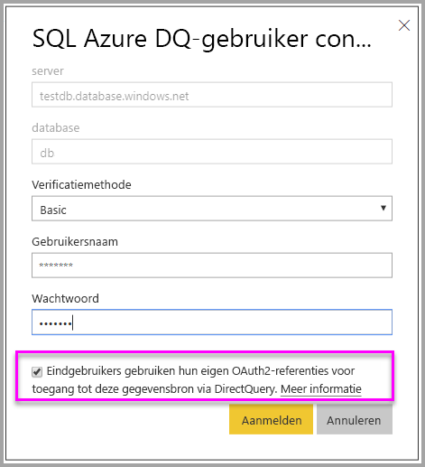

### <a name="token-based-identity-sdk-additions"></a>SDK-toevoegingen voor identiteiten op basis van tokens

De eigenschap van de id-blob is toegevoegd aan de effectieve identiteit in het scenario voor het genereren van tokens.

```JSON
[JsonProperty(PropertyName = "identityBlob")]
public IdentityBlob IdentityBlob { get; set; }
```

Het type IdentityBlob is een eenvoudige JSON-structuur met een eigenschap van een tekenreekswaarde

```JSON
[JsonProperty(PropertyName = "value")]
public string value { get; set; }
```

De EffectiveIdentity kan worden gemaakt met de id-blob en de volgende aanroep:

```C#
public EffectiveIdentity(string username, IList<string> datasets, IList<string> roles = null, string customData = null, IdentityBlob identityBlob = null);
```

De id-blob kan worden gemaakt met de volgende aanroep.

```C#
public IdentityBlob(string value);
```

### <a name="token-based-identity-rest-api-usage"></a>REST API-gebruik van identiteit op basis van tokens

Als u de [REST API](https://docs.microsoft.com/rest/api/power-bi/embedtoken/reports_generatetoken#definitions) aanroept, kunt u in elke identiteit een id-blob toevoegen.

```JSON
{
    "accessLevel": "View",
    "identities": [
        {
            "datasets": ["fe0a1aeb-f6a4-4b27-a2d3-b5df3bb28bdc"],
        “identityBlob”: {
            “value”: “eyJ0eXAiOiJKV1QiLCJh….”
         }
        }
    ]
}
```

De waarde die wordt opgegeven in de id-blob moet een geldig toegangstoken zijn voor Azure SQL Server (met een resource URL van (<https://database.windows.net/>)).

   > [!Note]
   > Als u een toegangstoken voor Azure SQL wilt maken, moet de toepassing de gedelegeerde machtiging **Toegang tot Azure SQL DB en Data Warehouse** hebben voor de **Azure SQL Database**-API in AAD-appregistratieconfiguratie in de Azure-portal.

   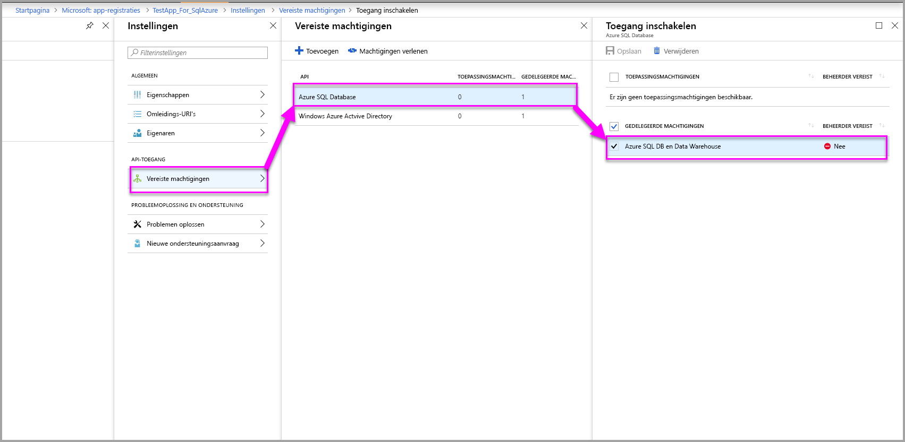

## <a name="on-premises-data-gateway-with-service-principal-preview"></a>On-premises gegevensgateway met service-principal (preview)

Klanten die beveiliging op rijniveau (RLS) met een on-premises SSAS-gegevensbron (SQL Server Analysis Services) met een live-verbinding configureren, profiteren van de nieuwe [service-principal](embed-service-principal.md)-mogelijkheid om gebruikers en hun toegang tot gegevens in SSAS te beheren wanneer zij integreren met **Power BI Embedded**.

Met [Power BI REST API's](https://docs.microsoft.com/rest/api/power-bi/)kunt u de effectieve identiteit voor on-premises live-SSAS-verbindingen voor een insluittoken opgeven met behulp van een [service-principal-object](https://docs.microsoft.com/azure/active-directory/develop/app-objects-and-service-principals#service-principal-object).

Tot nu toe moest de hoofdgebruiker die het insluittoken genereert een gatewaybeheerder zijn om de effectieve identiteit voor on-premises live-SSAS-verbindingen op te geven. Nu hoeft de gebruiker geen gatewaybeheerder meer te zijn: de gatewaybeheerder kan de gebruiker een toegewezen machtiging voor die gegevensbron geven, zodat de gebruiker de effectieve identiteit kan overschrijven wanneer het insluittoken wordt gegenereerd. Dankzij deze nieuwe mogelijkheid is insluiten met een service-principal voor een live-SSAS-verbinding mogelijk.

Voor het inschakelen van dit scenario gebruikt de gatewaybeheerder de [Add Datasource User Rest API](https://docs.microsoft.com/rest/api/power-bi/gateways/adddatasourceuser) om de service-principal de *ReadOverrideEffectiveIdentity*-machtiging te verlenen voor Power BI Embedded.

U kunt deze machtiging niet instellen via de beheerportal. Deze machtiging kan alleen worden ingesteld met de API. In de beheerportal ziet u een indicatie voor gebruikers en SPN’s met dergelijke machtigingen.

## <a name="considerations-and-limitations"></a>Overwegingen en beperkingen

* De toewijzing van gebruikers aan rollen in de Power BI-service heeft geen invloed op de beveiliging op rijniveau bij gebruik van een insluittoken.
* Wanneer u een identiteit met een insluittoken opgeeft, worden RLS-instellingen in de Power BI-service niet toegepast op beheerders of leden met machtigingen voor bewerken, maar op de gegevens.
* Liveverbindingen van Analysis Services worden ondersteund voor on-premises servers.
* Live verbindingen van Azure Analysis Services bieden ondersteuning voor het filteren op rollen. U kunt dynamisch filteren met CustomData.
* Als RLS niet vereist is voor de onderliggende gegevensset, mag de GenerateToken-aanvraag **geen** effectieve identiteit bevatten.
* Als de onderliggende gegevensset een cloudmodel is (een model in de cache of DirectQuery), moet de effectieve identiteit ten minste één rol bevatten. Anders wordt roltoewijzing niet uitgevoerd.
* Een lijst met identiteiten kan meerdere identiteitstokens insluiten in het dashboard. Voor alle andere artefacten bevat de lijst één identiteit.

### <a name="token-based-identity-limitations-preview"></a>Beperkingen van identiteit op basis van tokens (preview)

* Deze mogelijkheid beperkt het gebruik alleen met Power BI Premium.
* Deze mogelijkheid werkt niet met on-premises SQL Server.
* Deze functie werkt niet in meerdere geografische gebieden.

Hebt u nog vragen? [Misschien dat de Power BI-community het antwoord weet](https://community.powerbi.com/)
