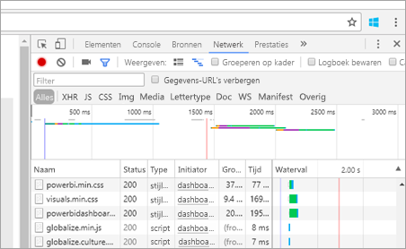
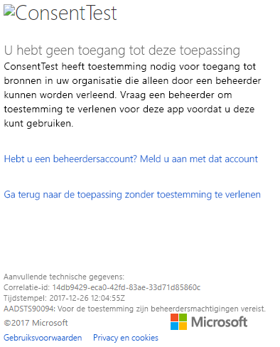
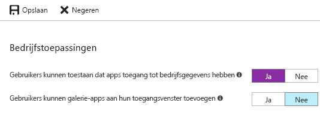

# <a name="troubleshoot-your-embedded-application"></a>Problemen oplossen met uw ingesloten toepassing

In dit artikel worden enkele veelvoorkomende problemen besproken die kunnen optreden tijdens het insluiten van inhoud vanuit Power BI.

## <a name="tools-to-troubleshoot"></a>Hulpprogramma's voor probleemoplossing

### <a name="fiddler-trace"></a>Traceren met Fiddler

[Fiddler](http://www.telerik.com/fiddler) is een gratis hulpprogramma van Telerik waarmee u het HTTP-verkeer kunt controleren.  U kunt hiermee het verkeer tussen de Power BI API's en de clientcomputer bekijken. Het programma kan fouten en aanverwante informatie weergeven.


### <a name="f12-in-browser-for-front-end-debugging"></a>F12 in de browser voor front-endfoutopsporing

Met F12 wordt het ontwikkelvenster in uw browser weergegeven. Met dit programma kunt u onder andere informatie over het netwerkverkeer bekijken.



### <a name="extract-error-details-from-power-bi-response"></a>Foutdetails extraheren uit het Power BI-antwoord

Dit codefragment laat zien hoe u de foutdetails van de HTTP-uitzondering kunt extraheren:

```csharp
public static string GetExceptionText(this HttpOperationException exc)
{
    var errorText = string.Format("Request: {0}\r\nStatus: {1} ({2})\r\nResponse: {3}",
    exc.Request.Content, exc.Response.StatusCode, (int)exc.Response.StatusCode, exc.Response.Content);
    if (exc.Response.Headers.ContainsKey("RequestId"))
    {
        var requestId = exc.Response.Headers["RequestId"].FirstOrDefault();
        errorText += string.Format("\r\nRequestId: {0}", requestId);
    }

    return errorText;
}
```

Het is raadzaam om de aanvraag-id (en foutdetails voor probleemoplossing) in een logboek te registreren.
Geef de aanvraag-id op als u contact opneemt met Microsoft Ondersteuning.

## <a name="app-registration"></a>App-registratie

### <a name="app-registration-failure"></a>App-registratiefout

Er wordt in de foutberichten in de Azure-portal of op de Power BI-pagina voor het registreren van apps aangegeven dat u over onvoldoende bevoegdheden beschikt. Als u een toepassing wilt registreren, moet u een beheerder van de Azure AD-tenant zijn of moet de functie voor toepassingsregistraties voor niet-beheerders zijn ingeschakeld.

### <a name="power-bi-service-doesnt-appear-in-the-azure-portal-when-registering-a-new-app"></a>De Power BI-service wordt niet weergegeven in Azure Portal tijdens het registreren van een nieuwe app

Er moet ten minste één gebruiker zijn aangemeld voor Power BI. Als de **Power BI-service** niet in de API-lijst wordt vermeld, is er geen gebruiker geregistreerd voor Power BI.

## <a name="rest-api"></a>REST API

### <a name="api-call-returning-401"></a>De API-aanroep retourneert fout 401

Mogelijk is er een Fiddler-opname nodig om het probleem nader te onderzoeken. Het vereiste machtigingsbereik voor de geregistreerde toepassing ontbreekt mogelijk in Azure AD. Controleer of het vereiste bereik aanwezig is in de app-registratie voor Azure AD in Azure Portal.

### <a name="api-call-returning-403"></a>De API-aanroep retourneert fout 403

Mogelijk is er een Fiddler-opname nodig om het probleem nader te onderzoeken. Er kunnen verschillende redenen zijn voor een 403-fout.

* De gebruiker heeft de hoeveelheid insluitingstokens overschreden die voor een gedeelde capaciteit kan worden gegenereerd. Schaf Azure-capaciteit aan als u insluitingstokens wilt genereren, en wijs de werkruimte vervolgens toe aan die capaciteit. Zie [Create Power BI Embedded capacity in the Azure portal](https://docs.microsoft.com/azure/power-bi-embedded/create-capacity) (Power BI Embedded-capaciteit maken in Azure Portal).
* Het Azure AD-verificatietoken is verlopen.
* De geverifieerde gebruiker is geen lid van de groep (app-werkruimte).
* De geverifieerde gebruiker is geen beheerder van de groep (app-werkruimte).
* De autorisatie-header wordt mogelijk niet correct vermeld. Controleer deze op spelfouten.

De back-end van de toepassing moet het verificatietoken mogelijk vernieuwen voordat GenerateToken wordt aangeroepen.

    ```
    GET https://wabi-us-north-central-redirect.analysis.windows.net/metadata/cluster HTTP/1.1
    Host: wabi-us-north-central-redirect.analysis.windows.net
    ...
    Authorization: Bearer eyJ0eXAiOi...
    ...

    HTTP/1.1 403 Forbidden
    ...

    {"error":{"code":"TokenExpired","message":"Access token has expired, resubmit with a new access token"}}
    ```

## <a name="authentication"></a>Verificatie

### <a name="authentication-failed-with-aadsts90002-tenant-authorize-not-found"></a>De verificatie is mislukt met AADSTS90002: Tenant 'autoriseren' niet gevonden

 Als u bij het aanmelden berichten ontvangt zoals ***fout: invalid_request, error_description: AADSTS90002: Tenant 'autoriseren' niet gevonden***, is dat omdat ADAL 4.x geen ondersteuning biedt voor 'https://login.microsoftonline.com/{Tenant}/oauth2/authorize/' als autoriteit-URL.
 
U lost dit probleem op door 'oauth2/authorize/' aan het einde van de autoriteit-URL te verwijderen; zie [Voorbeelden voor Power BI-ontwikkelaars](https://github.com/Microsoft/PowerBI-Developer-Samples) ter referentie.

 Controleer [Betere autoriteitsvalidatie](https://github.com/AzureAD/azure-activedirectory-library-for-dotnet/wiki/Changes-adalnet-4.0#better-authority-validation) in de releaseopmerkingen van ADAL 4.x.

### <a name="authentication-failed-with-aadsts70002-or-aadsts50053"></a>De verificatie is mislukt met AADSTS70002 of AADSTS50053

**_(AADSTS70002: er is een fout opgetreden bij het valideren van referenties. AADSTS50053: u hebt te vaak geprobeerd u aan te melden met een onjuiste gebruikers-id of een onjuist wachtwoord)_**

Als u Power BI Embedded en Azure AD Direct-verificatie gebruikt en u bij het aanmelden berichten ontvangt als ***fout: unauthorized_client, error_description:AADSTS70002: er is een fout opgetreden bij het valideren van referenties. AADSTS50053: U hebt te vaak geprobeerd u aan te melden met een onjuiste gebruikers-id of een onjuist wachtwoord***, komt dit doordat directe verificatie sinds 14 juni 2018 standaard is uitgeschakeld.

Er is een manier om dit weer in te schakelen met behulp van [Azure AD-beleid](https://docs.microsoft.com/azure/active-directory/manage-apps/configure-authentication-for-federated-users-portal#enable-direct-authentication-for-legacy-applications) waarvan het bereik wordt beperkt tot de organisatie of een [service-principal](https://docs.microsoft.com/azure/active-directory/develop/active-directory-application-objects#service-principal-object).

Het wordt aanbevolen dit beleid alleen per app in te schakelen.

Als u dit beleid wilt kunnen maken, moet u een **globale beheerder** zijn voor de map waar u het beleid maakt en toewijst. Hier volgt een voorbeeldscript voor het maken van het beleid en het toewijzen ervan aan de serviceprovider voor deze toepassing:

1. Installeer de [previewversie van de Azure AD PowerShell-module](https://docs.microsoft.com/powershell/azure/active-directory/install-adv2?view=azureadps-2.0).

2. Voer de volgende PowerShell-opdrachten per regel uit (zorg ervoor dat de variabele $sp niet meer dan één toepassing als resultaat heeft).

```powershell
Connect-AzureAD
```

```powershell
$sp = Get-AzureADServicePrincipal -SearchString "Name_Of_Application"
```

```powershell
$policy = New-AzureADPolicy -Definition @("{`"HomeRealmDiscoveryPolicy`":{`"AllowCloudPasswordValidation`":true}}") -DisplayName EnableDirectAuth -Type HomeRealmDiscoveryPolicy -IsOrganizationDefault $false
```

```powershell
Add-AzureADServicePrincipalPolicy -Id $sp.ObjectId -RefObjectId $policy.Id 
```

Na het toewijzen van het beleid wacht u ongeveer 15-20 seconden tot het beleid wordt doorgegeven voordat u begint met testen.

### <a name="generate-token-fails-when-providing-effective-identity"></a>Het token wordt niet gegeneerd wanneer de effectieve identiteit wordt opgegeven

GenerateToken kan om enkele verschillende redenen mislukken wanneer de effectieve identiteit wordt opgegeven.

* De gegevensset ondersteunt de effectieve identiteit niet
* De gebruikersnaam is niet opgegeven
* De rol is niet opgegeven
* De gegevensset-id is niet opgegeven
* Gebruiker beschikt niet over de juiste machtigingen.

Voer de onderstaande stappen uit om te controleren wat de reden is.

* Voer [Gegevensset ophalen](https://docs.microsoft.com/rest/api/power-bi/datasets) uit. Staat de eigenschap IsEffectiveIdentityRequired in gesteld op true (waar)?
* Voor elke EffectiveIdentity moet een gebruikersnaam worden opgegeven.
* Staat IsEffectiveIdentityRolesRequired in gestel op true (waar) en er dus een rol is vereist.
* DatasetId is verplicht voor elke EffectiveIdentity.
* Voor Analysis Services moet de hoofdgebruiker een gatewaybeheerder zijn.

### <a name="aadsts90094-the-grant-requires-admin-permission"></a>AADSTS90094: voor de toestemming zijn beheerdersmachtigingen vereist

**_Symptomen:_**<br>
Wanneer een gebruiker die geen beheerder is zich voor de eerste keer wil aanmelden bij een toepassing en toestemming verleent, wordt een van de volgende fouten weergegeven:

* ConsentTest heeft toestemming nodig voor toegang tot bronnen in uw organisatie die alleen door een beheerder kunnen worden verleend. Vraag een beheerder om toestemming te verlenen voor deze app voordat u deze kunt gebruiken.
* AADSTS90094: Voor de toestemming zijn beheerdersmachtigingen vereist.

    

Een gebruiker met beheerdersrechten kan zich aanmelden en toestemming verlenen.

**_Hoofdoorzaak:_**<br>
Toestemming van de gebruiker is uitgeschakeld voor de tenant.

**_Er zijn verschillende oplossingen mogelijk:_**

*Toestemming inschakelen voor de gebruiker voor de gehele tenant (alle gebruikers, alle toepassingen)*

1. Navigeer in Azure Portal naar Azure Active Directory = > Gebruikers en groepen = > Gebruikersinstellingen
2. Schakel de instelling Gebruikers kunnen apps namens hen toegang geven tot bedrijfsgegevens in en sla de wijzigingen op

    

*Verleen machtigingen* voor de toepassing (door een beheerder) voor de gehele tenant of voor een specifieke gebruiker.

## <a name="data-sources"></a>Gegevensbronnen

### <a name="isv-wants-to-have-different-credentials-for-the-same-data-source"></a>De ISV wil andere referenties voor dezelfde gegevensbron hebben

Een gegevensbron kan één set referenties voor één hoofdgebruiker hebben. Als u andere referenties moet gebruiken, maakt u aanvullende hoofdgebruikers. Vervolgens wijst u de andere referenties voor elk van de hoofdgebruikers toe en sluit u ze in met het Azure AD-token van de desbetreffende gebruiker.

## <a name="troubleshoot-your-embedded-application-with-the-ierror-object"></a>Problemen met uw ingesloten toepassing oplossen met het IError-object

Gebruik het [**IError-object** dat door de *foutgebeurtenis* vanuit de **JavaScript SDK**](https://github.com/Microsoft/PowerBI-JavaScript/wiki/Troubleshooting-and-debugging-of-embedded-parts) wordt geretourneerd om fouten in uw toepassing op te sporen en de oorzaak van de fouten beter te begrijpen.

Als u het IError-object hebt verkregen, zoekt u in de tabel met bijbehorende veelvoorkomende fouten die past bij het insluitingstype dat u gebruikt. Vergelijk de **IError-eigenschappen** met de eigenschappen in de tabel en zoek de mogelijke reden(en) voor de fout.

### <a name="typical-errors-when-embedding-for-power-bi-users"></a>Typische fouten bij het insluiten voor Power BI-gebruikers

| Bericht | Uitgebreid bericht | Foutcode | Mogelijke reden(en) |
|-------------------------------------------------------|-----------------------------------------------------------------------------------------------------------------------------|-----------|--------------------------------------------------------|
| TokenExpired | Toegangstoken is verlopen; opnieuw indienen met nieuw toegangstoken | 403 | Verlopen token  |
| PowerBIEntityNotFound | Laden van rapport mislukt | 404 | <li> Verkeerde rapport-id <li> Rapport bestaat niet  |
| Ongeldige parameters | Parameter powerbiToken niet opgegeven | N.v.t. | <li> Geen toegangstoken opgegeven <li> Geen rapport-id opgegeven |
| LoadReportFailed | Het initialiseren is mislukt: het cluster kan niet worden omgezet | 403 | * Beschadigd toegangstoken * Insluitingstype komt niet overeen met tokentype |
| PowerBINotAuthorizedException | Laden van rapport mislukt | 401 | <li> Verkeerde groeps-id <li> Niet gemachtigde groep |
| TokenExpired | Toegangstoken is verlopen; opnieuw indienen met nieuw toegangstoken. De rapportvisual met de titel <visual title> kan niet worden weergegeven | N.v.t. | Querygegevens, verlopen token |
| OpenConnectionError | Visual kan niet worden weergegeven. De rapportvisual met de titel <visual title> kan niet worden weergegeven | N.v.t. | Capaciteit is onderbroken of verwijderd terwijl een rapport in verband met de capaciteit tijdens een sessie was geopend |
| ExplorationContainer_FailedToLoadModel_DefaultDetails | Het modelschema dat is gekoppeld aan dit rapport kan niet worden geladen. Controleer of er verbinding is met de server en probeer het opnieuw. | N.v.t. | <li> Capaciteit onderbroken <li> Capaciteit verwijderd |

### <a name="typical-errors-when-embedding-for-non-power-bi-users-using-an-embed-token"></a>Typische fouten bij het insluiten voor niet-Power BI-gebruikers (met behulp van een insluitingstoken)

| Bericht | Uitgebreid bericht | Foutcode | Reden(en) |
|-------------------------------------------------------|-------------------------------------------------------------------------------------------------------------------------------|------------|-------------------------------------------------|
| TokenExpired | Toegangstoken is verlopen; opnieuw indienen met nieuw toegangstoken | 403 | Verlopen token  |
| LoadReportFailed | Laden van rapport mislukt | 404 | <li> Verkeerde rapport-id <li> Rapport bestaat niet  |
| LoadReportFailed | Laden van rapport mislukt | 403 | Rapport-id komt niet overeen met het token |
| LoadReportFailed | Laden van rapport mislukt | 500 | De door het rapport opgegeven id is geen GUID |
| Ongeldige parameters | Parameter powerbiToken niet opgegeven | N.v.t. | <li> Geen toegangstoken opgegeven <li> Geen rapport-id opgegeven |
| LoadReportFailed | Het initialiseren is mislukt: het cluster kan niet worden omgezet | 403 | Verkeerd tokentype, beschadigd token |
| PowerBINotAuthorizedException | Ophalen van rapport mislukt | 401 | Verkeerde/niet-geautoriseerde groeps-id |
| TokenExpired | Toegangstoken is verlopen; opnieuw indienen met nieuw toegangstoken. De rapportvisual met de titel <visual title> kan niet worden weergegeven | N.v.t. | Querygegevens, verlopen token |
| OpenConnectionError | Visual kan niet worden weergegeven. De rapportvisual met de titel <visual title> kan niet worden weergegeven | N.v.t. | Capaciteit is onderbroken of verwijderd terwijl een rapport in verband met de capaciteit tijdens een sessie was geopend |
| ExplorationContainer_FailedToLoadModel_DefaultDetails | Het modelschema dat is gekoppeld aan dit rapport kan niet worden geladen. Controleer of er verbinding is met de server en probeer het opnieuw. | N.v.t. | <li> Capaciteit onderbroken <li> Capaciteit verwijderd |

## <a name="content-rendering"></a>Inhoud weergeven

### <a name="performance"></a>Prestaties

[Prestaties van Power BI Embedded](embedded-performance-best-practices.md)

### <a name="rendering-or-consumption-of-embedded-content-fails-or-times-out"></a>De ingesloten inhoud kan niet worden weergegeven of gebruikt, of er treedt een time-out op

Controleer of het insluitingstoken is verlopen. Controleer de vervaldatum van het insluitingstoken en vernieuw het token. Zie [Refresh token using JavaScript SDK](https://github.com/Microsoft/PowerBI-JavaScript/wiki/Refresh-token-using-JavaScript-SDK-example) (Token vernieuwen met de JavaScript-SDK) voor meer informatie.

### <a name="report-or-dashboard-doesnt-load"></a>Het rapport of het dashboard wordt niet geladen

Als de gebruiker het rapport of het dashboard niet ziet, controleert u of het rapport of het dashboard correct wordt geladen in powerbi.com. Het rapport of het dashboard werkt niet in uw toepassing als het niet worden geladen in powerbi.com.

### <a name="report-or-dashboard-is-performing-slowly"></a>Het rapport of het dashboard presteert traag

Open het bestand vanuit Power BI Desktop, of in powerbi.com, om te controleren of de prestaties acceptabel zijn. Zodoende kunt u problemen met uw toepassing of de API's voor insluiten uitsluiten.

## <a name="embed-setup-tool"></a>Installatieprogramma voor insluiten

U kunt het [installatieprogramma voor insluiten](https://aka.ms/embedsetup) doorlopen om snel een voorbeeldtoepassing te downloaden. Vervolgens kunt u uw toepassing vergelijken met het voorbeeld.

### <a name="prerequisites"></a>Vereisten

Verifieer dat u aan alle voorwaarden voldoet voordat u het installatieprogramma voor insluiten gebruikt. U hebt een **Power BI Pro**-account en een **Microsoft Azure**-account nodig.

* Als u zich niet hebt geregistreerd voor **Power BI Pro**, [kunt u zich hier aanmelden voor een gratis proefversie](https://powerbi.microsoft.com/pricing/) voordat u begint.
* Als u nog geen abonnement op Azure hebt, maakt u een [gratis account](https://azure.microsoft.com/free/?WT.mc_id=A261C142F) voordat u begint.
* U moet beschikken over een eigen [Azure Active Directory-tenant ](create-an-azure-active-directory-tenant.md).
* [Visual Studio](https://www.visualstudio.com/) moet zijn geïnstalleerd (versie 2013 of hoger).

### <a name="common-issues"></a>Veelvoorkomende problemen

Hier volgt een lijst met veelvoorkomende problemen die kunnen optreden wanneer u testen uitvoert met het installatieprogramma voor insluiten:

#### <a name="using-the-embed-for-your-customers-sample-application"></a>De voorbeeldtoepassing Insluiten voor uw klanten gebruiken

Als u met de ervaring **Insluiten voor uw klanten** werkt, moet u het bestand *PowerBI-Developer-Samples.zip* opslaan en uitpakken. Open vervolgens de map *PowerBI-Developer-Samples-master\App Owns Data* en voer het bestand *PowerBIEmbedded_AppOwnsData.sln* uit.

Als u **Machtigingen verlenen** selecteert (de stap Machtigingen verlenen), krijgt u de volgende fout:

    AADSTS70001: Application with identifier <client ID> wasn't found in the directory <directory ID>

U lost dit op door het pop-upvenster te sluiten, enkele seconden te wachten en het vervolgens opnieuw te proberen. Mogelijk moet u deze actie een aantal keer herhalen. Een tijdsinterval zorgt ervoor dat het registratieproces voor de toepassing door het probleem niet kan worden voltooid voordat dit beschikbaar is voor externe API's.

De volgende foutmelding wordt weergegeven wanneer u de voorbeeld-app uitvoert:

    Password is empty. Please fill password of Power BI username in web.config.

Deze fout treedt op omdat de enige waarde die niet in de voorbeeldtoepassing wordt ingevoerd uw gebruikerswachtwoord is. Open het Web.config-bestand in de oplossing en vul in het veld pbiPassword het wachtwoord van uw gebruiker in.

Als u de foutmelding AADSTS50079 ziet, moet de gebruiker meervoudige verificatie gebruiken.

    Need to use an AAD account that doesn't have MFA enabled.

#### <a name="using-the-embed-for-your-organization-sample-application"></a>De voorbeeldtoepassing Insluiten voor uw organisatie gebruiken

Als u met de ervaring **Insluiten voor uw organisatie** werkt, moet u het bestand *PowerBI-Developer-Samples.zip* opslaan en uitpakken. Open vervolgens de map *PowerBI-Developer-Samples-master\User Owns Data\integrate-report-web-app* en voer het bestand *pbi-saas-embed-report.sln* uit.

Wanneer u de voorbeeld-app **Insluiten voor uw organisatie** uitvoert, krijgt u de volgende fout:

    AADSTS50011: The reply URL specified in the request doesn't match the reply URLs configured for the application: <client ID>

Deze fout treedt op omdat de omleidings-URL die is opgegeven voor de webservertoepassing afwijkt van de URL van het voorbeeld. Als u de voorbeeldtoepassing wilt registreren, gebruikt u `http://localhost:13526/` als de omleidings-URL.

Als u de geregistreerde toepassing wilt bewerken, moet u leren hoe u de [geregistreerde AAD-toepassing](https://docs.microsoft.com/azure/active-directory/develop/active-directory-integrating-applications#updating-an-application) bewerkt, zodat de toepassing toegang kan geven tot de web-API's.

Als u uw Power BI-gebruikersprofiel of -gegevens wilt bewerken, leert u hoe u uw [Power BI-gegevens](https://docs.microsoft.com/power-bi/service-basic-concepts) moet bewerken.

Als u de foutmelding AADSTS50079 ziet, moet de gebruiker meervoudige verificatie gebruiken.

    Need to use an AAD account that doesn't have MFA enabled.

Zie [Veelgestelde vragen over Power BI Embedded](embedded-faq.md) voor meer informatie.

Hebt u nog vragen? [Misschien dat de Power BI-community het antwoord weet](http://community.powerbi.com/)

Als u meer hulp nodig hebt, [neemt u contact op met de ondersteuning](https://powerbi.microsoft.com/support/pro/?Type=documentation&q=power+bi+embedded) of [maakt u een ondersteuningsticket via Azure Portal](https://ms.portal.azure.com/#blade/Microsoft_Azure_Support/HelpAndSupportBlade/newsupportrequest) en geeft u de foutberichten op die zijn weergegeven.

## <a name="next-steps"></a>Volgende stappen

Zie [Veelgestelde vragen](embedded-faq.md) voor meer informatie.

Hebt u nog vragen? [Misschien dat de Power BI-community het antwoord weet](http://community.powerbi.com/)
