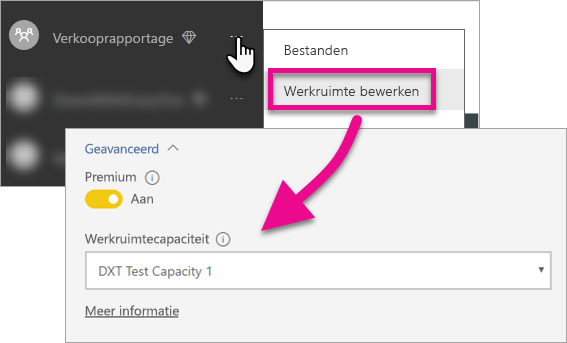

# Dashboards, rapporten en tegels van Power BI insluiten

Meer informatie over de stappen die u moet uitvoeren voor het insluiten van Power BI-inhoud in uw toepassing.

Microsoft [introduceert Power BI Premium](https://powerbi.microsoft.com/blog/microsoft-accelerates-modern-bi-adoption-with-power-bi-premium/), een nieuw, op capaciteit gebaseerd licentiemodel met meer flexibiliteit voor het openen, delen en distribueren van inhoud. Power BI Premium zorgt ook voor hogere schaalbaarheid en verbeterde prestaties van de Power BI-service. Microsoft introduceert ook Power BI Embedded, voor het maken van capaciteit binnen Microsoft Azure. Power BI Embedded is gericht op uw toepassing en uw klanten. 

In dit artikel behandelen we het insluiten van Power BI-inhoud voor uw organisatie en uw klanten. De stappen zijn vrijwel hetzelfde voor beide scenario's. Er worden bijschriften gemaakt wanneer een stap specifiek is voor het insluiten van inhoud voor klanten.

Er zijn een paar stappen die u moet uitvoeren met uw toepassing om dit mogelijk te maken. We doorlopen de benodigde stappen voor het maken en gebruiken van ingesloten inhoud in uw toepassing.

> [!NOTE]
> In de Power BI-API's worden app-werkruimten nog steeds groepen genoemd. Als er wordt verwezen naar groepen, werkt u in feite met app-werkruimten.

## Stap 1: de ingesloten analytische omgeving voor ontwikkeling instellen

Voordat u begint met het insluiten van dashboards en rapporten in uw toepassing, moet u ervoor zorgen dat uw omgeving is ingesteld voor het insluiten van inhoud. Als onderdeel van het instellingsproces moet u het volgende doen.

* [Controleren of u een Azure Active Directory-tenant hebt](embedding-content.md#azureadtenant)
* [Een Power BI Pro-account maken](embedding-content.md#proaccount)
* [Registratie en machtigingen voor de app](embedding-content.md#appreg)
* [App-werkruimten maken](embedding-content.md#appws)
* [Rapporten maken en uploaden](embedding-content.md#createreports)

U kunt het [hulpprogramma voor de onboarding-ervaring](https://aka.ms/embedsetup) uitvoeren om snel aan de slag te gaan en een voorbeeldtoepassing te downloaden.

Kies de oplossing die het beste bij u past:
* [Door inhoud voor uw klanten in te sluiten](embedding.md#embedding-for-your-customers) kunt u dashboards en rapporten insluiten voor gebruikers die geen account voor Power BI hebben. Voer de oplossing [Insluiten voor uw klanten](https://aka.ms/embedsetup/AppOwnsData) uit.
* [Met het insluiten van inhoud voor uw organisatie](embedding.md#embedding-for-your-organization) kunt u Power BI-service uitbreiden. Voer de oplossing [Insluiten voor uw organisatie](https://aka.ms/embedsetup/UserOwnsData) uit.

Als u echter besluit de omgeving handmatig in te stellen, kunt u hieronder doorgaan. 

> [!NOTE]
> Er is geen speciale capaciteit vereist voor het ontwikkelen van uw toepassing. De ontwikkelaars van de toepassing moeten beschikken over een Power BI Pro-licentie.

### Azure Active Directory-tenant

U hebt een Azure Active Directory-tenant (Azure AD) nodig om items vanuit Power BI te kunnen insluiten. Deze tenant moet ten minste één Power BI Pro-gebruiker hebben. U moet ook een Azure AD-app in de tenant definiëren. U kunt een bestaande Azure AD-tenant gebruiken of een nieuwe, specifieke Azure AD-tenant maken voor het insluiten.

U moet bepalen welke tenantconfiguratie u wilt gebruiken voor het insluiten van inhoud voor klanten.

* Wilt u de bestaande Power BI-tenant van uw bedrijf gebruiken?
* Wilt u een afzonderlijke tenant voor uw toepassing gebruiken?
* Wilt u voor elke klant een andere tenant gebruiken?

Als u geen bestaande tenant wilt gebruiken, kunt u kiezen of u een nieuwe tenant voor uw toepassing wilt maken, of een voor elke klant. Zie [Een Azure Active Directory-tenant maken](create-an-azure-active-directory-tenant.md) of [Een Azure Active Directory-tenant verkrijgen](https://docs.microsoft.com/azure/active-directory/develop/active-directory-howto-tenant) voor meer informatie.

### Een Power BI Pro-gebruikersaccount maken

U hebt slechts één Power BI Pro-account nodig voor het insluiten van inhoud. Mogelijk wilt u echter verschillende gebruikers met verschillende toegangsrechten voor items instellen. Hier volgt een overzicht van mogelijke gebruikers voor uw tenant.

De volgende accounts zijn vereist voor uw tenant. Ook moet aan die accounts een Power BI Pro-licentie zijn toegewezen. Een Power BI Pro-licentie is vereist voor het werken met app-werkruimten in Power BI.

#### Een organisatie-/tenantbeheerder

U wordt afgeraden om het gebruikersaccount van de globale beheerder van uw organisatie/tenant te gebruiken voor het insluiten van inhoud voor klanten. Zo beperkt u de toegangsrechten van het account voor de toepassing binnen uw tenant. De beheerder moet een beheerder zijn van alle app-werkruimten die worden gemaakt voor het insluiten van inhoud.

#### Accounts voor analisten die inhoud maken

Mogelijk hebt u meerdere gebruikers die inhoud voor Power BI maken. U hebt een Power BI Pro-account nodig voor elke analist die inhoud maakt en implementeert in Power BI.

#### Een *hoofd*gebruikersaccount voor het insluiten van inhoud voor klanten

Het hoofdaccount is het account dat in uw toepassing wordt gebruikt voor het insluiten van inhoud voor uw klanten. Het scenario wordt doorgaans gebruikt voor ISV-toepassingen. Het hoofdaccount is het enige vereiste account binnen uw organisatie. Het kan ook worden gebruikt als beheerdersaccount en analistaccount, maar dit wordt niet aanbevolen. De referenties voor dit account worden opgeslagen in de back-end van uw toepassing en gebruikt voor het verkrijgen van een Azure AD-verificatietoken voor de Power BI-API's. Dit account wordt gebruikt voor het genereren van een insluittoken voor de toepassing die moet worden gebruikt voor uw klanten.

Het hoofdaccount is slechts een standaardgebruiker met een Power BI Pro-licentie die u gebruikt voor uw toepassing. Het account moet een beheerder zijn van de app-werkruimte die wordt gebruikt voor het insluiten van inhoud.

### Registratie en machtigingen voor -app

U moet uw toepassing registreren bij Azure AD om REST-API-aanroepen te kunnen uitvoeren. Zie [Een Azure AD-app voor het insluiten van Power BI-inhoud registreren](register-app.md) voor meer informatie.

### App-werkruimten maken

Als u dashboards en rapporten voor uw klanten wilt insluiten, moeten deze dashboards en rapporten in een app-werkruimte worden geplaatst. Het eerder vermelde *hoofd*account moet een beheerder van de app-werkruimte zijn.

[!INCLUDE [powerbi-service-create-app-workspace](../includes/powerbi-service-create-app-workspace.md)]

> [!NOTE]
> Een gebruiker die geen beheerder is, kan maximaal maar 250 app-werkruimten maken. Als u meer app-werkruimten wilt maken, moet u een beheerdersaccount voor de tenant gebruiken.
>

### Rapporten maken en uploaden

U kunt de rapporten en gegevenssets maken met Power BI Desktop en de rapporten vervolgens publiceren naar een app-werkruimte. De eindgebruiker die de rapporten naar een app-werkruimte publiceert, moet beschikken over een Power BI Pro-licentie.

## Stap 2: uw inhoud insluiten

U moet de verificatie met Power BI uitvoeren binnen uw toepassing. Als u inhoud voor klanten wilt insluiten, slaat u de referenties voor het *hoofd*account op in de toepassing.

> [!NOTE]
> Zie [Gebruikers verifiëren en een Azure AD-toegangstoken ophalen voor uw Power BI-app](get-azuread-access-token.md) voor meer informatie over het verifiëren van gebruikers bij het insluiten van inhoud voor uw klanten.
>

Als de verificatie is geslaagd, binnen uw toepassing, kunt u dashboards en rapporten insluiten in de toepassing met de REST-API's van Power BI en JavaScript-API's. 

Zie de volgende scenario's voor informatie over het **insluiten van inhoud voor uw organisatie**:

* [Een dashboard in een app integreren](integrate-dashboard.md)
* [Een tegel in een app integreren](integrate-tile.md)
* [Een rapport in een app integreren](integrate-report.md)

Zie het volgende scenario voor informatie over het **insluiten van inhoud voor klanten**, een veelvoorkomende taak voor ISV's:

* [Een dashboard, tegel of rapport in uw toepassing integreren](embed-sample-for-customers.md)

Wanneer u inhoud voor uw klanten wilt insluiten, is een insluittoken vereist. Zie [Insluittoken](https://docs.microsoft.com/rest/api/power-bi/embedtoken) voor meer informatie.

## Stap 3: het niveau van de oplossing verhogen naar productie

Om het niveau te verhogen naar productie, zijn enkele extra stappen vereist.

### Inhoud insluiten voor uw organisatie

Als u inhoud insluit voor uw organisatie, hoeft u mensen alleen te laten weten hoe ze uw toepassing kunnen verkrijgen. 

Alle gebruikers (ongeacht de licentie die aan hen is toegewezen) kunnen inhoud die is ingesloten in een app-werkruimte (groep) gebruiken als deze werkruimte wordt ondersteund door specifieke capaciteit. U moet gebruikers die geen Power BI Pro-licentie hebben expliciet toevoegen aan de app-werkruimte, anders wordt een 401-fout (niet-geautoriseerd) weergegeven. In de volgende tabel ziet u de Power BI Premium-SKU's die beschikbaar zijn in Office 365.

| Capaciteit knooppunt | Totaal aantal cores *(back-end + front-end)* | Back-endcores | Front-endcores | Limieten voor DirectQuery/liveverbindingen | Maximum aantal pagina's (rendering) tijdens piekuren |
| --- | --- | --- | --- | --- | --- |
| EM3 |4 v-cores |2 cores, 10 GB RAM |2 cores | |601-1200 |
| P1 |8 v-cores |4 cores, 25 GB RAM |4 cores |30 per seconde |1201-2400 |
| P2 |16 v-cores |8 cores, 50 GB RAM |8 cores |60 per seconde |2401-4800 |
| P3 |32 v-cores |16 cores, 100 GB RAM |16 cores |120 per seconde |4.801-9.600 |

> [!NOTE]
> Als u Power BI Premium wilt kopen, moet u een globale beheerder of factureringsbeheerder binnen uw tenant zijn. Zie [Power BI Premium kopen](../service-admin-premium-purchase.md) voor meer informatie over het kopen van Power BI Premium.

>[!Note]
>[Stel uw omgeving voor ingesloten analyse in voor uw organisatie.](#step-1-setup-your-embedded-analytics-development-environment)
>

### Inhoud voor uw klanten insluiten

Als u inhoud voor uw klanten wilt insluiten, moet u het volgende doen.

* Als u een afzonderlijke tenant voor ontwikkeling gebruikt, moet u ervoor zorgen dat de app-werkruimten, dashboards en rapporten beschikbaar zijn in uw productieomgeving. Maak de toepassing voor uw productietenant in Azure AD en wijs de juiste app-machtigingen toe, zoals aangegeven in stap 1.
* Koop de capaciteit die past bij uw behoeften. Raadpleeg de onderstaande tabel om te zien welke Power BI Embedded-capaciteit of SKU u waarschijnlijk nodig hebt. Zie [Technisch document over Embedded-capaciteitsplanning](https://aka.ms/pbiewhitepaper) voor meer informatie. Wanneer u tot aanschaf wilt overgaan, kunt u dat doen in de [Microsoft Azure Portal](https://portal.azure.com). Zie [Power BI Embedded-capaciteit maken in Azure Portal](https://docs.microsoft.com/azure/power-bi-embedded/create-capacity) voor meer informatie over het maken van Power BI Embedded-capaciteit.

> [!IMPORTANT]
> Omdat insluittokens alleen voor ontwikkelingstesten zijn bedoeld, kan een Power BI-masteraccount een onbeperkt aantal insluittokens genereren. Er moet een [capaciteit moet worden aangeschaft](https://docs.microsoft.com/power-bi/developer/embedded-faq#technical) voor insluitingsscenario's voor de productie. Het aantal te genereren insluittokens is onbeperkt wanneer een specifieke capaciteit is aangeschaft. Ga naar [Beschikbare functies](https://docs.microsoft.com/rest/api/power-bi/availablefeatures) om te controleren hoeveel gratis insluittokens zijn gebruikt.

| Capaciteitsknooppunt | Totaal aantal cores *(back-end + front-end)* | Back-endcores | Front-endcores | Limieten voor DirectQuery/liveverbindingen | Maximum aantal pagina's (rendering) tijdens piekuren |
| --- | --- | --- | --- | --- | --- |
| A1 |1 v-core |0,5 core, 3 GB RAM |0,5 core | 5 per seconde |1-300 |
| A2 |2 v-cores |1 core, 5 GB RAM |1 core | 10 per seconde |301-600 |
| A3 |4 v-cores |2 cores, 10 GB RAM |2 cores | 15 per seconde |601-1200 |
| A4 |8 v-cores |4 cores, 25 GB RAM |4 cores |30 per seconde |1201-2400 |
| A5 |16 v-cores |8 cores, 50 GB RAM |8 cores |60 per seconde |2401-4800 |
| A6 |32 v-cores |16 cores, 100 GB RAM |16 cores |120 per seconde |4.801-9.600 |

* Bewerk de app-werkruimte en wijs deze via Geavanceerd toe aan een specifieke capaciteit.

    

* Implementeer uw bijgewerkte toepassing naar productie en begin met het insluiten van Power BI-dashboards en rapporten.

>[!Note]
>[Stel uw omgeving voor ingesloten analyse in voor uw klanten.](#step-1-setup-your-embedded-analytics-development-environment) 
>

## Beheerdersinstellingen

Globale beheerders of Power BI-servicebeheerders kunnen de mogelijkheid om REST-API's te gebruiken, in- of uitschakelen voor een tenant. Power BI-beheerders kunnen deze instelling inschakelen voor de hele organisatie of voor afzonderlijke beveiligingsgroepen. Standaard is deze instelling ingeschakeld voor de hele organisatie. Dit wordt gedaan via de [Power BI-beheerportal](../service-admin-portal.md).

## Volgende stappen

[Insluiten met Power BI](embedding.md)  
[Inhoud van de Power BI Embedded-werkruimteverzameling migreren naar Power BI](migrate-from-powerbi-embedded.md)  
[Power BI Premium - wat is het?](../service-premium.md)  
[Power BI Premium aanschaffen](../service-admin-premium-purchase.md)  
[Git-opslagplaats voor JavaScript-API](https://github.com/Microsoft/PowerBI-JavaScript)  
[Git-opslagplaats voor Power BI C#](https://github.com/Microsoft/PowerBI-CSharp)  
[Voorbeeld van het insluiten van JavaScript](https://microsoft.github.io/PowerBI-JavaScript/demo/)  
[Technisch document over Embedded-analysecapaciteitsplanning](https://aka.ms/pbiewhitepaper)  
[Technisch document over Power BI Premium](https://aka.ms/pbipremiumwhitepaper)  

Nog vragen? [Misschien dat de Power BI-community het antwoord weet](http://community.powerbi.com/)