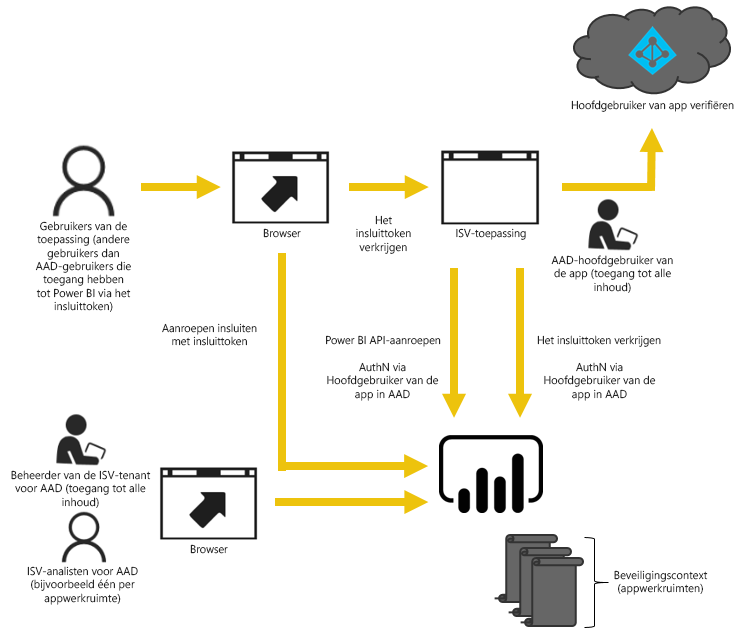

# Ingesloten analyses met Power BI

De Power BI-service (SaaS) en de Power BI Embedded-service in Azure (PaaS) bevatten API's voor het insluiten van uw dashboards en rapporten. Deze functie houdt in dat u een set mogelijkheden en toegang tot de nieuwste functies van Power BI (zoals dashboards, gateways en app-werkruimten) gebruikt voor het insluiten van uw inhoud.

U kunt het [installatieprogramma voor insluiten](https://aka.ms/embedsetup) uitvoeren om snel aan de slag te gaan en een voorbeeldtoepassing te downloaden.

Kies de oplossing die het beste bij u past:

* [Met het insluiten van inhoud voor uw organisatie](embedding.md#embedding-for-your-organization) kunt u Power BI-service uitbreiden. Voer de oplossing [Insluiten voor uw organisatie](https://aka.ms/embedsetup/UserOwnsData) uit.
* [Door inhoud voor uw klanten in te sluiten](embedding.md#embedding-for-your-customers) kunt u dashboards en rapporten insluiten voor gebruikers die geen account voor Power BI hebben. Voer de oplossing [Insluiten voor uw klanten](https://aka.ms/embedsetup/AppOwnsData) uit.

## Met behulp van API's

Er zijn twee hoofdscenario's voor het insluiten van Power BI-inhoud.  Insluiting voor gebruikers in uw organisatie (die licenties hebben voor Power BI) en insluiting voor uw gebruikers en klanten zonder dat deze Power BI-licenties nodig hebben. U kunt beide scenario’s uitvoeren met de Power BI REST-API.

Voor klanten en gebruikers zonder een Power Bi-licentie kunt u met dezelfde API dashboards en rapporten insluiten in uw aangepaste toepassing voor zowel uw organisatie als uw klanten. Uw klanten ziende gegevens die door de toepassing worden beheerd. Power BI-gebruikers in uw organisatie hebben daarnaast aanvullende opties om *hun gegevens* weer te geven, rechtstreeks in Power BI of in de context van de ingesloten toepassing. U kunt profiteren van de JavaScript- en REST-API's voor uw behoeften bij het insluiten van inhoud.

Voor een voorbeeld van hoe het insluiten van inhoud werkt, raadpleegt u het [Insluitvoorbeeld voor JavaScript](https://microsoft.github.io/PowerBI-JavaScript/demo/).

## Inhoud insluiten voor uw organisatie

**Met het insluiten van inhoud voor uw organisatie** kunt u Power BI-service uitbreiden. Bij het insluiten voor uw organisatie moeten gebruikers van uw toepassing zich aanmelden bij de Power BI-service wanneer ze hun inhoud willen weergeven. Als iemand in uw organisatie zich heeft aangemeld, heeft hij alleen toegang tot zijn eigen dashboards en rapporten of de dashboards en rapporten die met hem zijn gedeeld in de Power BI-service.

*Voorbeelden van het insluiten voor uw organisatie zijn interne toepassingen, zoals [SharePoint Online](https://powerbi.microsoft.com/blog/integrate-power-bi-reports-in-sharepoint-online/), [Microsoft Teams-integratie (hiervoor moet u beheerdersrechten hebben)](https://powerbi.microsoft.com/blog/power-bi-teams-up-with-microsoft-teams/) en [Microsoft Dynamics](https://docs.microsoft.com/dynamics365/customer-engagement/basics/add-edit-power-bi-visualizations-dashboard).*

Zie hieronder voor informatie over het insluiten van inhoud voor uw organisatie:

* [Een rapport in een app integreren](embed-sample-for-your-organization.md)

Mogelijkheden voor selfservice, zoals bewerken, opslaan en meer, zijn beschikbaar via de [JavaScript-API](https://github.com/Microsoft/PowerBI-JavaScript) wanneer u inhoud insluit voor Power BI-gebruikers.

U kunt het [instelprogramma voor insluiten om inhoud in te sluiten voor uw organisatie](https://aka.ms/embedsetup/UserOwnsData) uitvoeren om snel aan de slag te gaan en een voorbeeldtoepassing te downloaden waarmee u een rapport voor uw organisatie leert integreren.

## Inhoud voor uw klanten insluiten

**Door inhoud voor uw klanten in te sluiten** kunt u dashboards en rapporten insluiten voor gebruikers die geen account voor Power BI hebben. Inhoud voor uw klanten insluiten wordt ook wel aangeduid als **Power BI Embedded**.

[Power BI Embedded](azure-pbie-what-is-power-bi-embedded.md) is een **Microsoft Azure**-service waarmee onafhankelijke softwareleveranciers (ISV's) en ontwikkelaars snel visuals, rapporten en dashboards in een toepassing kunnen insluiten via een op capaciteit gebaseerd model waarvoor per uur kosten in rekening worden gebracht.

Power BI Embedded biedt voordelen voor ISV's, ontwikkelaars en klanten. Een ISV kan bijvoorbeeld gratis visuals maken met Power BI Desktop. Ze kunnen creaties ook sneller op de markt brengen omdat ze minder tijd hoeven te besteden aan het ontwikkelen van visuals én ze vallen meer op omdat ze een verfrissende gegevenservaring bieden. ISV's kunnen ervoor kiezen extra kosten in rekening te brengen voor de meerwaarde die de ingesloten analysemogelijkheden bieden.

Met Power BI Embedded hebben uw klanten geen voorkennis over Power BI nodig. U hebt slechts één Power BI Pro-account nodig om een ingesloten toepassing te maken. Het Power BI Pro-account fungeert als hoofdaccount voor uw toepassing (dit hoofdaccount is vergelijkbaar met een proxyaccount). Met het Power BI Pro-account kunt u ook insluittokens genereren die toegang bieden tot dashboards en rapporten in de Power BI-service die eigendom zijn van of worden beheerd door uw toepassing.

Ontwikkelaars die Power BI Embedded gebruiken, kunnen hun tijd besteden aan het bouwen van de basis van hun toepassing in plaats van aan het ontwikkelen van visuals en analysemogelijkheden. Ontwikkelaars kunnen snel reageren op verzoeken van klanten om dashboards en rapporten en ze kunnen eenvoudig zaken insluiten aan de hand van volledig gedocumenteerde API's en SDK's. Door het verkennen van gegevens eenvoudig te maken in apps, kunnen ISV's ervoor zorgen dat klanten op welk apparaat dan ook snel goede beslissingen kunnen nemen in de juiste context.

> [!IMPORTANT]
> Het insluiten is afhankelijk van de Power BI-service, maar uw klanten zijn niet afhankelijk van Power BI. Ze hoeven zich niet aan te melden voor Power BI om de ingesloten inhoud in uw toepassing te bekijken.

Wanneer u klaar bent om tot productie over te gaan, moet uw app-werkruimte worden toegewezen aan een speciale capaciteit. Power BI Embedded in Microsoft Azure biedt [toegewezen capaciteiten](azure-pbie-create-capacity.md) voor gebruik met uw toepassingen.

Zie [Power BI-dashboards, -rapporten en -tegels insluiten](embed-sample-for-customers.md) voor informatie over het insluiten.

## Volgende stappen

U kunt nu proberen om Power BI-inhoud in te sluiten in een toepassing of Power BI-inhoud in te sluiten voor uw klanten.

> [!div class="nextstepaction"]
> [Insluiten voor uw organisatie](embed-sample-for-your-organization.md)

> [!div class="nextstepaction"]
> [Wat is Power BI Embedded?](azure-pbie-what-is-power-bi-embedded.md)

> [!div class="nextstepaction"]
>[Insluiten voor uw klanten](embed-sample-for-customers.md)

Hebt u nog vragen? [Misschien dat de Power BI-community het antwoord weet](http://community.powerbi.com/)