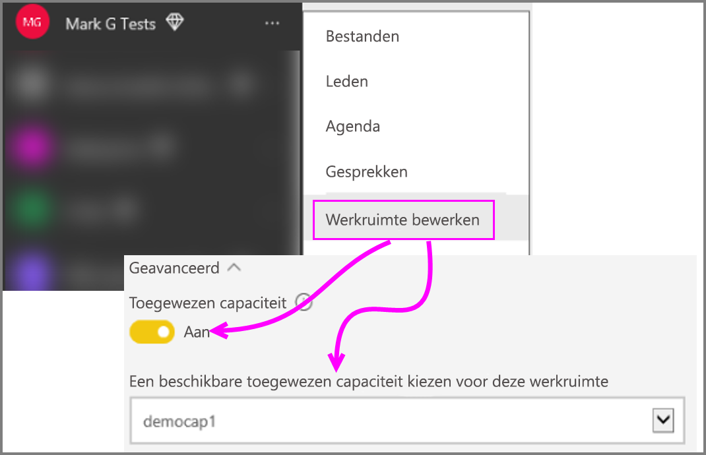

# Inhoud van de Power BI-werkruimteverzameling migreren naar Power BI Embedded
Informatie over het migreren van Power BI-werkruimteverzameling naar Power BI Embedded en hoe u gebruikmaakt van ontwikkelingen voor het insluiten van inhoud in apps.

Microsoft [introduceerde recentelijk Power BI Embedded](https://powerbi.microsoft.com/en-us/blog/power-bi-embedded-capacity-based-skus-coming-to-azure/), een nieuw, op capaciteit gebaseerd licentiemodel met meer flexibiliteit voor het openen, delen en distribueren van inhoud. De aanbieding zorgt ook voor hogere schaalbaarheid en verbeterde prestaties.

Met Power BI Embedded beschikt u over één API-service, een consistente set mogelijkheden en toegang tot de nieuwste functies van Power BI (zoals dashboards, gateways en app-werkruimten) gebruikt voor het insluiten van uw inhoud. Als u verder gaat, zult kunnen starten met Power BI Desktop en overstappen op implementatie met Power BI Embedded.

De huidige Power BI-werkruimteverzameling blijft beschikbaar gedurende een beperkte periode. Klanten die werken onder een Enterprise Agreement hebben toegang tot en met de vervaldatum van hun bestaande overeenkomsten; klanten die Power BI-werkruimteverzameling hebben verkregen via directe of CSP-kanalen behouden toegang tot één jaar na de release van de algemene beschikbaarheid van Power BI Embedded.  In dit artikel vindt u enkele richtlijnen voor het migreren van inhoud van Power BI-werkruimteverzameling naar de nieuwe Power BI Embedded-ervaring en welke wijzigingen u kunt verwachten in uw toepassing.

> [!IMPORTANT]
> Hoewel de migratie afhankelijk is van Power BI Embedded, zijn de gebruikers van uw toepassing niet afhankelijk van Power BI als deze een **insluittoken** gebruiken. Ze hoeven zich niet aan te melden voor Power BI om de ingesloten inhoud in uw toepassing te bekijken. U kunt deze aanpak voor insluiten gebruiken voor Embedded-gebruikers die niet beschikken over Power BI.
> 
> 

## Voorbereiden voor de migratie
Er zijn enkele dingen die u moet doen om inhoud voor te bereiden op een migratie van Power BI-werkruimteverzameling naar Power BI Embedded. U moet een tenant hebben die beschikbaar is en een gebruiker die een licentie voor Power BI Pro heeft.

1. Controleer of u toegang hebt tot een Azure AD-tenant (Azure Active Directory).
   
    U moet bepalen welk tenant-instelling u wilt gebruiken.
   
   * Wilt u de bestaande Power BI-tenant van uw bedrijf gebruiken?
   * Wilt u een afzonderlijke tenant voor uw toepassing gebruiken?
   * Wilt u voor elke klant een andere tenant gebruiken?
     
     Als u een nieuwe tenant voor uw toepassing wilt maken, of een voor elke klant, bekijk dan [Een Azure Active Directory-tenant maken](create-an-azure-active-directory-tenant.md) of [Een Azure Active Directory-tenant verkrijgen](https://docs.microsoft.com/azure/active-directory/develop/active-directory-howto-tenant) voor meer informatie.
2. Maak een gebruiker binnen deze nieuwe tenant die gaat fungeren als het ‘masteraccount’ van uw toepassing. Dit account moet zich aanmelden voor Power BI en moet beschikken over een Power BI Pro-licentie.

## Accounts in Azure AD
De volgende accounts moet binnen uw tenant aanwezig zijn.

> [!NOTE]
> Deze accounts moeten Power BI Pro-licenties hebben om app-werkruimten te kunnen gebruiken.
>

1. Een beheerder van de tenant.
   
    Het wordt aanbevolen dat deze gebruiker lid is van alle app-werkruimten die worden gemaakt voor het insluiten van inhoud.
2. Accounts voor analisten die inhoud maken.
   
    Deze gebruikers moeten waar nodig worden toegewezen aan de app-werkruimten.
3. Een *masteraccount* of Embedded-account voor de toepassing.
   
    De referenties voor dit account worden opgeslagen op de back-end van de toepassing en gebruikt voor het verkrijgen van een Azure AD-token voor de Power BI REST API's. Dit account wordt gebruikt voor het genereren van een insluittoken voor de toepassing. Dit account moet ook een beheerder zijn van de app-werkruimten die zijn gemaakt voor het insluiten van inhoud.
   
> [!NOTE]
> Dit is een normaal gebruikersaccount in uw organisatie dat wordt gebruikt voor het insluiten van inhoud.
>

> [!NOTE]
> Als tokenverificatie voor alleen apps een vereiste voor uw toepassing is, klikt u [hier](mailto:pbieci@microsoft.com?Subject=App-only%20token%20requirement) om contact met ons op te nemen.
>

## Registratie en machtigingen voor de app
U moet een toepassing in Azure AD registreren en bepaalde machtigingen verlenen.

### Een toepassing registreren
U moet uw toepassing registreren bij Azure AD om REST-API-aanroepen te kunnen uitvoeren. Hierbij moet u naar de Azure portal gaan om een aanvullende configuratie toe te passen, naast de registratiepagina van de Power BI-app. Zie [Een Azure AD-app voor het insluiten van Power BI-inhoud registreren](register-app.md) voor meer informatie.

U moet de toepassing die gebruikmaakt van het **masteraccount** registreren.

## App-werkruimten maken (vereist)
U kunt app-werkruimten gebruiken voor betere isolatie wanneer uw toepassing wordt gebruikt door meerdere klanten. Dashboards en rapporten zijn dan per klant geïsoleerd. U kunt vervolgens een Power BI-account per app-werkruimte gebruiken om de ervaringen van uw klanten met uw toepassing verder te isoleren.

> [!IMPORTANT]
> U kunt een persoonlijke werkruimte niet gebruiken om inhoud in te sluiten voor gebruikers die niet over Power BI beschikken.
> 
> 

U hebt een gebruiker nodig die een Pro-licentie heeft om een app-werkruimte in Power BI te kunnen maken. De Power BI-gebruiker die de app-werkruimte maakt, wordt standaard een beheerder van deze werkruimte.

> [!NOTE]
> Het *masteraccount* van de toepassing moet een beheerder zijn van de werkruimte.
> 
> 

## Inhoud migreren
U kunt de inhoud van uw werkruimteverzamelingen naar Power BI Embedded parallel met uw huidige oplossing migreren. Hiervoor is geen uitvaltijd vereist.

U kunt een **hulpprogramma voor migratie** gebruiken om u te helpen bij het kopiëren van inhoud van Power BI-werkruimteverzameling naar Power BI Embedded. Met name als u veel inhoud hebt. Zie [Hulpprogramma voor migratie in Power BI Embedded](migrate-tool.md) voor meer informatie.

Het migreren van inhoud gebeurt hoofdzakelijk via twee API's.

1. Download PBIX: deze API kan PBIX-bestanden downloaden die na oktober 2016 zijn geüpload naar Power BI.
2. Import PBIX: deze API kan elk type PBIX-bestand uploaden naar Power BI.

Zie [Codefragmenten voor het migreren van inhoud in Power BI-werkruimteverzameling](migrate-code-snippets.md) voor een aantal gerelateerde codefragmenten.

### Rapporttypen
Er zijn verschillende soorten rapporten en voor elk rapport is een enigszins verschillende migratiestroom vereist.

#### In het cachegeheugen opgeslagen gegevensset en rapport
In het cachegeheugen opgeslagen gegevenssets verwijzen naar PBIX-bestanden die gegevens in plaats van een live verbinding of DirectQuery-verbinding hebben geïmporteerd.

**Stroom**

1. Roep de Download PBIX API aan vanuit de PaaS-werkruimte.
2. Sla de PBIX op.
3. Roep de Import PBIX aan in de SaaS-werkruimte.

#### DirectQuery-gegevensset en -rapport
**Stroom**

1. Roep GET https://api.powerbi.com/v1.0/collections/{collection_id}/workspaces/{wid}/datasets/{dataset_id}/Default.GetBoundGatewayDataSources aan en sla de ontvangen verbindingsreeks op.
2. Roep de Download PBIX API aan vanuit de PaaS-werkruimte.
3. Sla de PBIX op.
4. Roep de Import PBIX aan in de SaaS-werkruimte.
5. Verbindingsreeks bijwerken door aanroepen - POST https://api.powerbi.com/v1.0/myorg/datasets/{dataset_id}/Default.SetAllConnections
6. GW-id en gegevensbron-id ophalen door aanroepen - GET https://api.powerbi.com/v1.0/myorg/datasets/{dataset_id}/Default.GetBoundGatewayDataSources
7. Referenties van gebruiker bijwerken door aanroepen - PATCH https://api.powerbi.com/v1.0/myorg/gateways/{gateway_id}/datasources/{datasource_id}

#### Oude gegevensset en rapport
Dit zijn gegevenssets/rapporten die zijn gemaakt vóór oktober 2016. Download PBIX biedt geen ondersteuning voor PBIX-bestanden die vóór oktober 2016 zijn geüpload

**Stroom**

1. Haal een PBIX-bestand op uit uw ontwikkelomgeving (uw interne bronbeheer).
2. Roep de Import PBIX aan in de SaaS-werkruimte.

#### Pushgegevensset en rapport
Download PBIX biedt geen ondersteuning voor *Push API*-gegevenssets. Push API-gegevenssets kunnen niet worden overgezet van PaaS naar SaaS.

**Stroom**

1. Roep de Create dataset API aan met de gegevensset Json om een gegevensset te maken in de SaaS-werkruimte.
2. Maak het rapport voor de gemaakte gegevensset opnieuw*.

Er zijn een aantal tijdelijke oplossingen waarmee u het rapport van de Push API toch kunt migreren van PaaS naar SaaS. Probeer hiervoor het volgende.

1. Upload een PBIX-bestand bij wijze van test naar de PaaS-werkruimte.
2. Kloon het Push API-rapport en koppel het aan het PBIX-testbestand uit stap 1.
3. Download het Push API-rapport met het PBIX-testbestand.
4. Upload het PBIX-testbestand naar uw SaaS-werkruimte.
5. Maak een pushgegevensset in de SaaS-werkruimte.
6. Koppel het rapport opnieuw aan de Push API-gegevensset.

## Nieuwe rapporten maken en uploaden
U kunt niet alleen inhoud migreren van de Power BI-werkruimteverzameling, maar ook rapporten en gegevenssets maken met Power BI Desktop en deze rapporten vervolgens publiceren naar een app-werkruimte. De eindgebruiker die de rapporten naar een app-werkruimte publiceert, moet beschikken over een Power BI Pro-licentie.

## Uw toepassing opnieuw bouwen
1. U moet uw toepassing wijzigen met de Power BI REST-API's en de rapportlocatie in powerbi.com.
2. Maak uw AuthN/AuthZ-verificatie opnieuw met behulp van het *masteraccount* voor uw toepassing. U een [insluittoken](https://msdn.microsoft.com/library/mt784614.aspx) gebruiker om deze gebruiker te machtigen om te handelen namens andere gebruikers.
3. Sluit uw rapporten uit powerbi.com in uw toepassing in.

## Uw gebruikers toewijzen aan een Power BI-gebruiker
In uw toepassing wijst u gebruikers die u in de toepassing naar beheert toe aan een *masterreferentie* van Power BI voor uw toepassing. De referenties voor dit *masteraccount* van Power BI worden opgeslagen in uw toepassing en worden gebruikt voor het maken van insluittokens.

## Wat u moet doen wanneer u klaar bent voor productie
Wanneer u klaar bent voor de productie, moet u het volgende te doen.

* Als u een afzonderlijke tenant voor ontwikkeling gebruikt, moet u ervoor zorgen dat de app-werkruimten, dashboards en rapporten beschikbaar zijn in uw productieomgeving. Bovendien moet u de toepassing maken voor uw productietenant in Azure AD en de juiste app-machtigingen toewijzen, zoals aangegeven in stap 1.
* Koop de capaciteit die past bij uw behoeften. Bekijk het [technisch document over capaciteitsplanning voor Power BI Embedded-analyses](https://aka.ms/pbiewhitepaper) voor meer inzicht in de hoeveelheid en het type capaciteit dat u nodig hebt. U kunt [capaciteit kopen](https://portal.azure.com/#create/Microsoft.PowerBIDedicated) in Azure.
* Bewerk de app-werkruimte en wijs deze toe aan een Premium capaciteit onder Geavanceerd.
 
    
    
* Implementeer uw bijgewerkte toepassing naar productie en begin met het insluiten van rapporten uit de Power BI Embedded.

## Na de migratie
Het is aan te raden om op te ruimen in Azure.

* Verwijder alle werkruimten uit de geïmplementeerde oplossing in de Azure Embedded van Power BI-werkruimteverzameling.
* Verwijder eventuele werkruimteverzamelingen die zijn opgeslagen in Azure.

## Volgende stappen
[Insluiten met Power BI](embedding.md)  
[Migratieprogramma voor Power BI-werkruimteverzameling](migrate-tool.md)  
[Codefragmenten voor het migreren van inhoud van Power BI-werkruimteverzameling](migrate-code-snippets.md)  
[Dashboards, rapporten en tegels van Power BI insluiten](embedding-content.md)  
[Power BI Premium - wat is het?](../service-premium.md)  
[Git-opslagplaats voor JavaScript-API](https://github.com/Microsoft/PowerBI-JavaScript)  
[Git-opslagplaats voor Power BI C#](https://github.com/Microsoft/PowerBI-CSharp)  
[Voorbeeld van het insluiten van JavaScript](https://microsoft.github.io/PowerBI-JavaScript/demo/)  
[Technisch document over analysecapaciteitsplanning voor Power BI-werkruimteverzameling](https://aka.ms/pbiewhitepaper)  
[Technisch document over Power BI Premium](https://aka.ms/pbipremiumwhitepaper)  

Nog vragen? [Misschien dat de Power BI-community het antwoord weet](http://community.powerbi.com/)