# <a name="power-bi-embedded-migration-tool"></a>Hulpprogramma voor de migratie van Power BI Embedded
Dit hulpprogramma voor migratie kan worden gebruikt voor het kopiëren van uw rapporten van de Power BI Embedded Azure-service (PaaS) naar de Power BI-service (SaaS).

U kunt de inhoud van uw werkruimteverzamelingen naar de Power BI-service parallel met uw huidige oplossing uitvoeren. Hiervoor is geen uitvaltijd vereist.

## <a name="limitations"></a>Beperkingen
* Gepushte gegevenssets kunnen niet worden gedownload en moeten opnieuw worden gemaakt met behulp van de Power BI REST-API's voor de Power BI-service.
* PBIX-bestanden die zijn geïmporteerd voor 26 november 2016 kunnen niet worden gedownload.

## <a name="download"></a>Downloaden
U kunt het voorbeeld van het hulpprogramma voor migratie downloaden via [GitHub](https://github.com/Microsoft/powerbi-migration-sample). U kunt een zip van de opslagplaats downloaden of u kunt deze lokaal klonen. Als u het bestand hebt gedownload, kunt u *powerbi-migration-sample.sln* openen vanuit Visual Studio om het hulpprogramma voor migratie te bouwen en uit te voeren.

## <a name="migration-plans"></a>Migratieplannen
Uw migratieplan bestaat uit metagegevens die de inhoud van Power BI Embedded sorteren en waarin is vastgelegd hoe u ze naar de Power BI-service wilt publiceren.

### <a name="start-with-a-new-migration-plan"></a>Beginnen met een nieuw migratieplan
Een migratieplan bestaat uit de metagegevens van de items die beschikbaar zijn in Power BI Embedded die u vervolgens wilt overzetten naar de Power BI-service. Het migratieplan wordt opgeslagen als een XML-bestand.

U kunt het best beginnen met het maken van een nieuw migratieplan. Ga als volgt te werk om een nieuw migratieplan te maken.

1. Selecteer **Bestand** > **Nieuw migratieplan**.
   
    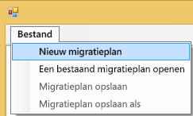
2. In het dialoogvenster **Power BI Embedded-resourcegroep selecteren** moet u de vervolgkeuzelijst Omgeving selecteren. Daarna selecteert u prod.
3. U wordt vervolgens gevraagd u aan te melden. Gebruik hiervoor de aanmeldgegevens voor uw Azure-abonnement.
   
   > [!IMPORTANT]
   > U gebruikt **niet** het Office 365-account van uw organisatie om u aan te melden bij Power BI.
   > 
   > 
4. Selecteer het Azure-abonnement waarin uw Power BI Embedded-werkruimteverzamelingen worden opgeslagen.
   
    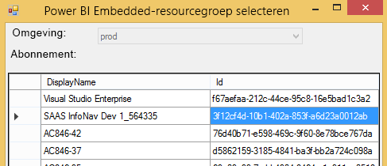
5. Selecteer onder de abonnementenlijst de **Resourcegroep** die uw werkruimteverzamelingen bevat en selecteer **Selecteren**.
   
    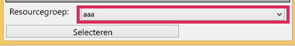
6. Selecteer **Analyseren**. Hiermee verkrijgt u een inventarisatie van de items in uw Azure-abonnement die u kunt gebruiken voor uw plan.
   
    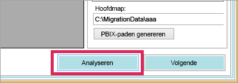
   
   > [!NOTE]
   > Het analyseproces kan enige tijd duren. Dit is afhankelijk van het aantal werkruimteverzamelingen en de hoeveelheid inhoud in de werkruimteverzameling.
   > 
   > 
7. Wanneer **Analyseren** is voltooid, wordt u gevraagd om uw migratieplan op te slaan.

Nu hebt u uw migratieplan verbonden met uw Azure-abonnement. Lees de informatie hieronder om te begrijpen hoe u het best kunt werken met uw migratieplan. De informatie bevat de hoofdstukken Analyseren en migratie plannen, Downloaden, Groepen maken en Uploaden.

### <a name="save-your-migration-plan"></a>Uw migratieplan opslaan
U kunt uw migratieplan voor later gebruik opslaan. Hiermee maakt u een XML-bestand dat alle informatie in uw migratieplan bevat.

Ga als volgt te werk om uw migratieplan op te slaan.

1. Selecteer **Bestand** > **Migratieplan opslaan**.
   
    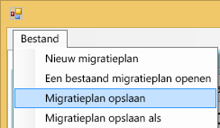
2. Geef een naam op voor het bestand of gebruik de gegenereerde naam en selecteer **Opslaan**.

### <a name="open-an-existing-migration-plan"></a>Een bestaand migratieplan openen
U kunt een opgeslagen migratieplan openen om verder te werken aan uw migratie.

Ga als volgt te werk om een bestaand migratieplan te openen.

1. Selecteer **Bestand** > **Bestaand migratieplan openen**.
   
    
2. Selecteer uw migratiebestand en selecteer **Openen**.

## <a name="step-1-analyze--plan-migration"></a>Stap 1: analyseren en migratie plannen
Het tabblad **Analyseren en migratie plannen** geeft u een overzicht van de zaken die zich momenteel in de resourcegroep van uw Azure-abonnement bevinden.

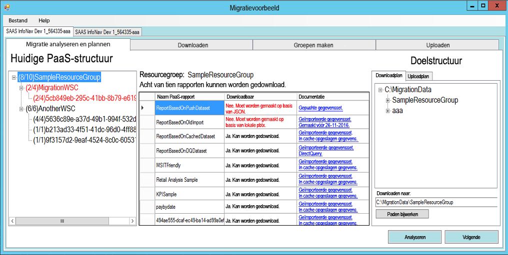

We nemen de *SampleResourceGroup* als voorbeeld.

### <a name="paas-topology"></a>PaaS-topologie
Dit is een lijst van uw *Resourcegroep > Werkruimteverzamelingen > Werkruimten*. Voor de resourcegroep en werkruimteverzamelingen wordt een beschrijvende naam weergegeven. Voor de werkruimten wordt een GUID weergegeven.

Bij de items in de lijst wordt ook een kleur en een nummer weergegeven in de indeling (#/#). Dit geeft het aantal rapporten aan dat kan worden gedownload. De kleur zwart geeft aan dat alle rapporten kunnen worden gedownload.

De kleur rood geeft aan dat sommige rapporten kunnen worden gedownload. Het getal links geeft het totale aantal rapporten aan dat kan worden gedownload. Het getal rechts geeft het totale aantal rapporten aan binnen de groep.

U kunt een item selecteren in de PaaS-topologie om de rapporten in de sectie Rapporten weer te geven.

### <a name="reports"></a>Rapporten
De sectie Rapporten bevat een lijst met de rapporten die beschikbaar zijn en geeft aan of deze kunnen worden gedownload of niet.

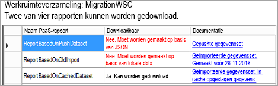

### <a name="target-structure"></a>Doelstructuur
In de **Doelstructuur** geeft u op waar het hulpprogramma zaken kan downloaden en hoe deze moeten worden geüpload.

#### <a name="download-plan"></a>Downloadplan
Er wordt automatisch een pad voor u gemaakt. U kunt dit pad wijzigen als u wilt. Als u het pad wijzigt, moet u **Paden bijwerken** selecteren.

> [!NOTE]
> Hiermee wordt de download niet daadwerkelijk uitgevoerd. U geeft hiermee alleen de locatie aan waar de rapporten naar worden gedownload.
> 
> 

#### <a name="upload-plan"></a>Uploadplan
Hier kunt u een voorvoegsel opgeven dat moet worden gebruikt voor de app-werkruimten die in de Power BI-service worden gemaakt. Na het voorvoegsel wordt de GUID geplaatst van de werkruimte die beschikbaar was in Azure.

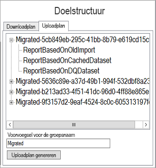

> [!NOTE]
> Hiermee worden de groepen in de Power BI-service niet daadwerkelijk gemaakt. Hiermee definieert u alleen de naamgevingsconventie voor de groepen.
> 
> 

Als u het voorvoegsel wilt wijzigen, moet u **Uploadplan genereren** selecteren.

Klik met de rechtermuisknop op een groep en kies ervoor de naam van de groep rechtstreeks te wijzigen in het uploadplan, indien gewenst.

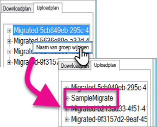

> [!NOTE]
> De naam van de *groep* mag geen spaties of ongeldige tekens bevatten.
> 
> 

## <a name="step-2-download"></a>Stap 2: downloaden
Op het tabblad **Downloaden** ziet u de lijst met rapporten en bijbehorende metagegevens. U kunt de huidige en de vorige uitvoerstatus bekijken.

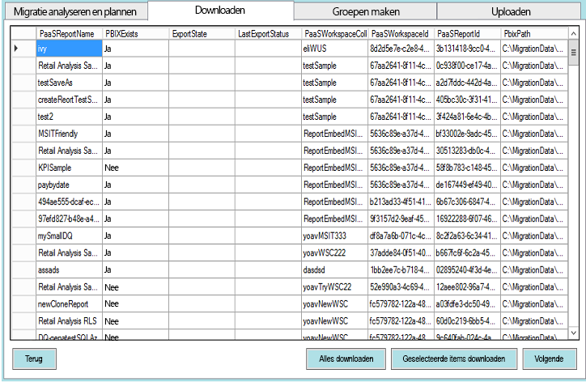

U hebt twee opties.

* Selecteer specifieke rapporten en selecteer **Selectie downloaden**
* Selecteer **Alles downloaden**.

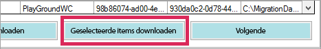

Als de download is gelukt, ziet u de status *Gereed* en wordt weergegeven dat het PBIX-bestand bestaat.

Nadat het downloaden is voltooid, selecteert u het tabblad **Groepen maken**.

## <a name="step-3-create-groups"></a>Stap 3: groepen maken
Nadat u de rapporten die beschikbaar zijn hebt gedownload, gaat u naar het tabblad **Groepen maken**. Dit tabblad maakt de app-werkruimten in de Power BI-service op basis van het migratieplan dat u hebt gemaakt. De app-werkruimte wordt gemaakt met de naam die u hebt opgegeven op het tabblad **Uploaden** in **Analyseren en migratie plannen**.

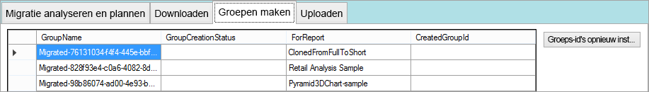

Voor het maken van de app-werkruimten kunt u ofwel **Geselecteerde groepen maken** of **Alle ontbrekende groepen maken** selecteren.

Wanneer u een van deze opties selecteert, wordt u gevraagd u aan te melden. *Gebruik de referenties voor de Power BI-service waarop de app-werkruimten moeten worden gemaakt.*

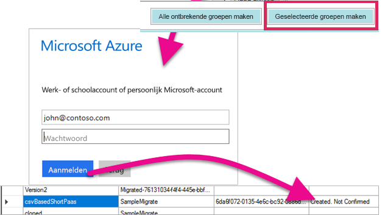

Hiermee wordt de app-werkruimte in de Power BI-service gemaakt. Hiermee worden de rapporten niet geüpload naar de app-werkruimte.

U kunt controleren of de app-werkruimte is gemaakt door u aan te melden bij Power BI en te controleren of de werkruimte bestaat. U ziet dat er is niets in de werkruimte staat.

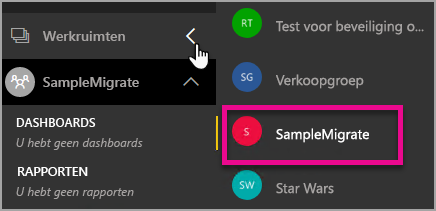

Nadat de werkruimte is gemaakt, kunt u naar het tabblad **Uploaden** gaan.

## <a name="step-4-upload"></a>Stap 4: uploaden
Op het tabblad **Uploaden** worden de rapporten geüpload naar de Power BI-service. U ziet een lijst met de rapporten die we hebben gedownload op het tabblad Downloaden, en de naam van de doelgroep op basis van uw migratieplan.

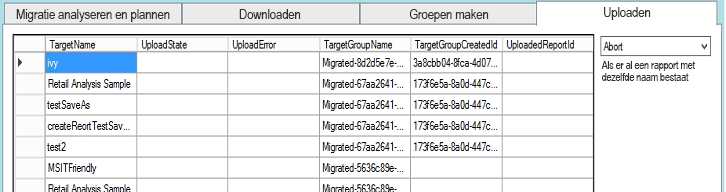

U kunt de geselecteerde rapporten uploaden of alle rapporten uploaden. U kunt ook de uploadstatus opnieuw instellen om items opnieuw te uploaden.

Daarnaast kunt u selecteren wat er moet worden gedaan als er al een rapport met dezelfde naam bestaat. U kunt kiezen tussen **Afbreken**, **Negeren** en **Overschrijven**.

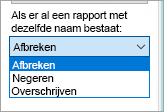

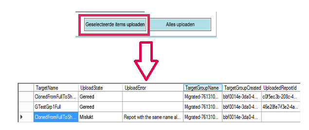

### <a name="duplicate-report-names"></a>Dubbele rapportnamen
Als u een rapport met dezelfde naam als een ander rapport hebt, maar zeker weet dat het een ander rapport is, moet u de **TargetName** van het rapport wijzigen. U kunt de naam wijzigen door de XML van het migratieplan handmatig te bewerken.

U moet het hulpprogramma voor migratie sluiten om de wijziging aan te brengen en het hulpprogramma en het migratieplan opnieuw openen.

In het bovenstaande voorbeeld is een van de gekloonde rapporten mislukt omdat er een rapport met dezelfde naam bestaat. Als we kijken naar de XML van het migratieplan, zien we het volgende.

```
<ReportMigrationData>
    <PaaSWorkspaceCollectionName>SampleWorkspaceCollection</PaaSWorkspaceCollectionName>
    <PaaSWorkspaceId>4c04147b-d8fc-478b-8dcb-bcf687149823</PaaSWorkspaceId>
    <PaaSReportId>525a8328-b8cc-4f0d-b2cb-c3a9b4ba2efe</PaaSReportId>
    <PaaSReportLastImportTime>1/3/2017 2:10:19 PM</PaaSReportLastImportTime>
    <PaaSReportName>cloned</PaaSReportName>
    <IsPushDataset>false</IsPushDataset>
    <IsBoundToOldDataset>false</IsBoundToOldDataset>
    <PbixPath>C:\MigrationData\SampleResourceGroup\SampleWorkspaceCollection\4c04147b-d8fc-478b-8dcb-bcf687149823\cloned-525a8328-b8cc-4f0d-b2cb-c3a9b4ba2efe.pbix</PbixPath>
    <ExportState>Done</ExportState>
    <LastExportStatus>OK</LastExportStatus>
    <SaaSTargetGroupName>SampleMigrate</SaaSTargetGroupName>
    <SaaSTargetGroupId>6da6f072-0135-4e6c-bc92-0886d8aeb79d</SaaSTargetGroupId>
    <SaaSTargetReportName>cloned</SaaSTargetReportName>
    <SaaSImportState>Failed</SaaSImportState>
    <SaaSImportError>Report with the same name already exists</SaaSImportError>
</ReportMigrationData>
```

We kunnen de naam van het SaaSTargetReportName wijzigen voor het item.

```
<SaaSTargetReportName>cloned2</SaaSTargetReportName>
```

We kunnen vervolgens het plan opnieuw openen in het hulpprogramma voor migratie en het mislukte rapport uploaden.

Als we teruggaan naar Power BI, zien we dat de rapporten en gegevenssets in de app-werkruimte zijn geüpload.

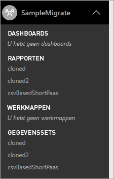

<a name="upload-local-file"></a>

### <a name="upload-a-local-pbix-file"></a>Een lokaal PBIX-bestand uploaden
U kunt een lokale versie van een Power BI Desktop-bestand uploaden. U moet het hulpprogramma sluiten, het XML-bestand bewerken en het volledige pad naar uw lokale PBIX in de eigenschap **PbixPath** opgeven.

```
<PbixPath>[Full Path to PBIX file]</PbixPath>
```

Nadat u het XML-bestand hebt bewerkt, opent u het plan opnieuw in het hulpprogramma voor migratie en uploadt u het rapport.

<a name="directquery-reports"></a>

### <a name="directquery-reports"></a>DirectQuery-rapporten
U moet de verbindingsreeks voor de DirectQuery-rapporten bijwerken. U kunt dit doen in *powerbi.com*, of u kunt de verbindingsreeks programmatisch opvragen in Power BI Embedded (PaaS). Zie [Een DirectQuery-verbindingsreeks ophalen uit een PaaS-rapport](migrate-code-snippets.md#extract-directquery-connection-string-from-paas-report) voor een voorbeeld.

U kunt de verbindingsreeks voor de gegevensset in de Power BI-service (SaaS) bijwerken en de referenties voor de gegevensbron instellen. U kunt de volgende voorbeelden bekijken om te zien hoe u dit doet.

* [De DirectQuery-verbindingsreeks bijwerken in de SaaS-werkruimte](migrate-code-snippets.md#update-directquery-connection-string-is-saas-workspace)
* [DirectQuery-referenties instellen in de SaaS-werkruimte](migrate-code-snippets.md#set-directquery-credentials-in-saas-workspace)

## <a name="embedding"></a>Insluiten
Nu uw rapporten zijn gemigreerd van de Power BI Embedded Azure-service naar de Power BI-service, kunt u uw toepassing bijwerken en beginnen met het insluiten van de rapporten in deze app-werkruimte.

Zie [Inhoud van de Power BI Embedded-werkruimteverzameling migreren naar Power BI](migrate-from-powerbi-embedded.md) voor meer informatie.

## <a name="next-steps"></a>Volgende stappen
[Insluiten met Power BI](embedding.md)  
[Inhoud van de Power BI Embedded-werkruimteverzameling migreren naar Power BI](migrate-from-powerbi-embedded.md)  
[Power BI Premium - wat is het?](../service-premium.md)  
[Git-opslagplaats voor JavaScript-API](https://github.com/Microsoft/PowerBI-JavaScript)  
[Git-opslagplaats voor Power BI C#](https://github.com/Microsoft/PowerBI-CSharp)  
[Voorbeeld van het insluiten van JavaScript](https://microsoft.github.io/PowerBI-JavaScript/demo/)  
[Technisch document over Power BI Premium](https://aka.ms/pbipremiumwhitepaper)  

Nog vragen? [Misschien dat de Power BI-community het antwoord weet](http://community.powerbi.com/)

