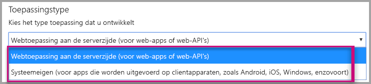
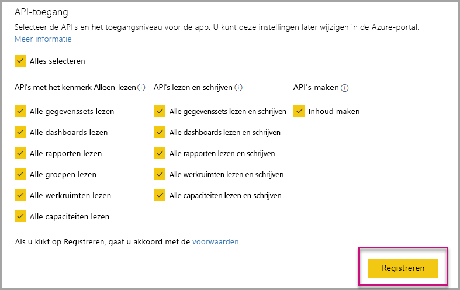
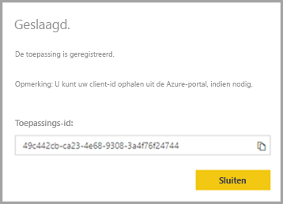
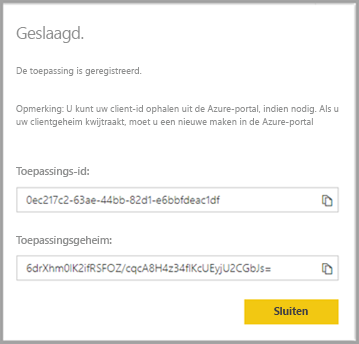

# <a name="register-an-azure-ad-application-to-use-with-power-bi"></a>Een Azure AD-toepassing registeren om bij Power BI te gebruiken

Informatie over het registreren van een toepassing in Azure Active Directory (Azure AD) voor gebruik met ingesloten Power BI-inhoud.

U kunt uw toepassing registreren bij Azure AD zodat uw toepassing toegang heeft tot de [Power BI REST API's](https://docs.microsoft.com/rest/api/power-bi/). Nadat u uw toepassing registreert, kunt u een identiteit instellen voor uw toepassing en machtigingen opgeven voor Power BI REST-resources.

> [!IMPORTANT]
> Voordat u een Power BI-app registreert, hebt u een [Azure Active Directory-tenant en een organisatiegebruiker](create-an-azure-active-directory-tenant.md) nodig. Als u zich nog niet hebt geregistreerd voor Power BI met een gebruiker in uw tenant, wordt de registratie van de app niet voltooid.

Er zijn twee manieren om uw toepassing te registreren. De eerste is met het [Power BI-app-hulpprogramma voor registratie](https://dev.powerbi.com/apps/). U kunt dit ook rechtstreeks doen in Azure Portal. Het Power BI App-hulpprogramma voor registratie is handiger om te gebruiken, aangezien u hier maar een aantal velden hoeft in te vullen. Gebruik Azure Portal als u wijzigingen wilt aanbrengen in uw app.

## <a name="register-with-the-power-bi-application-registration-tool"></a>Registreren met het Power BI Application-hulpprogramma voor registratie

U moet uw toepassing registreren in **Azure Active Directory** om een identiteit te maken voor uw toepassing en machtigingen op te geven voor Power BI REST-resources. Wanneer u een toepassing registreert, zoals een console-app of een website, ontvangt u een id die wordt gebruikt door de toepassing om zich te identificeren bij de gebruikers bij wie ze machtigingen aanvragen.

Ga als volgt te werk om uw toepassing te registreren met het Power BI App-hulpprogramma voor registratie:

1. Ga naar [dev.powerbi.com/apps](https://dev.powerbi.com/apps).

2. Selecteer **Aanmelden** met uw bestaande account en selecteer **Volgende**.

3. Geef een **Toepassingsnaam** op.

4. Geef een **toepassingstype** op.

    Hier ziet u de verschillen tussen **systeemeigen toepassingen** en **webtoepassingen aan de serverzijde** die bepalen welk toepassingstype u kiest.

    Systeemeigen:
    * U wilt een toepassing maken die is [ontworpen voor uw klanten](embed-sample-for-customers.md) en gebruikt een account van de hoofdgebruiker (de Power BI Pro-licentie die voor het aanmelden bij Power BI is gebruikt) voor de verificatie.

    Webtoepassing aan de serverzijde:
    * U wilt een toepassing maken die is [ontworpen voor uw organisatie](embed-sample-for-your-organization.md).
    * U wilt een toepassing maken die is [ontworpen voor uw klanten](embed-sample-for-customers.md) met behulp van een service-principal voor de verificatie.
    * U wilt webapps of web-API's maken.

    

5. Als u **Webtoepassing aan de serverzijde** als toepassingstype hebt geselecteerd, voert u nu een waarde in voor **Startpagina-URL** en **Omleidings-URL**. De **Omleidings-URL**werkt in combinatie met elke geldige URL en moet overeenkomen met de toepassing die u hebt gemaakt. Als u **Systeemeigen** hebt geselecteerd, gaat u verder naar stap 6.

6. Kies de API's van Power BI die voor uw toepassing nodig zijn. Zie [Power BI-machtigingen](power-bi-permissions.md) voor meer informatie over Power BI-toegangsmachtigingen. Selecteer vervolgens **Registreren**.

    

    > [!Important]
    > Als u de service-principals inschakelt voor gebruik met Power BI, zijn de Azure Active Directory-machtigingen niet meer geldig. De machtigingen worden beheerd via het Power BI-beheerportal.

7. Als u **Systeemeigen** als toepassingstype kiest, wordt er een **toepassings-id** toegewezen. Als u **Web-app aan de serverzijde** als toepassingstype kiest, ontvangt u een **toepassings-id** en een **toepassingsgeheim**.

    > [!Note]
    > De **toepassings-id** kan indien nodig op een later tijdstip worden opgehaald uit Azure Portal. Als u het **toepassingsgeheim** kwijtraakt, moet u een nieuw clientgeheim maken binnen Azure Portal.

| Systeemeigen | Webtoepassing aan de serverzijde |
|--------|-----------------------------|
|  |  |

U kunt de geregistreerde toepassing nu als onderdeel van uw aangepaste toepassing gebruiken om te communiceren met de Power BI-service en uw Power BI Embedded-toepassing.

## <a name="register-with-the-azure-portal"></a>Registreren bij Azure Portal

Uw andere optie voor het registreren van uw toepassing is dit rechtstreeks in Azure Portal te doen. Volg deze stappen voor het registreren van uw toepassing.

1. Accepteer de [algemene voorwaarden van de Microsoft Power BI-API](https://powerbi.microsoft.com/api-terms).

2. Meld u aan bij [Azure Portal](https://portal.azure.com).

3. Kies uw Azure AD-tenant door uw account te selecteren in de rechterbovenhoek van de pagina.

4. Kies in het navigatiedeelvenster links **Alle services**, selecteer **Azure Active Directory**, kies **App-registraties** en selecteer vervolgens **Nieuwe toepassing registreren**.

    

5. Volg de aanwijzingen en maak een nieuwe toepassing.

   * Voor webtoepassingen geeft u de aanmeldings-URL op, die de basis-URL van uw app vormt waar gebruikers zich kunnen aanmelden, bijvoorbeeld (`http://localhost:13526`).
   * Voor systeemeigen toepassingen geeft u een **omleidings-URI** op, die Azure AD gebruikt om tokenantwoorden te retourneren. Voer een voor uw toepassing specifieke waarde in (bijvoorbeeld `http://myapplication/Redirect`).

Zie voor meer informatie over het registreren van toepassingen bij Azure Active Directory het onderwerp [Toepassingen integreren met Azure Active Directory](https://docs.microsoft.com/azure/active-directory/develop/active-directory-integrating-applications)

## <a name="how-to-get-the-application-id"></a>De toepassings-id verkrijgen

Wanneer u een toepassing registreert, ontvangt u een [toepassings-id](embed-sample-for-customers.md#application-id).  Met de **toepassings-id** worden door de toepassing machtigingen aangevraagd bij de gebruikers ten behoeve van identificatie.

## <a name="how-to-get-the-service-principal-object-id"></a>De id van het service-principal-object ophalen

Wanneer u de [API's van Power BI](https://docs.microsoft.com/rest/api/power-bi/) gebruikt, moet u bewerkingen definiëren met behulp van de [object-id van de service-principal](embed-service-principal.md#how-to-get-the-service-principal-object-id) als u naar de service-principal verwijst, bijvoorbeeld wanneer u een service-principal als beheerder aan een werkruimte toewijst.

## <a name="apply-permissions-to-your-application-within-azure-ad"></a>Machtigingen toepassen op uw toepassing in Azure AD

Schakel extra machtigingen in voor uw toepassing naast de informatie die is opgegeven op de pagina voor de app-registratie. U kunt dit doen via de Azure AD-portal of programmatisch.

U moet hiervoor zijn aangemeld bij het *hoofd*account, dat wordt gebruikt voor insluiting, of een globale beheerdersaccount.

### <a name="using-the-azure-ad-portal"></a>Azure AD Portal gebruiken

1. Blader naar [App-registraties](https://portal.azure.com/#blade/Microsoft_AAD_IAM/ApplicationsListBlade) in Azure Portal en selecteer de app die u gebruikt voor insluiting.

    
2. Selecteer **Vereiste machtigingen** onder **API-toegang**.

    

3. Selecteer binnen **Vereiste machtigingen** de optie **Power BI Service (Power BI)**.

    

   > [!NOTE]
   > Als u de app rechtstreeks in Azure AD Portal maakt, is **Power BI Service (Power BI)** mogelijk niet aanwezig. Als dit niet het geval is, selecteert u **+Toevoegen** en vervolgens **1 Een API selecteren**. Selecteer **Power BI Service** in de API-lijst en kies **Selecteren**.  Als **Power BI Service (Power BI)** niet beschikbaar is in **Toevoegen**, meld u zich met ten minste één gebruiker voor Power BI aan.

4. Selecteer alle machtigingen onder **Gedelegeerde machtigingen**. Selecteer deze één voor één om ze te kunnen opslaan. Selecteer **Opslaan** wanneer u klaar bent.

    
5. Selecteer binnen **Vereiste machtigingen** de optie **Machtigingen verlenen**.

    De actie **Machtigingen verlenen** is vereist voor het *hoofdaccount* om te voorkomen dat om toestemming wordt gevraagd door Azure AD. Als het account dat deze actie uitvoert een globale beheerder is, verleent u machtigingen voor alle gebruikers binnen uw organisatie voor deze toepassing. Als het account dat deze actie uitvoert de *hoofdaccount* is en niet een globale beheerder, verleent u alleen machtigingen aan het *hoofdaccount* voor deze toepassing.

    

### <a name="applying-permissions-programmatically"></a>Machtigingen via een programma toepassen

1. U moet de bestaande service-principals (gebruikers) ophalen in uw tenant. Zie [servicePrincipal ophalen](https://developer.microsoft.com/graph/docs/api-reference/beta/api/serviceprincipal_get) voor informatie over hoe u dit kunt doen.

    U roept de API *Get servicePrincipal* zonder {ID} aan. Alle service-principals worden dan opgehaald in de tenant.

2. Controleer dit voor een service-principal met uw app-toepassings-id als **appId**-eigenschap.

3. Maak een nieuw serviceabonnement als dit ontbreekt voor uw app.

    ```json
    Post https://graph.microsoft.com/beta/servicePrincipals
    Authorization: Bearer ey..qw
    Content-Type: application/json
    {
    "accountEnabled" : true,
    "appId" : "{App_Client_ID}",
    "displayName" : "{App_DisplayName}"
    }
    ```

4. App-machtiging verlenen aan de API van Power BI

   Als u gebruikmaakt van een bestaande tenant en geen machtigingen namens alle tenant-gebruikers wilt verlenen, kunt u machtigingen verlenen aan een specifieke gebruiker door de waarde **contentType** te vervangen door **Principal**.

   De waarde van **consentType** kan **AllPrincipals** of **Principal** zijn.

   * **AllPrincipals** kan alleen worden gebruikt door tenantbeheerders om alle gebruikers in de tenant machtigingen te verlenen.
   * **Principal** wordt gebruikt om machtigingen te verlenen aan een specifieke gebruiker. In dit geval moet er een extra eigenschap worden toegevoegd aan de aanvraagbody: *principalId={User_ObjectId}*.

     U moet *Machtigingen verlenen* voor het hoofdaccount om te voorkomen dat om toestemming wordt gevraagd door Azure AD. Dit is niet mogelijk bij niet-interactieve aanmelding.

     ```json
     Post https://graph.microsoft.com/beta/OAuth2PermissionGrants
     Authorization: Bearer ey..qw
     Content-Type: application/json
     {
     "clientId":"{Service_Plan_ID}",
     "consentType":"AllPrincipals",
     "resourceId":"c78a3685-1ce7-52cd-95f7-dc5aea8ec98e",
     "scope":"Dataset.ReadWrite.All Dashboard.Read.All Report.Read.All Group.Read Group.Read.All Content.Create Metadata.View_Any Dataset.Read.All Data.Alter_Any",
     "expiryTime":"2018-03-29T14:35:32.4943409+03:00",
     "startTime":"2017-03-29T14:35:32.4933413+03:00"
     }
     ```

    De **resourceId** *c78a3685-1ce7-52cd-95f7-dc5aea8ec98e* is niet universeel maar is afhankelijk van de tenant. Deze waarde is de objectId van de toepassing Power BI Service in de AAD-tenant (Azure Active Directory).

    De gebruiker kan deze waarde snel verkrijgen in de Azure-portal:
    1. https://portal.azure.com/#blade/Microsoft_AAD_IAM/StartboardApplicationsMenuBlade/AllApps

    2. In het zoekvak te zoeken naar Power BI Service

5. App-machtigingen verlenen aan Azure Active Directory (AAD)

   De waarde van **consentType** kan **AllPrincipals** of **Principal** zijn.

   * **AllPrincipals** kan alleen worden gebruikt door tenantbeheerders om alle gebruikers in de tenant machtigingen te verlenen.
   * **Principal** wordt gebruikt om machtigingen te verlenen aan een specifieke gebruiker. In dit geval moet er een extra eigenschap worden toegevoegd aan de aanvraagbody: *principalId={User_ObjectId}*.

   U moet *Machtigingen verlenen* voor het hoofdaccount om te voorkomen dat om toestemming wordt gevraagd door Azure AD. Dit is niet mogelijk bij niet-interactieve aanmelding.

   ```json
   Post https://graph.microsoft.com/beta/OAuth2PermissionGrants
   Authorization: Bearer ey..qw
   Content-Type: application/json
   { 
   "clientId":"{Service_Plan_ID}",
   "consentType":"AllPrincipals",
   "resourceId":"61e57743-d5cf-41ba-bd1a-2b381390a3f1",
   "scope":"User.Read Directory.AccessAsUser.All",
   "expiryTime":"2018-03-29T14:35:32.4943409+03:00",
   "startTime":"2017-03-29T14:35:32.4933413+03:00"
   }
   ```

## <a name="next-steps"></a>Volgende stappen

Nu u uw toepassing in Azure AD hebt geregistreerd, moet u gebruikers in uw toepassing verifiëren. Zie [Gebruikers verifiëren en een Azure AD-toegangstoken verkrijgen voor uw Power BI-app](get-azuread-access-token.md) voor meer informatie.

Hebt u nog vragen? [Misschien dat de Power BI-community het antwoord weet](http://community.powerbi.com/)