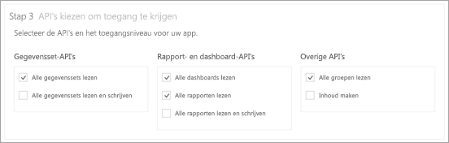
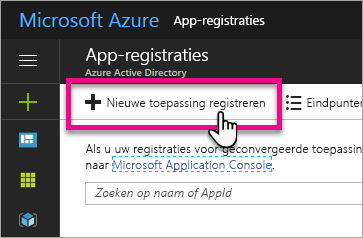
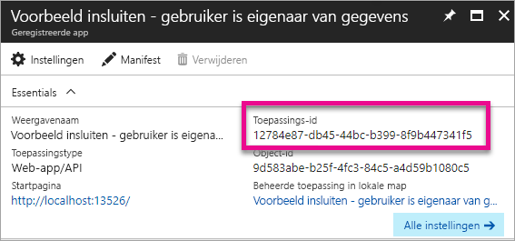
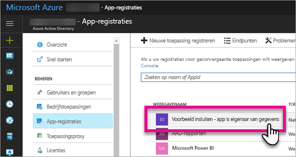
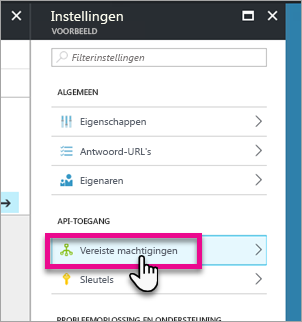
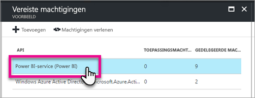
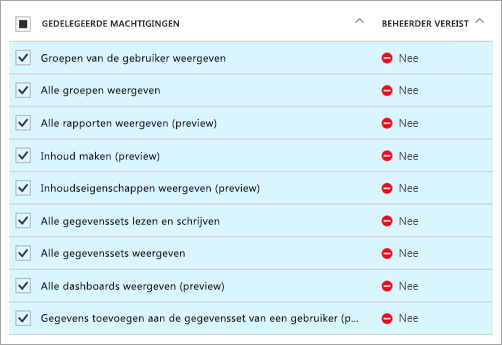
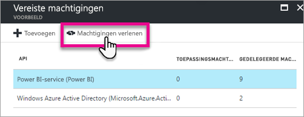

# <a name="register-an-azure-ad-app-to-embed-power-bi-content"></a>Een Azure AD-app registreren om Power BI-inhoud in te sluiten
Informatie over het registreren van een toepassing in Azure Active Directory (Azure AD) voor gebruik met ingesloten Power BI-inhoud.

U kunt uw toepassing registreren bij Azure AD zodat uw toepassing toegang heeft tot de Power BI REST-API's. Hiermee kunt u een identiteit instellen voor uw toepassing en machtigingen opgeven voor Power BI REST-resources.

> [!IMPORTANT]
> Voordat u een Power BI-app registreert, hebt u een [Azure Active Directory-tenant en een organisatiegebruiker](create-an-azure-active-directory-tenant.md) nodig. Als u zich nog niet hebt geregistreerd voor Power BI met een gebruiker in uw tenant, wordt de registratie van de app niet voltooid.
> 
> 

Er zijn twee manieren om uw toepassing te registreren. De eerste is met het [Power BI App-hulpprogramma voor registratie](https://dev.powerbi.com/apps/). U kunt dit ook rechtstreeks doen in Azure Portal. Het Power BI App-hulpprogramma voor registratie is de eenvoudigste optie, omdat u slechts enkele velden hoeft in te vullen. Gebruik Azure Portal als u wijzigingen wilt aanbrengen in uw app.

## <a name="register-with-the-power-bi-app-registration-tool"></a>Registreren met het Power BI App-hulpprogramma voor registratie
U moet uw toepassing registreren in **Azure Active Directory** om een identiteit te maken voor uw toepassing en machtigingen op te geven voor Power BI REST-resources. Wanneer u een toepassing registreert, zoals een console-app of een website, ontvangt u een id die wordt gebruikt door de toepassing om zich te identificeren bij de gebruikers bij wie ze machtigingen aanvragen.

Ga als volgt te werk om uw toepassing te registreren met het Power BI App-hulpprogramma voor registratie:

1. Ga naar [dev.powerbi.com/apps](https://dev.powerbi.com/apps).
2. Selecteer **Aanmelden met uw bestaande account**.
3. Geef de **naam van een app** op.
4. Welk type app u selecteert, is afhankelijk van de toepassing die u gebruikt.
   
   * Gebruik een **systeemeigen app** voor apps die worden uitgevoerd op clientapparaten. U kiest ook voor een **systeemeigen app** als u inhoud insluit voor uw klanten, ongeacht wat de toepassing is. Dit geldt zelfs voor webtoepassingen.
   * Gebruik een **web-app aan de serverzijde** voor web-apps of web-API's.

5. Voer een waarde in voor **Omleidings-URL** en **URL van startpagina**. De **omleidings-URL** kan een willekeurige geldige URL zijn.
   
    De **URL van startpagina** is alleen beschikbaar als u kiest voor een **web-app aan de serverzijde** voor het type toepassing.
   
    Voor de voorbeelden voor *insluiting voor uw klanten* en *integrate-dashboard-web-app* is de omleidings-URL `http://localhost:13526/redirect`. Voor het rapport- en tegelvoorbeeld is de omleidings-URL `http://localhost:13526/`.
6. Kies de API's voor de toepassing die toegang heeft. Zie [Power BI-machtigingen](power-bi-permissions.md) voor meer informatie over Power BI-toegangsmachtigingen.
   
    
7. Selecteer **App registreren**.
   
    U krijgt dan een **client-id**. Als u een **web-app aan de serverzijde** selecteert, ontvangt u een **clientgeheim**. De **client-id** kan indien nodig op een later tijdstip worden opgehaald uit Azure Portal. Als u het **clientgeheim** kwijtraakt, moet u een nieuw clientgeheim maken binnen Azure Portal.

8. U moet naar Azure navigeren om **Machtigingen verlenen** te selecteren.
   > [!Note]
   > U moet een globale beheerder in de Azure-tenant zijn om dit uit te voeren

* Ga naar Azure.
* Zoek en selecteer **App registraties**.
* Kies uw app.
* Selecteer **Instellingen**.
* Selecteer **Vereiste machtigingen**.
* Selecteer **Power BI-Service** om de machtigingen te verifiëren die u hebt geselecteerd in de App-registratiesite.
* Selecteer **Machtigingen verlenen**.

U kunt de geregistreerde toepassing nu als onderdeel van uw aangepaste toepassing gebruiken om te communiceren met de Power BI-service.

> [!IMPORTANT]
> Als u inhoud insluit voor uw klanten, moet u extra machtigingen in Azure Portal configureren. Zie [Machtigingen toepassen op uw toepassing](#apply-permissions-to-your-application) voor meer informatie.
> 

## <a name="register-with-the-azure-portal"></a>Registreren bij Azure Portal
Uw andere optie voor het registreren van uw toepassing is dit rechtstreeks in Azure Portal te doen. Volg deze stappen voor het registreren van uw toepassing.

1. Accepteer de [algemene voorwaarden van de Microsoft Power BI-API](https://powerbi.microsoft.com/api-terms).
2. Meld u aan bij [Azure Portal](https://portal.azure.com).
3. Kies uw Azure AD-tenant door uw account te selecteren in de rechterbovenhoek van de pagina.
4. Kies in het navigatiedeelvenster links **Meer services**, selecteer **App-registraties** onder **Beveiliging en identiteit** en selecteer **Registratie van nieuwe toepassing**.
   
    
5. Volg de aanwijzingen en maak een nieuwe toepassing.
   
   * Voor webtoepassingen geeft u de aanmeldings-URL op, die de basis-URL van uw app vormt waar gebruikers zich kunnen aanmelden, bijvoorbeeld `http://localhost:13526`.
   * Voor systeemeigen toepassingen geeft u een omleidings-URI op, die Azure AD gebruikt om tokenantwoorden te retourneren. Voer een specifieke waarde in voor uw toepassing, bijvoorbeeld `http://myapplication/redirect`

Zie voor meer informatie over het registreren van toepassingen bij Azure Active Directory het onderwerp [Toepassingen integreren met Azure Active Directory](https://docs.microsoft.com/azure/active-directory/develop/active-directory-integrating-applications)

## <a name="how-to-get-the-client-id"></a>De client-id ophalen
Wanneer u een toepassing registreert, ontvangt u een **Client-id**.  Met de **client-id** worden door de toepassing machtigingen aangevraagd bij de gebruikers ten behoeve van identificatie.

U ontvangt als volgt een client-id:

1. Meld u aan bij [Azure Portal](https://portal.azure.com).
2. Kies uw Azure AD-tenant door uw account te selecteren in de rechterbovenhoek van de pagina.
3. Kies in het navigatiedeelvenster links **Meer services** en selecteer **App-registraties**.
4. Selecteer de toepassing waarvoor u de client-id wilt ophalen.
5. De **toepassings-id** wordt vermeld als een GUID. Dit is de client-id voor de toepassing.
   
    

## <a name="apply-permissions-to-your-application-within-azure-ad"></a>Machtigingen toepassen op uw toepassing in Azure AD
> [!IMPORTANT]
> Deze sectie geldt alleen voor toepassingen die **inhoud insluiten voor uw organisatie**.
> 

U moet extra machtigingen inschakelen voor uw toepassing naast de informatie die is opgegeven op de pagina voor de app-registratie. U kunt dit doen via de Azure AD-portal of programmatisch.

U moet hiervoor zijn aangemeld bij het *hoofd*account, dat wordt gebruikt voor insluiting, of een globale beheerdersaccount.

### <a name="using-the-azure-ad-portal"></a>Azure AD Portal gebruiken
1. Blader naar [App-registraties](https://portal.azure.com/#blade/Microsoft_AAD_IAM/ApplicationsListBlade) in Azure Portal en selecteer de app die u gebruikt voor insluiting.
   
    
2. Selecteer **Vereiste machtigingen** onder **API-toegang**.
   
    

3. Selecteer binnen **Vereiste machtigingen** de optie **Power BI Service (Power BI)**.
   
    
   
   > [!NOTE]
   > Als u de app rechtstreeks in Azure AD Portal maakt, is **Power BI Service (Power BI)** mogelijk niet aanwezig. Als dit het geval is, selecteert u **Toevoegen** en vervolgens **1 Een API selecteren**. Selecteer **Power BI Service** in de API-lijst en kies **Selecteren**.  Als **Power BI Service (Power BI)** niet beschikbaar is in **Toevoegen**, meld u zich met ten minste één gebruiker voor Power BI aan.
   > 
   > 
4. Selecteer alle machtigingen onder **Gedelegeerde machtigingen**. U moet deze één voor één selecteren om ze te kunnen opslaan. Selecteer **Opslaan** wanneer u klaar bent.
   
    
5. Selecteer binnen **Vereiste machtigingen** de optie **Machtigingen verlenen**.
   
    De actie **Machtigingen verlenen** is vereist voor de *hoofdaccount* om te voorkomen dat om toestemming wordt gevraagd door Azure AD. Als het account dat deze actie uitvoert een globale beheerder is, verleent u machtigingen voor alle gebruikers binnen uw organisatie voor deze toepassing. Als het account dat deze actie uitvoert de *hoofdaccount* is en niet een globale beheerder, verleent u alleen machtigingen aan het *hoofdaccount* voor deze toepassing.
   
    

### <a name="applying-permissions-programmatically"></a>Machtigingen via een programma toepassen
1. U moet de bestaande service-principals (gebruikers) ophalen in uw tenant. Zie [servicePrincipal ophalen](https://developer.microsoft.com/en-us/graph/docs/api-reference/beta/api/serviceprincipal_get) voor informatie over hoe u dit kunt doen.
   
    U roept de API *servicePrincipal ophalen* zonder {id} aan. Alle service-principals worden dan opgehaald in de tenant.
2. Controleer op een service-principal met uw app-client-id als **appId**-eigenschap.
3. Maak een nieuw serviceabonnement als dit ontbreekt voor uw app.
   
    ```
    Post https://graph.microsoft.com/beta/servicePrincipals
    Authorization: Bearer ey..qw
    Content-Type: application/json
    {
    "accountEnabled" : true,
    "appId" : "{App_Client_ID}",
    "displayName" : "{App_DisplayName}"
    }
    ```
4. App-machtiging verlenen aan de API van Power BI
   
   Als u gebruikmaakt van een bestaande tenant en geen machtigingen namens alle tenant-gebruikers wilt verlenen, kunt u machtigingen verlenen aan een specifieke gebruiker door de waarde **contentType** te vervangen door **Principal**.

   De waarde van **consentType** kan **AllPrincipals** of **Principal** zijn.

   * **AllPrincipals** kan alleen worden gebruikt door tenantbeheerders om alle gebruikers in de tenant machtigingen te verlenen.
   * **Principal** wordt gebruikt om machtigingen te verlenen aan een specifieke gebruiker. In dit geval moet er een extra eigenschap worden toegevoegd aan de aanvraagbody: *principalId={User_ObjectId}*.
    
     *Machtigingen verlenen* is vereist voor het hoofdaccount om te voorkomen dat om toestemming wordt gevraagd door Azure AD. Dit is niet mogelijk bij niet-interactieve aanmelding.
   
     ```
     Post https://graph.microsoft.com/beta/OAuth2PermissionGrants
     Authorization: Bearer ey..qw
     Content-Type: application/json
     { 
     "clientId":"{Service_Plan_ID}",
     "consentType":"AllPrincipals",
     "resourceId":"c78b2585-1df6-41de-95f7-dc5aeb7dc98e",
     "scope":"Dataset.ReadWrite.All Dashboard.Read.All Report.Read.All Group.Read Group.Read.All Content.Create Metadata.View_Any Dataset.Read.All Data.Alter_Any",
     "expiryTime":"2018-03-29T14:35:32.4943409+03:00",
     "startTime":"2017-03-29T14:35:32.4933413+03:00"
     }
     ```

5. App-machtigingen verlenen aan Azure Active Directory (AAD)
   
   De waarde van **consentType** kan **AllPrincipals** of **Principal** zijn.

   * **AllPrincipals** kan alleen worden gebruikt door tenantbeheerders om alle gebruikers in de tenant machtigingen te verlenen.
   * **Principal** wordt gebruikt om machtigingen te verlenen aan een specifieke gebruiker. In dit geval moet er een extra eigenschap worden toegevoegd aan de aanvraagbody: *principalId={User_ObjectId}*.
    
   *Machtigingen verlenen* is vereist voor het hoofdaccount om te voorkomen dat om toestemming wordt gevraagd door Azure AD. Dit is niet mogelijk bij niet-interactieve aanmelding.

   ```
   Post https://graph.microsoft.com/beta/OAuth2PermissionGrants
   Authorization: Bearer ey..qw
   Content-Type: application/json
   { 
   "clientId":"{Service_Plan_ID}",
   "consentType":"AllPrincipals",
   "resourceId":"61e57743-d5cf-41ba-bd1a-2b381390a3f1",
   "scope":"User.Read Directory.AccessAsUser.All",
   "expiryTime":"2018-03-29T14:35:32.4943409+03:00",
   "startTime":"2017-03-29T14:35:32.4933413+03:00"
   }
   ```

## <a name="next-steps"></a>Volgende stappen
Nu u uw toepassing in Azure AD hebt geregistreerd, moet u gebruikers in uw toepassing verifiëren. Zie [Gebruikers verifiëren en een Azure AD-toegangstoken verkrijgen voor uw Power BI-app](get-azuread-access-token.md) voor meer informatie.

Hebt u nog vragen? [Misschien dat de Power BI-community het antwoord weet](http://community.powerbi.com/)
