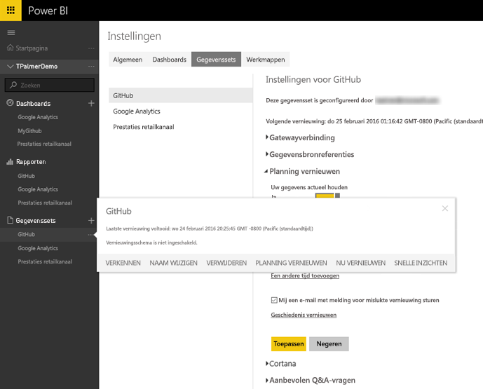
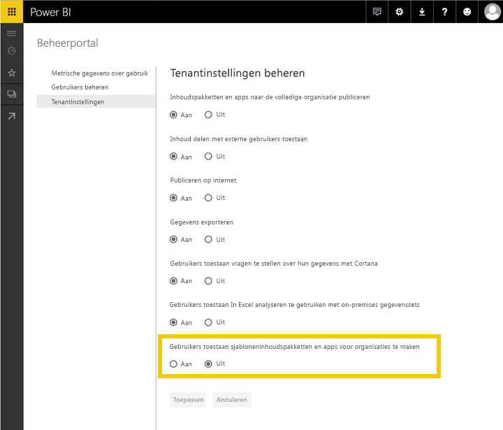
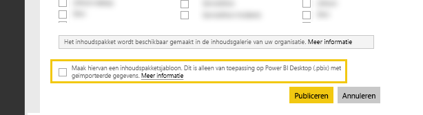
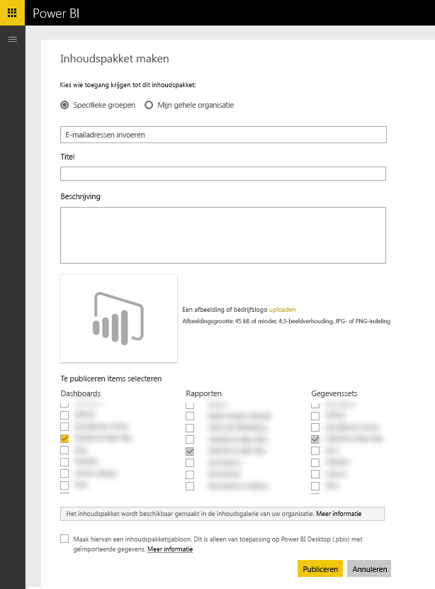

# Sjablooninhoudspakketten testen voor Power BI
U kunt uw inhoudspakket op meerdere manieren testen voordat u het verzendt voor publicatie.  

> [!NOTE]
> Als uw inhoudspakket gebruikmaakt van een aangepaste [gegevensconnector](https://aka.ms/DataConnectors) die u hebt ontwikkeld, kunt u het vernieuwen van de gegevens of het sjablooninhoudspakket niet testen op de manier die hieronder wordt beschreven. Ga als dat het geval is verder met het [verzenden](#submission) van uw inhoudspakket. Het Power BI-team zal dan samen met u uw inhoudspakket testen.
> 
> 

## Planning van gegevens vernieuwen testen
Sjablooninhoudspakketten testen maken gebruik van de functie Vernieuwen in PowerBI.com om een inhoudspakket met de gegevens van de klant te maken wanneer deze verbinding maakt. Voordat het inhoudspakket openbaar beschikbaar komt, kunt u deze stroom testen met het bureaubladbestand dat u hebt gemaakt.

Selecteer nadat u het bestand hebt geüpload de "…" naast de gegevensset en selecteer Planning vernieuwen. Configureer referenties voor de bron. Controleer of uw gegevensset wordt vernieuwd. Probeer zowel "Nu vernieuwen" als "Geplande vernieuwing". Als er tijdens het vernieuwen fouten optreden, controleert u het foutbericht en valideert u uw query‘s en uw eindsysteem.

### Aanvullende tips voor vernieuwen
* Er mag maar één gegevensbron worden gedetecteerd wanneer u het vernieuwen plant  
* De testverbinding moet aangeven dat uw gebruiker het inhoudspakket kan laden. Als dat niet het geval is, moet u controleren of uw query‘s de aanvullende fouten kunnen afhandelen.  
* Het vernieuwen moet binnen een redelijke tijd worden uitgevoerd, in circa 5 minuten  

## Sjablonen testen
Een sjablooninhoudspakket is vergelijkbaar met bestaande oplossingen, met als uitzondering dat deze de daadwerkelijke gegevens in de gegevensset niet omvat. In plaats daarvan wordt een gebruiker wanneer deze een sjabloon gebruikt of opent gevraagd om parameters en referenties om verbinding te kunnen maken. Als de gebruiker verbinding heeft, ziet deze zijn gegevens in het dashboard, rapport en gegevenssets. 

Nadat een gebruiker het inhoudspakket heeft geïnstantieerd, heeft deze toegang tot de gegevenssetinstellingen met inbegrip van de geplande vernieuwing; RLS instellingen in de gegevensset worden **niet** gepubliceerd met het inhoudspakket.  

> [!NOTE]
> Sjablooninhoudspakketten kunnen maar 1 dashboard, 1 rapport en 1 gegevensset bevatten. Zie de lijst met beperkingen op de [ontwerp](template-content-pack-authoring.md#restrictions)pagina. 
> 
> 

Als u het maken van sjablonen wilt inschakelen voor uw tenant, neemt u contact op met uw Power BI-beheerder om de onderstaande functieschakeloptie in te schakelen. 

Als deze functie is ingeschakeld, ziet u een selectievakje onder aan ['Inhoudspakket maken'](https://app.powerbi.com/groups/me/publish-content/), zodat u een sjablooninhoudspakket voor uw organisatie kunt publiceren. 

### Naamgeving
Het is raadzaam om uw dashboard, rapport en gegevensset overal in uw inhoudspakket een consistente naam te geven. Deze namen zijn vastgelegd en zijn hetzelfde voor alle gebruikers. Het gebruik van de naam van uw product/scenario maakt deze gemakkelijker vindbaar voor uw klanten.

### Aanvullende tips voor sjablonen
* Zorg ervoor dat de parameters die u hebt opgegeven in de query's relevant zijn voor uw eindgebruikers
* Houd rekening met hoe lang de eindgebruiker moet wachten tot de geplande vernieuwing is voltooid

## Verzending
Met het verzendingsproces via [Microsoft AppSource](https://appsource.microsoft.com/en-us/partners/list-an-app) kunt u uw sjablooninhoudspakket publiceren in de galerie met service-inhoudspakketten op PowerBI.com, en uw inhoudspakket vermelden in [Microsoft AppSource ](http://appsource.microsoft.com).

### Voorafgaand aan verzending
* Bekijk de ontwerptips voor elk van de artefacten binnen het inhoudspakket
* Test en maak verbinding met verschillende accounts en gegevensomstandigheden. (Sla deze stap over als u uw eigen aangepaste [gegevensconnector](https://aka.ms/DataConnectors) hebt ontwikkeld)
* Bekijk alle visuele elementen, zoek zorgvuldig naar verkeerd gespelde items
* Zorg ervoor dat het inhoudspakket goed reageert op V&A. Het is raadzaam ten minste 30 uiteenlopende vragen in het gegevensmodel te testen. (Sla deze stap over als u uw eigen aangepaste [gegevensconnector](https://aka.ms/DataConnectors) hebt ontwikkeld)

### Verzending
Zodra u klaar bent voor verzending, gaat u naar de [apps-verzendpagina](https://appsource.microsoft.com/en-us/partners/list-an-app) op AppSource en verzendt u uw gegevens. Zorg ervoor dat u Power BI selecteert in de lijst met beschikbare producten

Het Power BI-team controleert uw inzending en neemt contact met u op om te controleren of alle artefacten voldoen aan de vereisten voor inzending. Er wordt gecontroleerd of het verstrekte dashboard en de verstrekte rapporten zijn voltooid en ook wordt de kwaliteit ervan gevalideerd om ervoor te zorgen dat ze voldoen aan het bedrijfsscenario dat wordt beschreven in de toepassing.

### Updates
Voor het bijwerken van uw inhoudspakket wordt een proces gebruikt dat soortgelijk is aan de eerste inzending. 

