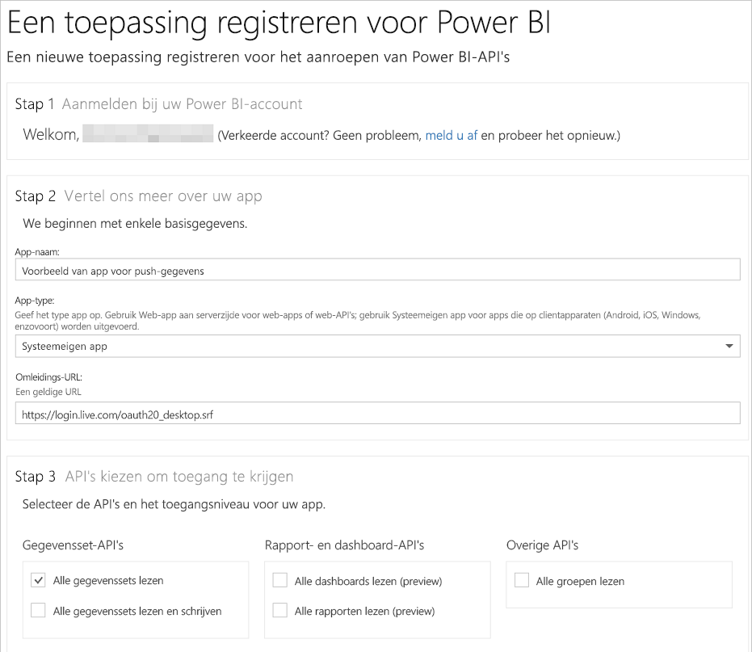

# Stap 1: Een app bij Azure AD registreren
Dit artikel maakt deel uit van een stapsgewijze uitleg van hoe u [gegevens naar een gegevensset pusht](walkthrough-push-data.md).

De eerste stap bij het pushen van gegevens in een Power BI-gegevensset bestaat uit het registreren van uw app in Azure AD. U moet dit eerst doen zodat u een **client-id** hebt waarmee uw app in Azure AD kan worden geïdentificeerd. Zonder een **client-id** kan uw app niet worden geverifieerd in Azure AD.

> **OPMERKING**: voordat u een app registreert voor Power BI, moet u zich [registreren bij Power BI](create-an-azure-active-directory-tenant.md).
> 
> 

Hier volgen de stappen om een app bij Azure AD te registreren.

## Een app bij Azure AD registreren
1. Ga naar dev.powerbi.com/apps.
2. Klik op **Aanmelden met uw bestaande account** en meld u aan bij uw Power BI-account.
3. Voer een **app-naam** in, zoals 'App met voorbeeldgegevens voor pushen'.
4. Kies voor **App-type** de optie **Systeemeigen app**.
5. Voer een **omleidings-URL** in, bijvoorbeeld **https://login.live.com/oauth20_desktop.srf**. Voor een **systeemeigen client-app** geeft **Azure AD** bij een omleidings-URI meer details over de specifieke toepassing die wordt geverifieerd. De standaard-URI voor een client-app is https://login.live.com/oauth20_desktop.srf.
6. Kies voor **Choose APIs to access** de optie **Alle gegevenssets lezen en schrijven**. Zie [Power BI Permissions](power-bi-permissions.md) (Machtigingen voor Power BI) voor alle app-machtigingen voor Power BI.
7. Klik op **App registreren** en sla de **client-ID** op die is gegenereerd. Een **client-ID** identificeert de app in Azure AD.

Hier ziet u hoe uw pagina **Register an Application for Power BI** eruit moet zien:

In de volgende stap ziet u hoe u [een toegangstoken voor verificatie kunt verkrijgen](walkthrough-push-data-get-token.md).

[Volgende stap >](walkthrough-push-data-get-token.md)

## Volgende stappen
[Sign up for Power BI](create-an-azure-active-directory-tenant.md) (Aanmelden voor Power BI)  
[Get an authentication access token](walkthrough-push-data-get-token.md) (Een verificatietoegangstoken ophalen)  
[Overzicht: gegevens in een gegevensset pushen](walkthrough-push-data.md)  
[Register an application](register-app.md) (Een toepassing registreren)  
[Overview of Power BI REST API](overview-of-power-bi-rest-api.md) (Overzicht van de REST-API voor Power BI)  

Hebt u nog vragen? [Misschien dat de Power BI-community het antwoord weet](http://community.powerbi.com/)

