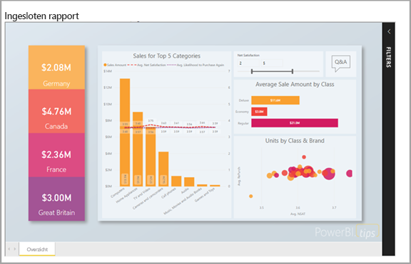
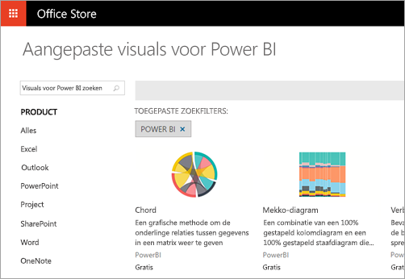
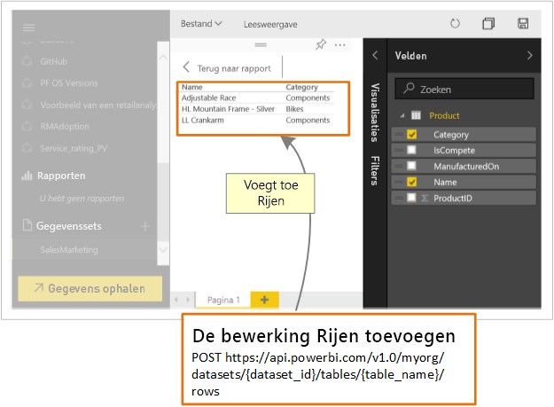

# Wat kunnen ontwikkelaars doen met Power BI?

Ontwikkelaars hebben verschillende mogelijkheden om Power BI-inhoud in toepassingen op te nemen. Als ontwikkelaar kunt u via deze opties **inhoud insluiten met Power BI**, **aangepaste visuals opnemen** en **gegevens pushen naar Power BI**.

## Power BI-inhoud insluiten

De Power BI-service (SaaS) en de Power BI Embedded-service in Azure (PaaS) bevatten API's voor het insluiten van uw dashboards en rapporten. Deze functie houdt in dat u toegang hebt tot de nieuwste functies van Power BI (zoals dashboards, gateways en app-werkruimten) voor het insluiten van uw inhoud.

U kunt het [installatieprogramma voor insluiten](https://aka.ms/embedsetup) uitvoeren om snel aan de slag te gaan en een voorbeeldtoepassing te downloaden.

Kies de oplossing die het beste bij u past:

* [Door inhoud voor uw klanten in te sluiten](embedding.md#embedding-for-your-customers) kunt u dashboards en rapporten insluiten voor gebruikers die geen account voor Power BI hebben. Voer de oplossing [Insluiten voor uw klanten](https://aka.ms/embedsetup/AppOwnsData) uit.

* [Met het insluiten van inhoud voor uw organisatie](embedding.md#embedding-for-your-organization) kunt u Power BI-service uitbreiden. Voer de oplossing [Insluiten voor uw organisatie](https://aka.ms/embedsetup/UserOwnsData) uit.

Zie voor meer informatie over het insluiten met Power BI [Insluiten met Power BI](embedding.md).

## Aangepaste visuals ontwikkelen

U kunt aangepaste visuals gebruiken in Power BI om een uniek soort visual te maken die op u of uw bedrijf is aangepast. Deze aangepaste visuals worden vaak door ontwikkelaars gemaakt. Ze worden gemaakt wanneer het grote aantal visuals dat is opgenomen in Power BI niet helemaal aan uw behoeften voldoet.

Met aangepaste visuele elementen kunt u visuele elementen maken voor gebruik in Power BI-rapporten. Aangepaste visuals zijn geschreven in TypeScript, een hoofdverzameling van JavaScript. TypeScript biedt ondersteuning voor bepaalde geavanceerde functies en vroege toegang tot de ES6/ES7-functionaliteit. De stijl van visuele elementen wordt afgehandeld met behulp van Cascading Styles Sheets (CSS). Voor uw gemak gebruiken we de Less-precompiler die enkele geavanceerde functies ondersteunt, zoals nesten, variabelen, voorwaarden, lussen en andere functies. Als u geen van deze functies wilt gebruiken, kunt u gewone CSS gebruiken in het Less-bestand.

Zie [Een aangepaste visual voor Power BI ontwikkelen](custom-visual-develop-tutorial.md) voor meer informatie over het ontwikkelen van aangepaste visuals.

## API-automatisering gebruiken

Power BI geeft dashboards weer die interactief zijn en in realtime kunnen worden gemaakt en bijgewerkt via vele verschillende gegevensbronnen. Met behulp van elke programmeertaal die REST-aanroepen ondersteunt, kunt u apps maken die in realtime met een Power BI-dashboard kunnen worden geïntegreerd. U kunt ook Power BI-tegels en -rapporten integreren met apps.

Ontwikkelaars kunnen ook hun eigen gegevensvisualisaties bouwen die in interactieve rapporten en dashboards kunnen worden gebruikt.

Zie [Wat kunnen ontwikkelaars doen met de Power BI-API?](overview-of-power-bi-rest-api.md) om te bekijken wat u zoals kunt doen met de Power BI-API's.

## Volgende stappen

[Insluiten met Power BI](embedding.md)  

[Een aangepaste visual voor Power BI ontwikkelen](https://microsoft.github.io/PowerBI-visuals/docs/step-by-step-lab/developing-a-power-bi-custom-visual/)

[Wat kunnen ontwikkelaars doen met de Power BI-API?](overview-of-power-bi-rest-api.md)

[Power BI-ontwikkelaarscentrum](https://powerbi.microsoft.com/developers/)