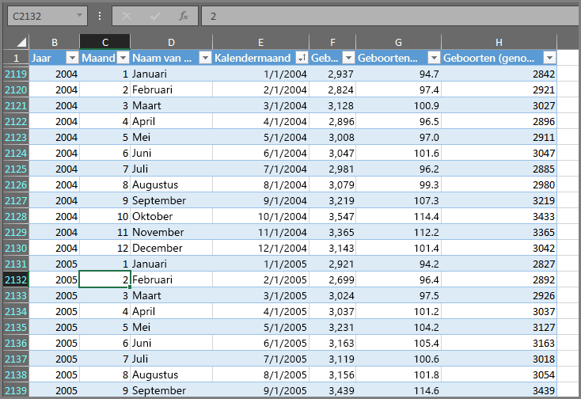
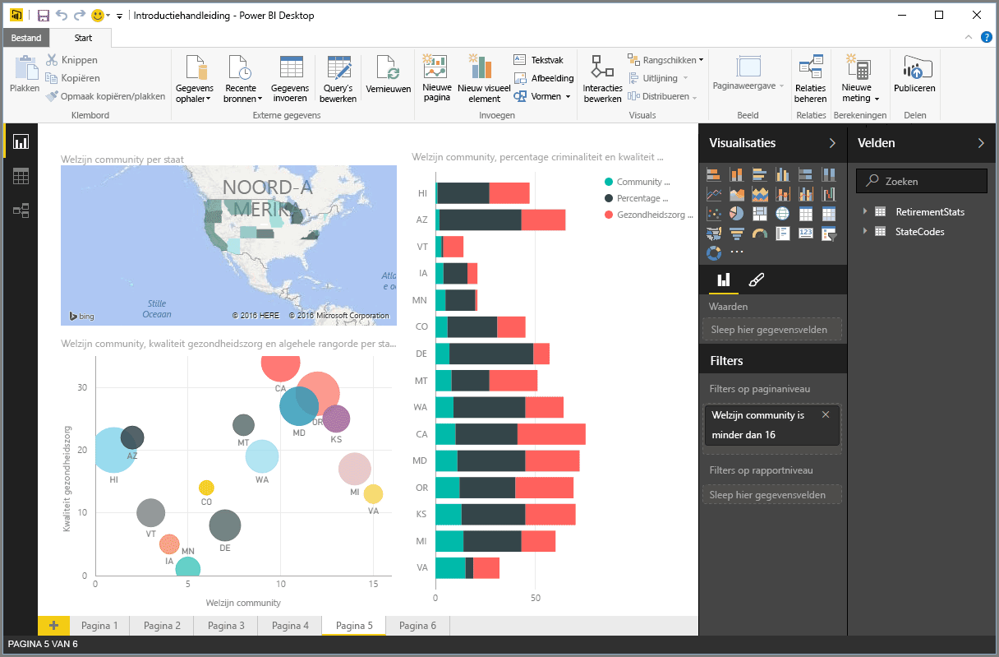
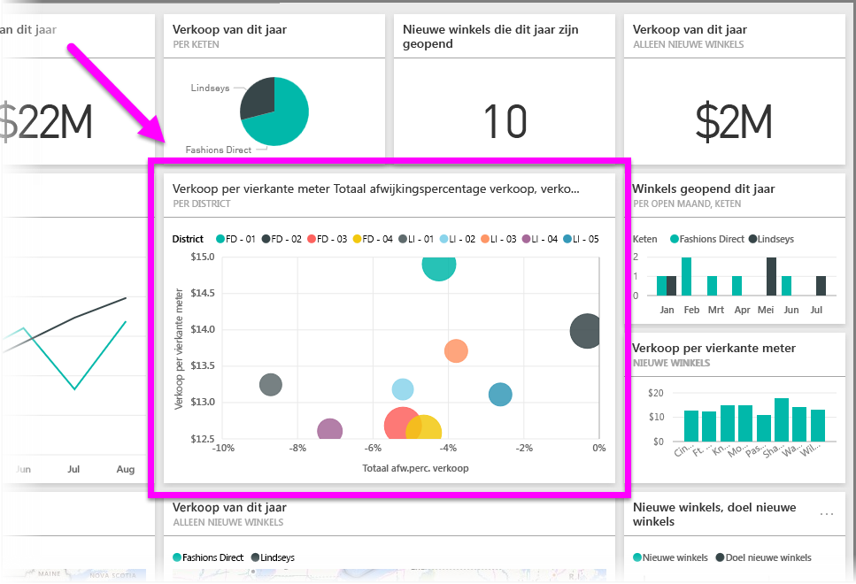

Alles wat u met Power BI kunt doen, bestaat uit een aantal **bouwstenen**. Zodra u deze bouwstenen begrijpt, kunt u hiermee verder aan de slag en vervolgens uitgebreide en complexe rapporten maken. Zelfs schijnbaar complexe elementen zijn opgebouwd uit basisbouwstenen, net zoals gebouwen zijn gemaakt van hout, staal, beton en glas, en auto's bestaan uit metaal, textiel en rubber. Gebouwen en auto's kunnen een basisontwerp of een zeer uitgebreid ontwerp hebben, afhankelijk van de manier waarop de bouwstenen zijn geordend.

In deze sectie worden de bouwstenen nader bekeken, een aantal eenvoudige zaken besproken die met deze bouwstenen kunnen worden gemaakt en ziet u hoe u hiermee ook complexere zaken kunnen maken.

Power BI bevat de volgende bouwstenen:

* Visualisaties
* Gegevenssets
* Rapporten
* Dashboards
* Tegels

## Visualisaties
Een **visualisatie** (ook wel **visueel element** genoemd) is een visuele representatie van gegevens, zoals een diagram, een grafiek, een kaart met kleurcode of een andere interessante manier waarop u uw gegevens visueel kunt weergeven. Power BI heeft verschillende visualisatietypen en deze worden in latere versies verder uitgebreid. In de volgende afbeelding ziet u een verzameling van verschillende visualisaties die zijn gemaakt met de Power BI-service.

Visualisaties kunnen eenvoudig zijn, zoals een enkel getal dat staat voor iets significants, of visueel complex, zoals een kleurovergang in een kaart die het gevoel van kiezers laat zien over een sociaal probleem of kwestie. Het doel van een visualisatie is om gegevens te presenteren met context en inzichten, die waarschijnlijk moeilijk te onderscheiden zijn in een tabel met onbewerkte getallen of tekst.

## Gegevenssets
Een **gegevensset** is een verzameling gegevens die in Power BI wordt gebruikt om visualisaties te maken.

U kunt een eenvoudige gegevensset hebben op basis van één tabel in een Excel-werkmap, zoals in de volgende afbeelding.

**Gegevenssets** kunnen ook een combinatie van veel verschillende bronnen zijn die u kunt filteren en combineren om zo een unieke gegevensverzameling (een gegevensset) te maken die u in Power BI kunt gebruiken.

U kunt bijvoorbeeld een gegevensset maken van drie verschillende databasevelden, een tabel op een website, een Excel-tabel en online resultaten van een e-marketingcampagne. Deze unieke combinatie wordt beschouwd als een afzonderlijke **gegevensset**, ook al bestaat deze uit veel verschillende bronnen.

Als u gegevens filters voordat u deze in Power BI gebruikt, kunt u zich richten op de gegevens die voor u het belangrijkst zijn. U kunt bijvoorbeeld de database van uw contactpersonen filteren, zodat alleen klanten die e-mails van de marketingcampagne hebben ontvangen zijn opgenomen in de gegevensset. Vervolgens kunt u visualisaties maken op basis van deze subset (de gefilterde verzameling) van klanten die zijn opgenomen in de campagne. Door te filteren kunt u zich richten op speciale gegevens.

Een belangrijk onderdeel van Power BI is het grote aantal gegevens**connectors** dat is opgenomen. Of de gewenste gegevens nu staan in een Excel- of een SQL-database staan, in Azure of Oracle, of in een service als Facebook, Salesforce of MailChimp, Power BI heeft ingebouwde gegevensconnectors waarmee u eenvoudig verbinding met die gegevens kunt maken, deze gegevens eventueel kunt filteren en over kunt brengen naar uw gegevensset.

Zodra u een gegevensset hebt, kunt u visualisaties maken die verschillende gedeelten van de gegevensset op verschillende manieren weergeven, en zo inzichten verkrijgen. En hierbij spelen rapporten een belangrijke rol.

## Rapporten
Een **rapport** is een verzameling visualisaties die samen op een of meer pagina's staan. Net als de rapporten die u voor een verkooppresentatie maakt of de rapporten die u voor een schoolopdracht schrijft, een **rapport** in Power BI is een verzameling van onderdelen die aan elkaar verwant zijn. In de volgende afbeelding ziet u een **rapport** in Power BI Desktop, in dit geval de vijfde pagina in een rapport van zes pagina's. U kunt ook rapporten maken in de Power BI-service.

Aan de hand van rapporten kunt u veel visualisaties maken, eventueel op meerdere verschillende pagina's, en deze geheel naar wens ordenen.

U kunt bijvoorbeeld een rapport maken over de kwartaalomzet, over de groei van producten in een bepaald segment of over de migratiepatronen van ijsberen. Wat het onderwerp ook is, met rapporten kunt u uw visualisaties op een of meer pagina's verzamelen en ordenen.

## Dashboards
Als u klaar bent om een pagina van een rapport of een verzameling visualisaties te delen, maakt u een **dashboard**. Zoals een dashboard in de auto is een **dashboard** in Power BI een verzameling van visualisaties op een enkele pagina die u met anderen kunt delen. Het is vaak een geselecteerde groep visualisaties die snel inzicht biedt in de gegevens van uw presentatie.

Een dashboard moet op één pagina passen. Dit wordt het canvas genoemd (een lege achtergrond in Power BI Desktop of de service, waarop u visualisaties plaatst). U kunt het zien als het canvas dat een artiest gebruikt, een werkruimte waar u interessante en uitdagende visualisaties maakt, combineert en bewerkt.
U kunt dashboards delen met andere gebruikers of groepen, die uw dashboard vervolgens kunnen gebruiken als ze in de Power BI-service of op hun mobiele apparaat werken.

## Tegels
In Power BI is een **tegel** een enkele visualisatie in een rapport of dashboard. Het is het rechthoekige vak dat afzonderlijke visualisatie bevat. In de volgende afbeelding ziet u een tegel (gemarkeerd met een helder vak) die wordt omgeven door andere tegels.

Wanneer u klaar bent met het *maken* van een rapport of dashboard in Power BI, kunt u tegels verplaatsen of schikken op de manier waarop u uw informatie wilt presenteren. U kunt tegels groter maken, de breedte of hoogte aanpassen of combineren met andere tegels op de manier die u wilt.

Wanneer u een dashboard of rapport *weergeeft* of *verbruikt*, dat wil zeggen dat u niet de maker of de eigenaar bent maar dat iemand anders het met u heeft gedeeld, kunt u het formaat van tegels of de weergave ervan niet wijzigen.

## Alles bij elkaar
Dit zijn de basisprincipes ofwel de bouwstenen van Power BI. Laten we alles nog eens kort samenvatten.

Power BI is een verzameling van services, apps en connectors waarmee u verbinding maken met uw gegevens, waar deze zich ook bevinden, uw gegevens indien nodig kunt filteren en vervolgens kunt overbrengen naar Power BI waarin u uitdagende visualisaties kunt maken die u met anderen kunt delen.  

Nu u weet wat de bouwstenen van Power BI zijn, zal het duidelijk zijn dat u *zinvolle* gegevenssets en visueel aantrekkelijke rapporten kunt maken om uw verhaal te vertellen. Deze hoeven niet complex te zijn om uitdagend te zijn.

Soms is het al genoeg om een enkele Excel-tabel te gebruiken in een gegevensset en dit dashboard vervolgens met uw team te delen. Dit kan al een waardevolle manier zijn om Power BI te gebruiken.

U kunt ook realtime Azure SQL Data Warehouse-tabellen combineren met andere databases en realtime bronnen en deze vervolgens filteren om een gegevensset te maken waarin het fabricageproces stap voor stap wordt bijgehouden. Ook in dit geval is Power BI de tool bij uitstek.

Het proces is in beide gevallen hetzelfde: er wordt een gegevensset gemaakt die wordt weergegeven in uitdagende visualisaties, die vervolgens met anderen worden gedeeld. Het resultaat is in beide gevallen ook hetzelfde: een alsmaar groeiende reeks gegevens omgezet in nuttige inzichten.

Of voor uw inzichten nou eenvoudige of complexe gegevenssets nodig zijn, met Power BI kunt u snel aan de slag. U kunt uw gegevenssets uitbreiden op de manier die voor u het best werkt, hoe complex uw gegevensverzameling ook is. En omdat Power BI een Microsoft-product is, kunt u erop vertrouwen dat u beschikt over robuuste, uitbreidbare, resultaten die Office-vriendelijk zijn en zijn afgestemd op uw bedrijf.

Laten we eens kijken hoe het werkt. Hier volgt een kort overzicht van de Power BI-service.

