In dit onderwerp ziet u hoe de eerste twee gedeelten van Power BI bij elkaar passen:

* Een rapport maken in **Power BI Desktop**
* Het rapport publiceren in de **Power BI-service**

Selecteer in Power BI **Gegevens ophalen**. U kunt een gegevensbron kiezen uit de verzameling die wordt weergegeven. De volgende afbeelding toont een webpagina die als bron is geselecteerd. In de bovenstaande video wordt een **Excel**-werkmap als bron geselecteerd.

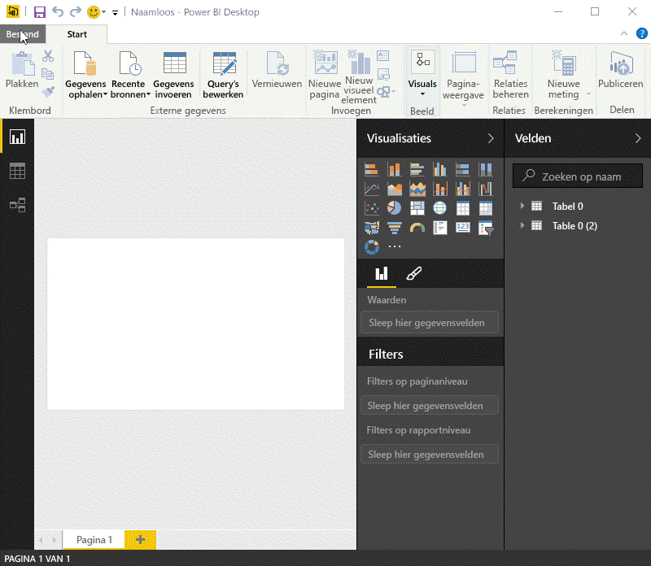

Wat u ook kiest, Power BI maakt verbinding met de gegevensbron en toont de beschikbare gegevens van de bron. De volgende afbeelding is een ander voorbeeld van een webpagina waarop de verschillende statussen en interessante gegevens van pensioenen worden geanalyseerd.

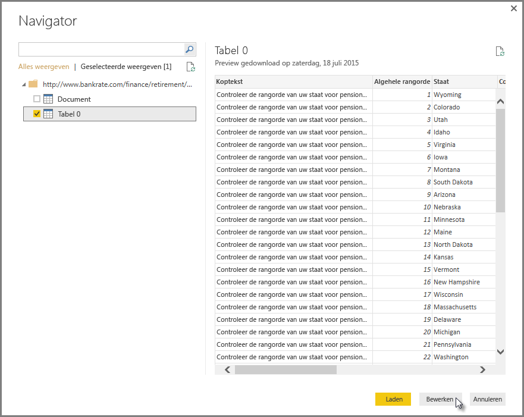

In de weergave **Rapport** van Power BI Desktop kunt u beginnen met het maken van een rapport.

De weergave **Rapport** bevat vijf hoofdgebieden:

1. Het lint, waarop de algemene taken worden weergegeven in verband met rapporten en visualisaties
2. De weergave **Rapport**, of het canvas, waar visualisaties worden gemaakt en gerangschikt
3. Het tabblad **Pagina's** onderaan, waar u een rapportpagina kunt selecteren of toevoegen
4. Het deelvenster **Visualisaties**, waar u visualisaties kunt wijzigen, kleuren of assen kunt aanpassen, filters kunt toepassen, velden heen kunt slepen, en nog veel meer
5. Het deelvenster **Velden**, waarvandaan query-elementen en filters naar de weergave **Rapport** kunnen worden gesleept of naar het gebied **Filters** van het deelvenster **Visualisaties**

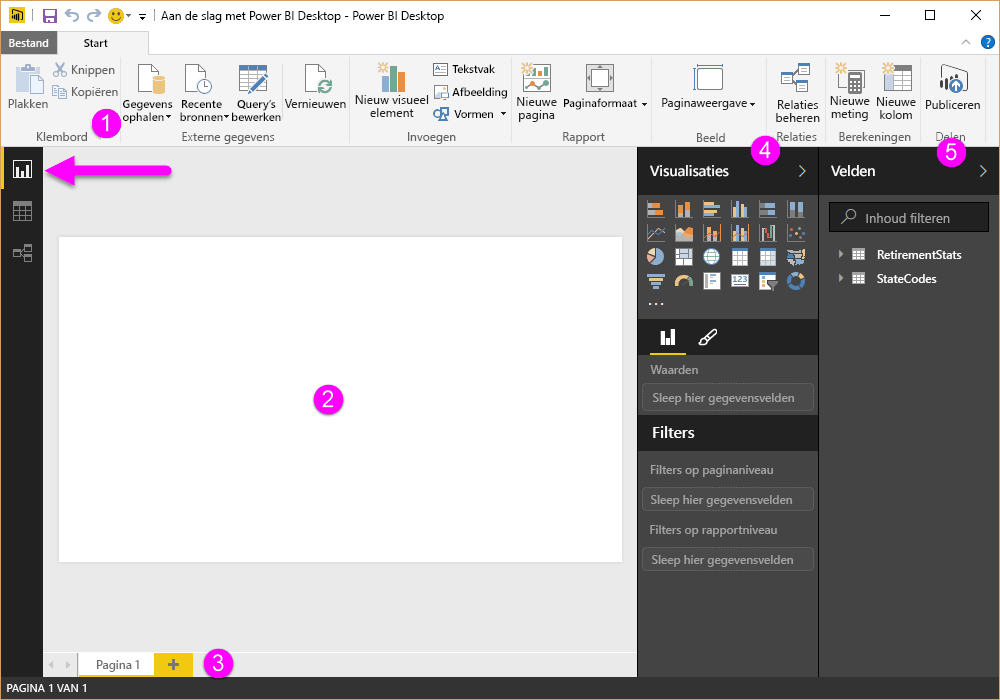

De deelvensters **Visualisaties** en **Velden** kunnen worden samengevouwen met het pijltje langs de rand , zodat u meer ruimte hebt in de weergave**Rapport** voor het bouwen van aantrekkelijke visualisaties. Als u een visualisatie wijzigt, ziet u deze pijlen ook omhoog of omlaag wijzen, wat betekent dat u de betreffende sectie respectievelijk kunt uitvouwen of samenvouwen.

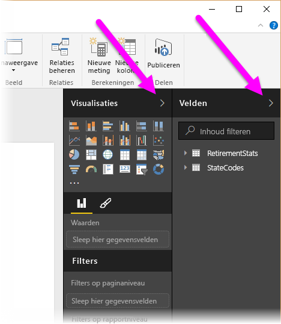

Voor het maken van een visualisatie sleept u een veld uit de lijst **Velden** lijst naar de weergave **Rapport**. In dit geval slepen we het veld Status uit *RetirementStats*.

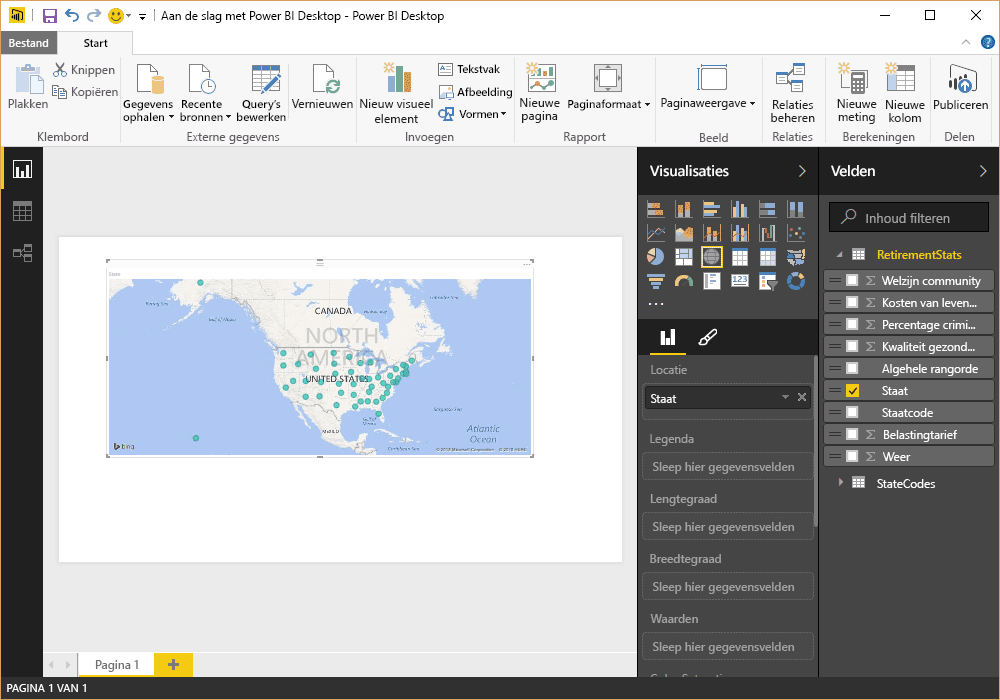

Kijk wat er gebeurt. Power BI Desktop heeft automatisch een visualisatie gemaakt op basis van een kaart doordat het veld Status geolocatiegegevens bevat.

We gaan hier even wat sneller doorheen. Nadat er een rapport met een paar visualisaties is gemaakt, kunt u dit publiceren naar de Power BI-service. Selecteer in Power BI Desktop **Publiceren**op het lint **Start**.

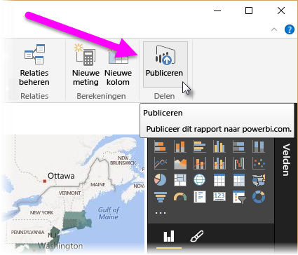

U moet u aanmelden bij Power BI.

Zodra u zich hebt aangemeld en het publiceren is voltooid, ziet u het volgende dialoogvenster. Als u de koppeling selecteert (in het voorbeeld hieronder de koppeling **Success!**), gaat u naar de Power BI-service waar u het rapport kunt zien dat u zojuist hebt gepubliceerd.

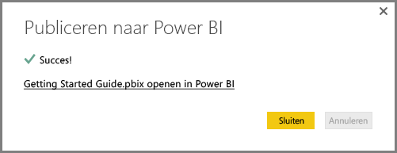

Wanneer u zich aanmeldt bij Power BI, ziet u het Power BI Desktop-bestand dat u zojuist in de service hebt gepubliceerd. In de onderstaande afbeelding wordt het rapport dat in Power BI Desktop is gemaakt weergegeven in sectie **Rapporten**.

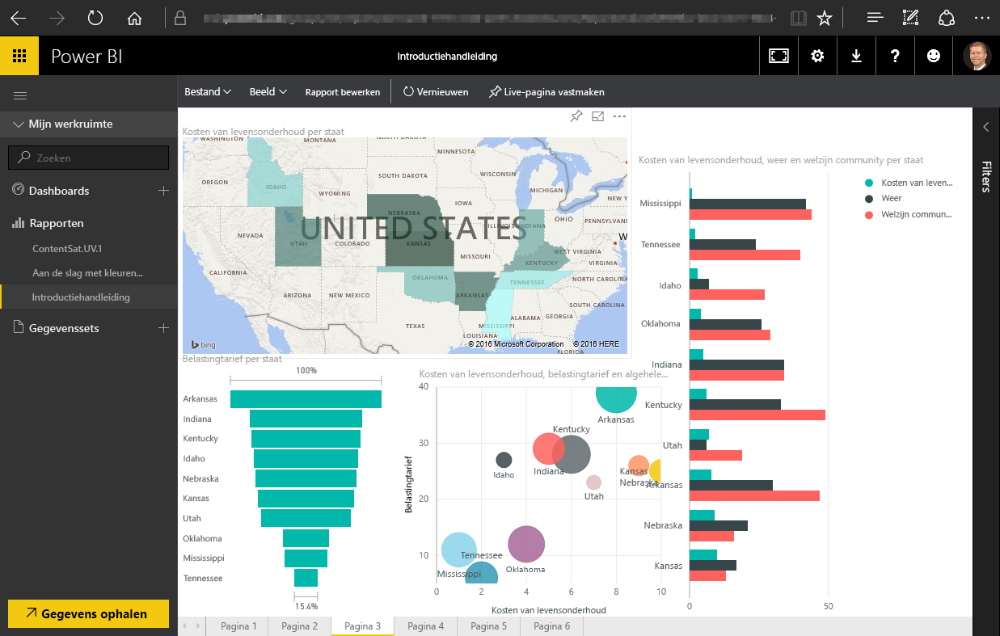

In het rapport kunt u de visualisatie vastmaken aan een dashboard door het **speld**pictogram te selecteren. In de volgende afbeelding is het speldpictogram gemarkeerd met een helder vak en een pijl.

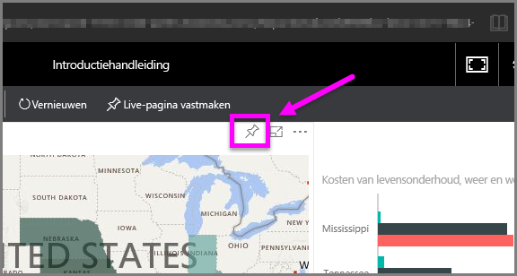

Als u het pictogram selecteert, verschijnt het volgende dialoogvenster waarin u de visualisatie aan een bestaand dashboard kunt vastmaken of een nieuw dashboard kunt maken.

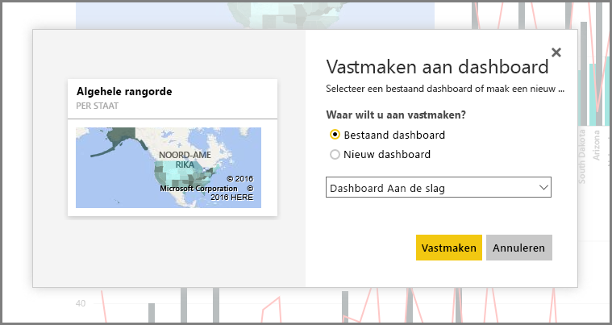

Als u een aantal visualisaties uit uw rapport aan het dashboard hebt vastgemaakt, worden deze in uw dashboard weergegeven.

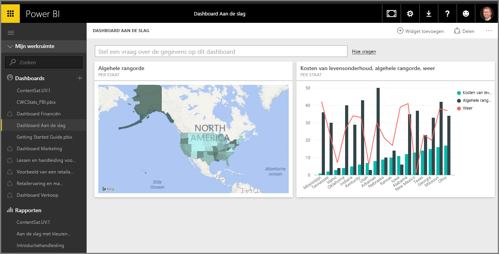

Maar met Power BI kunt u natuurlijk veel meer doen, zoals het delen van de dashboards die u hebt gemaakt. Deze mogelijkheden worden verderop in de cursus besproken.

Laten we hier eens kijken naar een functie waarmee u automatisch dashboards maakt door verbinding te maken met cloudservices als Facebook of Salesforce.

