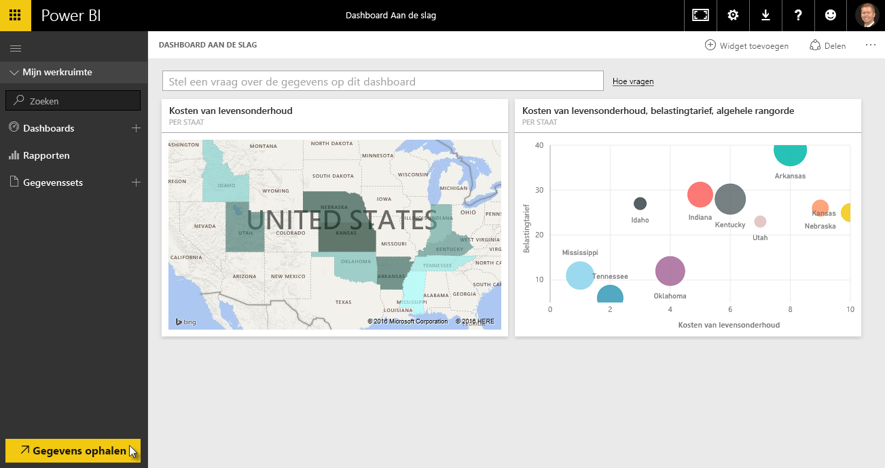
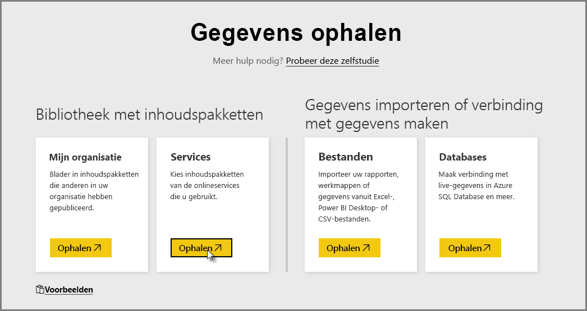
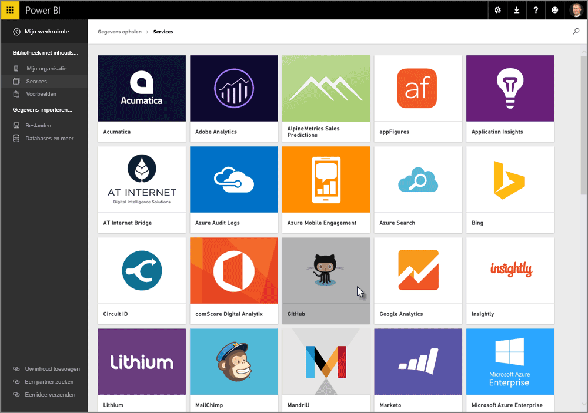
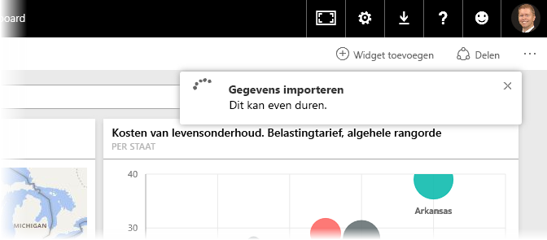
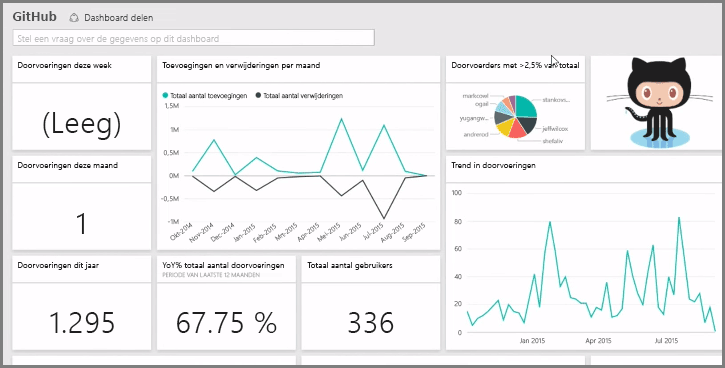
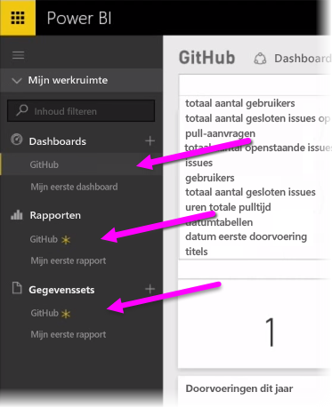
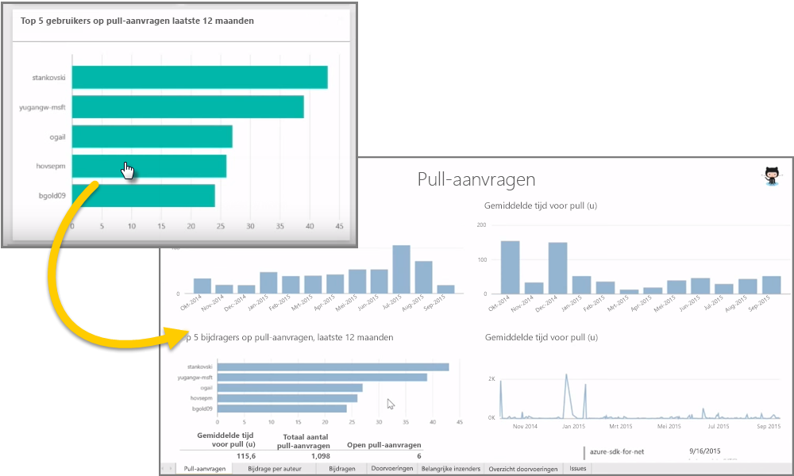
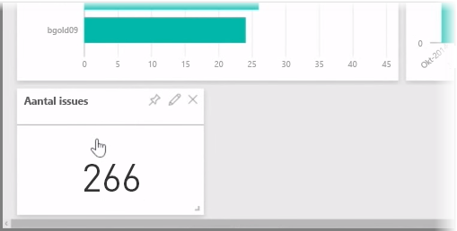
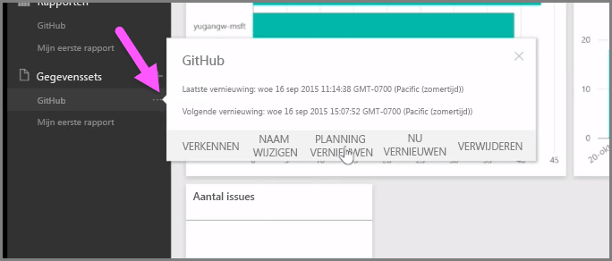

Zoals we hebben geleerd, wordt de volgende algemene werkstroom in Power BI gehanteerd: een rapport maken in Power BI Desktop, het rapport publiceren naar de Power BI-service om het vervolgens te delen met anderen, zodat ze het rapport kunnen weergeven in de service of in een mobiele app.

Aangezien sommige mensen echter in de Power BI-service beginnen, lijkt het een goed idee om hier kort wat aandacht aan te besteden en iets te vertellen over *inhoudspakketten*, een snelle en populaire manier om visuals in Power BI te maken.

Een **inhoudspakket** is een verzameling vooraf geconfigureerde, kant-en-klare visuals en rapporten die zij gebaseerd op specifieke gegevensbronnen, zoals Salesforce. Het gebruik van een inhoudspakket is vergelijkbaar met het bereiden van een magnetronmaaltijd of het bestellen van een fastfoodgerecht: in een paar klikken en opmerkingen, wordt u snel een verzameling items gepresenteerd die goed bij elkaar passen, keurig verpakt in een gebruiksklaar pakket.

Laten we daarom kort wat aandacht besteden aan inhoudspakketten, de service en hoe het werkt. Meer informatie over inhoudspakketten (en de service) volgt in een latere sectie. Beschouw dit maar als een voorproefje om u een indruk te geven.

## Gebruiksklare dashboards maken met cloudservices
Met Power BI kunt u eenvoudig verbinding maken met gegevens. U selecteert in de Power BI-service eenvoudigweg de knop **Gegevens ophalen** in de linkerbenedenhoek van het startscherm.

Op het *canvas* (het gebied in het midden van de Power BI-service) kunt u zien welke gegevensbronnen beschikbaar zijn in de Power BI-service. Naast de algemene gegevensbronnen zoals Excel-bestanden, databases of Azure-gegevens kunt u met Power BI net zo eenvoudig verbinding maken met **softwareservices** (ook wel van SaaS-providers of cloudservices genoemd) zoals Salesforce, Facebook, Google Analytics en diverse andere SaaS-services.

Voor deze softwareservices biedt de **Power BI-service** een verzameling kant-en-klare visuals die vooraf zijn gerangschikt in dashboards en rapporten, zogenaamde **inhoudspakketten**. Inhoudspakketten zorgen ervoor dat u snel met gegevens van de geselecteerde service aan de slag kunt in Power BI. Als u bijvoorbeeld het Salesforce-inhoudspakket gebruikt, maakt Power BI verbinding met uw Salesforce-account (zodra u uw referenties hebt opgegeven). Vervolgens worden in Power BI een vooraf gedefinieerde verzameling van visuals en dashboards ingevuld.

Power BI bevat inhoudspakketten voor diverse soorten services. De volgende afbeelding toont u het eerste scherm met services, in alfabetische volgorde. Dit scherm wordt weergegeven wanneer u **Ophalen** selecteert in het vak **Services** (zoals weergegeven in de vorige afbeelding). Zoals in de onderstaande afbeelding kunt zien, kunt u kiezen uit een groot aantal services.

Wij selecteren in dit geval **GitHub**. GitHub is een toepassing voor online broncodebeheer. Zodra ik de informatie en referenties voor het GitHub-inhoudspakket opgeef, worden mijn gegevens geïmporteerd.

Zodra de gegevens zijn geladen, wordt het vooraf gedefinieerde dashboard met het GitHub-inhoudspakket weergegeven.

Naast het **Dashboard** is het **rapport** beschikbaar dat is gegenereerd (als onderdeel van het GitHub-inhoudspakket) om het dashboard te maken. Ook beschikbaar is de **gegevensset** (de verzameling van gegevens die is opgehaald uit GitHub) die is gemaakt tijdens het importeren van de gegevens en die wordt gebruikt om GitHub-rapport te maken.

Als u op het dashboard op een visual klikt, wordt u automatisch omgeleid naar de **rapportpagina** waarop deze visual is gemaakt. Wanneer er dus op de visual **Top 5 gebruikers op pull-aanvragen** wordt geklikt, wordt de rapportpagina **Pull-aanvragen** (de rapportpagina waar deze visual is gemaakt) in Power BI geopend.

## Vragen stellen over uw gegevens
U kunt ook vragen over uw gegevens stellen. De Power BI-service maakt vervolgens in realtime visuals op basis van uw vraag. In de volgende afbeelding ziet u dat er een visual met een getal in Power BI wordt gemaakt waarmee het aantal afgehandelde problemen wordt aangegeven op basis van wat er in de balk voor **query's in natuurlijke taal** is getypt.

Wanneer u tevreden bent over een visual, kunt u rechts van de balk voor query's in natuurlijke taal het **punaisepictogram** selecteren om de visual vast te maken aan het dashboard. In dit geval wordt de visual vastgemaakt aan het GitHub-dashboard, omdat dat het geselecteerde dashboard is.

## Gegevens vernieuwen in de Power BI-service
U kunt er ook voor kiezen om de gegevensset voor een inhoudspakket, of andere gegevens die u gebruikt in Power BI, te **vernieuwen**. Als u vernieuwingsinstellingen wilt configureren, selecteert u de weglatingstekens (de drie puntjes) naast een gegevensset zodat er een menu wordt weergegeven.

Selecteer onder in het menu de optie **Planning vernieuwen**. Het dialoogvenster Instellingen wordt weergegeven op het canvas, zodat u de vernieuwingsinstellingen kunt opgeven die voldoen aan uw behoeften.

Hier willen we het wat de Power BI-service voor nu bij laten. U kunt nog veel meer dingen met de service doen, maar deze komen later deze cursus aan bod. Onthoud ook dat er tal van verschillende typen gegevens zijn waarmee u verbinding kunt maken kunt, er allerlei soorten inhoudspakketten beschikbaar zijn en er voortdurend nieuwe typen gegevens en inhoudspakketten worden toegevoegd.

Laten we doorgaan met het volgende onderwerp, waarin we een samenvatting van de sectie **Aan de slag** geven en u voorbereiden op wat er komen gaat.

