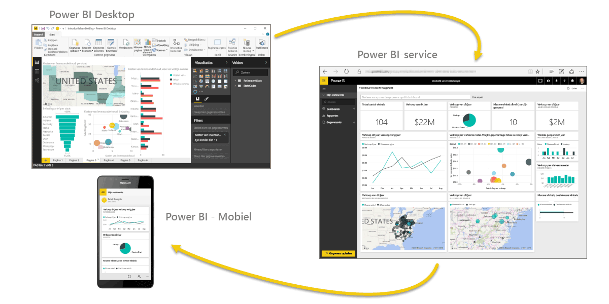

Laten we in het kort terugblikken op wat er in de eerste sectie is behandeld.

**Power BI** bestaat uit een verzameling softwareservices, apps en connectors die samenwerken om gegevens om te zetten in interactieve inzichten. U kunt gegevens uit één eenvoudige bron gebruiken, zoals een Excel-werkmap, of gegevens ophalen uit meerdere databases en cloudbronnen om complexe gegevenssets en rapporten te maken. U kunt het met Power BI zo eenvoudig houden als u wilt of zo complex maken als uw internationaal bedrijf vereist.

Power BI bestaat uit drie elementen: **Power BI Desktop**, de **Power BI-service** en **Power BI - Mobiel**. Deze elementen werken allemaal samen zodat u uw gegevens kunt maken, gebruiken, delen en verkennen zoals u dat wilt.

We hebben ook de basisbouwstenen in Power BI besproken, namelijk:

* **Visualisaties**: een visuele representatie van gegevens, die ook wel een visual wordt genoemd
* **Gegevenssets**: een verzameling gegevens die in Power BI wordt gebruikt om visualisaties te maken
* **Rapporten**: een verzameling visuals uit een gegevensset die een of meer pagina's beslaat
* **Dashboards**: een verzameling visuals van één pagina die is samengesteld op basis van een rapport
* **Tegels**: één visualisatie in een rapport of dashboard

Vervolgens hebben we middels een videorondleiding met onze gids **Will Thompson** een kijkje in Power BI genomen. Will heeft in het kort laten zien hoe u gegevens kunt analyseren en visualiseren met Power BI.

<!---
In **Power BI Desktop**, we connected to a basic Excel file, created visualizations, then published those visualizations to the service. Even if you use Power BI only with your Excel workbooks, you can gain amazing visual insights with those Excel workbooks, and both interact and share it in ways never before possible.
-->
We hebben in slechts een paar klikken een dashboard in de **Power BI-service** gemaakt. Vervolgens hebben we een **Inhoudspakket**, een kant-en-klare verzameling visuals en rapporten, in de Power BI-service gebruikt en verbinding gemaakt met een **softwareservice** om het inhoudspakket te vullen en de gegevens tot leven te brengen.

We hebben ook query's in natuurlijke taal, oftewel **Q&A's**, gebruikt om vragen over de gegevens te stellen, op basis waarvan er visuals in Power BI worden gemaakt. Tot slot hebben we een **vernieuwingsschema** voor onze gegevens opgesteld. Zodoende weten we dat wanneer we terugkeren naar de Power BI-service, de gegevens up-to-date zijn.

## Volgende stappen
**Gefeliciteerd.** U hebt het eerste gedeelte van de cursus **Begeleide training** voor Power BI voltooid. U beschikt nu over een goede basiskennis om door te gaan naar de sectie **Gegevens ophalen**. Dit is de volgende sectie en volgend stap in de logische werkstroom in Power BI.

We hebben het al eens gezegd, maar willen nogmaals onderstrepen dat uw kennis wordt opgebouwd door de algemene werkstroom in Power BI te volgen:

* Gegevens overzetten naar **Power BI Desktop** en een rapport maken.
* **Publish** naar de Power BI-service, waar u nieuwe visualisaties kunt maken of dashboards kunt bouwen
* Uw dashboards meten anderen **delen**, met name mensen die onderweg zijn
* Gedeelde dashboards en rapporten in **Power BI -Mobiel**-apps weergeven en gebruiken

Mogelijk voert u niet alle werkzaamheden zelf uit. Bepaalde mensen bekijken mogelijk alleen dashboards in de service die zijn gemaakt door iemand anders. Dat is prima, maar omdat *u* alle secties van deze cursus doorloopt, *begrijpt* u hoe deze dashboards zijn gemaakt en hoe de verbinding met de gegevens is gemaakt. En misschien besluit u zelfs om er zelf een dashboard te maken.

Tot ziens in de volgende sectie.

