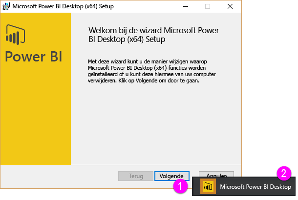

Welkom bij de sectie **Gegevens ophalen**. Dit is de tweede sectie in deze **Begeleide training** voor Power BI. In deze sectie komen de vele gegevensgerichte functies en hulpprogramma's van Power BI aan bod en ligt de focus op Power BI Desktop. Veel van deze hulpprogramma's vindt u ook in de Power BI-service. Door deze sectie te leren, vangt u in feite dus twee vliegen in één klap.

Wanneer u gegevens ophaalt, zijn deze soms niet zo goed opgemaakt, of niet zo *schoon*, als u graag zou willen. In deze sectie leert u daarom hoe u gegevens ophaalt en deze gegevens kunt opruimen (ook wel het *opschonen* of *transformeren* van gegevens genoemd). Daarnaast leert u enkele geavanceerde trucs om het ophalen van gegevens te vergemakkelijken.

Zoals altijd in deze cursus volgt uw leertraject hetzelfde pad als de werkstroom in Power BI. Laten we daarom **Power BI Desktop** eens onder de loep, waar het vaak begint.

## Een overzicht van Power BI Desktop
Power BI Desktop is een hulpprogramma voor de verbinding met en het opschonen en visualiseren van uw gegevens. U kunt met Power BI Desktop verbinding met gegevens maken en de gegevens vervolgens op verschillende manieren modelleren en visualiseren. De meeste gebruikers die aan business intelligence-projecten werken, werken het merendeel van de tijd in Power BI Desktop.

U kunt Power BI Desktop downloaden [via internet](http://go.microsoft.com/fwlink/?LinkID=521662). U kunt **Power BI Desktop** ook installeren als een app vanuit de [ **Windows Store**](http://aka.ms/pbidesktopstore), of u kunt het downloaden via de Power BI-service. Als u **Power BI Desktop** wilt downloaden via de service, selecteert u de pijl omlaag in de rechterbovenhoek van Power BI en selecteert u vervolgens Power BI Desktop.

Power BI Desktop wordt als een toepassing geïnstalleerd op uw Windows-computer.

Zodra u Power BI Desktop hebt gedownload, kunt u deze net als andere toepassing op Windows installeren en uitvoeren. De volgende afbeelding toont u het startscherm Power BI Desktop. Dit scherm wordt weergegeven wanneer u de toepassing start.

U kunt met Power BI Desktop verbinding maken met een groot aantal gegevensbronnen, van on-premises databases en Excel-werkbladen tot cloudservices. Daarnaast kunt u met Power BI Desktop uw gegevens opschonen en opmaken om ze beter bruikbaar te maken. U kun bijvoorbeeld kolommen opsplitsen of een andere naam geven, de gegevenstypen wijzigen en met datums werken. U kunt ook de relaties tussen de kolommen maken, zodat u de gegevens makkelijker kunt modelleren en analyseren.

