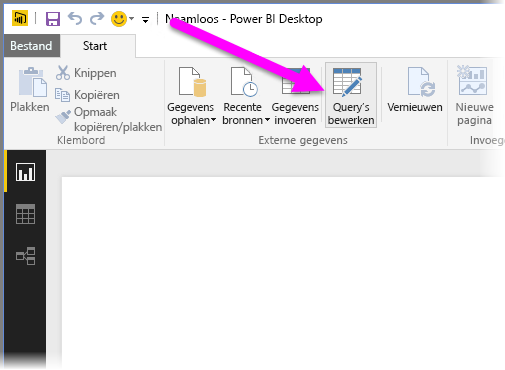
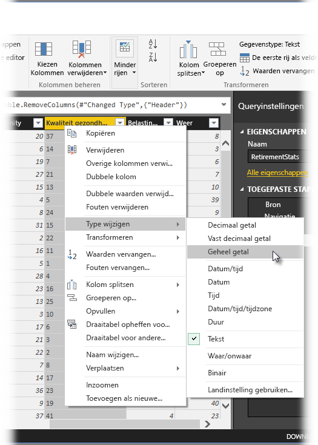
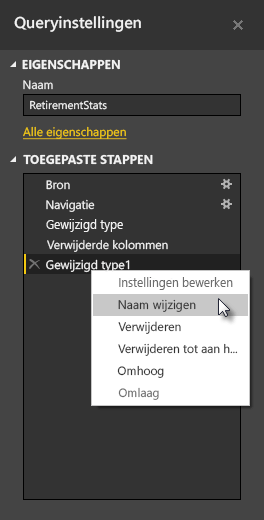
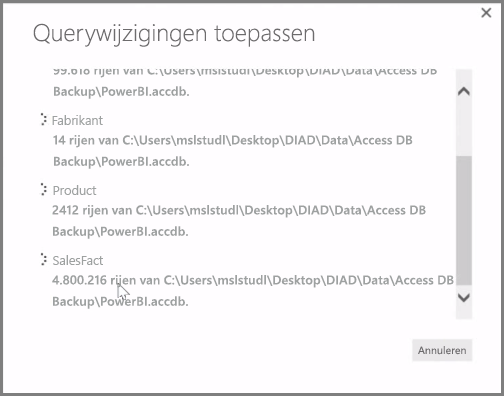

**Power BI Desktop** bevat **Query-Editor**, een krachtig hulpmiddel voor het vormgeven en transformeren van gegevens, zodat deze gereed zijn voor uw modellen en visuele elementen. Wanneer u Bewerken selecteert in de Navigator, wordt Query-Editor gestart en wordt Query-Editor gevuld met de tabellen of andere entiteiten die u hebt geselecteerd in de gegevensbron.

U kunt **Query-Editor** ook rechtstreeks vanuit **Power BI Desktop** starten met behulp van de knop **Query's bewerken** op het lint **Start**.

Zodra de Query-Editor is geladen met gegevens die u kunt gebruiken, ziet u een aantal verschillende secties:

1. In het lint zijn veel knoppen actief om de gegevens in de query te gebruiken
2. In het linkerdeelvenster worden query's (voor elke tabel of entiteit) vermeld en geactiveerd voor selectie, weergave en vormgeving
3. In het middelste deelvenster worden gegevens uit de geselecteerde query weergegeven en geactiveerd voor weergave
4. Het venster Query-instellingen wordt weergegeven, waarin de eigenschappen van de query en de toegepaste stappen worden weergegeven

Als u in het middelste deelvenster met de rechtermuisknop op een kolom klikt, worden een aantal verschillende beschikbare transformaties weergegeven, zoals het verwijderen van de kolom uit de tabel, het dupliceren van de kolom met een nieuwe naam en het vervangen van waarden. In dit menu kunt u ook tekstkolommen in veelvouden splitsen door algemene scheidingstekens.

Het lint **Query-Editor** bevat aanvullende hulpmiddelen, zoals het wijzigen van het gegevenstype van kolommen, het toevoegen van wetenschappelijke notaties of het extraheren van elementen uit datums, zoals de dag van de week.

Als u transformaties toepast, wordt elke stap weergegeven in de lijst **Toegepaste stappen** in het deelvenster **Query-instellingen** aan de rechterkant van **Query-Editor**. U kunt deze lijst gebruiken om bepaalde wijzigingen ongedaan te maken of te bekijken of om de naam van een stap te wijzigen. Als u uw transformaties wilt opslaan, selecteert u **Sluiten en toepassen** op het tabblad **Start**.

Als u **Sluiten en toepassen** selecteert, past Query-Editor de wijzigingen toe die u hebt gemaakt en worden deze toegepast op Power BI Desktop.

Er zijn verschillende dingen die u doen kunt tijdens het omzetten van gegevens in **Query-Editor**, zoals geavanceerde transformaties. In de volgende sectie komen verschillende geavanceerde transformaties aan de orde, zodat u kunt zien hoe u met **Query-Editor** uw gegevens kunt omzetten.

