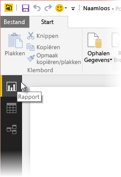
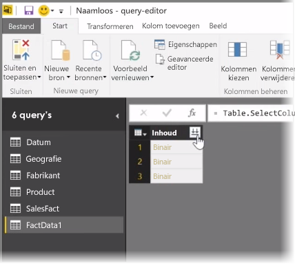
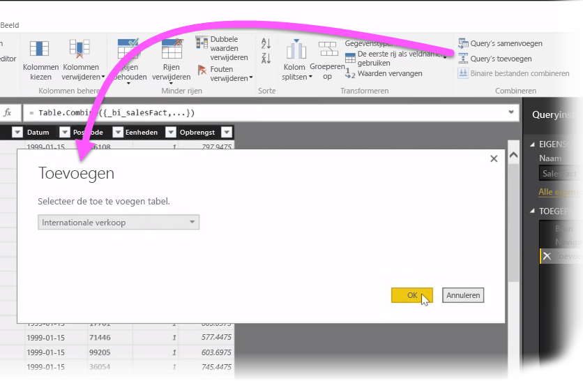
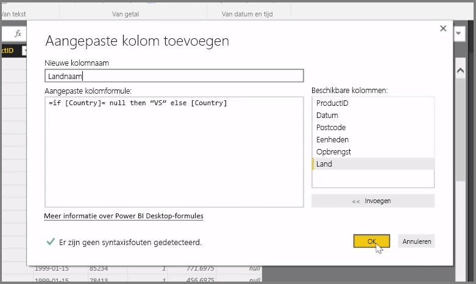

In dit artikel bekijken we een aantal geavanceerde technieken voor het importeren en wissen van gegevens in **Power BI Desktop**. Als u uw gegevens hebt bewerkt in **Query-Editor** en deze vervolgens hebt overgebracht naar **Power BI Desktop**, kunt u deze op verschillende manieren bekijken. Er zijn drie weergaven in Power BI Desktop: de weergave **Rapport**, de weergave **Gegevens** en de weergave **Relaties**. U kunt elke weergave bekijken door het betreffende pictogram te selecteren in de linkerbovenhoek van het canvas. In de volgende afbeelding is de weergave **Rapport** geselecteerd. De gele balk naast het pictogram geeft aan welke weergave actief is.

Als u de weergave wilt wijzigen, selecteert u een van de andere twee pictogrammen. De gele balk naast het pictogram geeft aan welke weergave actief is.

In Power BI Desktop kunt u gegevens uit meerdere bronnen op elk moment tijdens het modelleringsproces combineren. Als u een extra bron aan een bestaand rapport wilt toevoegen, selecteert u **Query's bewerken** in het lint **Start** en selecteert u vervolgens **Nieuwe bron** in **Query-Editor**.

U kunt vele verschillende mogelijke gegevensbronnen gebruiken in **Power BI Desktop**, zoals mappen. Door verbinding te maken met een map, kunt u gegevens uit meerdere bestanden tegelijk importeren, bijvoorbeeld uit een reeks Excel- of CSV-bestanden. De bestanden in de geselecteerde map worden in **Query-Editor** als binaire inhoud weergegeven. Als u klikt op het pictogram met de dubbele pijl boven in de kolom **Inhoud**, worden de waarden geladen.

Een van de handigste hulpmiddelen van Power BI is *Filters*. Als u bijvoorbeeld de pijl-omlaag naast een kolom selecteert, wordt een vervolgkeuzelijst met tekstfilters geopend die u kunt gebruiken om waarden uit het model te verwijderen.

U kunt query's ook samenvoegen en toevoegen en meerdere tabellen (of gegevens uit diverse bestanden in mappen) omzetten in één tabel met alleen de gewenste gegevens. Met **Query's toevoegen** kunt u gegevens uit een nieuwe tabel toevoegen aan een bestaande query. Hierbij wordt de opmaak van de bestaande kolommen in uw query's gebruikt. U kunt deze indien nodig aanpassen in **Query-Editor**.

Ten slotte kunt u met **Aangepaste kolom toevoegen** volledig nieuwe query-expressies maken met de krachtige M-taal. U kunt een aangepaste kolom toevoegen die is gebaseerd op taalinstructies van M-query's en uw gegevens vervolgens naar wens opmaken.

