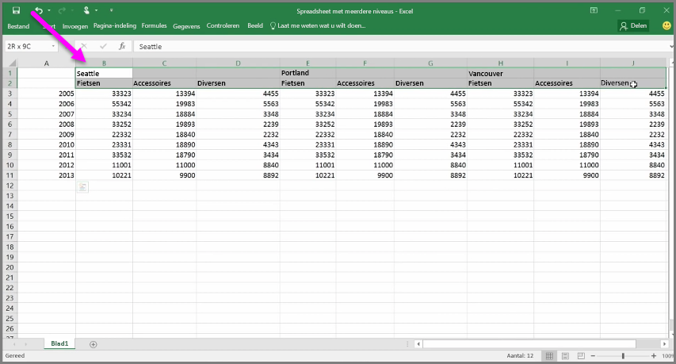
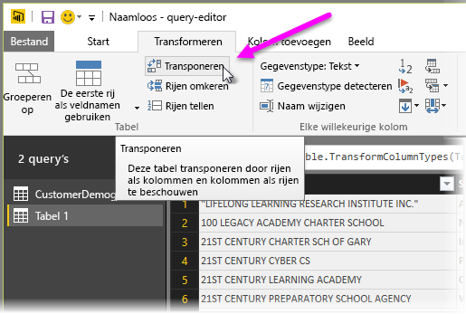
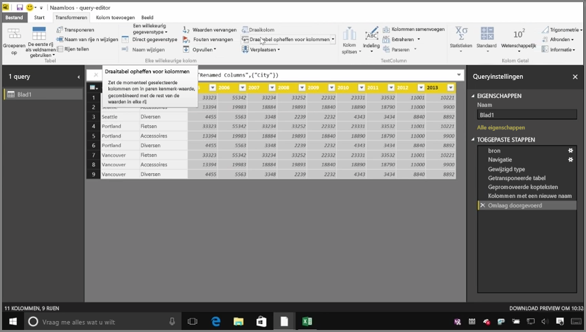
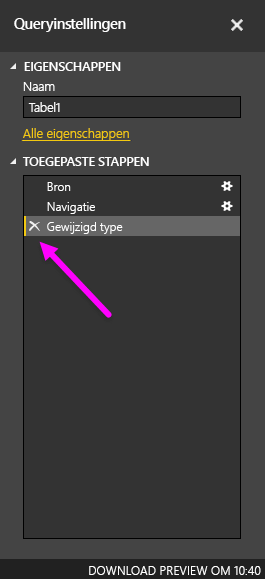
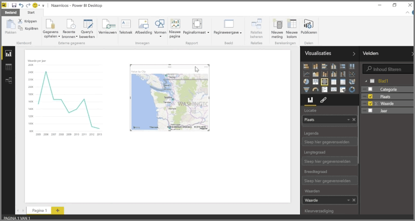

Hoewel u met Power BI gegevens uit bijna elke bron kunt importeren, werken de visualisatie- en modelleringsprogramma het beste met kolomgegevens. Soms worden uw gegevens niet ingedeeld in eenvoudige kolommen. Dit is vaak het geval met Excel-werkbladen, waarbij een tabelindeling die op het eerste oog prima lijkt, niet altijd optimaal is voor geautomatiseerde query's. De volgende spreadsheet bevat bijvoorbeeld kopteksten die meerdere kolommen in beslag nemen.

Gelukkig beschikt in Power BI over hulpprogramma's waarmee u snel kolommen met meerdere tabellen kunt transformeren in bruikbare gegevenssets.

## Gegevens transponeren
Met **Transponeren** in **Query-editor** kunt u gegevens bijvoorbeeld spiegelen (kolommen omzetten in rijen en rijen omzetten in kolommen), zodat u de gegevens kunt uitsplitsen naar indelingen die u kunt bewerken.

Zodra u dit een paar keer hebt gedaan, zoals wordt beschreven in de video, begint uw tabel zich te vormen naar iets waar u in Power BI gemakkelijker mee kunt werken.

## Gegevens opmaken
Ook is het mogelijk dat u gegevens moet opmaken, zodat ze na het importeren goed door Power BI kunnen worden gecategoriseerd en geïdentificeerd.

Met een handvol transformaties, waaronder *het promoveren van rijen naar kopteksten* om kopteksten af te breken, het gebruik van **Opvullen** om *null-waarden* om te zetten in de waarden boven of onder een bepaalde kolom en **Draaitabel opheffen voor kolommen**, kunt u die gegevens opschonen om een gegevensset te maken die kan worden gebruikt in Power BI.

U kunt in Power BI experimenteren met het transformeren van gegevens en zodoende bepalen welke typen transformaties een kolomindeling opleveren waarmee u in Power BI kunt werken. Vergeet bovendien niet dat alle acties die u uitvoert, in Query-editor worden vastgelegd in het gedeelte Toegepaste stappen. Als een transformatie niet het gewenste resultaat oplevert, kunt u gewoon op de **x** naast de stap klikken en de actie ongedaan maken.

## Visuals maken
Zodra uw gegevens, door ze te transformeren en op te schonen, zijn opgemaakt in een indeling die door Power BI kan worden gebruikt, kunt u visuals gaan maken.

## Volgende stappen
**Gefeliciteerd.** U hebt dit gedeelte van de cursus **Begeleide training** voor Power BI voltooid. U weet nu hoe u **gegevens importeert** in Power BI Desktop en hoe u die gegevens kunt *vormgeven* of *transformeren* om aantrekkelijke visuals te maken.

De volgende stap om te leren hoe Power BI werkt en wat Power BI *voor u* kan betekenen, heeft betrekking op het **maken van modellen**. Zoals u hebt geleerd, is een **gegevensset** een van de basisbouwstenen van Power BI, maar bepaalde gegevenssets zijn zeer complex en gebaseerd op tal van verschillende gegevensbronnen. En soms moet u de gegevensset die u maakt, een eigen draai geven (of moet u een eigen *veld* toevoegen).

In de volgende sectie leert u onder andere hoe u **modellen** maakt. Tot ziens in de volgend sectie.

