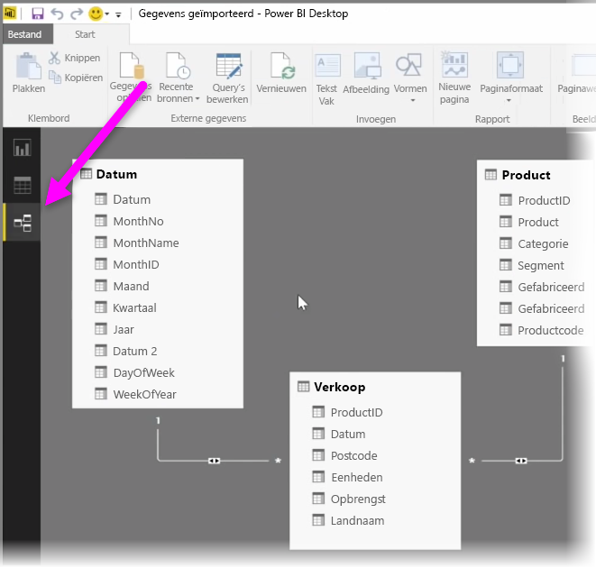
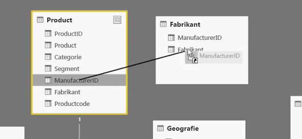
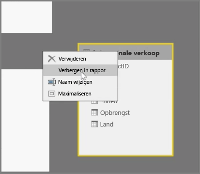
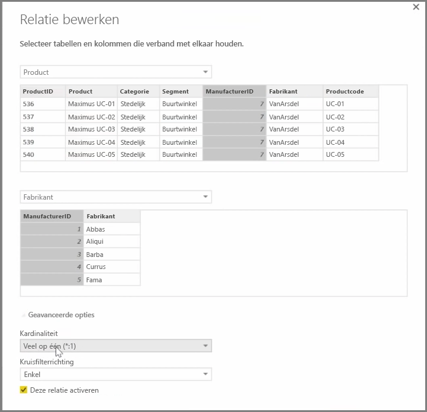

Met Power BI kunt u de relatie tussen tabellen of elementen visueel weergeven. Voor een diagramweergave van uw gegevens gebruikt u de weergave **Relatie** aan de linkerkant kant van het scherm naast het rapportcanvas.

In de weergave **Relatie** ziet u een blok dat elke tabel en de bijbehorende kolommen voorstelt. De regels tussen de blokken zijn de relaties.

U kunt eenvoudig relaties toevoegen en verwijderen. Als u een relatie wilt verwijderen, klikt u met de rechtermuisknop op de relatie en selecteert u vervolgens **Verwijderen**. Als u een relatie wilt maken, sleept u de velden die u wilt koppelen tussen tabellen.

Als u een tabel of een afzonderlijke kolom in uw rapport wilt verbergen, klikt u met de rechtermuisknop op de tabel of kolom in de weergave Relaties en selecteert u vervolgens **Verbergen in rapportweergave**.

Selecteer voor een gedetailleerdere weergave van uw gegevensrelaties **Relaties beheren** in het tabblad **Start**. Hiermee opent u het dialoogvenster **Relaties beheren**, waarin u relaties als een lijst in plaats van een visueel diagram worden weergegeven. Hier kunt u **Automatische detectie** selecteren om relaties in nieuwe of bijgewerkte gegevens te vinden. Selecteer **Bewerken** in het dialoogvenster **Relaties beheren** om uw relaties handmatig te bewerken. Ook vindt u hier geavanceerde opties om de richting van *Kardinaliteit* en *Kruisfilter* van uw relaties in te stellen.

De opties voor Kardinaliteit zijn *Veel op een* en *Een op een*. *Veel op een* is geschikt voor dimensieachtige relaties, zoals een verkooptabel met meerdere rijen per product die is gekoppeld aan een tabel met producten in hun eigen unieke rij. *Een op een* wordt vaak gebruikt voor het koppelen van enkelvoudige vermeldingen in referentietabellen.

Standaard is voor relaties een kruisfilter in beide richtingen ingesteld. Kruisfiltering in slechts één richting beperkt de modelmodelijkheden in een relatie.

Als u nauwkeurige relaties tussen uw gegevens instelt, kunt u complexe berekeningen met meerdere gegevenselementen uitvoeren.

