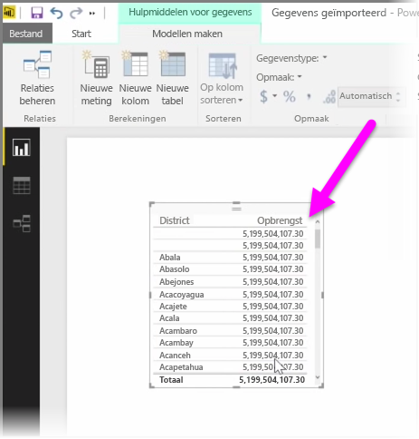
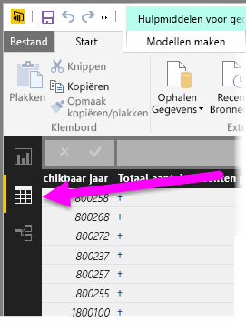
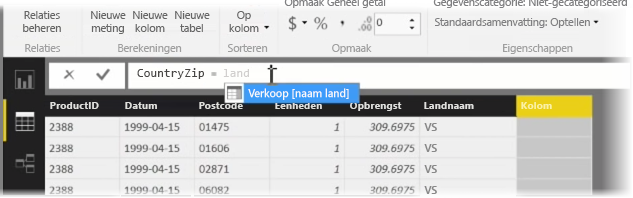
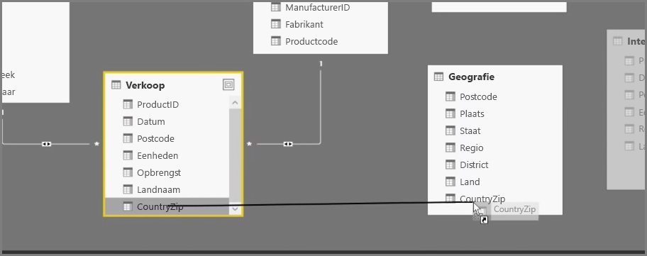
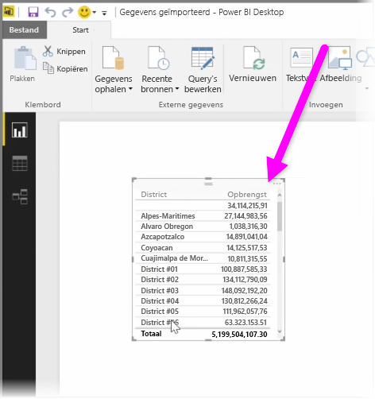

Met berekende kolommen kunt u uw gegevens eenvoudig verbeteren. Een **berekende kolom** is een nieuwe kolom die u maakt door een berekening te doen die twee of meer elementen van bestaande gegevens transformeert of combineert. U kunt bijvoorbeeld een nieuwe kolom maken door twee kolommen in één te combineren.

Een reden voor het maken van een berekende kolom is het tot stand brengen van een relatie tussen tabellen wanneer er geen unieke velden bestaan die kunnen worden gebruikt om een relatie tot stand te brengen. Het ontbreken van een relatie wordt zichtbaar wanneer u een eenvoudige tabelvisualisatie in Power BI Desktop maakt en u dezelfde waarde voor alle vermeldingen hebt, maar u weet dat de onderliggende gegevens verschillen.

Om een relatie met unieke velden van gegevens te maken, kunt u bijvoorbeeld een nieuwe berekende kolom maken voor 'Volledig telefoonnummer' door de waarden van de kolommen voor het netnummer en het lokale nummer te combineren als deze waarden aanwezig zijn in uw gegevens. Met berekende kolommen kunt u snel modellen en visualisaties maken.

Als u een berekende tabel wilt maken, gaat u naar de **Gegevensweergave** in Power BI Desktop aan de linkerkant van het rapportcanvas.

Selecteer in het tabblad Modellering **Nieuwe kolom**. Hiermee schakelt u de formulebalk in waarin u de berekeningen kunt invoeren op basis van de DAX-taal (gegevens Analysis expressies). DAX is een krachtige formuletaal, zoals die in Excel, waarmee u robuuste berekeningen kunt maken. Wanneer u een formule typt, geeft Power BI Desktop overeenkomende formules of gegevenselementen weer waarmee u de formule snel kunt maken.

De formulebalk van Power BI geeft suggesties voor bepaalde DAX-functies en gerelateerde gegevenskolommen weer terwijl u uw expressie invoert.

Zodra u de berekende kolommen in elke tabel hebt gemaakt, kunnen deze worden gebruikt als een unieke sleutel om een relatie tot stand te brengen. In de weergave **Relatie** kunt u vervolgens het veld van de ene naar de andere tabel slepen om een relatie te maken.

In de weergave **Rapport** ziet u nu een andere waarde voor elk district.

Maar met berekende kolommen kunt u nog veel meer dingen doen.

