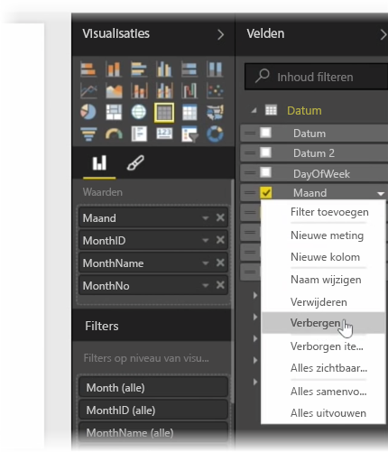
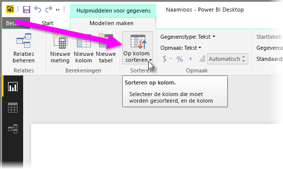
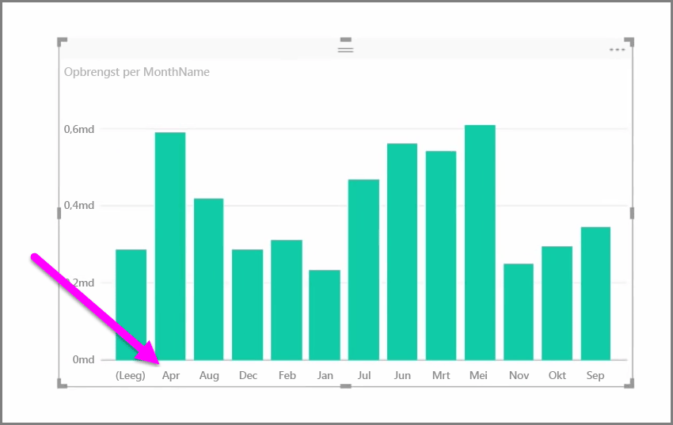
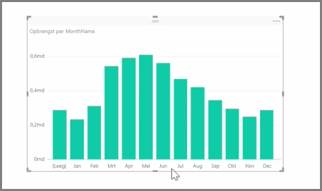

Geïmporteerde gegevens bevatten vaak velden die u niet echt nodig hebt voor rapportage- en visualisatietaken, omdat het bijvoorbeeld extra informatie is of omdat de gegevens al beschikbaar zijn in een andere kolom. Power BI Desktop heeft hulpmiddelen voor het optimaliseren van uw gegevens, zodat deze beter bruikbaar zijn voor uw rapporten en visuele elementen en voor de weergave van gedeelde rapporten.

## Velden verbergen
Als u een kolom in het deelvenster **Velden** van Power BI Desktop wilt verbergen, klikt u met de rechtermuisknop op de kolom en selecteert u **Verbergen**. Uw verborgen kolommen worden niet worden verwijderd. Als u dit veld in bestaande visuele elementen hebt gebruikt, zijn de gegevens nog steeds aanwezig en kunt u de gegevens ook in andere visuele elementen gebruiken. Het verborgen veld wordt alleen niet weergegeven in het deelvenster **Velden**.

Als u tabellen in de weergave **Relaties** weergeeft, worden verborgen velden grijs weergegeven. De gegevens zijn nog steeds aanwezig en onderdeel van het model. Ze worden alleen niet weergegeven. U kunt verborgen velden zichtbaar maken door met de rechtermuisknop op het veld te klikken en **Weergeven** te selecteren.

## Visualisatiegegevens op een ander veld sorteren
Met **Sorteren op kolom** in het tabblad **Modelleren** kunt u ervoor zorgen dat uw gegevens in de gewenste volgorde worden weergegeven.

Bijvoorbeeld, gegevens die de naam van de maand bevatten worden standaard alfabetisch gesorteerd, waardoor 'augustus' vóór 'februari' wordt weergegeven.

Als u het veld in de lijst met velden selecteert, vervolgens **Op kolom sorteren** selecteert in het tabblad **Modelleren** en dan een veld kiest waarop u wilt sorteren, kunt u dit verhelpen. In dit geval worden met de sorteeroptie MonthNo de maanden in de gewenste volgorde geplaatst.

Ook kunt u het gegevenstype voor een veld instellen om gegevens te optimaliseren, zodat deze op de juiste manier worden verwerkt. Als u een gegevenstype op het rapportcanvas wilt wijzigen, selecteert u de kolom in het deelvenster **Velden** en gebruikt u vervolgens de vervolgkeuzelijst **Indeling** om een optie te selecteren. Visuele elementen waarin dat veld wordt weergegeven, worden automatisch bijgewerkt.

