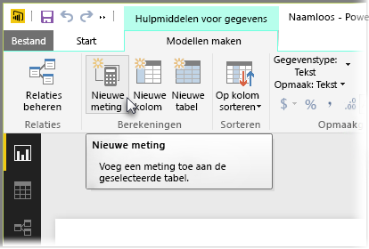
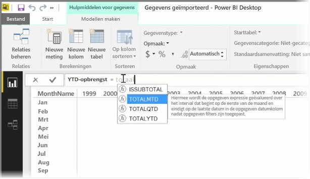
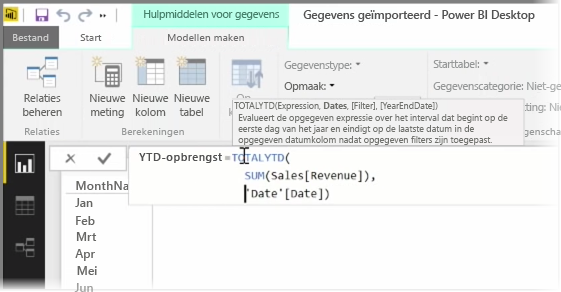
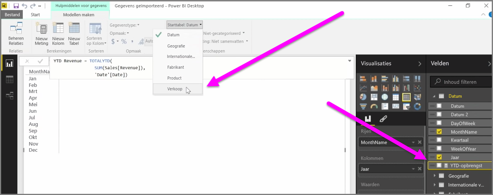

Een *meting* is een berekening in uw Power BI-gegevensmodel. Als u een meting in de weergave **Rapport** wilt maken, selecteert u **Nieuwe meting** op het tabblad **Model maken**.

Het fijne aan DAX, de expressietaal voor gegevensanalyse in Power BI, is dat het is voorzien van tal van handige functies, met name voor berekeningen op basis van tijd, zoals *Jaar tot datum* of *Jaar na jaar*. Met DAX kunt u eenmalig een maateenheid voor de tijd definiëren en in uw gegevensmodel vervolgens zo vaak in andere velden segmenteren als u wilt.

In Power BI wordt een gedefinieerde berekening een *meting* genoemd. Als u een *meting* wilt maken, selecteert u **Nieuwe meting** op het tabblad **Start**. Hiermee opent u de formulebalk waarin u de DAX-expressie kunt invoeren die de meting definieert. Tijdens het typen worden er relevante DAX-functies in Power BI voorgesteld. Wanneer u de berekening invoert, worden er relevante gegevensvelden voorgesteld. Daarnaast wordt er een tooltip weergegeven waarin bepaalde syntaxis en functieparameters worden uitgelegd.

Als de berekening erg lang is, kunt u met **ALT + Enter** extra regeleinden in de expressie-editor toevoegen.

Zodra u een nieuwe meting hebt gedefinieerd, wordt deze weergegeven in een van de tabellen in het deelvenster **Velden** aan de rechterkant van het scherm. De nieuwe meting wordt ingevoegd in de tabel die u op dat moment in Power BI hebt geselecteerd, en hoewel het niet uitmaakt waar de meting zich precies bevindt in uw gegevens, kunt u deze eenvoudig verplaatsen door de meting te selecteren en gebruik te maken van de vervolgkeuzelijst **Starttabel**.

U kunt een meting op dezelfde manier gebruiken als elke andere tabelkolom. U kunt de meting gewoon naar het rapportcanvas of visualisatievelden slepen en daar neerzetten. Metingen kunnen ook naadloos worden geïntegreerd met slicers om in een oogwenk uw gegevens te segmenteren. Dit betekent dat u een gedefinieerde meting kunt gebruiken in verschillende visualisaties.

De DAX-functie **Berekenen** is een krachtige functie waarmee diverse nuttige berekeningen kunt maken. De functie is vooral geschikt voor financiële rapporten en visuals.

