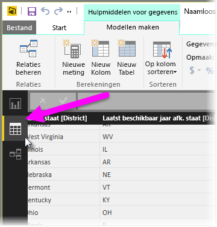
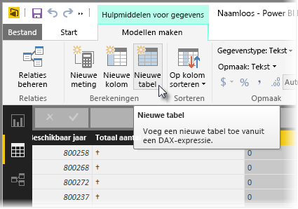
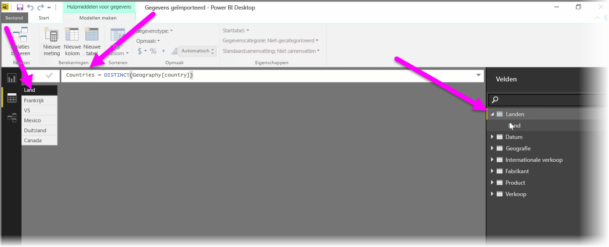

Berekende tabellen zijn een functie binnen DAX waarmee u beschikt over een groot aantal nieuwe mogelijkheden voor modellen. Berekende tabellen zijn bijvoorbeeld handig wanneer u verschillende samenvoegingen wilt of nieuwe tabellen wilt maken op basis van de resultaten van een functionele formule.

Als u een berekende tabel wilt maken, gaat u naar **Gegevensweergave** in Power BI Desktop, dat u aan de linkerkant van het rapportcanvas kunt activeren.

Selecteer **Nieuwe tabel** op het tabblad Modelleren om de formulebalk te openen.

Typ de naam van de nieuwe tabel aan de linkerkant van het gelijkteken en typ de berekening die u wilt gebruiken om de tabel te maken aan de rechterkant. Wanneer u uw berekening hebt voltooid, wordt de nieuwe tabel weergegeven in het deelvenster Velden in het model.

Vervolgens kunt u de berekende tabel op dezelfde manier gebruiken als een tabel voor relaties, formules en rapporten.

