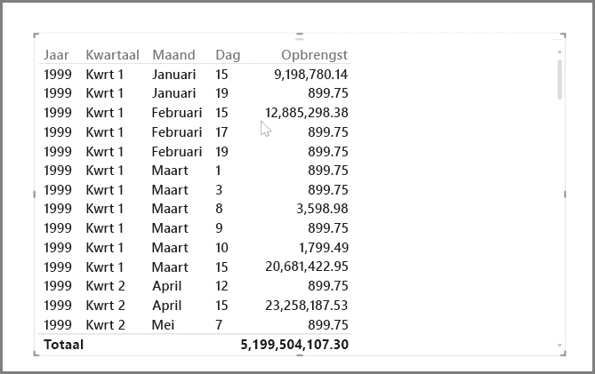
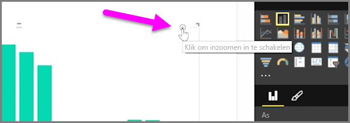
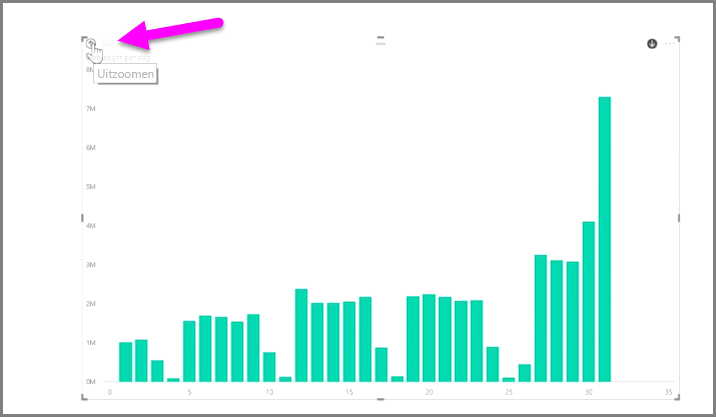
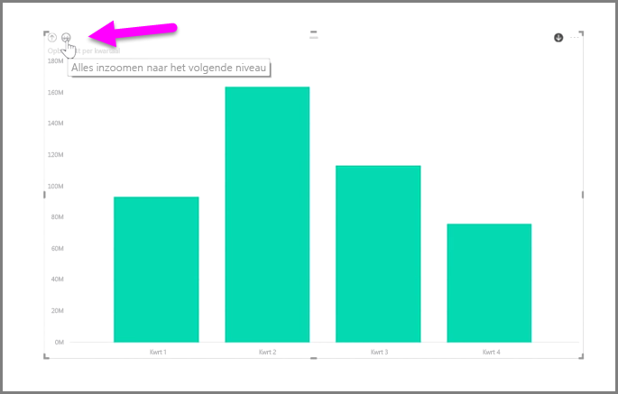
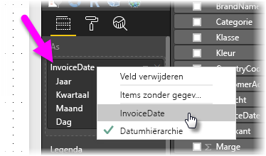
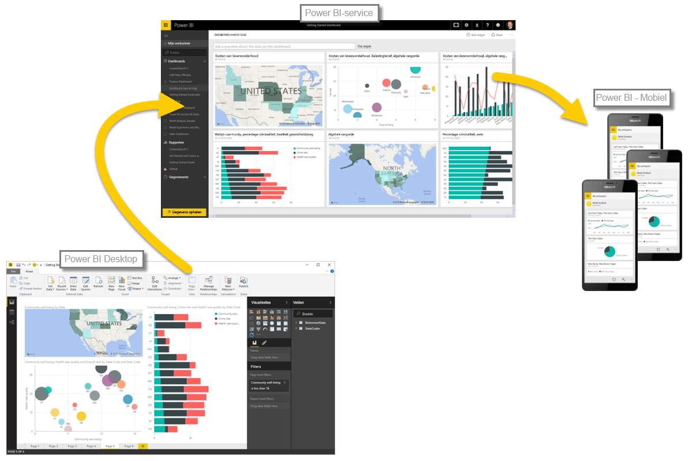

U kunt eenvoudig tijdgegevens in Power BI analyseren. De modelleringshulpprogramma's in Power BI Desktop bevatten automatisch gegenereerde velden waarmee u met één klik kunt inzoomen op jaren, kwartalen, maanden en dagen.  

Wanneer u met behulp van een datumveld een tabelvisualisatie in uw rapport maakt, worden de gegevens in Power BI Desktop automatisch uitgesplitst op basis van de tijdsduur. Het datumveld in de tabel **Datum** wordt in Power Bi automatisch onderverdeeld in Jaar, Kwartaal, Maand en Dag, zoals wordt weergegeven in de volgende afbeelding.

De gegevens in visualisaties worden standaard per *jaar* weergegeven, maar u kunt dit wijzigen door in de rechterbovenhoek van de visual de optie **Inzoomen** in te schakelen.

Als u nu op de balken of lijnen in uw diagram klikt, wordt ingezoomd op het volgende niveau in de tijdhiërarchie, bijvoorbeeld van *jaren* naar *kwartalen*. U kunt blijven inzoomen totdat u het meest gedetailleerde niveau van de hiërarchie bereikt. In dit voorbeeld *dagen*. Als u weer een minder gedetailleerd niveau in de tijdhiërarchie wilt weergeven, klikt u in de linkerbovenhoek van de visual op **Uitzoomen**.

U kunt in plaats van een op geselecteerde periode ook inzoomen op de gegevens die in de visual worden weergegeven. Hiervoor klikt u op het pictogram met de dubbele pijl **Alles inzoomen**. Dit pictogram bevindt zich ook in de rechterbovenhoek van de visual.

Zolang uw model een datumveld heeft, worden er automatisch verschillende weergaven voor verschillende hiërarchieën met Power BI gegenereerd.

Als u wilt terugkeren naar afzonderlijke datums in plaats van de datumhiërarchie, klikt u met de rechtermuisknop op de naam van de kolom in de bron **Velden** (in de volgende afbeelding is de kolomnaam *InvoiceDate*). Vervolgens selecteert u in het menu dat verschijnt, de kolomnaam in plaats van **Datumhiërarchie**. De gegevens in uw visual worden dan weergegeven op basis van die kolomgegevens, zonder gebruik te maken van de datumhiërarchie. Moet u de datumhiërarchie opnieuw gebruiken? Geen probleem. U klikt gewoon met de rechtermuisknop en selecteert **Datumhiërarchie** in het menu.

## Volgende stappen
**Gefeliciteerd.** U hebt dit gedeelte van de cursus **Begeleide training** voor Power BI voltooid. Nu u weet hoe u gegevens *modelleert*, bent u klaar voor de leuke dingen die u te wachten staan in de volgende sectie: **Visualisaties**.

Zoals gezegd, wordt uw kennis opgebouwd door de algemene werkstroom in Power BI te volgen:

* Gegevens overzetten naar **Power BI Desktop** een rapport maken.
* Publiceren naar de Power BI-service, waar u nieuwe **visualisaties** maakt en dashboards bouwt
* Uw dashboards meten anderen **delen**, met name mensen die onderweg zijn
* Gedeelde dashboards en rapporten in **Power BI -Mobiel**-apps weergeven en gebruiken

Hoewel u al het werk mogelijk niet zelf uitvoert, *begrijpt* u nu wel hoe deze dashboards zijn gemaakt en hoe ze zijn verbonden met de gegevens. Zodra u deze cursus hebt voltooid, kunt u zelf ook een dashboard maken.

Tot ziens in de volgende sectie.

