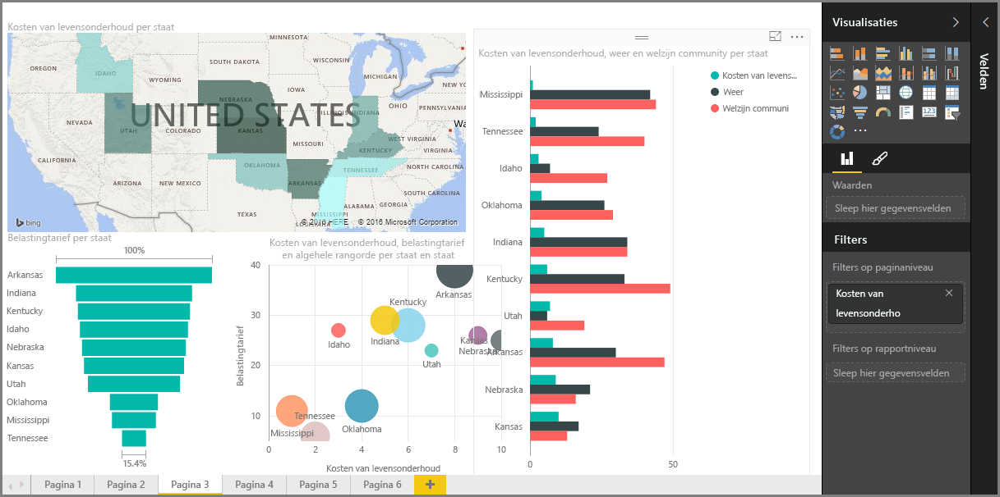

Welkom bij de sectie **Visualisaties** van de cursus **Begeleide training** voor Power BI. Bereid u voor op een leuke, interessante en verhelderende rondleiding langs de talloze visualisaties die Power BI te bieden heeft. En dit is nog niet alles. Er worden voortdurend visuals toegevoegd.

Natuurlijk vormen visuals het eindresultaat van elke actie waarbij business intelligence wordt verzameld. We willen de verzamelde gegevens op een aantrekkelijke en inzichtelijke manier presenteren en *laten zien* wat in het oog springt. En aangezien Power BI allerlei aantrekkelijke visuals bevat die vrijwel zonder enige beperking kunnen worden aangepast, is dit een belangrijk sectie.

Deze sectie bevat misschien een aanzienlijke hoeveelheid onderwerpen, maar elk onderwerp is kort, bevat (u raadt het al) tal van visuals en is eenvoudig te begrijpen. Wanneer u deze sectie doorloopt zult u zich waarschijnlijk voortdurend afvragen hoe u deze visuals kunt gebruiken om uw eigen gegevens te presenteren.

We beginnen met de meest basale visualisaties, de visuals waar we allemaal bekend mee zijn, en zorgen ervoor dat u alle ins en outs komt te weten. Vervolgens worden er geavanceerdere, in ieder geval iets minder gebruikelijke, visualisaties behandeld en vullen we de werkset waarmee u rapporten maakt.

Veel plezier. Er valt hier veel te leren.

## Inleiding tot visuals in Power BI
Het visualiseren van gegevens is een van de essentiële onderdelen van Power BI, een van de basisbouwstenen zoals we die eerder in deze cursus hebben gedefinieerd, en het maken van visuals is de eenvoudigste manier om uw inzichten te vinden en te delen.

Power BI bevat standaard diverse visualisaties, van eenvoudige staafdiagrammen tot cirkeldiagrammen en kaarten, maar ook meer esoterische diagrammen zoals waterval-, trechter- en meterdiagrammen. Power BI Desktop biedt ook uitgebreide opmaakfuncties voor pagina's, zoals vormen en afbeeldingen, waarmee u de rapporten tot leven kunt brengen.

