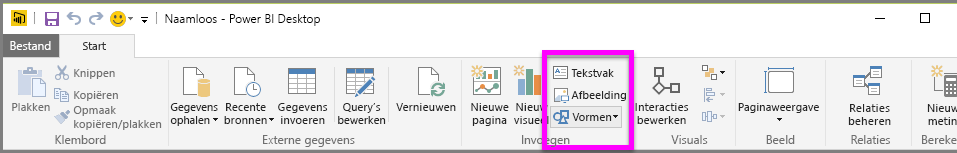
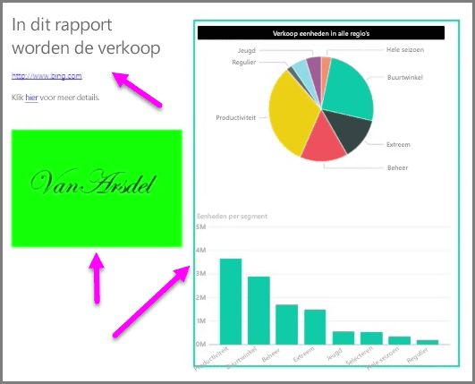

Naast gegevensgebonden visualisaties kunt u ook statische elementen als tekstvakken, afbeeldingen en vormen toevoegen om het visuele aspect van uw rapporten te verbeteren. Als u een visueel element wilt toevoegen, selecteert u **Tekstvak**, **Afbeelding** of **Vormen** in het tabblad **Start**.

**Tekstvakken** zijn geschikt om grote titels, bijschriften of korte alinea's met informatie bij uw visualisaties weer te geven. Tekstvakken kunnen koppelingen bevatten, die worden gemaakt via een geschreven URL of door ankertekst te markeren en het koppelsymbool in de werkbalk met tekstopties te selecteren. U kunt URL's opnemen in tekstvakken. De koppeling wordt automatisch gedetecteerd en omgezet in een livekoppeling.

Als u **Afbeelding** selecteert, wordt een bestandsbrowser geopend waarin u de afbeelding op uw computer of een andere netwerkbron kunt selecteren. Als u het formaat van een afbeelding in uw rapport wijzigt, blijft de hoogte-breedteverhouding standaard behouden. U kunt dit eventueel uitschakelen in de visuele opmaakopties.

**Vormen** bevat vijf verschillende opties voor vormen, waaronder rechthoeken en pijlen. Vormen kunnen ondoorzichtig of doorzichtig met een gekleurde rand zijn. (Deze laatste optie is handig als u randen rondom groepen visualisaties maakt.)

