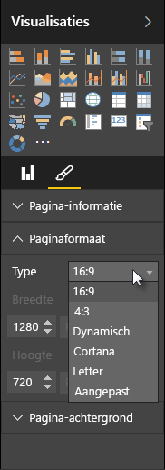

Met Power BI Desktop kunt u de indeling en opmaak van uw rapportpagina's bepalen, zoals de grootte en de richting.

Via het menu **Paginaweergave** menu in het tabblad Start kunt u de schaal van uw rapportpagina's wijzigen. De beschikbare opties zijn **Passend op pagina** (standaard), **Aan breedte aanpassen** en **Werkelijk formaat**.

U kunt ook de grootte van de pagina's wijzigen. Standaard zijn de rapportpagina's 16:9. Wanneer u de paginagrootte wilt wijzigen, moet u ervoor zorgen dat er geen visualisaties zijn geselecteerd, het verfkwastpictogram in het deelvenster Visualisaties selecteren en vervolgens **Paginaformaat** selecteren om deze sectie uit te vouwen.

Opties voor pagina's bevatten 4 x 3 (meer vierkante hoogte-breedteverhouding) en Dynamisch (de pagina wordt uitgerekt om de beschikbare ruimte te vullen). Rapporten hebben ook een standaardformaat. U moet het formaat van visualisaties mogelijk aanpassen nadat u het paginaformaat hebt gewijzigd om ervoor te zorgen dat deze volledig op het canvas worden weergegeven.

U kunt ook een aangepast paginaformaat opgeven, het formaat instellen op inches of pixels en de achtergrondkleur van het volledige rapport wijzigen.

Ook kunt u Cortana selecteren. Hiermee wordt het formaat van het rapport aangepast zodat dit kan worden gebruikt als zoekresultaat met Cortana.

