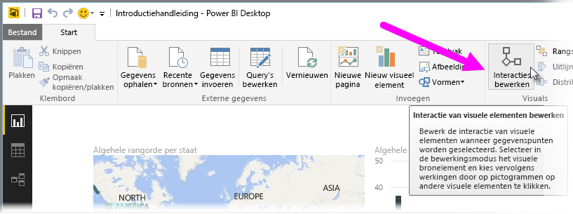
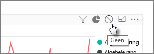
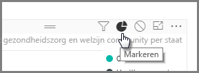
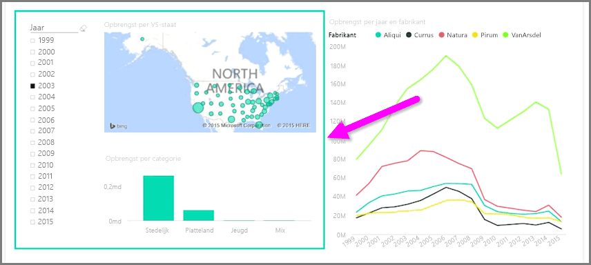

Wanneer u meerdere visualisaties op dezelfde rapportpagina hebt en door te klikken of met een slicer een bepaald segment selecteert, is dit van invloed op alle visuals op deze pagina. In sommige gevallen is het echter mogelijk dat u alleen specifieke visuals wilt segmenteren. Dit geldt met name wanneer er elementen als spreidingsplots worden gebruikt, waarbij het beperken van gegevens tot een specifiek segment cruciale gevolgen heeft voor de betekenis. Gelukkig kunt u met Power BI Desktop bepalen hoe de interacties tussen visuals stromen.

Als u de interactie tussen uw visualisaties wilt wijzigen, selecteert **Bewerken** in de sectie Visuals op het lint **Start** om de **Bewerkingsmodus** in te schakelen.

>[!NOTE]
>Het pictogram **Interacties bewerken** in Power BI Desktop is gewijzigd nadat deze video is opgenomen.
> 
> 

Wanneer u een visual op uw rapportcanvas selecteert, wordt er in de rechterbovenhoek van alle andere visuals waarop dit van invloed is, een klein ondoorzichtig *filterpictogram* weergegeven. Als u een visual wilt uitsluiten voor de interactie, klikt u in de rechterbovenhoek, in de buurt van het *filterpictogram* op het symbool *Geen*.

In bepaalde gevallen kunt u het type filterinteractie aanpassen die plaatsvindt tussen de visuals. Zorg dat de **Bewerkingsmodus** is ingeschakeld en selecteer de visual die u wilt gebruiken om te filteren. Als u het type interactie voor een andere visual kunt wijzigen, wordt in de rechterbovenhoek een pictogram van een *cirkeldiagram* weergegeven naast het filterpictogram.

Klik op het pictogram van het *cirkeldiagram* om de gesegmenteerde gegevens te markeren. Anders worden de gegevens gefilterd. Net als voorheen kunt u het pictogram *Geen* klikken alle interactie verwijderen.

Het kan handig zijn om een transparante vorm rond de communicerende visuals te tekenen, zodat voor de gebruiker duidelijk is dat ze een interactieve relatie hebben.

