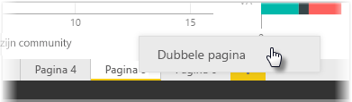

De afzonderlijke pagina's van een rapport kunnen behoorlijk gecompliceerd zijn, doordat meerdere visuele elementen op bepaalde manieren met elkaar in verband staan en een nauwkeurige indeling hebben. Wanneer u een rapport maakt, kan het zijn dat u dezelfde visuele elementen en indelingen voor twee verschillende paginaonderwerpen wilt gebruiken. Als u bijvoorbeeld zojuist een rapportpagina over de bruto-omzet hebt opgesteld, wilt u misschien dat de rapportpagina over de netto-omzet er bijna hetzelfde uitziet.

Het is erg omslachtig als u al het werk weer opnieuw zou moeten doen. Met Power BI Desktop kunt u een rapportpagina dupliceren, zodat u uzelf veel tijd bespaart.

Klik gewoon met de rechtermuisknop op het tabblad dat u wilt kopiëren en selecteer **Dubbele pagina**.

Vervolgens kunt u het tabblad van de nieuwe pagina de gewenste naam geven, de teksttitel bijwerken en vervolgens de visuele elementen bijwerken met het nieuwe veld dat u wilt bijhouden.

