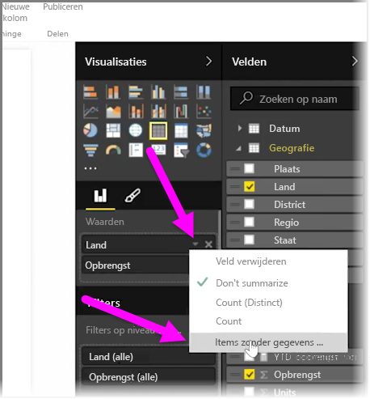
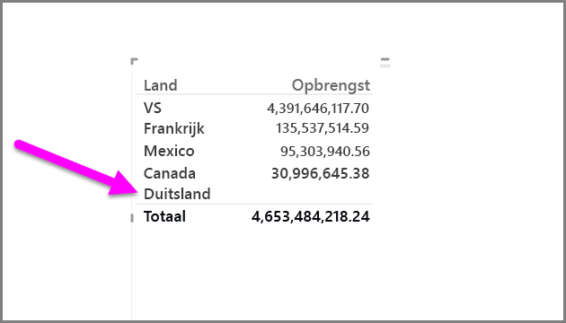
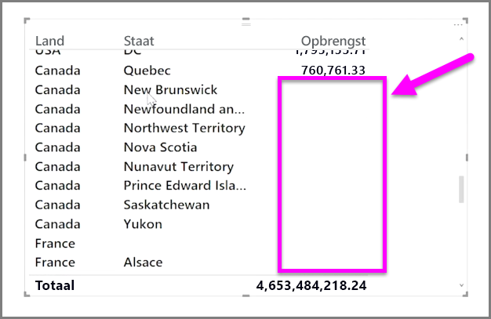

Standaard worden kolomkoppen alleen in uw rapporten weergegeven als deze gegevens bevatten. Als u bijvoorbeeld de omzet per land weergeeft terwijl er geen omzet voor Noorwegen beschikbaar is, wordt Noorwegen niet weergegeven in uw visualisatie.

Als u lege categorieën wilt weergeven, klikt u op de pijl-omlaag in het veld dat u wilt wijzigen in het deelvenster **Visualisaties** en selecteert u **Items zonder gegevens weergeven**.

Alle lege kolommen worden nu weergegeven in uw visualisatie met lege waarden.

Als u **Items zonder gegevens weergeven** selecteert voor een veld in het deelvenster **Visualisaties**, wordt dit toegepast op alle velden die worden weergegeven in het deelvenster Visualisaties. Als u dus nog een veld toevoegt, worden items zonder gegevens ook weergegeven zonder dat u opnieuw naar het vervolgkeuzemenu hoeft te gaan.

