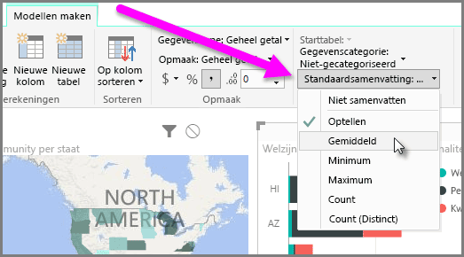
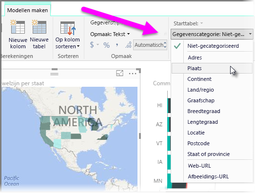

Power BI bevat eigenschappen die u kunt toewijzen aan velden in uw model. Deze eigenschappen helpen u om de gegevens op en heldere en duidelijke manier te rapporteren, visualiseren en presenteren. Soms wilt bijvoorbeeld het gemiddelde voor een lijst met getallen, terwijl de lijst in Power BI automatisch wordt opgeteld. Met Power BI kunt u aanpassen hoe deze lijsten met getallen worden samengevat.

## Numerieke controle over de samenvatting
Hier volgt een voorbeeld waarin wordt gedemonstreerd hoe u kunt bepalen op welke manier de numerieke gegevensvelden in Power BI worden samengevat.

Selecteer een visual op uw rapportcanvas en selecteer vervolgens een veld in het deelvenster **Velden**. He tabblad **Model maken** wordt weergegeven in het lint en bevat opties voor het opmaken van gegevens en voor gegevenseigenschappen.

U kunt het type valutasymbool selecteren dat is gebruikt door de vervolgkeuzelijst voor het valutasymbool te selecteren die wordt weergegeven in de volgende afbeelding.

Er zijn veel verschillende opties beschikbaar voor het opmaken van velden. U kunt de valutanotatie bijvoorbeeld veranderen in een percentagenotatie.

U kunt ook wijzigen hoe de gegevens in Power BI worden samengevat. Selecteer het pictogram **Standaardoverzicht** om te wijzigen hoe een veld wordt samengevat, waaronder de som, het aantal of een gemiddelde.

## Uw locatiegegevens beheren en verduidelijken
U kunt soortgelijke wijzigingen aanbrengen wanneer u locaties op een kaart tekent. Selecteer de kaart en selecteer in het deelvenster **Velden** vervolgens het veld dat u gebruikt voor de waarde bij *Locatie*. Selecteer op het tabblad **Model maken** de optie **Gegevenscategorie** en kies in de vervolgkeuzelijst vervolgens de categorie die uw locatiegegevens representeert. Selecteer bijvoorbeeld staat, provincie of plaats.

