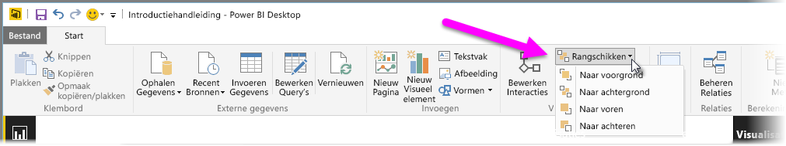
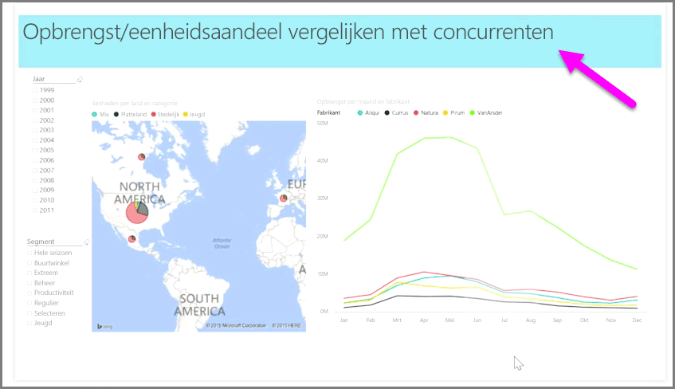

Wanneer u veel elementen in een rapport hebt, kunt u met Power BI beheren hoe de verschillende elementen met elkaar overlappen. De manier waarop items zijn geordend, of op elkaar zijn geplaatst, wordt de Z-volgorde genoemd.

Als u de Z-volgorde van elementen in een rapport wilt beheren, selecteert u een element en gebruikt u de knop **Rangschikken** in het tabblad **Start** van het lint om de Z-volgorde te wijzigen.

Met de opties in het knopmenu **Rangschikken** kunt u de elementen rangschikken in de door u gewenste volgorde. U kunt een visualisatie één laag vooruit of achteruit verplaatsen of helemaal naar het begin of het einde van de volgorde verplaatsen.

De knop Rangschikken is vooral handig wanneer u vormen gebruikt als decoratieve achtergrond of randen of om bepaalde gedeelten van een diagram of grafiek te markeren. U kunt vormen ook gebruiken om een achtergrond te maken, zoals de volgende lichtblauwe rechthoek die wordt gebruikt als achtergrond voor de titel van het rapport.

