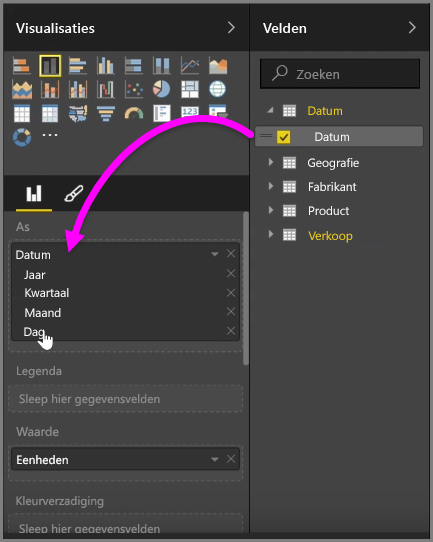
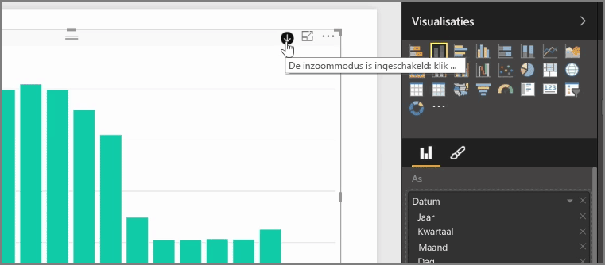
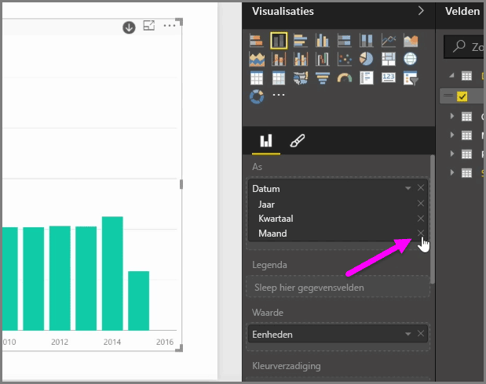
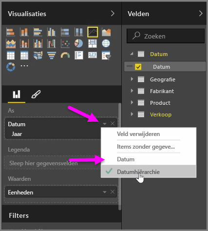
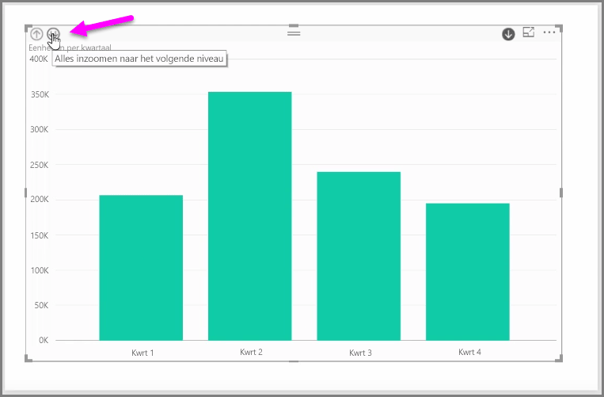

Wanneer u een *datum*veld aan een visualisatie in de veldbucket *As* toevoegt, voegt Power BI automatisch een tijdshiërarchie toe met *Jaar*, *Kwartaal*, *Maand* en *Dag*. Op deze manier kunt u met Power BI visualisaties op basis van tijd gebruiken voor de weergave van rapporten, doordat gebruikers kunnen inzoomen op de verschillende tijdsniveaus.

Doordat er sprake is van een hiërarchie, kunt u inzoomen op de verschillende tijdsvakken. Als u bijvoorbeeld in een grafiek op een jaar klikt, zoomt u in op het volgende niveau in de hiërarchie, in dit geval *Kwartalen*, dat vervolgens in de visualisatie wordt weergegeven.

In deze automatische opgestelde hiërarchie kunt u ook bepalen tot welk niveau van uw gedeelde rapport gebruikers kunnen inzoomen. Klik hiervoor in het deelvenster Visualisaties op de X naast de hiërarchie die u wilt verwijderen. Het verwijderde niveau wordt uit het rapport verwijderd en er kan niet meer op dat niveau worden ingezoomd.

Als u een niveau van de hiërarchie wilt terughalen, verwijdert u het *datum*veld en voegt u het vervolgens opnieuw toe in het deelvenster **Velden**. De hiërarchie wordt opnieuw automatisch voor u gemaakt.

Het kan zijn dat u de hiërarchie niet wilt gebruiken voor een visualisatie. U kunt dit instellen door de pijl-omlaag naast het veld *Datum* te selecteren (nadat u dit veld aan een visualisatie hebt toegevoegd) en vervolgens **Datum** in plaats van **Datumhiërarchie** te selecteren. In Power BI worden vervolgens de onbewerkte datumwaarden in de visualisatie weergegeven.

U kunt ook in plaats van afzonderlijke kwartalen of jaren alle zichtbare gegevenselementen in één keer uitvouwen. Hiervoor selecteert u het pictogram *Alles inzoomen* linksboven in de visualisatie (een pictogram met een dubbele pijl-omlaag).

