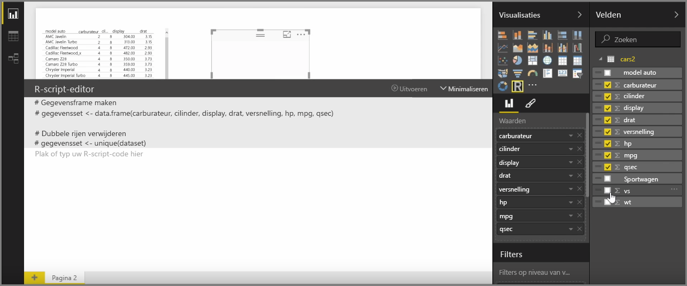
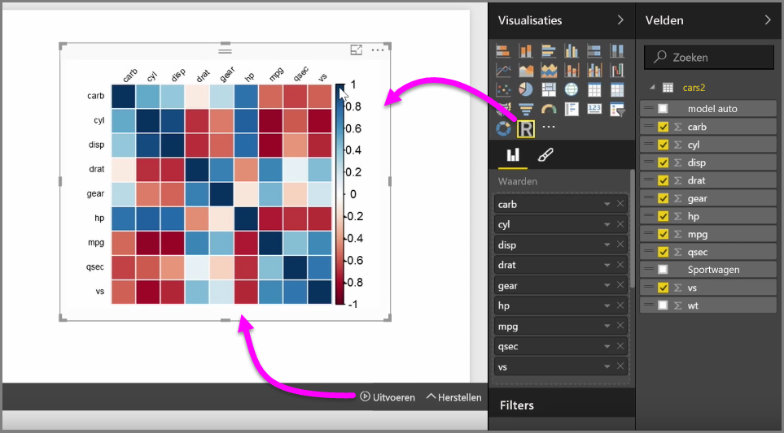
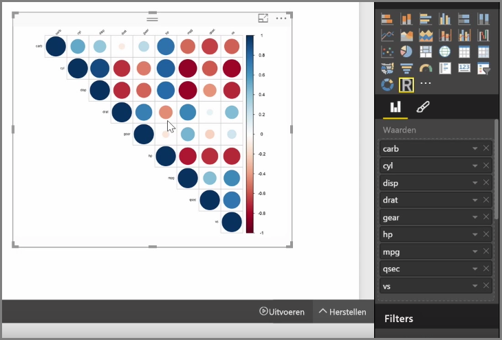

Met Power BI Desktop kunt u analytische en statistische analyses uitvoeren en aantrekkelijk visuals maken door te integreren met R. U kunt deze R-visualisaties hosten in het Power BI Desktop-rapport.

Wanneer u het pictogram **R-visual** selecteert in het deelvenster **Visualisaties**, wordt er een tijdelijke aanduiding op het canvas in Power BI gemaakt om uw R-visual te hosten. Vervolgens wordt er een R-script-editor weergegeven die u rechtstreeks op het canvas kunt gebruiken. Als u velden aan het visuele R-element toevoegt, worden deze in Power BI Desktop toegevoegd aan het deelvenster R-script-editor.

Onder het hetgeen in de R-script-editor door Power BI wordt gegenereerd, kunt u vast beginnen aan het R-script waarmee u de visual genereert. Zodra uw script is voltooid, selecteert u **Uitvoeren** en gebeurt het volgende:

1. De gegevens die worden toegevoegd aan de visual (via het deelvenster **Velden**) wordt van Power BI Desktop verzonden naar de lokale installatie van R
2. Het script dat is gemaakt in de Power BI Desktop R-script-editor wordt uitgevoerd op die lokale installatie van R
3. Vervolgens ontvangt Power BI Desktop een visual van de R-installatie en wordt deze weergegeven op het canvas

Alles gaat razendsnel en het resultaat wordt weergegeven in de visualisatie op het canvas van de **R-visual**.

U kunt de R-visual wijzigen door het R-script aan te passen en vervolgens opnieuw **Uitvoeren** te selecteren. In de volgende afbeelding is de visual zodanig aangepast dat er cirkels in plaats van vierkanten worden weergegeven.

En aangezien de R-visual niet anders is dan andere visuals in Power BI Desktop, kunt u deze bewerken en ook verbindingen met andere visuals op het canvas maken. Wanneer u andere visuals op het canvas bewerkt, door te filteren of te markeren, reageert de R-visual automatisch, net als elke andere Power BI-visual, zonder dat u het R-script hoeft aan te passen.

Dit is een uitstekende manier om de kracht van R rechtstreeks in Power BI Desktop te gebruiken.

## Volgende stappen
**Gefeliciteerd.** U hebt de sectie **Visualisaties** van de cursus **Begeleide training** voor Power BI voltooid. U kunt rustig stellen dat u goed bent ingevoerd in de diverse visualisatie die in Power BI worden aangeboden en u over de kennis beschikt om ze te gebruiken, te wijzigen en aan te passen. En het goede nieuws is dat de visualisaties in Power BI Desktop en de Power BI-service in wezen hetzelfde zijn. Wat u hebt geleerd, is dus van toepassing op beide.

U bent nu klaar om naar de cloud te gaan en u te verdiepen in de Power BI-service, waarin u **gegevens kunt verkennen**. Zoals u weet, ziet de werkstroom er ongeveer als volgt uit:

* Gegevens overzetten naar **Power BI Desktop** en een rapport maken.
* Publiceren naar de Power BI-service, waar u nieuwe **visualisaties** maakt en dashboards bouwt
* Uw dashboards meten anderen **delen**, met name mensen die onderweg zijn
* Gedeelde dashboards en rapporten in **Power BI -Mobiel**-apps weergeven en gebruiken

Of u nu rapporten maakt of ze alleen weergeeft en gebruikt, u weet precies hoe deze visuals worden gemaakt en ze worden verbonden met de gegevens. Vervolgens kunnen we deze visuals en rapporten in actie bekijken.

Tot ziens in de volgende sectie.

