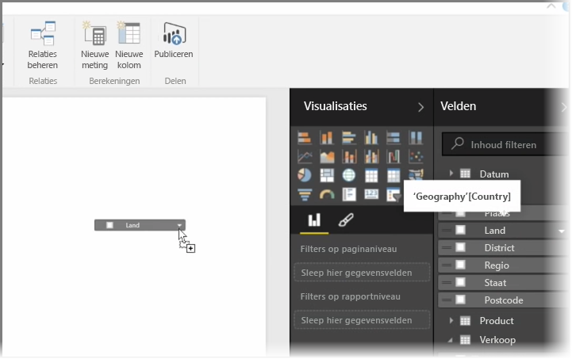
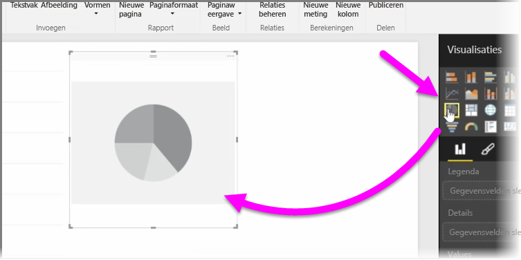
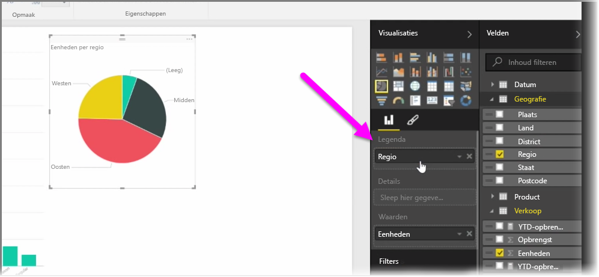
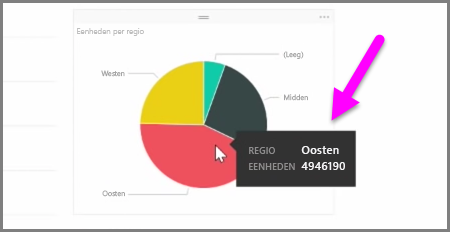
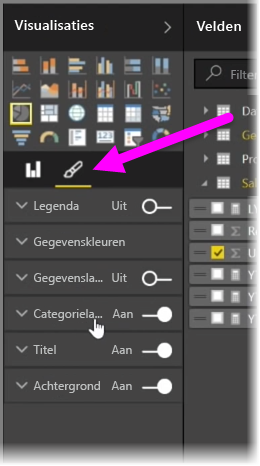

In dit artikel leert u hoe u nieuwe staafdiagrammen, cirkeldiagrammen en treemaps maakt en deze aanpast aan uw rapporten.

Er zijn twee verschillende manieren om nieuwe visualisaties te maken in Power BI Desktop:

* U kunt veldnamen uit het deelvenster **Velden** slepen en deze neerzetten op het rapportcanvas. De visualisatie wordt standaard weergegeven als een tabel met gegevens.
  
  
* U kunt in het deelvenster **Visualisaties** ook op het type visualisatie klikken dat u wilt maken. De standaardvisual voor deze methode is een lege tijdelijke aanduiding die lijkt op het type visual dat u hebt geselecteerd.
  
  

Zodra u een grafiek, kaart of diagram hebt gemaakt, kunt u gegevensvelden naar het onderste gedeelte van het deelvenster **Visualisatie** slepen om uw visual samen te stellen en te ordenen. Welke velden beschikbaar zijn, is afhankelijk van het type visualisatie dat u hebt geselecteerd. Als u gegevensvelden sleept en neerzet, wordt uw visualisatie automatisch bijgewerkt met de wijzigingen.

U kunt de grootte van uw visualisatie wijzigen door de visualisatie te selecteren en vervolgens de grepen naar binnen of buiten te slepen. U kunt uw visualisatie ook op het canvas verplaatsen door op de visualisatie te klikken en de vervolgens te slepen. Als u wilt converteren tussen verschillende typen visualisaties, selecteert u eerst de visual die u wilt wijzigen en selecteert u in het deelvenster **Visualisaties** vervolgens een pictogram voor een andere visualisatie. De geselecteerde velden worden door Power BI geconverteerd. Hierbij wordt geprobeerd om ze zo nauw mogelijk te aansluiten op het nieuwe type visual.

Als u de muisaanwijzer over de onderdelen van uw visualisaties beweegt, wordt er een tooltip met informatie over dat segment weergegeven, zoals labels en de totale waarde.

Selecteer het **penseelpictogram** in het deelvenster **Visualisaties** om cosmetisch wijzigingen in uw visual aan te brengen, zoals de achtergrond, uitlijning, titeltekst en gegevenskleuren.

De beschikbare opties voor cosmetisch wijzigingen in uw visual variëren afhankelijk van het type visual dat u hebt geselecteerd.

