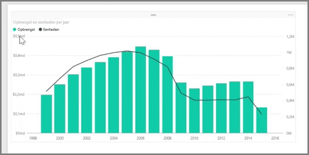
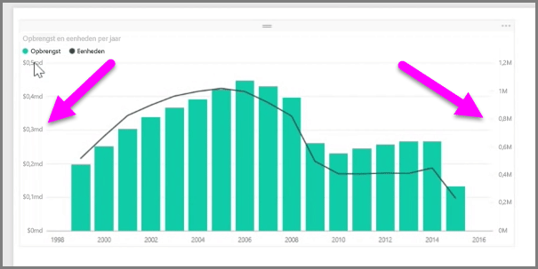
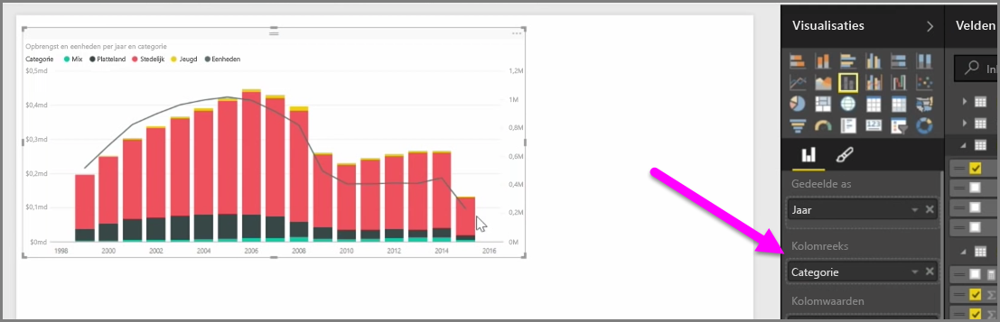

Wanneer u twee metingen met zeer verschillende schalen wilt visualiseren, zoals omzet en eenheden, kunt u een **combinatiediagram** maken met een lijn en een staaf met verschillende asschalen. Power BI biedt standaard ondersteuning voor verschillende soorten combinatiegrafieken, zoals het populaire **Regeldiagram** en het **Gestapelde kolomdiagram**.

Wanneer u een combinatiediagram maakt, hebt u een veld voor **Gedeelde as** (de x-as) en waarden voor uw twee velden, in dit geval een kolom en een regel. De legenda voor de twee Y-assen worden aan beide zijden van de visualisatie weergegeven.

U kunt ook elke kolom splitsen op categorie door een categorie in het veld Kolomreeks in het deelvenster Visualisaties te slepen. Elke staaf is proportioneel gekleurd op basis van de waarden in elke categorie.

Combinatiegrafieken zijn handig als u meerdere metingen met zeer verschillende schalen in één visualisatie wilt weergeven.

