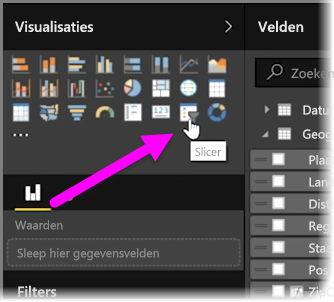
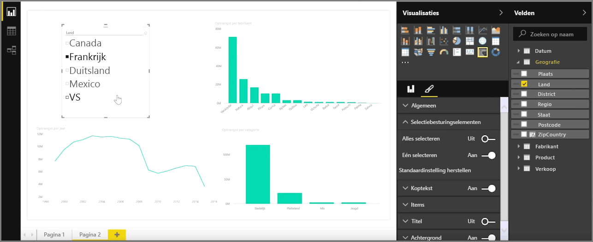
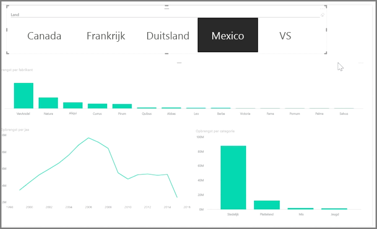

Slicers zijn een van de krachtigste visualisatietypen, met name als onderdeel van een omvangrijk rapport. Een **slicer** is een visueel filter op het canvas in **Power BI Desktop** waarmee u de gegevens in een rapport op een bepaalde waarde kunt segmenteren, zoals op jaar of op geografische locatie.

Als u een slicer aan uw rapport wilt toevoegen, selecteert u **Slicer** in het deelvenster **Visualisaties**.

Sleep het veld waarop u wilt segmenteren boven in de tijdelijke aanduiding voor de slicer. De visualisatie verandert in een lijst met elementen met selectievakjes. Deze elementen zijn uw filters. Selecteer het vakje naast het filter dat u wilt segmenteren. Alle andere visualisaties in hetzelfde rapport worden gefilterd of *gesegmenteerd* op basis van uw selectie.

Er zijn een aantal andere opmaakopties voor uw slicer beschikbaar. Zo kunt u instellen dat de slicer meer dan één invoer tegelijk accepteert of **Eén selecteren** kiezen om één invoer per keer te gebruiken. U kunt ook de optie **Alles selecteren** toevoegen aan uw slicer-elementen. Dit is met name handig als lange lijsten hebt. Als u de richting van de slicer wijzigt van verticaal (dit is de standaardinstelling) naar horizontaal, wordt de slicer een selectiebalk in plaats van een keuzelijst.

