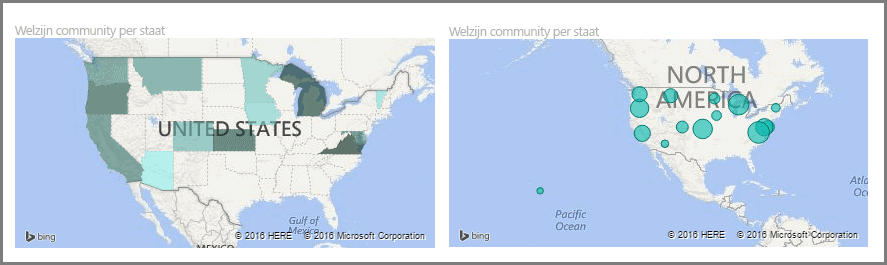
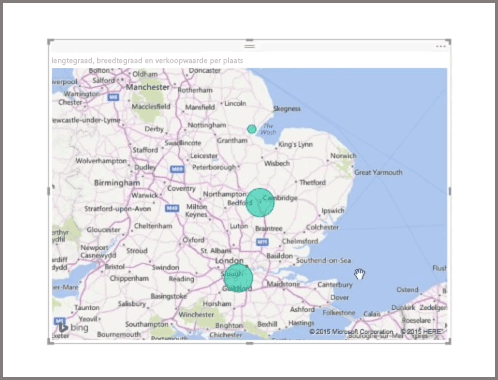
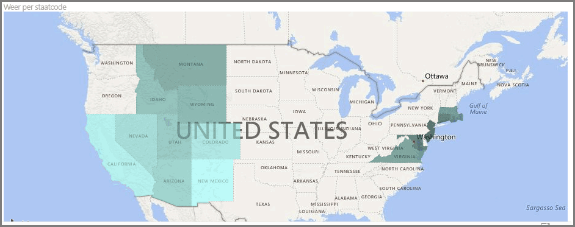
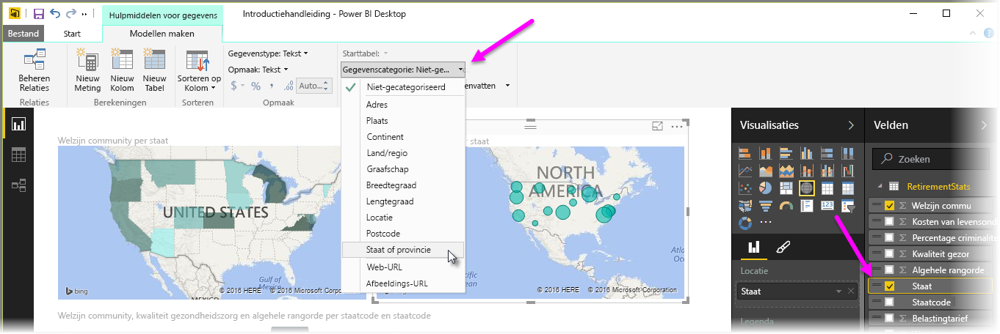

Power BI heeft twee verschillende typen kaartvisualisaties: een bellenkaart met bellen op geografische punten en een shape-kaart die de omtrek toont van het gebied dat u wilt visualiseren.

> [!NOTE]
> Als u werkt met landen of regio's, gebruikt u de afkorting van drie letters om ervoor te zorgen dat geocodering goed werkt in kaartvisualisaties. Gebruik *geen* afkortingen van twee letters, aangezien bepaalde landen of regio's mogelijk niet goed worden herkend.
> Als u alleen afkortingen van twee letters gebruikt, bekijkt u [dit externe blogbericht](https://blog.ailon.org/how-to-display-2-letter-country-data-on-a-power-bi-map-85fc738497d6#.yudauacxp) voor stapsgewijze instructies om de tweeletterige afkortingen voor landen/regio's aan de drieletterige afkortingen voor landen/regio's te koppelen.
> 
> 

## Bellenkaarten maken
Als u een bellenkaart wilt maken, selecteert u de optie **Kaart** in het deelvenster **Visualisatie**. U moet een waarde aan de bucket *Locatie* in de opties van **Visualisaties** toevoegen om een kaartvisual te gebruiken.

Power BI is flexibel wat betreft het type locatiewaarde dat wordt geaccepteerd. U kunt zeer algemene gegevens, zoals plaatsnamen en luchthavencodes, tot zeer specifieke gegevens voor de breedtegraad en lengtegraad gebruiken. Voeg een veld aan de bucket **Grootte** toe om de grootte van de bel voor elke locatie op de kaart dienovereenkomstig aan te passen.

## Shape-kaarten maken
Als u een shape-kaart wilt maken, selecteert u de optie **Choropletenkaart** in het deelvenster Visualisatie. Net als voor bellenkaarten moet u een bepaalde waarde aan de bucket Locatie toevoegen om deze visual te kunnen gebruiken. Voeg een veld aan de bucket Grootte toe om de intensiteit van de opvulkleur dienovereenkomstig te wijzigen.

Een waarschuwingspictogram in de linkerbovenhoek van de visual geeft aan dat de kaart meer locatiegegevens nodig heeft om de waarden nauwkeurig te tekenen. Dit is een bijzonder veelvoorkomend probleem wanneer het locatieveld van uw locatie niet-eenduidige gegevens bevat, zoals het gebruik van een gebiedsnaam zoals *Groningen* die kan duiden op een provincie of een plaats. U kunt dit probleem onder meer oplossen door de kolom een specifiekere naam te geven, bijvoorbeeld *Provincie*. U kunt dit probleem ook oplossen door de gegevenscategorie handmatig opnieuw in te stellen. Hiervoor selecteert u op het tabblad Model maken de optie **Gegevenscategorie**. Hier kunt u een categorie toewijzen aan uw gegevens, zoals Provincie of Plaats.

