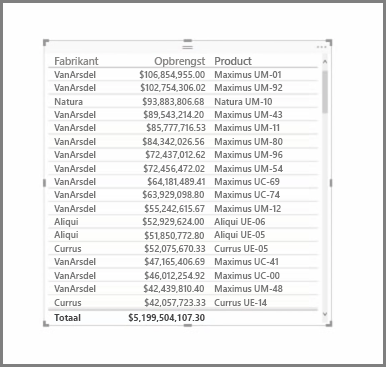
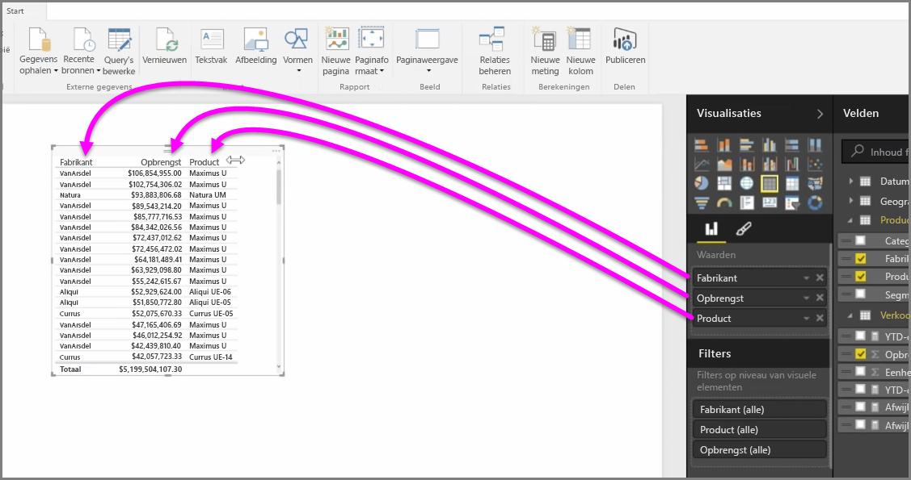
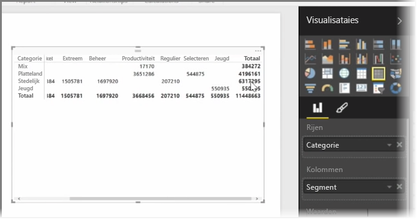

Naast vele verschillende diagrammen biedt Power BI Desktop ook ondersteuning voor tabellaire visualisaties. Als u een categorisch veld of tekstveld naar een rapportcanvas sleept, wordt standaard een tabel met de resultaten weergegeven. U kunt omhoog of omlaag door de tabel schuiven en de tabel wordt alfabetisch gesorteerd.

Als een tabel numerieke gegevens bevat, zoals de omzet, wordt het totaal onder aan de tabel weergegeven. U kunt handmatig op elke kolom sorteren door op de kolomkop te klikken om in aflopende of oplopende volgorde te sorteren. Als een kolom niet groot genoeg is om alle inhoud weer te geven, klikt u op de kolomkop en sleept u opzij om de kolom breder te maken.

De volgorde van de velden in de bucket *Waarden* in het deelvenster **Visualisaties** bepaalt de volgorde waarin de velden in de tabel worden weergegeven.

Een **matrix** is vergelijkbaar met een tabel. Een matrix heeft alleen andere categoriekoppen op de kolommen en rijen. Net als bij tabellen wordt automatisch een totaal van numerieke gegevens weergegeven onder en rechts van de matrix.

Er zijn verschillende kosmetische opties beschikbaar voor matrices, zoals het automatisch aanpassen van de grootte van kolommen, schakelen tussen de rij- en kolomtotalen, kleuren instellen, en nog veel meer. Als u een matrix maakt, moet u ervoor zorgen dat uw categorische gegevens (gegevens niet op basis van getallen) links in de matrix staan en de numerieke bestanden rechts in de matrix, zodat de horizontale schuifbalk wordt weergegeven. Ook moet u ervoor zorgen dat de schuiffuncties naar behoren werkt.

