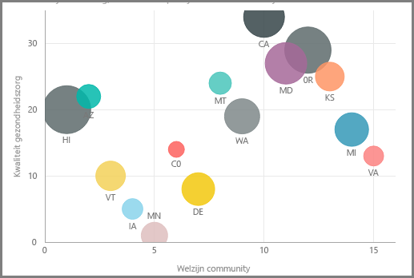
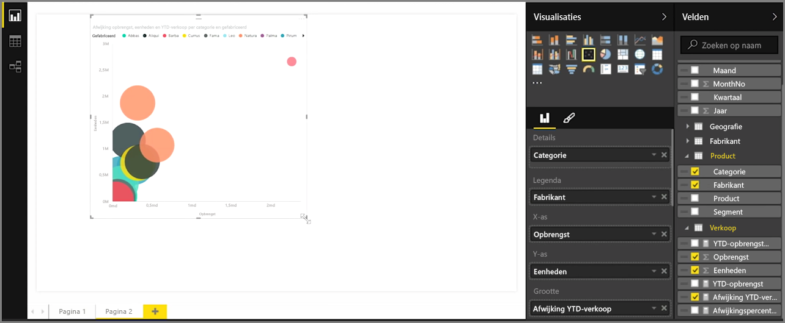
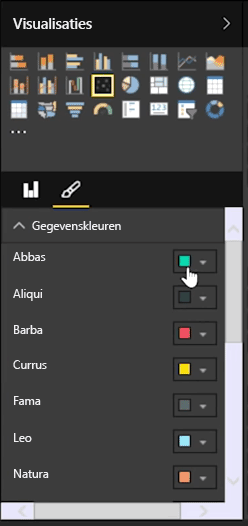
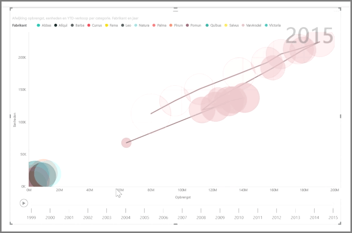

Als u twee verschillende metingen wilt vergelijken, zoals het aantal verkochte eenheden versus de opbrengst, is een spreidingsdiagram een veelgebruikte visualisatie.

Selecteer **Spreidingsdiagram** in het deelvenster **Visualisaties** om een leeg diagram te maken. Sleep de twee velden die u wilt vergelijken van het deelvenster **Velden** naar de optiebuckets voor de *X-as* en *Y-as*. Op dit moment wordt er voor uw spreidingsdiagram waarschijnlijk slechts een kleine bel in het midden van de visual weergegeven. U moe een meting aan de bucket *Details* toevoegen om aan te geven hoe u de gegevens wilt segmenteren. Als u bijvoorbeeld de verkoop en opbrengst van items wilt vergelijken, wilt u de gegevens mogelijk opsplitsen naar categorie, fabrikant of verkoopmaand.

Als u een extra veld aan de bucket *Legenda* toevoegt, worden er op basis van de waarde van het veld kleurcodes aan uw bellen toegevoegd. U kunt ook een veld toevoegen aan de bucket *Grootte* om de grootte van de bel aan te passen op basis van de desbetreffende waarde.

Spreidingsdiagrammen beschikken over diverse opties voor de visuele opmaak. U kunt bijvoorbeeld een contour voor elke gekleurde bel inschakelen en afzonderlijke labels in- en uitschakelen. U kunt ook de kleuren van gegevens voor andere typen diagrammen wijzigen.

U kunt een animatie maken van de wijzigingen die in de loop van de tijd in uw bellendiagram zijn aangebracht door een op tijd gebaseerd veld aan de bucket *Afspeelas* toe te voegen. Klik tijdens een animatie op een bel om de tracering voor het bijbehorende pad weer te geven.

>[!NOTE]
>Vergeet niet dat wanneer er slechts één bel in uw spreidingsdiagram wordt weergegeven, dit komt omdat uw gegevens standaard worden samengevoegd Power BI. Als u meer bellen wilt weergeven, voegt u een categorie aan de bucket *Details* in het deelvenster **Visualisaties** toe.
> 
> 

