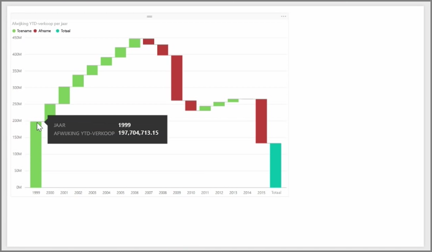
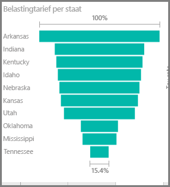

Waterval- en trechterdiagrammen zijn twee interessante (en misschien niet zo veel voorkomende) standaardvisualisaties in Power BI. Wanneer u een leeg diagram voor een van deze typen wilt maken, selecteert u het betreffende pictogram in het deelvenster **Visualisaties**.

**Watervaldiagrammen** worden meestal gebruikt om wijzigingen van een bepaalde waarde door de tijd heen weer te geven.

Watervaldiagrammen hebben slechts twee bucketopties: *Categorie* en *Y-as*. Sleep een op tijd gebaseerd veld, zoals *Jaar*, naar de bucket *Categorie* en de waarde die u wilt traceren naar de bucket *Y-as*. Perioden waarin er een toename van de waarde was worden standaard in het groen weergegeven en perioden waarin er een afname in de waarde was worden weergegeven in het rood.

**Trechterdiagrammen** worden meestal gebruikt om wijzigingen gedurende een bepaald proces weer te geven, zoals een verkooppijplijn of bewaarduur van een website.

Zowel **waterval-** als **trechter**diagrammen kunnen worden gesegmenteerd en visueel worden aangepast.

