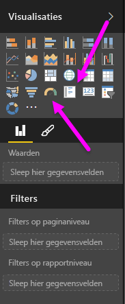
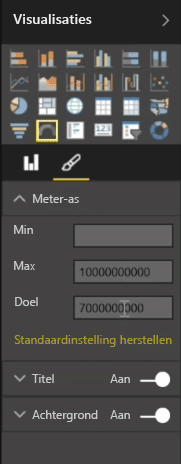
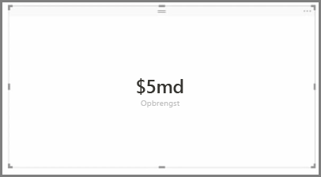
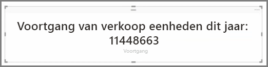

Visualisaties worden over het algemeen gebruikt om twee of meer verschillende waarden te vergelijken. Het kan echter zo zijn dat u bij het maken van rapporten slechts één Key Performance Indicator (KPI) of de metrische gegevens gedurende een periode wilt bijhouden. In dit geval kunt u in Power BI Desktop een kaart voor **Meter** of **Eén getal** gebruiken. Wanneer u een leeg diagram voor een van deze typen wilt maken, selecteert u het betreffende pictogram in het deelvenster **Visualisaties**.

Meters zijn met name handig als u dashboards maakt en de voortgang voor een bepaald doel wilt weergeven. Als u een meter wilt maken, selecteert u het betreffende pictogram in het deelvenster **Visualisaties** en sleept u het veld dat u wilt bijhouden in de bucket *Waarde*.

Meters worden standaard op 50% of op tweemaal de *waarde* weergegeven. U kunt deze instelling op een van de volgende manieren aanpassen. Als u de waarden dynamisch wilt instellen, sleept u de velden naar de waardebuckets *Minimum*, *Maximum* en *Doel*. U kunt het bereik van de meter ook handmatig aanpassen met behulp van de visuele opmaakopties.

Kaartvisualisaties tonen een numerieke representatie van een veld. Standaard tonen kaartvisualisaties eenheden om een getal eenvoudiger weer te geven, bijvoorbeeld $5mld in plaats van $5,000,000,000. U kunt de gebruikte eenheid wijzigen of deze volledig uitschakelen.

Met kaarten kunt u een aangepaste meting weergeven die u met tekst hebt samengevoegd. In het vorige voorbeeld kunt u op uw kaart met een aangepaste meting geavanceerde DAX-functies gebruiken en bijvoorbeeld het volgende weergeven: Totale inkomen dit jaar: $5 mld, of Voortgang van verkoop eenheden dit jaar en vervolgens het aantal toevoegen dat de voortgang weergeeft.

