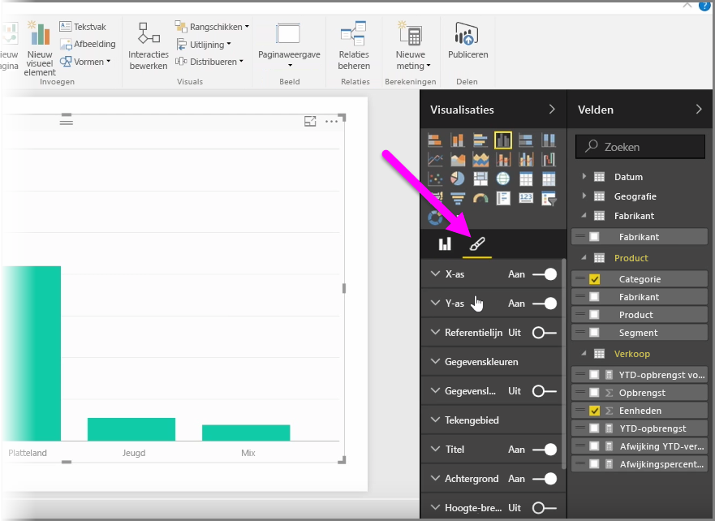
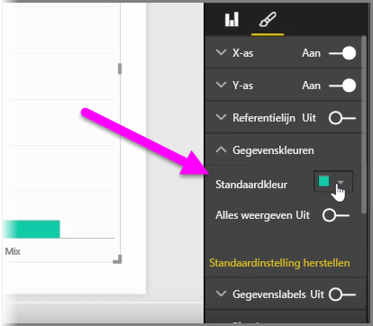
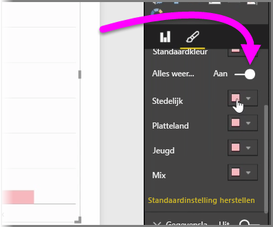
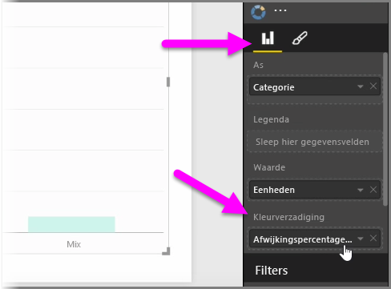
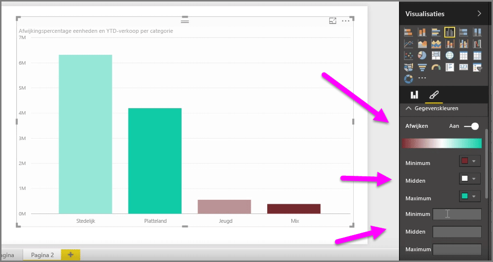
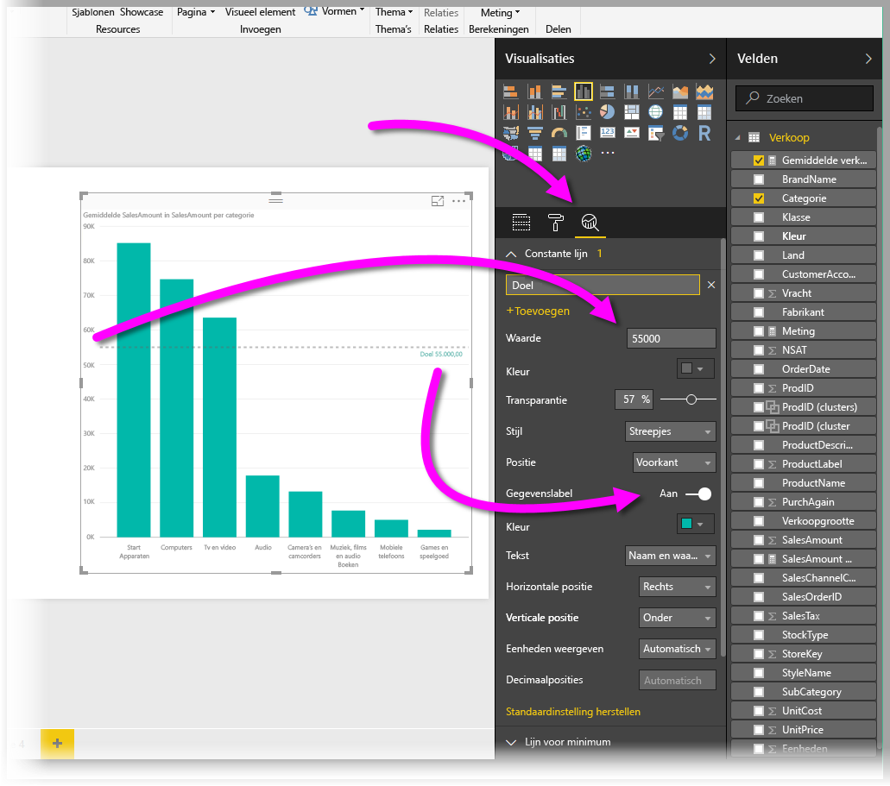
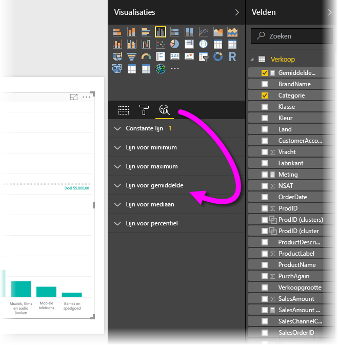

Het komt waarschijnlijk regelmatig voor dat u de gebruikte kleuren in diagrammen of visuals wilt aanpassen. Met Power BI kunt u in grote mate zelf bepalen hoe kleuren worden weergegeven. Selecteer om te beginnen een visual in het deelvenster **Visualisaties** en klik op het **penseelpictogram**.

U beschikt over tal van opties om de kleuren of de opmaak van de visual te wijzigen. U kun de kleur van alle balken van een visual wijzigen door achtereenvolgens de kleurkiezer naast **Standaardkleur** en de gewenste kleur te selecteren.

U kunt ook de kleur van elke balk (of een ander element, afhankelijk van het type visual die u hebt geselecteerd) wijzigen door de schuifregelaar **Alles weergeven** in te schakelen. Wanneer u dit doet, wordt er voor elk element een kleurenkiezer weergegeven.

U kunt ook de kleur ook wijzigen op basis van een waarde of meting. Om dit te doen, sleept u een veld in de bucket **Kleurverzadiging** in het deelvenster Visualisaties (beschikbaar in de sectie **Veldbron** en niet in de sectie **Penseel**).

Bovendien kunt u de schaal en de kleuren wijzigen die worden gebruikt bij het invullen van de kleuren voor gegevenselementen. U kunt een afwijkende schaal selecteren door de schuifregelaar Afwijken in te schakelen, zodat er een kleurenschaal met drie kleuren wordt gebruikt. U kunt ook de *minimum-*, *centrum-* en *maximumwaarde* instellen die in een diagram wordt weergegeven.

U kunt deze waarden ook gebruiken om regels te maken. U kunt bijvoorbeeld een bepaalde kleur voor waarden van meer dan nul en een andere kleur voor waarden minder dan nul instellen.

Een ander handig hulpmiddel voor het gebruik van kleuren is het instellen van een *constante lijn*. Dit wordt ook wel een *referentielijn* genoemd. U kunt de waarde en kleur van de constante lijn instellen en zelfs een label aan de referentielijn toevoegen. Als u een constante lijn (en andere interessante lijnen) wilt maken, selecteert u het deelvenster **Analyse** (lijkt op een vergrootglas) en vouwt u vervolgens de sectie **Referentielijn** uit.

Het deelvenster **Analyse** bevat tal van andere lijnen die u kunt maken voor een visual, zoals Lijn voor maximum, Lijn voor minimum, Lijn voor mediaan en Lijn voor percentiel.

Tot slot kunt u een rand om een afzonderlijke visualisatie toevoegen, en net als voor andere elementen kunt u ook de kleur van de rand opgeven.

